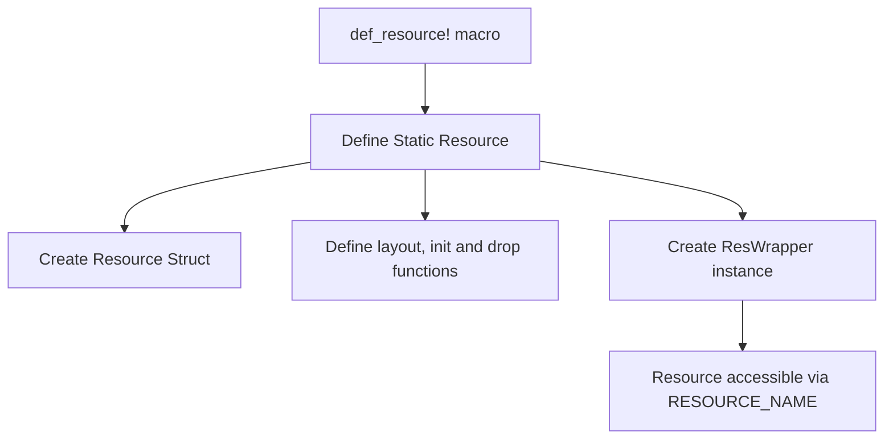
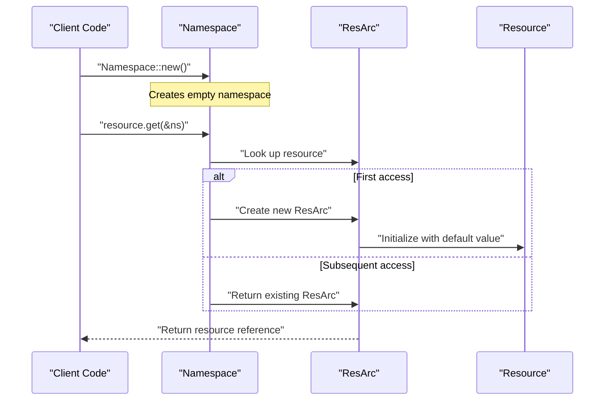
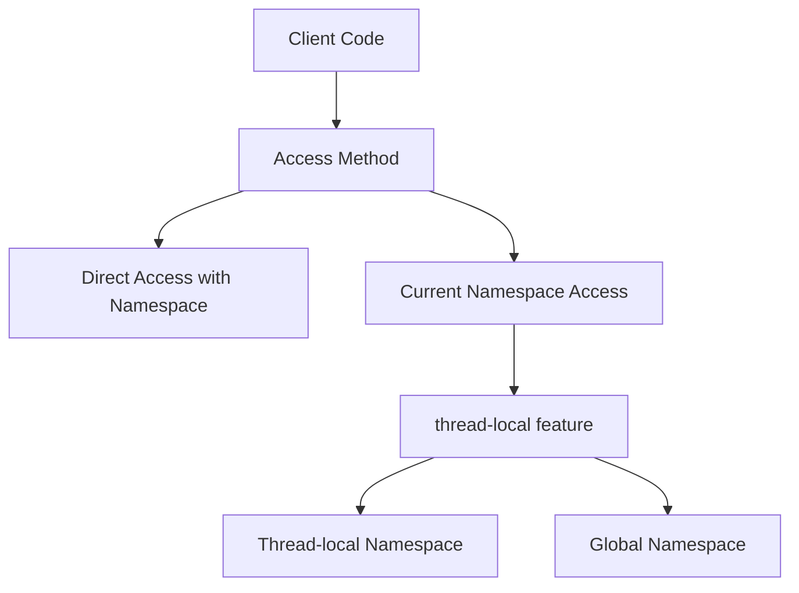
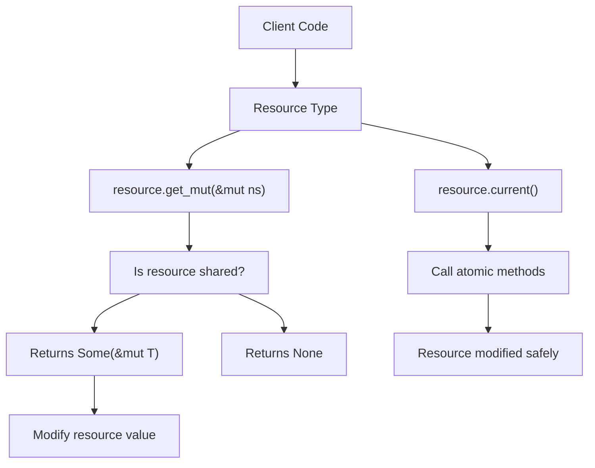

# Basic Resource Access

> **Relevant source files**
> * [src/res.rs](https://github.com/Starry-OS/axns/blob/622a680e/src/res.rs)
> * [tests/all.rs](https://github.com/Starry-OS/axns/blob/622a680e/tests/all.rs)

This page provides practical instructions for the fundamental operations in AXNS: defining resources, accessing them from namespaces, and modifying their values. For more advanced operations such as sharing resources between namespaces or resetting them to initial values, see [Sharing and Resetting Resources](/Starry-OS/axns/5.2-sharing-and-resetting-resources).

## Defining Resources

Resources in AXNS are defined using the `def_resource!` macro, which creates statically allocated resources with their default values.

### Syntax

```css
def_resource! {
    /// Documentation for the resource
    pub static RESOURCE_NAME: ResourceType = default_value;
    
    // Multiple resources can be defined in a single macro call
    pub static ANOTHER_RESOURCE: AnotherType = another_default_value;
}
```

Behind the scenes, this macro creates a static `ResWrapper<T>` instance that provides methods for accessing the resource in different namespaces.



Sources: [src/res.rs(L144 - L168)&emsp;](https://github.com/Starry-OS/axns/blob/622a680e/src/res.rs#L144-L168)

### Examples

Simple value types:

```css
def_resource! {
    /// A static integer resource
    pub static MY_NUMBER: i32 = 42;
}
```

Complex types:

```css
def_resource! {
    /// A custom data structure
    pub static MY_DATA: MyStruct = MyStruct { 
        field1: "default",
        field2: 100 
    };
}
```

Atomic types for thread-safe access:

```css
def_resource! {
    /// An atomic counter
    pub static COUNTER: AtomicUsize = AtomicUsize::new(0);
}
```

Sources: [src/res.rs(L130 - L168)&emsp;](https://github.com/Starry-OS/axns/blob/622a680e/src/res.rs#L130-L168) [tests/all.rs(L11 - L13)&emsp;](https://github.com/Starry-OS/axns/blob/622a680e/tests/all.rs#L11-L13) [tests/all.rs(L31 - L33)&emsp;](https://github.com/Starry-OS/axns/blob/622a680e/tests/all.rs#L31-L33)

## Creating Namespaces

Before accessing resources, you need to create a namespace:

```javascript
let mut ns = Namespace::new();
```

Resources will be automatically initialized with their default values when first accessed in a namespace.



Sources: [tests/all.rs(L15)&emsp;](https://github.com/Starry-OS/axns/blob/622a680e/tests/all.rs#L15-L15)

## Accessing Resources

AXNS provides two main methods to access resources:

### Direct Access with Namespace Reference

```javascript
// Get a reference to the resource in the given namespace
let value = RESOURCE_NAME.get(&namespace);
```

This method requires explicitly passing the namespace reference.

### Current Namespace Access

```javascript
// Access the resource in the current namespace
let current_value = RESOURCE_NAME.current();
```

The `current()` method uses the current namespace, which depends on the `thread-local` feature:

* When enabled: uses a thread-local namespace
* When disabled: uses a global namespace



Sources: [src/res.rs(L78 - L82)&emsp;](https://github.com/Starry-OS/axns/blob/622a680e/src/res.rs#L78-L82) [src/res.rs(L69 - L76)&emsp;](https://github.com/Starry-OS/axns/blob/622a680e/src/res.rs#L69-L76) [tests/all.rs(L22 - L24)&emsp;](https://github.com/Starry-OS/axns/blob/622a680e/tests/all.rs#L22-L24) [tests/all.rs(L35 - L37)&emsp;](https://github.com/Starry-OS/axns/blob/622a680e/tests/all.rs#L35-L37)

## Modifying Resources

To modify a resource, you need a mutable reference to the namespace and the resource must not be shared with other namespaces:

```javascript
// Try to get a mutable reference
if let Some(mut_value) = RESOURCE_NAME.get_mut(&mut namespace) {
    // Modify the resource
    *mut_value = new_value;
} else {
    // Resource is shared, cannot modify
}
```

For atomic types, you can modify them without a mutable reference:

```
// No mutable reference needed for atomic operations
COUNTER.current().fetch_add(1, Ordering::Relaxed);
```



Sources: [src/res.rs(L89 - L92)&emsp;](https://github.com/Starry-OS/axns/blob/622a680e/src/res.rs#L89-L92) [tests/all.rs(L17 - L20)&emsp;](https://github.com/Starry-OS/axns/blob/622a680e/tests/all.rs#L17-L20) [tests/all.rs(L36 - L37)&emsp;](https://github.com/Starry-OS/axns/blob/622a680e/tests/all.rs#L36-L37)

## Complete Example

Here's a complete example demonstrating resource definition, access, and modification:

```javascript
use axns::{Namespace, def_resource};

// Define resources
def_resource! {
    /// A custom data structure
    static DATA: MyStruct = MyStruct { 
        value: 100, 
        name: "hello".to_string() 
    };
}

// Create a namespace
let mut ns = Namespace::new();

// Access the resource (will have default value)
let data = DATA.get(&ns);
assert_eq!(data.value, 100);
assert_eq!(data.name, "hello");

// Modify the resource
if let Some(mut_data) = DATA.get_mut(&mut ns) {
    mut_data.value = 42;
    mut_data.name = "world".to_string();
}

// Verify changes
let modified_data = DATA.get(&ns);
assert_eq!(modified_data.value, 42);
assert_eq!(modified_data.name, "world");

// Access via current() method
let current_data = DATA.current();
// Note: If using the default global namespace, this would still
// have the default values, not the modified ones from our local namespace
```

Sources: [tests/all.rs(L4 - L25)&emsp;](https://github.com/Starry-OS/axns/blob/622a680e/tests/all.rs#L4-L25)

## Key Considerations

1. **Resource Initialization**: Resources are initialized with their default values when first accessed.
2. **Thread Safety**:

* Use atomic types for thread-safe modifications.
* Regular types require a mutable reference and cannot be modified if shared.
3. **Current Namespace**:

* The behavior of `current()` depends on the `thread-local` feature.
* Be aware of which namespace you're accessing when using `current()`.
4. **Resource Sharing**:

* Shared resources cannot be modified through `get_mut()`.
* For resource sharing, see [Sharing and Resetting Resources](/Starry-OS/axns/5.2-sharing-and-resetting-resources).

Sources: [src/res.rs(L53 - L105)&emsp;](https://github.com/Starry-OS/axns/blob/622a680e/src/res.rs#L53-L105)