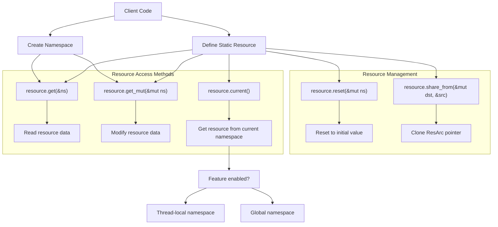
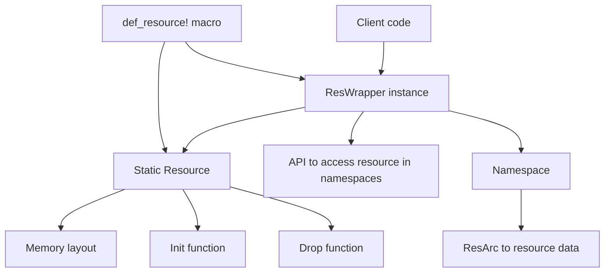
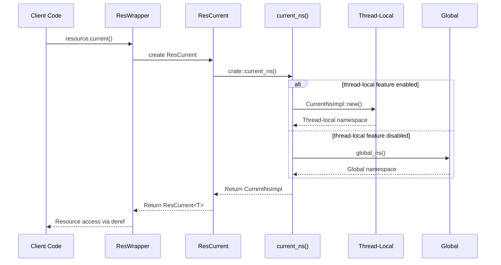
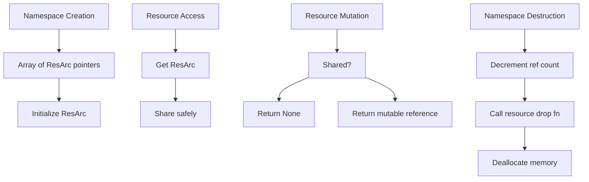

# Core Concepts

> **Relevant source files**
> * [src/lib.rs](https://github.com/Starry-OS/axns/blob/622a680e/src/lib.rs)
> * [src/ns.rs](https://github.com/Starry-OS/axns/blob/622a680e/src/ns.rs)
> * [src/res.rs](https://github.com/Starry-OS/axns/blob/622a680e/src/res.rs)

This page explains the fundamental concepts of the AXNS namespace system, providing an overview of key components and their relationships. For detailed implementation information, see [Namespaces](/Starry-OS/axns/2.1-namespaces), [Resources and ResWrapper](/Starry-OS/axns/2.2-resources-and-reswrapper), and [The def_resource! Macro](/Starry-OS/axns/2.3-the-def_resource!-macro).

## System Purpose

AXNS (Axiomatic Namespace System) provides a unified interface for managing system resources in a structured, namespace-based approach. Its core purpose is to enable:

1. Resource isolation or sharing between different parts of a system
2. Consistent access to resources through well-defined interfaces
3. Proper resource lifecycle management including initialization and cleanup
4. Flexibility across different deployment scenarios from shared unikernel environments to containerized systems

Sources: [src/lib.rs(L1 - L15)&emsp;](https://github.com/Starry-OS/axns/blob/622a680e/src/lib.rs#L1-L15)

## Key Components Overview

The following diagram illustrates the primary components of the AXNS system and their relationships:

```

```

Sources: [src/res.rs(L11 - L15)&emsp;](https://github.com/Starry-OS/axns/blob/622a680e/src/res.rs#L11-L15) [src/res.rs(L53 - L56)&emsp;](https://github.com/Starry-OS/axns/blob/622a680e/src/res.rs#L53-L56) [src/res.rs(L107 - L119)&emsp;](https://github.com/Starry-OS/axns/blob/622a680e/src/res.rs#L107-L119) [src/ns.rs(L7 - L10)&emsp;](https://github.com/Starry-OS/axns/blob/622a680e/src/ns.rs#L7-L10)

## Component Descriptions

### Namespace

A `Namespace` is a collection of resources that can be managed as a unit. It serves as a container that holds references to various system resources and provides controlled access to them.

Key characteristics:

* Contains an array of `ResArc` pointers (one for each defined resource)
* Provides methods to access resources both immutably and mutably
* Can be created explicitly or accessed implicitly via the current namespace
* Manages the lifecycle of its contained resources

Sources: [src/ns.rs(L7 - L10)&emsp;](https://github.com/Starry-OS/axns/blob/622a680e/src/ns.rs#L7-L10) [src/ns.rs(L22 - L36)&emsp;](https://github.com/Starry-OS/axns/blob/622a680e/src/ns.rs#L22-L36)

### Resource

A `Resource` represents system resource metadata including memory layout and lifecycle functions. Resources are defined statically and stored in a special program section called "axns_resources".

Key characteristics:

* Contains memory layout information
* Provides initialization and cleanup functions
* Stored in a special section of the compiled program
* Referenced by index in a namespace

Sources: [src/res.rs(L11 - L15)&emsp;](https://github.com/Starry-OS/axns/blob/622a680e/src/res.rs#L11-L15) [src/res.rs(L36 - L44)&emsp;](https://github.com/Starry-OS/axns/blob/622a680e/src/res.rs#L36-L44)

### ResWrapper

`ResWrapper<T>` provides a type-safe interface to a specific resource. It acts as the primary API for interacting with resources across namespaces.

Key characteristics:

* References a static `Resource` instance
* Provides methods to access the resource in different namespaces
* Enables resource sharing between namespaces
* Allows resetting resources to their default values

Sources: [src/res.rs(L53 - L56)&emsp;](https://github.com/Starry-OS/axns/blob/622a680e/src/res.rs#L53-L56) [src/res.rs(L58 - L105)&emsp;](https://github.com/Starry-OS/axns/blob/622a680e/src/res.rs#L58-L105)

### ResCurrent

`ResCurrent<T>` provides access to a resource in the "current" namespace, which might be a global namespace or a thread-local namespace depending on configuration.

Key characteristics:

* References a static `Resource` instance
* Contains a reference to the current namespace
* Implements `Deref` for convenient access to the resource

Sources: [src/res.rs(L107 - L119)&emsp;](https://github.com/Starry-OS/axns/blob/622a680e/src/res.rs#L107-L119) [src/res.rs(L121 - L128)&emsp;](https://github.com/Starry-OS/axns/blob/622a680e/src/res.rs#L121-L128)

## Resource Access Flow

The following diagram shows how resources are accessed within the AXNS system:



Sources: [src/res.rs(L70 - L76)&emsp;](https://github.com/Starry-OS/axns/blob/622a680e/src/res.rs#L70-L76) [src/res.rs(L80 - L82)&emsp;](https://github.com/Starry-OS/axns/blob/622a680e/src/res.rs#L80-L82) [src/res.rs(L90 - L92)&emsp;](https://github.com/Starry-OS/axns/blob/622a680e/src/res.rs#L90-L92) [src/res.rs(L96 - L98)&emsp;](https://github.com/Starry-OS/axns/blob/622a680e/src/res.rs#L96-L98) [src/res.rs(L102 - L104)&emsp;](https://github.com/Starry-OS/axns/blob/622a680e/src/res.rs#L102-L104) [src/lib.rs(L54 - L59)&emsp;](https://github.com/Starry-OS/axns/blob/622a680e/src/lib.rs#L54-L59)

## Resource Definition

Resources are defined using the `def_resource!` macro, which creates both a static `Resource` instance and a corresponding `ResWrapper<T>` accessor:



Sources: [src/res.rs(L144 - L168)&emsp;](https://github.com/Starry-OS/axns/blob/622a680e/src/res.rs#L144-L168)

## Thread-Local vs. Global Namespace Behavior

AXNS supports both global and thread-local namespaces through a feature flag:



Sources: [src/lib.rs(L16 - L59)&emsp;](https://github.com/Starry-OS/axns/blob/622a680e/src/lib.rs#L16-L59) [src/res.rs(L70 - L76)&emsp;](https://github.com/Starry-OS/axns/blob/622a680e/src/res.rs#L70-L76)

## Key Operational Patterns

The AXNS system revolves around several key operational patterns:

1. **Resource Definition**: Static resources are defined using the `def_resource!` macro, which creates metadata and accessor objects.
2. **Namespace Creation**: Namespaces can be created explicitly (`Namespace::new()`) or accessed implicitly via the current namespace.
3. **Resource Access**: Resources can be accessed in four main ways:

* `resource.get(&ns)`: Immutable access in a specific namespace
* `resource.get_mut(&mut ns)`: Mutable access in a specific namespace (if not shared)
* `resource.current()`: Access in the current namespace
* Direct namespace access: `ns.get(res)` and `ns.get_mut(res)`
4. **Resource Sharing**: Resources can be shared between namespaces using `resource.share_from(&mut dst, &src)`.
5. **Resource Reset**: Resources can be reset to their default values using `resource.reset(&mut ns)`.

Sources: [src/res.rs(L58 - L105)&emsp;](https://github.com/Starry-OS/axns/blob/622a680e/src/res.rs#L58-L105) [src/ns.rs(L22 - L46)&emsp;](https://github.com/Starry-OS/axns/blob/622a680e/src/ns.rs#L22-L46)

## Memory Management Model

AXNS implements careful memory management to ensure resources are properly initialized and cleaned up:



Sources: [src/ns.rs(L22 - L36)&emsp;](https://github.com/Starry-OS/axns/blob/622a680e/src/ns.rs#L22-L36) [src/ns.rs(L55 - L62)&emsp;](https://github.com/Starry-OS/axns/blob/622a680e/src/ns.rs#L55-L62)

## Summary

The core concepts of AXNS revolve around:

1. **Resources** - System objects with defined memory layouts and lifecycle functions
2. **Namespaces** - Collections of resources that can be managed as units
3. **Wrappers** - Type-safe interfaces for accessing resources in namespaces
4. **Current Namespace** - A concept that provides easy access to resources without explicit namespace references

These components work together to provide a flexible, memory-safe system for managing resources in various deployment environments, from shared global resources to fully isolated per-thread resources.

Sources: [src/lib.rs(L1 - L15)&emsp;](https://github.com/Starry-OS/axns/blob/622a680e/src/lib.rs#L1-L15) [src/res.rs(L11 - L15)&emsp;](https://github.com/Starry-OS/axns/blob/622a680e/src/res.rs#L11-L15) [src/res.rs(L53 - L56)&emsp;](https://github.com/Starry-OS/axns/blob/622a680e/src/res.rs#L53-L56) [src/ns.rs(L7 - L10)&emsp;](https://github.com/Starry-OS/axns/blob/622a680e/src/ns.rs#L7-L10)