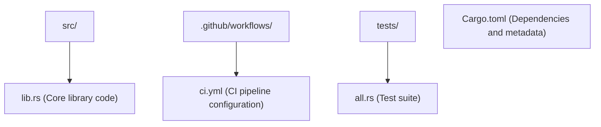
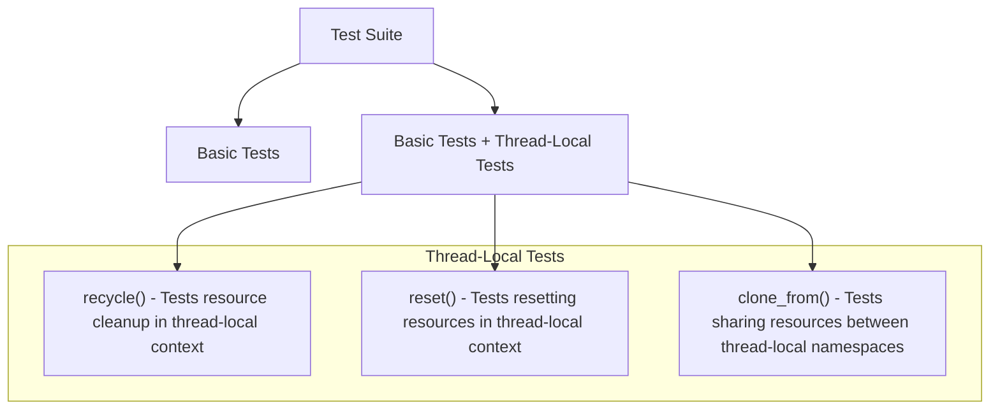
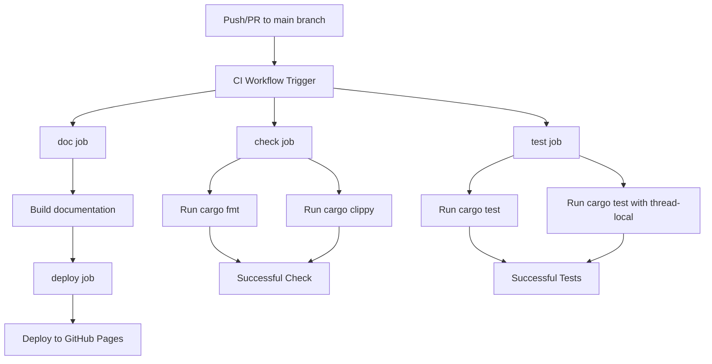
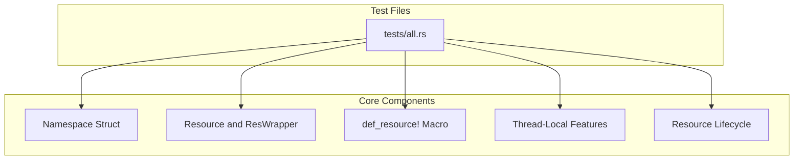
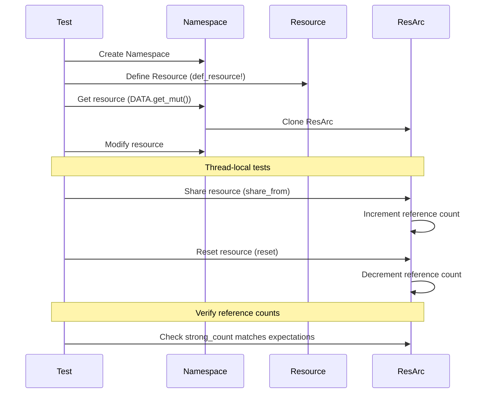
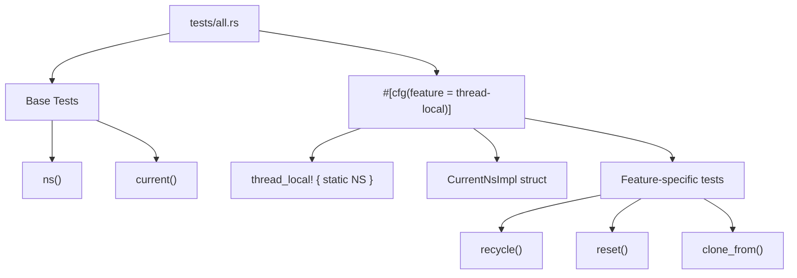

# Development and Testing

> **Relevant source files**
> * [.github/workflows/ci.yml](https://github.com/Starry-OS/axns/blob/622a680e/.github/workflows/ci.yml)
> * [.gitignore](https://github.com/Starry-OS/axns/blob/622a680e/.gitignore)
> * [tests/all.rs](https://github.com/Starry-OS/axns/blob/622a680e/tests/all.rs)

This page provides comprehensive information for developers working on the AXNS resource namespace library itself. It covers the development environment, testing methodology, CI/CD workflow, and guidelines for contributing to the project. For information about using the AXNS library in your applications, please see [Usage Guide](/Starry-OS/axns/5-usage-guide).

## Development Environment

AXNS is developed as a Rust library with minimal dependencies. To work on AXNS, you need:

1. **Rust Toolchain**: The project uses the nightly Rust toolchain for development to leverage advanced features and documentation tools.
2. **Cargo**: For building, testing, and package management.
3. **Git**: For version control.

The repository is organized in a standard Rust project structure:



Sources: [.github/workflows/ci.yml](https://github.com/Starry-OS/axns/blob/622a680e/.github/workflows/ci.yml) [tests/all.rs](https://github.com/Starry-OS/axns/blob/622a680e/tests/all.rs)

## Testing Methodology

AXNS employs a comprehensive testing methodology to ensure correctness and reliability of the namespace system. The test suite in `tests/all.rs` validates the core functionality through various test cases.

### Test Categories

The test suite includes several categories of tests:

```

```

Sources: [tests/all.rs](https://github.com/Starry-OS/axns/blob/622a680e/tests/all.rs)

### Test Case Examples

The test suite validates several key aspects of the AXNS system:

1. **Basic namespace operations** [tests/all.rs(L4 - L25)&emsp;](https://github.com/Starry-OS/axns/blob/622a680e/tests/all.rs#L4-L25)

* Creating a namespace
* Defining resources with `def_resource!`
* Getting and modifying resources
2. **Current resource access** [tests/all.rs(L27 - L38)&emsp;](https://github.com/Starry-OS/axns/blob/622a680e/tests/all.rs#L27-L38)

* Accessing the current value of a resource
* Modifying resources in the current namespace
3. **Thread-local feature tests** [tests/all.rs(L40 - L159)&emsp;](https://github.com/Starry-OS/axns/blob/622a680e/tests/all.rs#L40-L159)

* Resource cleanup and recycling
* Resetting resources
* Sharing resources between namespaces

Sources: [tests/all.rs](https://github.com/Starry-OS/axns/blob/622a680e/tests/all.rs)

## Feature Flag Testing

AXNS uses feature flags to enable optional functionality. The most significant feature is `thread-local`, which enables thread-local namespace support.

### Thread-Local Feature Testing

The thread-local feature is tested in a dedicated module that is only compiled when the feature is enabled:



The thread-local tests validate several important aspects:

1. **Resource lifecycle** - Ensuring resources are properly cleaned up when threads terminate
2. **Resource sharing** - Verifying resources can be shared between namespaces
3. **Resource resetting** - Testing the reset functionality in thread-local contexts

Sources: [tests/all.rs(L40 - L159)&emsp;](https://github.com/Starry-OS/axns/blob/622a680e/tests/all.rs#L40-L159)

## CI/CD Pipeline

AXNS employs a comprehensive CI/CD pipeline implemented with GitHub Actions to ensure code quality and consistency.

### CI Workflow



The CI pipeline consists of the following jobs:

|Job|Description|Commands|
| --- | --- | --- |
|check|Validates code formatting and checks for linting issues|cargo fmt --all --checkcargo clippy --all-targets --all-features -- -D warnings|
|test|Runs the test suite in both standard and thread-local modes|cargo test --verbosecargo test --verbose -F thread-local|
|doc|Builds the documentation with all features|cargo doc --all-features --no-deps|
|deploy|Deploys the documentation to GitHub Pages|GitHub Actions deployment task|

Sources: [.github/workflows/ci.yml](https://github.com/Starry-OS/axns/blob/622a680e/.github/workflows/ci.yml)

## Test-Driven Development

The AXNS development process follows test-driven development principles:

1. **Write Tests First**: New features should be accompanied by tests that validate their behavior
2. **Validate Core Functionality**: Tests should cover the full range of functionality
3. **Feature Flag Testing**: Both standard and feature-enabled configurations must be tested

### Test to Code Relationship



Sources: [tests/all.rs](https://github.com/Starry-OS/axns/blob/622a680e/tests/all.rs)

## Testing ResArc Reference Counting

A critical aspect of AXNS is its reference counting mechanism implemented through `ResArc`. The test suite verifies that reference counting works correctly to prevent memory leaks.



The thread-local tests specifically validate reference counting by tracking the `strong_count` of `Arc` instances and ensuring they are properly incremented and decremented.

Sources: [tests/all.rs(L40 - L159)&emsp;](https://github.com/Starry-OS/axns/blob/622a680e/tests/all.rs#L40-L159)

## Development Guidelines

When developing AXNS, follow these guidelines:

1. **Write Tests**: All new functionality should be accompanied by appropriate tests.
2. **Feature Flags**: When adding features that can be optional, use feature flags and add tests for both configurations.
3. **Documentation**: Document all public APIs with doc comments.
4. **Code Quality**: Ensure code passes `cargo fmt` and `cargo clippy` checks.
5. **Compatibility**: Maintain backward compatibility when possible.

### Adding New Resources

When adding new resource types to the system:

1. Define the resource using the `def_resource!` macro
2. Implement tests that validate the resource behavior in various scenarios
3. Ensure proper cleanup and reference counting

### Testing Thread-Local Features

When working with the thread-local feature:

1. Place thread-local specific tests in the `#[cfg(feature = "thread-local")]` module
2. Verify resources are properly cleaned up when threads terminate
3. Test interactions between thread-local and global namespaces

Sources: [tests/all.rs(L40 - L159)&emsp;](https://github.com/Starry-OS/axns/blob/622a680e/tests/all.rs#L40-L159)

## Test Code Structure

The test structure in AXNS follows a modular pattern where base functionality is tested first, followed by feature-specific tests:



Sources: [tests/all.rs](https://github.com/Starry-OS/axns/blob/622a680e/tests/all.rs)

## Conclusion

The development and testing infrastructure of AXNS is designed to ensure the correctness and reliability of the resource namespace system. By following the guidelines and leveraging the existing test framework, developers can contribute to AXNS while maintaining its quality standards.

For information on using AXNS in your applications, please refer to the [Usage Guide](/Starry-OS/axns/5-usage-guide) section.