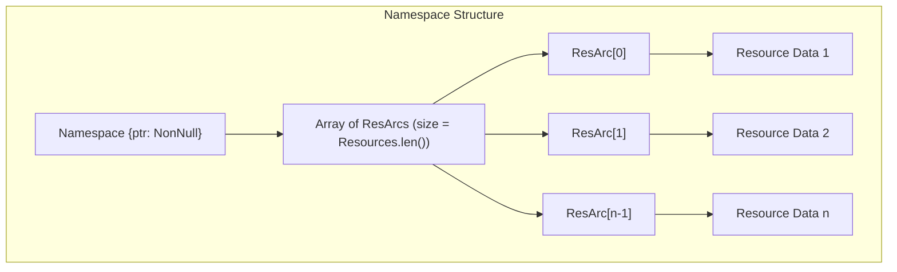
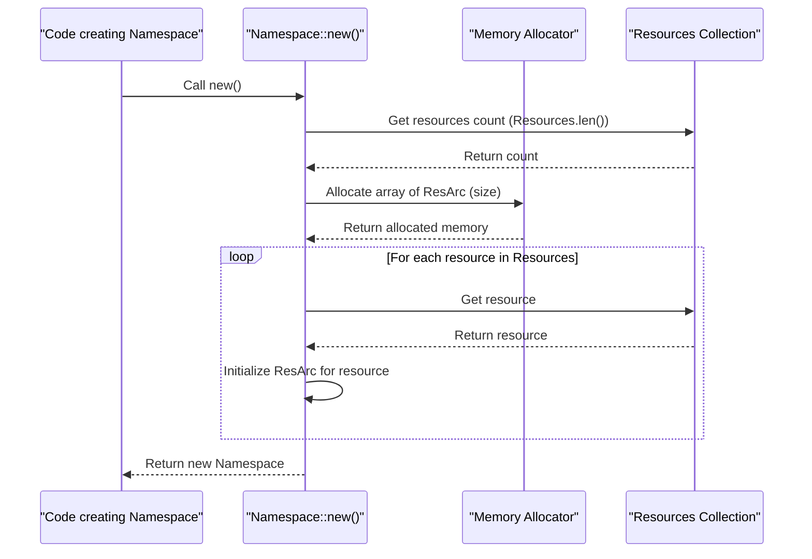
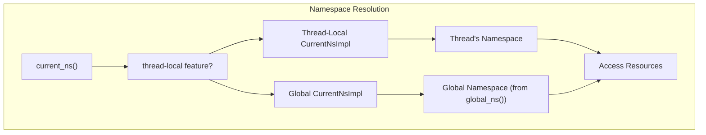
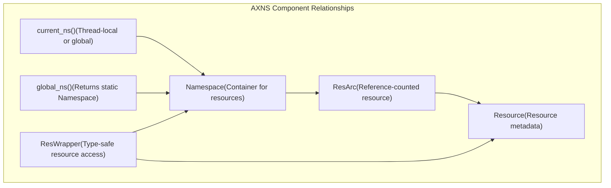

# Namespaces

> **Relevant source files**
> * [src/lib.rs](https://github.com/Starry-OS/axns/blob/622a680e/src/lib.rs)
> * [src/ns.rs](https://github.com/Starry-OS/axns/blob/622a680e/src/ns.rs)

## Purpose and Scope

This document provides a detailed explanation of the `Namespace` struct in the AXNS system, which serves as a container for resources. It covers the internal structure, creation, resource access methods, and memory management of namespaces. For information about the resources themselves and how they're wrapped, see [Resources and ResWrapper](/Starry-OS/axns/2.2-resources-and-reswrapper). For details on thread-local namespace features, see [Thread-Local Features](/Starry-OS/axns/3-thread-local-features).

## Namespace Structure

In AXNS, a `Namespace` is a collection of resources, each accessed through a reference-counted pointer (`ResArc`). The `Namespace` struct is defined in `src/ns.rs` and consists of a single pointer field that points to an array of `ResArc` instances.

Sources: [src/ns.rs(L6 - L13)&emsp;](https://github.com/Starry-OS/axns/blob/622a680e/src/ns.rs#L6-L13)

## Namespace Creation and Initialization

When a new `Namespace` is created using `Namespace::new()`, it:

1. Allocates memory for an array of `ResArc` instances (one for each resource in the system)
2. Initializes each `ResArc` with its corresponding resource's default value
3. Returns the constructed `Namespace`

Sources: [src/ns.rs(L16 - L36)&emsp;](https://github.com/Starry-OS/axns/blob/622a680e/src/ns.rs#L16-L36)

## Resource Access

The `Namespace` provides two primary methods for accessing resources:

1. `get(&self, res: &'static Resource) -> &ResArc`: Returns a reference to the `ResArc` for a given resource.
2. `get_mut(&mut self, res: &'static Resource) -> &mut ResArc`: Returns a mutable reference to the `ResArc` for a given resource.

Both methods use the resource's index (obtained via `res.index()`) to locate the corresponding `ResArc` in the array.

|Method|Description|Implementation|
| --- | --- | --- |
|get|Returns a reference to a resource'sResArc|Uses the resource's index to find the correspondingResArcin the array|
|get_mut|Returns a mutable reference to a resource'sResArc|Uses the resource's index to find the correspondingResArcin the array|

Sources: [src/ns.rs(L38 - L46)&emsp;](https://github.com/Starry-OS/axns/blob/622a680e/src/ns.rs#L38-L46)

## Global and Thread-Local Namespaces

AXNS supports two namespace access patterns:

1. **Global Namespace**: A singleton namespace accessible from anywhere via the `global_ns()` function
2. **Thread-Local Namespaces**: When the "thread-local" feature is enabled, each thread can have its own namespace

Sources: [src/lib.rs(L16 - L59)&emsp;](https://github.com/Starry-OS/axns/blob/622a680e/src/lib.rs#L16-L59)

## Memory Management

The `Namespace` struct carefully manages memory for all its resources. When a `Namespace` is dropped:

1. It calls `drop_in_place()` on the array of `ResArc` instances, which decrements the reference count for each resource
2. It deallocates the memory used for the array itself

This ensures that resources are properly cleaned up when they're no longer needed.

Sources: [src/ns.rs(L55 - L63)&emsp;](https://github.com/Starry-OS/axns/blob/622a680e/src/ns.rs#L55-L63)

## Namespace in the AXNS Architecture

The `Namespace` is a central component in the AXNS system, working closely with other components:

Sources: [src/lib.rs(L10 - L14)&emsp;](https://github.com/Starry-OS/axns/blob/622a680e/src/lib.rs#L10-L14) [src/ns.rs(L1 - L4)&emsp;](https://github.com/Starry-OS/axns/blob/622a680e/src/ns.rs#L1-L4)

## Implementation Details

The `Namespace` implementation includes several important features:

* **Memory Efficiency**: Uses a single pointer to an array rather than a standard Rust collection to minimize overhead
* **Safety Markers**: Implements `Send` and `Sync` traits to indicate thread safety
* **Default Implementation**: Provides a `Default` implementation that calls `new()`
* **Manual Memory Management**: Performs explicit allocation and deallocation to maintain control over memory layout

### API Summary

|Method|Description|Example Usage|
| --- | --- | --- |
|Namespace::new()|Creates a newNamespacewith default values|let ns = Namespace::new();|
|ns.get(resource)|Gets a reference to a resource|let r = ns.get(&MY_RESOURCE);|
|ns.get_mut(resource)|Gets a mutable reference to a resource|let r = ns.get_mut(&MY_RESOURCE);|
|global_ns()|Gets the global namespace|let ns = global_ns();|
|current_ns()|Gets the current namespace (global or thread-local)|let ns = current_ns();|

Sources: [src/ns.rs(L15 - L63)&emsp;](https://github.com/Starry-OS/axns/blob/622a680e/src/ns.rs#L15-L63) [src/lib.rs(L16 - L59)&emsp;](https://github.com/Starry-OS/axns/blob/622a680e/src/lib.rs#L16-L59)