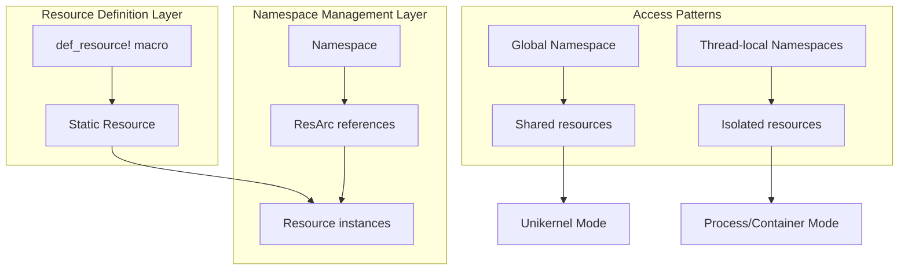
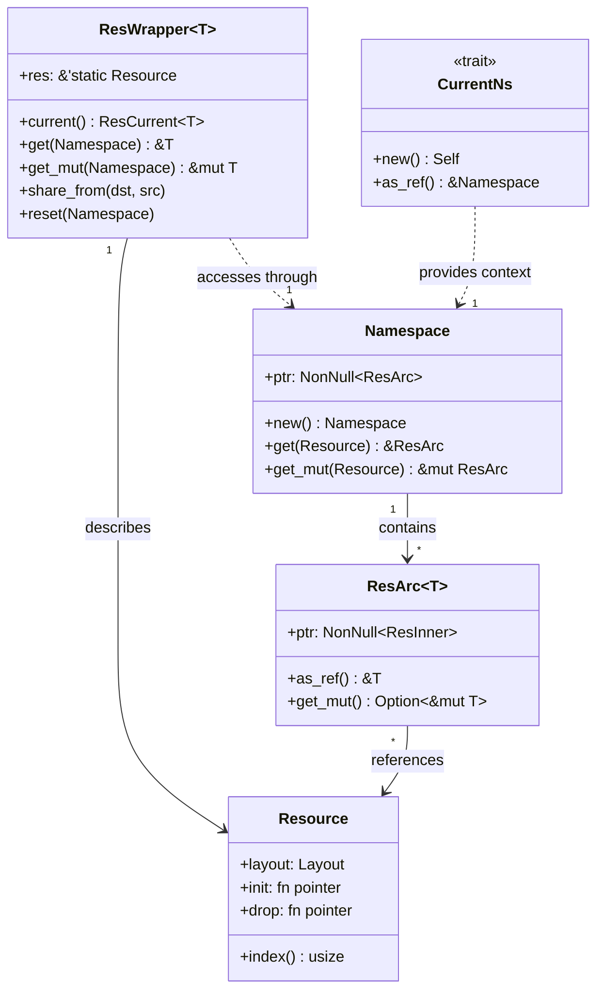
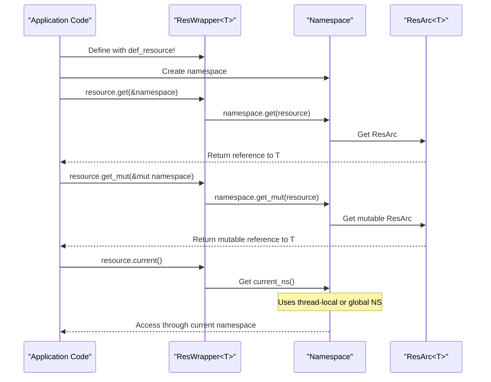
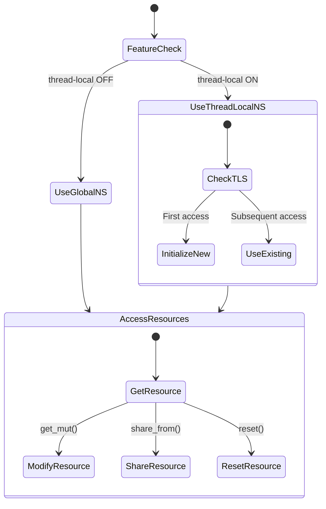
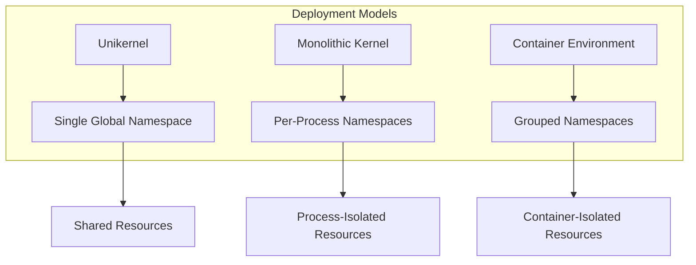

# Overview

> **Relevant source files**
> * [Cargo.toml](https://github.com/Starry-OS/axns/blob/622a680e/Cargo.toml)
> * [README.md](https://github.com/Starry-OS/axns/blob/622a680e/README.md)
> * [src/lib.rs](https://github.com/Starry-OS/axns/blob/622a680e/src/lib.rs)

AXNS (Resource Namespace System) is a Rust library providing a unified interface for managing and controlling access to system resources across different deployment scenarios. It enables configurable resource sharing and isolation between processes and threads in various operating system environments, from unikernels with shared resources to monolithic kernels or containerized environments requiring isolation.

For more detailed information about specific components, see [Core Concepts](/Starry-OS/axns/2-core-concepts) and [Thread-Local Features](/Starry-OS/axns/3-thread-local-features).

## Purpose and Scope

AXNS addresses several key requirements for flexible resource management:

* **Unified Resource Access**: Providing a consistent interface to system resources
* **Configurable Isolation**: Supporting varying degrees of resource sharing between threads
* **Deployment Flexibility**: Working effectively in different system architectures
* **Memory Safety**: Ensuring proper resource initialization and cleanup
* **Type Safety**: Providing strongly-typed access to resources

The system manages resources such as virtual address spaces, working directories, file descriptors, and other system facilities that might need to be shared or isolated.

Sources: [README.md(L5 - L14)&emsp;](https://github.com/Starry-OS/axns/blob/622a680e/README.md#L5-L14)

## Core Architecture

AXNS follows a modular design with several key architectural patterns:



The architecture consists of these primary components:

|Component|Description|Role|
| --- | --- | --- |
|Namespace|Container for resources|Stores and provides access to system resources|
|Resource|Resource type metadata|Defines memory layout and lifecycle functions|
|ResWrapper<T>|Static resource handle|Provides the public API for resource access|
|ResArc<T>|Reference-counted pointer|Manages resource lifecycle and memory|
|def_resource!|Resource definition macro|Simplifies creation of new resource types|

Sources: [src/lib.rs(L10 - L14)&emsp;](https://github.com/Starry-OS/axns/blob/622a680e/src/lib.rs#L10-L14)

## Component Relationships



Sources: [src/lib.rs(L10 - L14)&emsp;](https://github.com/Starry-OS/axns/blob/622a680e/src/lib.rs#L10-L14) [src/lib.rs(L32 - L59)&emsp;](https://github.com/Starry-OS/axns/blob/622a680e/src/lib.rs#L32-L59)

## Resource Access Flow

Accessing resources in AXNS follows this pattern:



Sources: [src/lib.rs(L16 - L59)&emsp;](https://github.com/Starry-OS/axns/blob/622a680e/src/lib.rs#L16-L59)

## Thread-Local Feature

AXNS provides an optional thread-local feature for fine-grained resource isolation:



This feature is controlled by the `thread-local` feature flag in Cargo.toml:

```
[features]
thread-local = ["dep:extern-trait"]
```

When enabled, AXNS uses the `CurrentNs` trait to provide thread-local namespaces. When disabled, all access goes through the global namespace.

Sources: [src/lib.rs(L32 - L59)&emsp;](https://github.com/Starry-OS/axns/blob/622a680e/src/lib.rs#L32-L59) [Cargo.toml(L14 - L15)&emsp;](https://github.com/Starry-OS/axns/blob/622a680e/Cargo.toml#L14-L15)

## Deployment Scenarios

AXNS supports various deployment models by adjusting namespace isolation:



1. **Unikernel Mode**: A single global namespace shared by all threads (default)
2. **Monolithic Kernel Mode**: Each process has its own namespace, with threads in the same process sharing resources
3. **Container Mode**: System resources grouped into namespaces that are shared between specific processes

Sources: [README.md(L5 - L14)&emsp;](https://github.com/Starry-OS/axns/blob/622a680e/README.md#L5-L14)

## Summary

AXNS provides a flexible, efficient system for managing resource namespaces across different operating system environments. Its architecture balances the need for shared resources with isolation requirements, providing a consistent API regardless of the deployment scenario. The system's design ensures proper resource lifecycle management through reference counting, while the optional thread-local feature provides additional isolation when needed.

For practical guidance on using AXNS, see [Usage Guide](/Starry-OS/axns/5-usage-guide).

Sources: [src/lib.rs(L1 - L59)&emsp;](https://github.com/Starry-OS/axns/blob/622a680e/src/lib.rs#L1-L59) [README.md(L1 - L14)&emsp;](https://github.com/Starry-OS/axns/blob/622a680e/README.md#L1-L14)