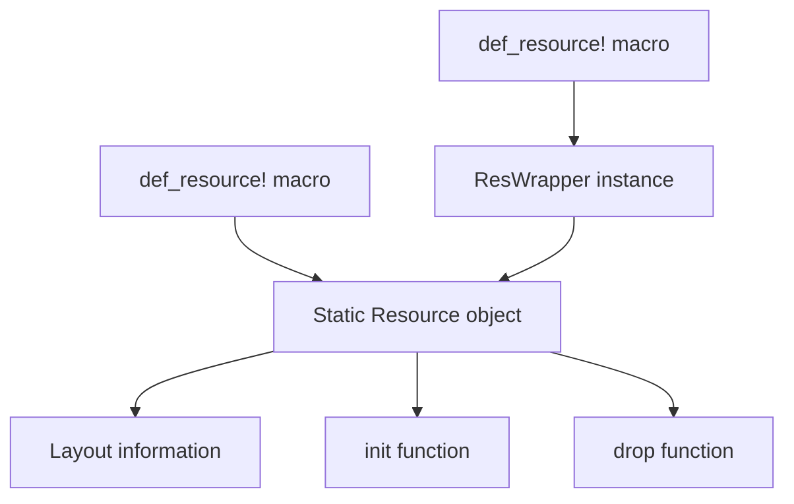
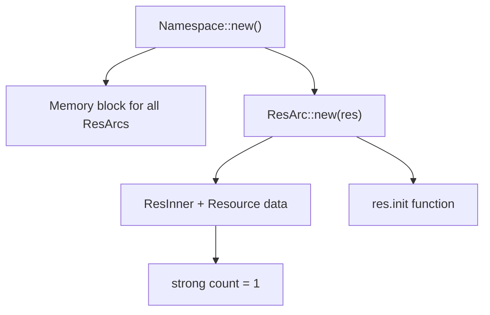
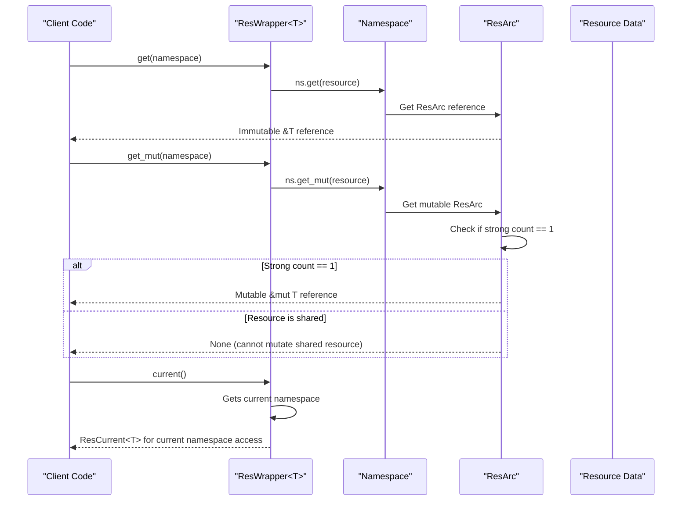
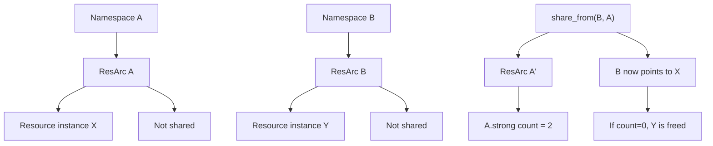
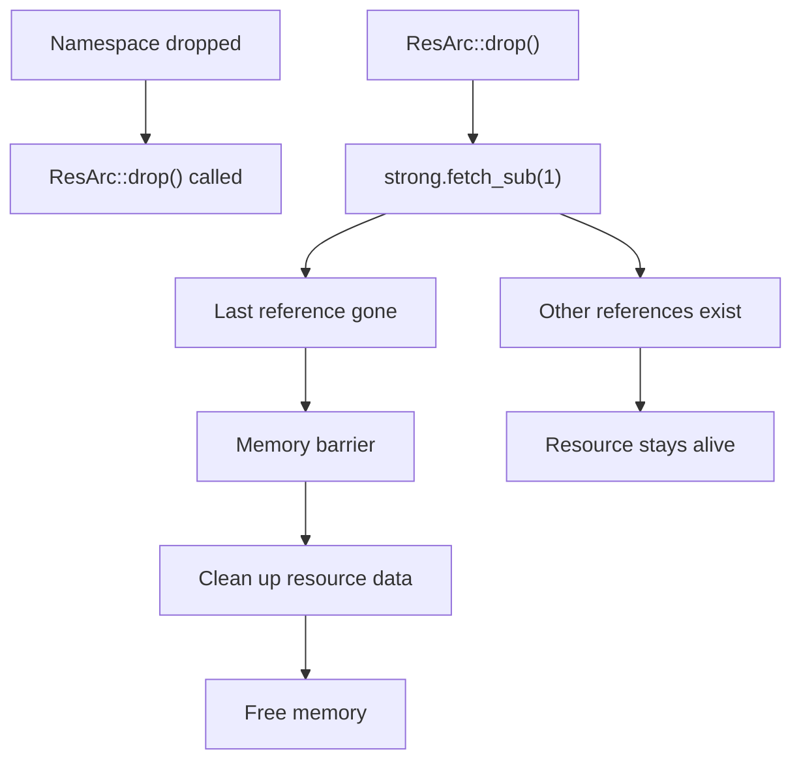
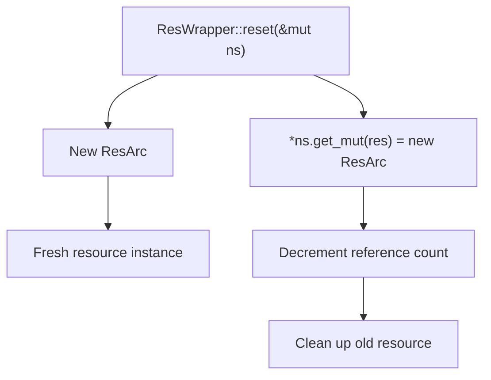
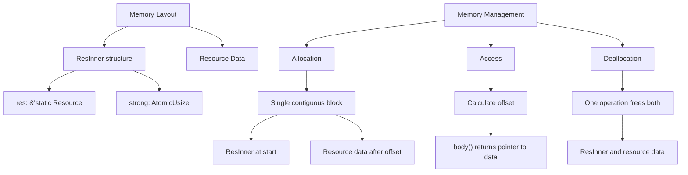

# Resource Lifecycle

> **Relevant source files**
> * [src/arc.rs](https://github.com/Starry-OS/axns/blob/622a680e/src/arc.rs)
> * [src/ns.rs](https://github.com/Starry-OS/axns/blob/622a680e/src/ns.rs)
> * [src/res.rs](https://github.com/Starry-OS/axns/blob/622a680e/src/res.rs)

## Purpose and Scope

This document explains in detail how resources are created, accessed, shared, and cleaned up throughout their lifecycle in the AXNS system. Understanding the resource lifecycle is crucial for effectively utilizing the namespace system and ensuring proper resource management.

For information about the specific implementation of reference counting used for resource management, see [Resource Reference Counting](/Starry-OS/axns/4.1-resource-reference-counting).

## Resource Creation Process

### Definition and Initialization

Resources in AXNS begin their lifecycle when they are defined using the `def_resource!` macro. This macro generates static resource definitions along with their accessor wrappers.

Sources: [src/res.rs(L144 - L168)&emsp;](https://github.com/Starry-OS/axns/blob/622a680e/src/res.rs#L144-L168)

When a resource is defined using the `def_resource!` macro, several key components are created:

1. A `static Resource` object with:

* Memory layout information for the resource type via `Layout::new::<T>()`
* An initialization function that creates the default value
* A drop function that properly cleans up the resource when no longer needed
2. A static `ResWrapper<T>` that provides the API for accessing this resource across namespaces

### Namespace Resource Initialization

When a namespace is created, it initializes all resources with their default values.

Sources: [src/ns.rs(L22 - L36)&emsp;](https://github.com/Starry-OS/axns/blob/622a680e/src/ns.rs#L22-L36) [src/arc.rs(L57 - L72)&emsp;](https://github.com/Starry-OS/axns/blob/622a680e/src/arc.rs#L57-L72)

The initialization flow works as follows:

1. `Namespace::new()` allocates a single contiguous memory block to hold all `ResArc` instances for every defined resource
2. For each resource in the resources list:
* It creates a new `ResArc` using `ResArc::new(res)`
* `ResArc::new` allocates memory for both the `ResInner` structure and the resource data
* The resource is initialized by calling its init function with the allocated memory
* The reference count (strong count) is set to 1

## Resource Access Patterns

AXNS provides several ways to access resources, each designed for different use cases.

Sources: [src/res.rs(L69 - L128)&emsp;](https://github.com/Starry-OS/axns/blob/622a680e/src/res.rs#L69-L128) [src/arc.rs(L79 - L85)&emsp;](https://github.com/Starry-OS/axns/blob/622a680e/src/arc.rs#L79-L85)

### Access Methods

AXNS provides three primary methods for accessing resources:

1. **Immutable Access** - `ResWrapper::get(&Namespace) -> &T`:

* Always succeeds, providing read-only access to the resource
* Safe to use regardless of whether the resource is shared
2. **Mutable Access** - `ResWrapper::get_mut(&mut Namespace) -> Option<&mut T>`:

* Only succeeds if the resource has a reference count of 1 (not shared)
* Returns `None` if the resource is shared with other namespaces
* Ensures memory safety by preventing concurrent mutation
3. **Current Namespace Access** - `ResWrapper::current() -> ResCurrent<T>`:

* Provides access to the resource in the current namespace
* The current namespace is determined by the thread-local feature status
* Returns a `ResCurrent<T>` that implements `Deref` for transparent access

## Resource Sharing Mechanism

AXNS allows resources to be shared between namespaces, which is useful for both memory efficiency and communication.

Sources: [src/res.rs(L96 - L98)&emsp;](https://github.com/Starry-OS/axns/blob/622a680e/src/res.rs#L96-L98) [src/arc.rs(L95 - L102)&emsp;](https://github.com/Starry-OS/axns/blob/622a680e/src/arc.rs#L95-L102)

The sharing process works as follows:

1. Initially, each namespace has its own independent resource instances
2. When `ResWrapper::share_from(dst, src)` is called:
* It gets the `ResArc` from the source namespace
* Clones it, which increments the reference count
* Replaces the destination namespace's existing `ResArc` with this clone
* The destination's original resource may be freed if no other references exist

This creates a situation where multiple namespaces point to the same underlying resource data, with reference counting ensuring it remains alive until all namespaces are done with it.

## Resource Cleanup Process

Resources are automatically cleaned up when they are no longer needed, which happens when their reference count reaches zero.

Sources: [src/arc.rs(L104 - L120)&emsp;](https://github.com/Starry-OS/axns/blob/622a680e/src/arc.rs#L104-L120) [src/ns.rs(L55 - L63)&emsp;](https://github.com/Starry-OS/axns/blob/622a680e/src/ns.rs#L55-L63)

The cleanup process has several stages:

1. When a `Namespace` is dropped:

* It drops all its `ResArc` instances in its destructor
* The memory for the namespace's `ResArc` array is deallocated
2. When a `ResArc` is dropped:

* Its reference count is atomically decremented
* If the result is 1 (meaning this was the last reference):
* A memory fence is executed for proper synchronization
* The resource's drop function is called to clean up the resource data
* The memory for the `ResInner` and resource data is deallocated
* If the count remains positive, the resource stays alive for other references

## Resource Reinitialization

AXNS allows resources to be reset to their default values using the `reset` method.

Sources: [src/res.rs(L100 - L104)&emsp;](https://github.com/Starry-OS/axns/blob/622a680e/src/res.rs#L100-L104)

The reset process works as follows:

1. A new `ResArc` is created with a fresh instance of the resource
2. The namespace's existing `ResArc` is replaced with this new one
3. The reference count of the old `ResArc` is decremented
4. If the old reference count reaches 0, that resource instance is cleaned up

This provides a way to return resources to their initial state without affecting other namespaces that might be sharing the previous instance.

## Memory Layout and Management

Understanding the memory layout of resources is important for comprehending the complete lifecycle.

Sources: [src/arc.rs(L17 - L47)&emsp;](https://github.com/Starry-OS/axns/blob/622a680e/src/arc.rs#L17-L47) [src/arc.rs(L23 - L27)&emsp;](https://github.com/Starry-OS/axns/blob/622a680e/src/arc.rs#L23-L27)

The resource memory system works as follows:

1. **Memory Layout**: Each resource allocation consists of:

* A `ResInner` structure containing the metadata and reference count
* The actual resource data, placed after the `ResInner` at a calculated offset
2. **Memory Allocation**:

* A single contiguous memory block is allocated for both the `ResInner` and resource data
* The layout is calculated using `Layout::new::<ResInner>().extend(body)`
* This approach minimizes allocations and improves memory locality
3. **Memory Access**:

* The `body()` method calculates the offset to the resource data
* This provides direct access to the data portion without extra indirection
4. **Memory Deallocation**:

* When the reference count reaches 0, the entire memory block is deallocated
* The resource's drop function is called first to clean up any internal resources

This approach minimizes allocations while providing safe, efficient memory management for resources.

## Reference Counting Safeguards

AXNS implements several safeguards to ensure reference counting works correctly:

1. **Overflow Prevention**: The reference counter is checked against `MAX_REFCOUNT` to prevent overflow
2. **Safe Mutation**: Mutable access is only allowed when a resource has a reference count of 1
3. **Atomic Operations**: All reference count operations use atomic operations with appropriate ordering
4. **Memory Fences**: Proper memory barriers ensure visibility across threads

These safeguards ensure that the resource lifecycle is managed correctly and safely, preventing memory leaks and use-after-free errors.