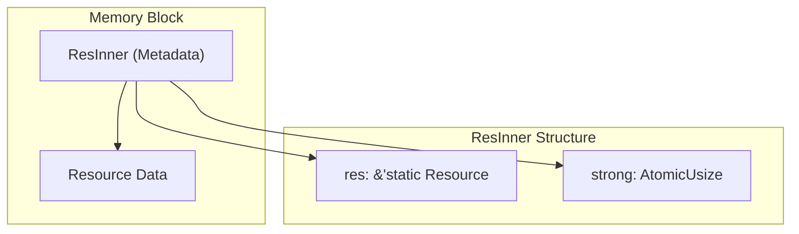
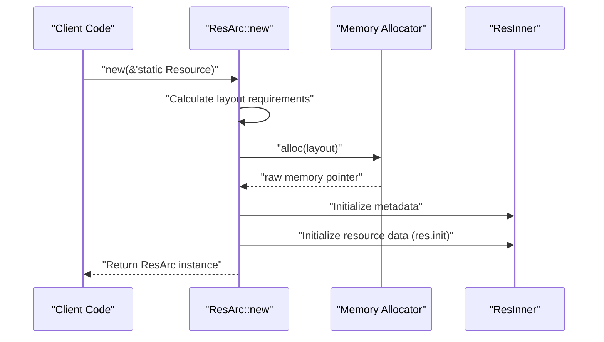
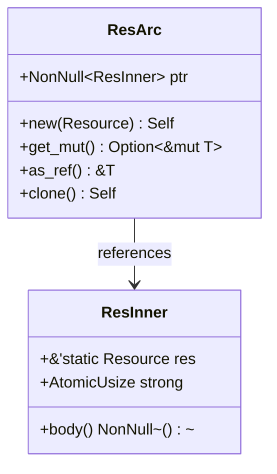
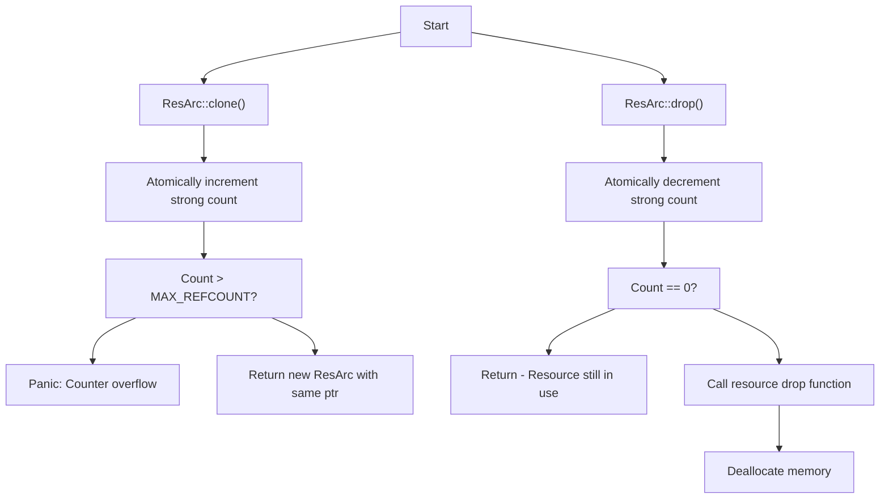
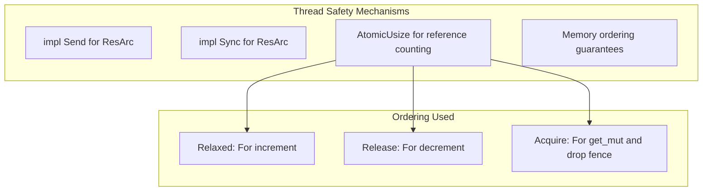
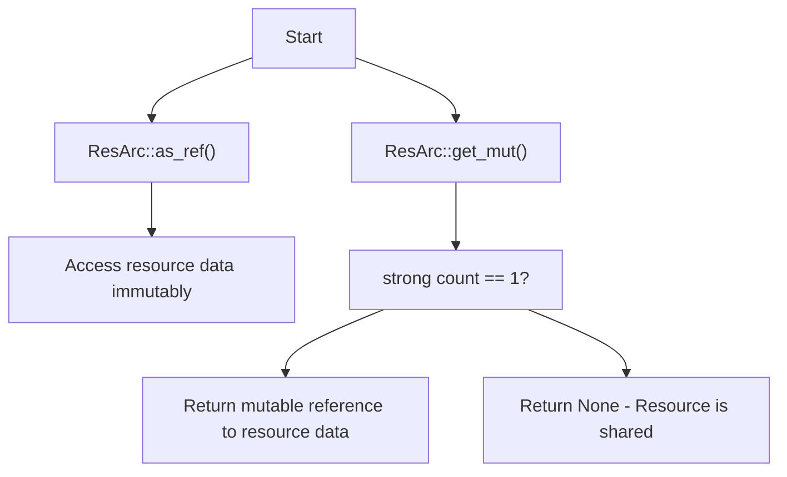
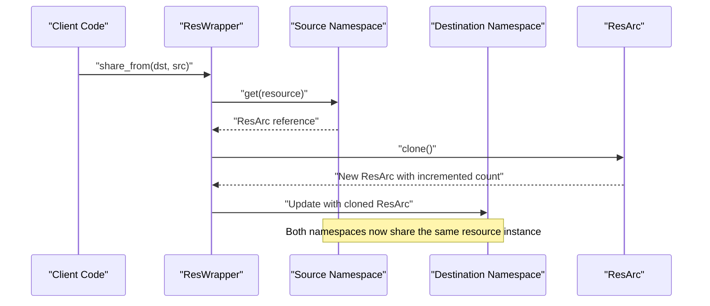
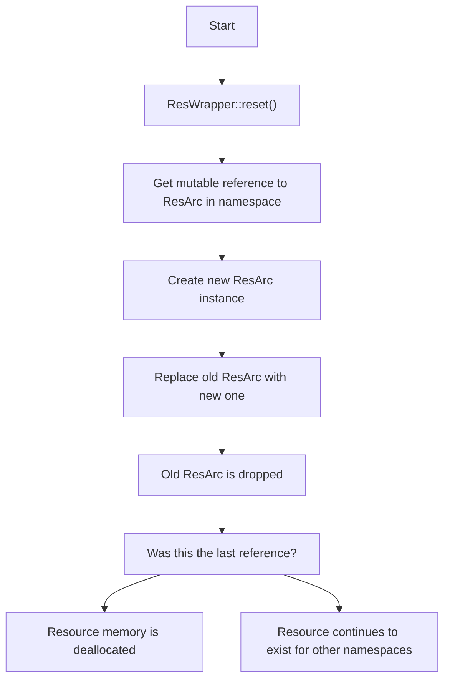

# Resource Reference Counting

> **Relevant source files**
> * [src/arc.rs](https://github.com/Starry-OS/axns/blob/622a680e/src/arc.rs)
> * [src/res.rs](https://github.com/Starry-OS/axns/blob/622a680e/src/res.rs)

## Purpose and Scope

This document details how AXNS implements reference counting for resources through the `ResArc` type, which provides memory management and safe resource sharing between namespaces. This page covers the internal memory layout of resources, the reference counting mechanism, and the resource lifecycle from allocation to deallocation.

For information about the broader resource lifecycle, see [Resource Lifecycle](/Starry-OS/axns/4-resource-lifecycle). For details on how resources are defined, see [Resources and ResWrapper](/Starry-OS/axns/2.2-resources-and-reswrapper).

## Memory Layout

The AXNS resource system uses a custom memory layout that combines metadata with the actual resource data in a contiguous memory block.

### Resource Memory Structure

The memory layout consists of two key sections:

1. **Metadata Section (ResInner)**: Contains:

* A reference to the static resource descriptor
* An atomic counter for tracking references
2. **Resource Data Section**: Contains the actual data of the resource, with its layout defined during resource creation

Sources: [src/arc.rs(L17 - L21)&emsp;](https://github.com/Starry-OS/axns/blob/622a680e/src/arc.rs#L17-L21) [src/arc.rs(L23 - L27)&emsp;](https://github.com/Starry-OS/axns/blob/622a680e/src/arc.rs#L23-L27)

### Memory Allocation Process

When a resource is created, `ResArc::new`:

1. Calculates the combined layout of the metadata and resource data
2. Allocates a single memory block
3. Initializes the metadata section with a reference count of 1
4. Calls the resource's init function to initialize the data section

Sources: [src/arc.rs(L57 - L72)&emsp;](https://github.com/Starry-OS/axns/blob/622a680e/src/arc.rs#L57-L72)

## Reference Counting Implementation

The `ResArc` type implements a custom atomic reference counting mechanism to track resource usage.

### ResArc Architecture

The reference counting is implemented through the `AtomicUsize strong` field in `ResInner`, which ensures thread-safe operations on the reference count.

Sources: [src/arc.rs(L49 - L51)&emsp;](https://github.com/Starry-OS/axns/blob/622a680e/src/arc.rs#L49-L51) [src/arc.rs(L18 - L21)&emsp;](https://github.com/Starry-OS/axns/blob/622a680e/src/arc.rs#L18-L21)

### Reference Counter Operations

Key aspects of the reference counting implementation:

1. **Incrementing**: When `clone()` is called, the strong count is atomically incremented with a relaxed ordering
2. **Overflow Protection**: Checks ensure the counter doesn't exceed `MAX_REFCOUNT` (isize::MAX)
3. **Decrementing**: When `drop()` is called, the strong count is atomically decremented
4. **Cleanup**: When the count reaches zero, the resource's drop function is called and memory is deallocated

Sources: [src/arc.rs(L95 - L102)&emsp;](https://github.com/Starry-OS/axns/blob/622a680e/src/arc.rs#L95-L102) [src/arc.rs(L104 - L120)&emsp;](https://github.com/Starry-OS/axns/blob/622a680e/src/arc.rs#L104-L120)

## Thread Safety

`ResArc` implements both `Send` and `Sync` traits, allowing it to be safely shared between threads. The atomic operations ensure that reference counting works correctly in a multi-threaded environment.

The implementation uses specific memory orderings to balance performance and correctness:

* `Relaxed` ordering for incrementing the counter (lighter weight)
* `Release` ordering when decrementing to ensure visibility of all previous operations
* `Acquire` fence after the last reference is dropped to ensure all operations complete before deallocation

Sources: [src/arc.rs(L53 - L54)&emsp;](https://github.com/Starry-OS/axns/blob/622a680e/src/arc.rs#L53-L54) [src/arc.rs(L5 - L9)&emsp;](https://github.com/Starry-OS/axns/blob/622a680e/src/arc.rs#L5-L9) [src/arc.rs(L95 - L102)&emsp;](https://github.com/Starry-OS/axns/blob/622a680e/src/arc.rs#L95-L102) [src/arc.rs(L104 - L120)&emsp;](https://github.com/Starry-OS/axns/blob/622a680e/src/arc.rs#L104-L120)

## Resource Access Patterns

### Accessing and Mutating Resources

`ResArc` provides two primary access patterns:

1. **Immutable access** (`as_ref()`): Always available, returns a reference to the resource data
2. **Mutable access** (`get_mut()`): Only available when the reference count is exactly 1, ensuring exclusive access

Sources: [src/arc.rs(L79 - L85)&emsp;](https://github.com/Starry-OS/axns/blob/622a680e/src/arc.rs#L79-L85) [src/arc.rs(L88 - L93)&emsp;](https://github.com/Starry-OS/axns/blob/622a680e/src/arc.rs#L88-L93)

## Integration with Namespace System

The reference counting mechanism integrates with the namespace system to enable safe resource sharing between namespaces.

When a resource is shared between namespaces:

1. The `share_from` method obtains a reference to the resource in the source namespace
2. This reference is cloned, incrementing the strong count
3. The destination namespace's reference is replaced with the cloned reference
4. Both namespaces now point to the same underlying resource data

Sources: [src/res.rs(L94 - L98)&emsp;](https://github.com/Starry-OS/axns/blob/622a680e/src/res.rs#L94-L98)

## Resource Reset and Memory Management

When a resource is reset in a namespace:

1. A new `ResArc` instance is created with a fresh copy of the resource
2. The old `ResArc` in the namespace is replaced and dropped
3. If this was the last reference to the old resource, its memory is deallocated
4. Otherwise, the resource continues to exist for other namespaces that share it

Sources: [src/res.rs(L100 - L104)&emsp;](https://github.com/Starry-OS/axns/blob/622a680e/src/res.rs#L100-L104)

## Technical Limitations and Safeguards

The ResArc implementation includes several important safeguards:

1. **Reference Count Maximum**: Limited to isize::MAX to prevent overflow
2. **Mutable Access Safety**: Mutable access is only granted when the reference count is exactly 1
3. **Memory Layout Handling**: Carefully manages the layout and offset calculations for resource data
4. **Drop Sequence**: Ensures proper ordering of deallocation operations

Sources: [src/arc.rs(L14 - L15)&emsp;](https://github.com/Starry-OS/axns/blob/622a680e/src/arc.rs#L14-L15) [src/arc.rs(L79 - L85)&emsp;](https://github.com/Starry-OS/axns/blob/622a680e/src/arc.rs#L79-L85)

## Summary

The resource reference counting system in AXNS provides:

1. **Memory Safety**: Ensuring resources are only deallocated when all references are dropped
2. **Thread Safety**: Allowing resources to be safely shared between threads
3. **Efficient Sharing**: Enabling namespaces to share resources without unnecessary duplication
4. **Controlled Mutability**: Preventing data races by restricting mutable access to unshared resources

This system forms the foundation for the resource lifecycle management in AXNS, balancing safety, performance, and flexibility.