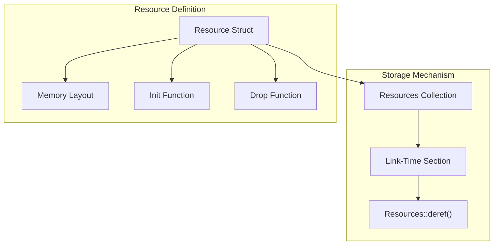
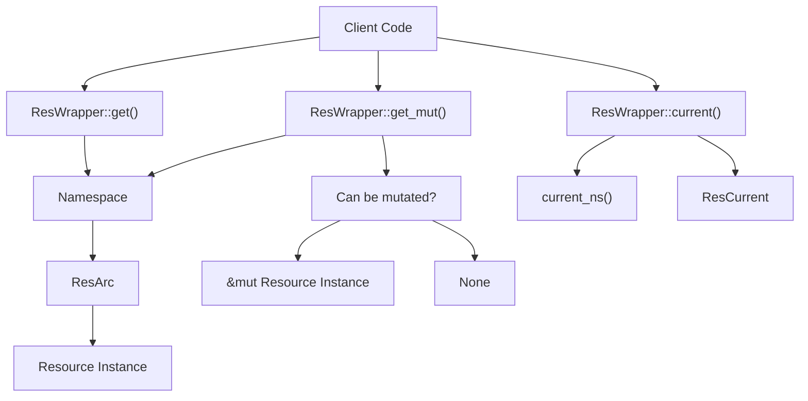
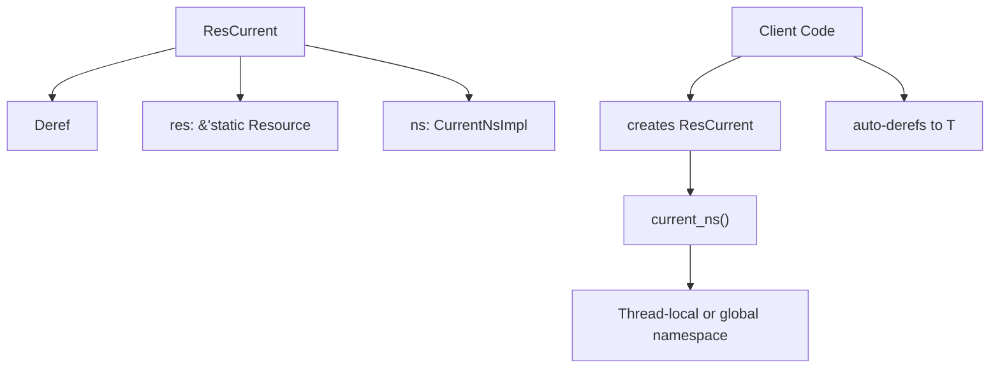
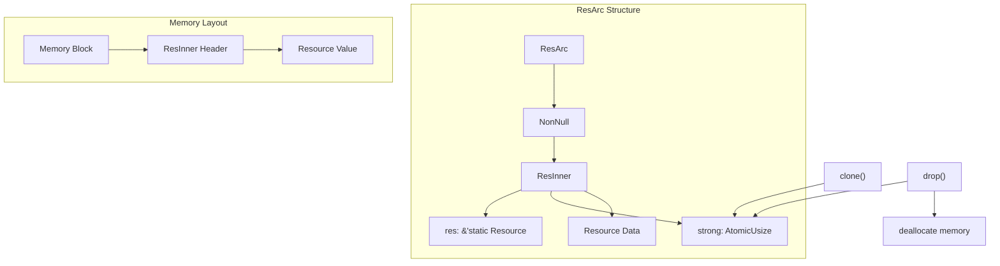
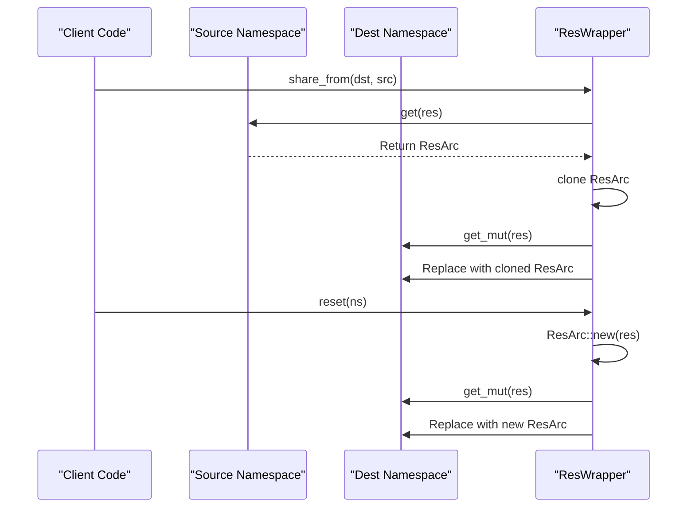
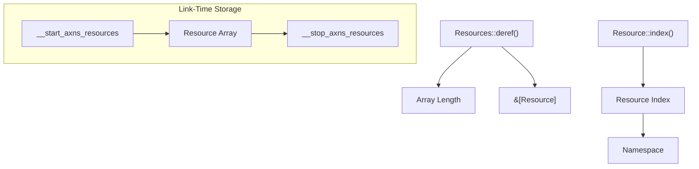
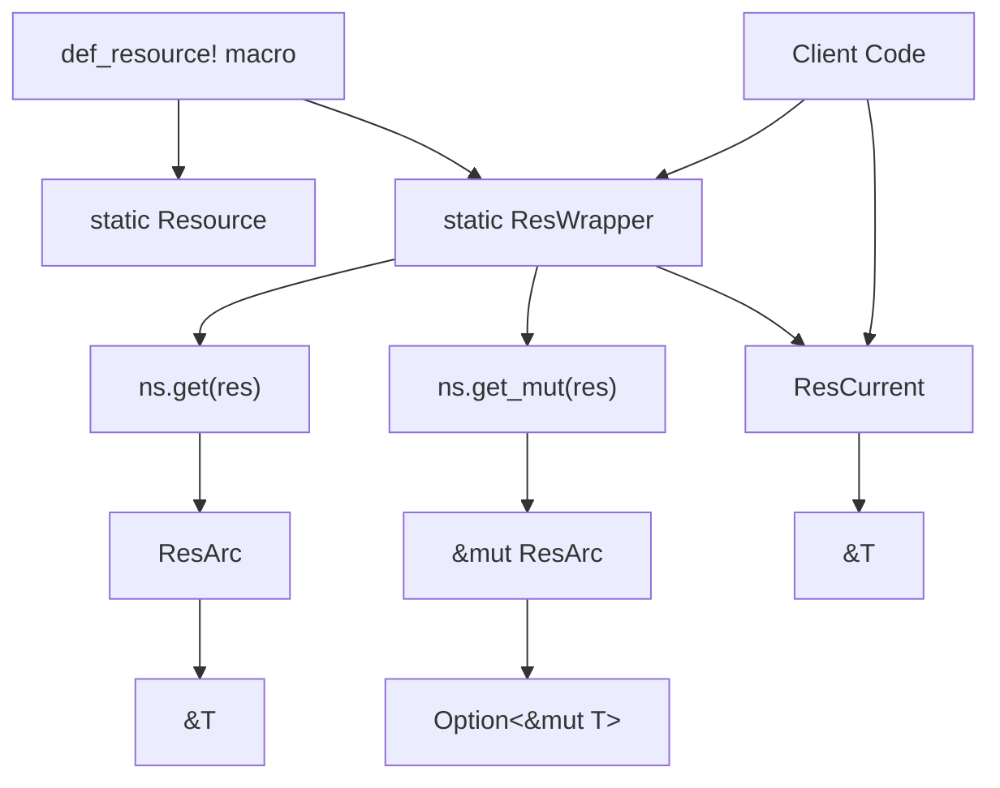

# Resources and ResWrapper

> **Relevant source files**
> * [src/arc.rs](https://github.com/Starry-OS/axns/blob/622a680e/src/arc.rs)
> * [src/res.rs](https://github.com/Starry-OS/axns/blob/622a680e/src/res.rs)

This page documents the resource system in AXNS, focusing on the `Resource` struct and `ResWrapper<T>` container that provide typed access to resources in namespaces. For information about how resources are defined using macros, see [The def_resource! Macro](/Starry-OS/axns/2.3-the-def_resource!-macro).

## Resource System Overview

Resources in AXNS are statically defined objects that can be accessed through namespaces. The resource system provides:

1. Type-safe access to resources
2. Reference counting for memory management
3. Sharing capabilities between namespaces
4. Thread-local or global contexts depending on configuration

```

```

**Sources:** [src/res.rs(L11 - L43)&emsp;](https://github.com/Starry-OS/axns/blob/622a680e/src/res.rs#L11-L43) [src/res.rs(L53 - L105)&emsp;](https://github.com/Starry-OS/axns/blob/622a680e/src/res.rs#L53-L105) [src/res.rs(L115 - L128)&emsp;](https://github.com/Starry-OS/axns/blob/622a680e/src/res.rs#L115-L128) [src/arc.rs(L17 - L47)&emsp;](https://github.com/Starry-OS/axns/blob/622a680e/src/arc.rs#L17-L47) [src/arc.rs(L49 - L120)&emsp;](https://github.com/Starry-OS/axns/blob/622a680e/src/arc.rs#L49-L120)

## The Resource Struct

The `Resource` struct is the foundational building block of the resource system:



**Sources:** [src/res.rs(L11 - L15)&emsp;](https://github.com/Starry-OS/axns/blob/622a680e/src/res.rs#L11-L15) [src/res.rs(L17 - L44)&emsp;](https://github.com/Starry-OS/axns/blob/622a680e/src/res.rs#L17-L44)

The `Resource` struct is defined in `src/res.rs` and contains three key components:

* `layout`: Specifies the memory layout for the resource type
* `init`: A function pointer to initialize the resource
* `drop`: A function pointer to clean up the resource when it's dropped

Resources are stored in a special link-time section named "axns_resources", which allows them to be accessed as a collection through the `Resources` struct. This implementation mimics the behavior of the `linkme` crate.

## ResWrapper: Type-Safe Resource Access

The `ResWrapper<T>` struct provides a typed interface to access resources:



**Sources:** [src/res.rs(L53 - L105)&emsp;](https://github.com/Starry-OS/axns/blob/622a680e/src/res.rs#L53-L105)

`ResWrapper<T>` is a wrapper around a static `Resource` that provides type-safe access methods:

* `get`: Obtains a reference to the resource in a given namespace
* `get_mut`: Attempts to get a mutable reference (only if the resource isn't shared)
* `current`: Creates a `ResCurrent<T>` that references the resource in the current namespace
* `share_from`: Shares a resource from one namespace to another
* `reset`: Resets a resource to its default value in a namespace

## ResCurrent: Accessing the Current Namespace

`ResCurrent<T>` provides a convenient way to access resources in the current namespace:



**Sources:** [src/res.rs(L115 - L128)&emsp;](https://github.com/Starry-OS/axns/blob/622a680e/src/res.rs#L115-L128)

`ResCurrent<T>` implements `Deref<Target = T>`, which allows for transparent access to the underlying resource value. When you dereference a `ResCurrent<T>` (using `*` or accessing fields/methods), it automatically retrieves the resource from the current namespace.

## Memory Management with ResArc

Resources are managed using a reference-counted smart pointer called `ResArc`:



**Sources:** [src/arc.rs(L17 - L47)&emsp;](https://github.com/Starry-OS/axns/blob/622a680e/src/arc.rs#L17-L47) [src/arc.rs(L49 - L120)&emsp;](https://github.com/Starry-OS/axns/blob/622a680e/src/arc.rs#L49-L120)

`ResArc` uses a pattern similar to Rust's standard `Arc<T>` to implement reference counting:

1. When a new `ResArc` is created, it allocates memory for both the `ResInner` header and the resource data
2. The `ResInner` contains a reference to the static `Resource` definition and an atomic reference counter
3. Cloning an `ResArc` increments the reference counter
4. Dropping an `ResArc` decrements the counter; when it reaches zero, the memory is deallocated

This system ensures that resources are properly cleaned up when they're no longer needed, while allowing efficient sharing between namespaces.

## Resource Sharing and Reset

`ResWrapper<T>` provides methods to share resources between namespaces and reset them to their default values:



**Sources:** [src/res.rs(L94 - L104)&emsp;](https://github.com/Starry-OS/axns/blob/622a680e/src/res.rs#L94-L104)

* `share_from`: This method clones the `ResArc` from the source namespace and assigns it to the destination namespace. This creates a shared reference to the same resource value.
* `reset`: This method creates a new `ResArc` with the default value for the resource and assigns it to the namespace, effectively resetting it to its initial state.

## Resource Collection System

Resources are stored in a special link-time section and accessed through the `Resources` collection:



**Sources:** [src/res.rs(L17 - L44)&emsp;](https://github.com/Starry-OS/axns/blob/622a680e/src/res.rs#L17-L44)

The resource collection system uses link-time sections to create an array of `Resource` objects:

1. `Resources::deref()` calculates the length of the resource array by finding the difference between the start and end addresses
2. The `Resource::index()` method calculates the index of a resource in this array
3. The index is used by the `Namespace` to store and retrieve resource instances

This approach allows for efficient storage and lookup of resources with minimal runtime overhead.

## Complete Resource Flow

The complete flow of defining and accessing resources involves several components:



**Sources:** [src/res.rs(L53 - L128)&emsp;](https://github.com/Starry-OS/axns/blob/622a680e/src/res.rs#L53-L128) [src/res.rs(L144 - L168)&emsp;](https://github.com/Starry-OS/axns/blob/622a680e/src/res.rs#L144-L168)

This diagram illustrates the complete flow from resource definition to access:

1. Resources are defined using the `def_resource!` macro
2. The macro generates a static `Resource` object and a `ResWrapper<T>` to access it
3. Client code can access the resource in multiple ways:
* Using `get()` to get a reference in a specific namespace
* Using `get_mut()` to get a mutable reference if possible
* Using `current()` to access the resource in the current namespace

## Summary

The Resource system in AXNS provides a flexible and type-safe way to define and access resources in different namespaces. Key components include:

|Component|Purpose|
| --- | --- |
|Resource|Defines the layout and lifecycle functions for a resource|
|ResWrapper<T>|Provides type-safe access to resources in namespaces|
|ResCurrent<T>|Enables access to resources in the current namespace|
|ResArc|Implements reference counting for resource management|

This system enables efficient sharing of resources between namespaces while maintaining memory safety and proper cleanup when resources are no longer needed.