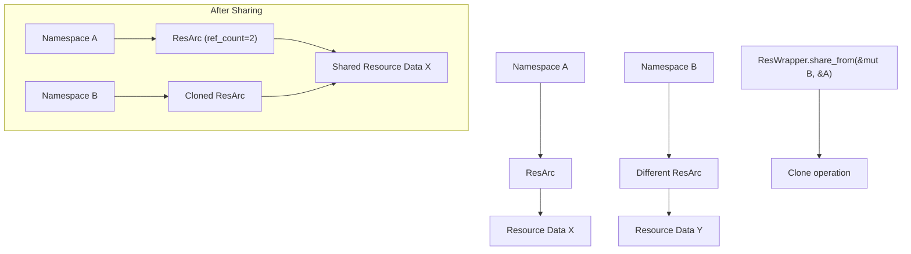
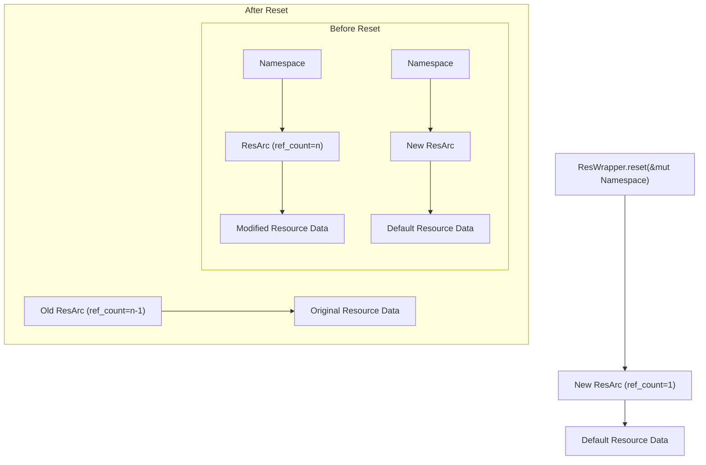
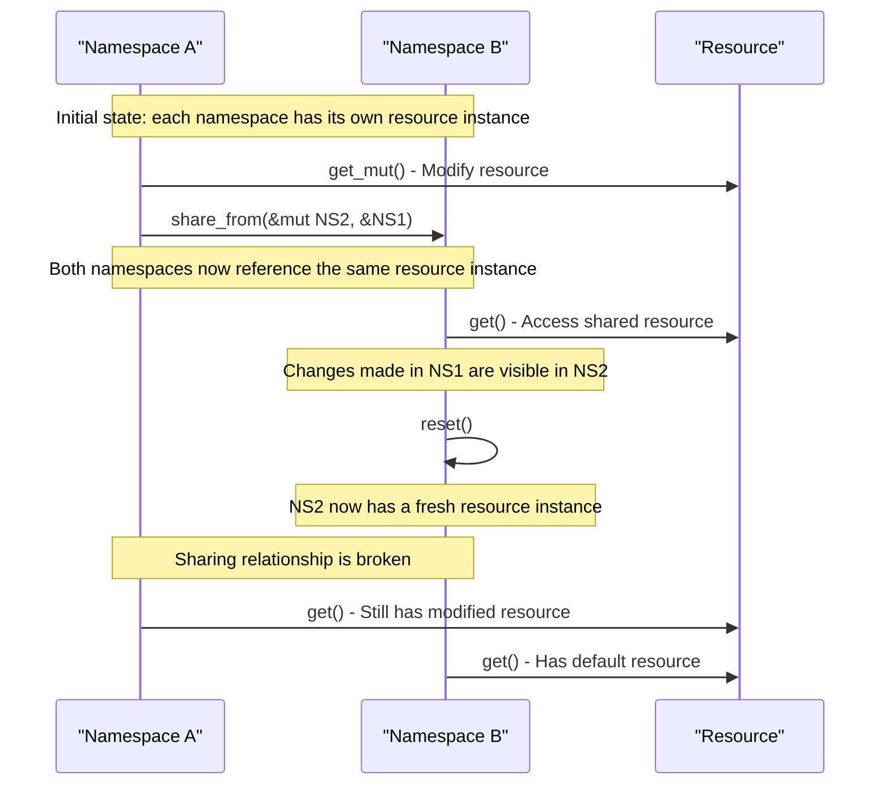

# Sharing and Resetting Resources

> **Relevant source files**
> * [src/res.rs](https://github.com/Starry-OS/axns/blob/622a680e/src/res.rs)
> * [tests/all.rs](https://github.com/Starry-OS/axns/blob/622a680e/tests/all.rs)

This page explains how to share resources between namespaces and how to reset resources to their default values in the AXNS system. These operations are essential for effective resource management in multi-namespace environments. For information about basic resource access and modification, see [Basic Resource Access](/Starry-OS/axns/5.1-basic-resource-access).

## Resource Sharing

AXNS allows resources to be shared between namespaces using the `share_from` method. When a resource is shared, both namespaces reference the same underlying data, though through separate `ResArc` instances. This means changes to the resource will be visible across all namespaces that share it.

### How Resource Sharing Works

Resource sharing transfers the reference from one namespace to another by cloning the `ResArc` that wraps the resource:



The `share_from` method implementation is straightforward:

```rust
pub fn share_from<'ns>(&self, dst: &'ns mut Namespace, src: &'ns Namespace) {
    *dst.get_mut(self.res) = src.get(self.res).clone();
}
```

This method clones the `ResArc` from the source namespace and replaces the existing `ResArc` in the destination namespace. The reference count for the resource increases, ensuring it won't be deallocated until all namespaces release their references.

Sources: [src/res.rs(L96 - L98)&emsp;](https://github.com/Starry-OS/axns/blob/622a680e/src/res.rs#L96-L98)

### Example of Resource Sharing

Here's a practical example of sharing a resource between namespaces:

```javascript
// Define a resource
def_resource! {
    static SHARED_DATA: Arc<()> = Arc::new(());
}

// Set up source namespace with custom data
let mut src_ns = Namespace::new();
DATA.get_mut(&mut src_ns).unwrap().clone_from(&MY_CUSTOM_DATA);

// Create destination namespace
let mut dst_ns = Namespace::new();

// Share the resource from source to destination
DATA.share_from(&mut dst_ns, &src_ns);

// Now both namespaces reference the same underlying data
// Changes in one namespace will be visible in the other
```

Sources: [tests/all.rs(L126 - L158)&emsp;](https://github.com/Starry-OS/axns/blob/622a680e/tests/all.rs#L126-L158)

## Resource Resetting

The `reset` method allows you to discard the current state of a resource in a namespace and reinitialize it to the default value defined in the `def_resource!` macro.

### How Resource Resetting Works

Resetting creates a new `ResArc` instance with freshly initialized resource data:



The implementation of `reset` is equally straightforward:

```rust
pub fn reset(&self, ns: &mut Namespace) {
    *ns.get_mut(self.res) = ResArc::new(self.res);
}
```

This method creates a new `ResArc` for the resource with default initialization and replaces the existing one in the namespace. The reference count of the old `ResArc` decreases, potentially triggering deallocation if no other namespaces reference it.

Sources: [src/res.rs(L102 - L104)&emsp;](https://github.com/Starry-OS/axns/blob/622a680e/src/res.rs#L102-L104)

### Example of Resource Resetting

Here's how to reset a resource to its default value:

```javascript
// Define a resource
def_resource! {
    static DATA: Arc<()> = Arc::new(());
}

// Get a namespace and potentially modify the resource
let mut ns = Namespace::new();
// ...modify resource...

// Reset the resource to its default value
DATA.reset(&mut ns);

// Now the resource has been reinitialized with the default value
// Any previous sharing relationships are broken for this namespace
```

Sources: [tests/all.rs(L97 - L123)&emsp;](https://github.com/Starry-OS/axns/blob/622a680e/tests/all.rs#L97-L123)

## Use Cases and Considerations

### When to Use Sharing vs. Resetting

* **Use sharing** when:

* Multiple namespaces need to access the same resource instance
* You want to propagate changes from one namespace to others
* You need to conserve memory by avoiding duplication of large resources
* **Use resetting** when:

* You need to return a resource to its initial state
* You want to break sharing relationships with other namespaces
* You're reinitializing a namespace for reuse

### Memory Management Implications

Both operations affect resource reference counting:

|Operation|Effect on Reference Count|Memory Impact|
| --- | --- | --- |
|share_from|Increases reference count for source resource|Prevents deallocation as long as any namespace references it|
|reset|Decreases reference count of old resource|May trigger deallocation if count reaches zero|

### Thread Safety Considerations

When using these operations in a multi-threaded environment:

* Ensure proper synchronization when accessing shared resources
* For thread-local namespaces (with the `thread-local` feature enabled), be aware that resources are isolated by default
* Consider using thread-safe types (atomics, mutexes) for resources that may be shared across threads

Sources: [src/res.rs(L53 - L105)&emsp;](https://github.com/Starry-OS/axns/blob/622a680e/src/res.rs#L53-L105)

## Example: Resource Lifecycle with Sharing and Resetting

The following sequence diagram illustrates a typical resource lifecycle involving sharing and resetting:



Sources: [src/res.rs(L96 - L104)&emsp;](https://github.com/Starry-OS/axns/blob/622a680e/src/res.rs#L96-L104)

## Best Practices

1. **Be mindful of sharing**: Shared resources cannot be safely mutated through `get_mut()`, so plan your resource usage accordingly.
2. **Consider reference counting**: When sharing or resetting resources that hold external allocations (like `Arc`), be aware of the reference counting implications.
3. **Use reset for cleanup**: Reset resources in namespaces before reusing them to prevent resource leaks and ensure consistent initial states.
4. **Share judiciously**: While sharing can save memory, it can make resource management more complex by creating implicit dependencies between namespaces.

Sources: [src/res.rs(L90 - L92)&emsp;](https://github.com/Starry-OS/axns/blob/622a680e/src/res.rs#L90-L92) [tests/all.rs(L97 - L158)&emsp;](https://github.com/Starry-OS/axns/blob/622a680e/tests/all.rs#L97-L158)