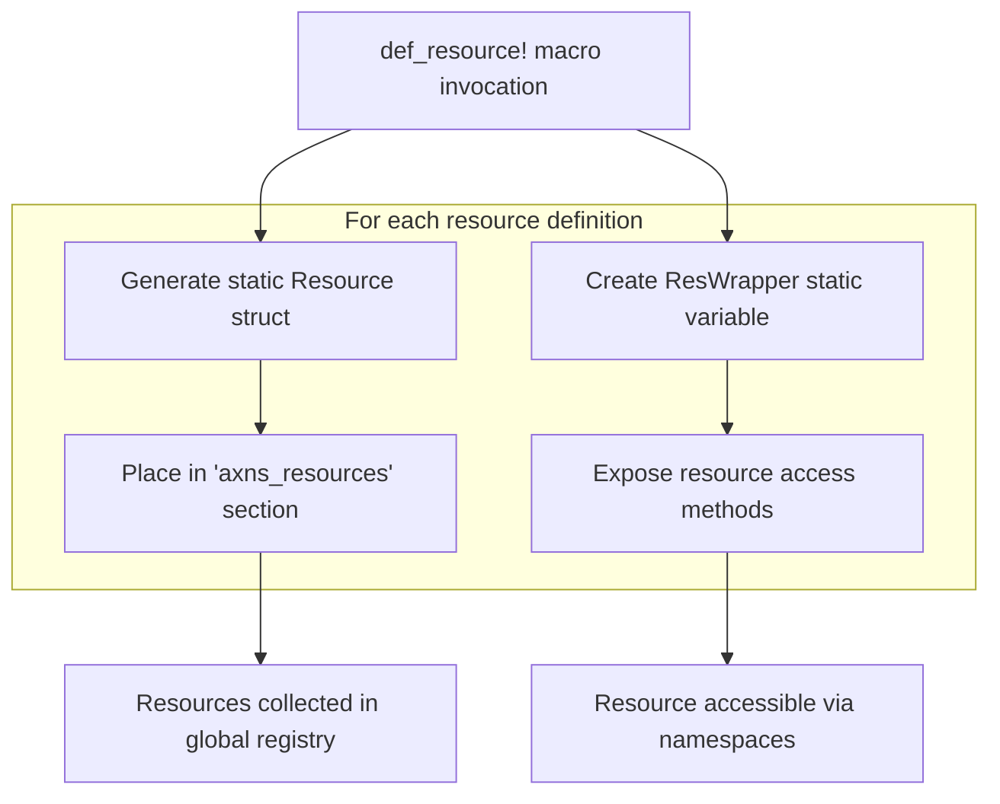
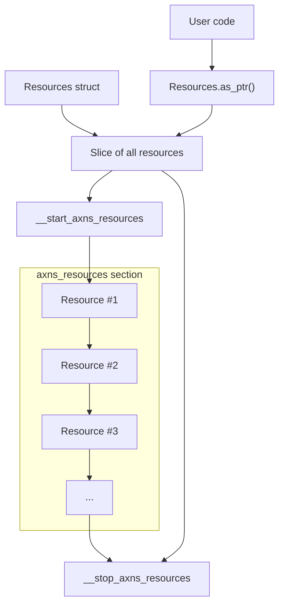
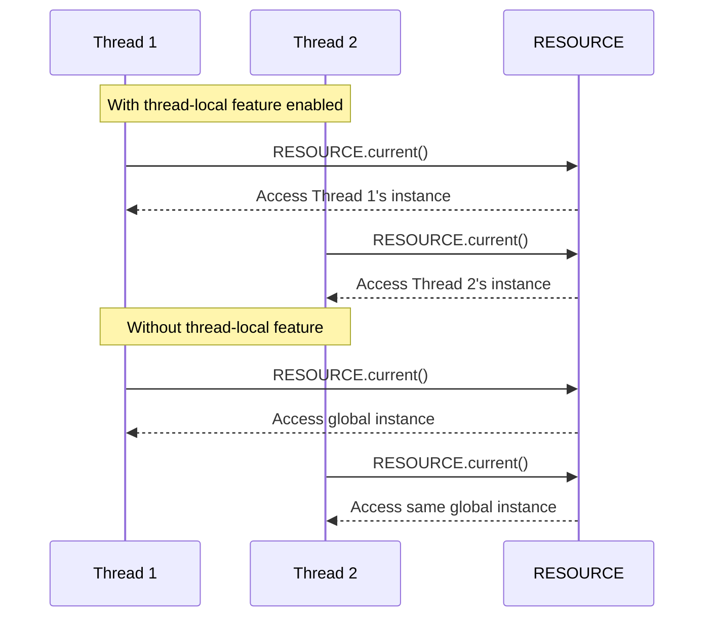

# The def_resource! Macro

> **Relevant source files**
> * [src/res.rs](https://github.com/Starry-OS/axns/blob/622a680e/src/res.rs)
> * [tests/all.rs](https://github.com/Starry-OS/axns/blob/622a680e/tests/all.rs)

The `def_resource!` macro is a core component of the AXNS system that provides a declarative syntax for defining static resources that can be managed within namespaces. This page explains how the macro works, its syntax, and how it integrates with the rest of the AXNS resource namespace system.

For information about the general resource system and `ResWrapper` structure, see [Resources and ResWrapper](/Starry-OS/axns/2.2-resources-and-reswrapper).

## Purpose and Function

The `def_resource!` macro serves as the primary entry point for users to define resources that can be managed by the AXNS namespace system. It:

1. Creates static resources with type safety and initialization logic
2. Registers these resources in a global resource registry
3. Generates wrapper objects that provide a consistent interface for resource access
4. Handles proper memory layout and lifecycle management for resources

Sources: [src/res.rs(L144 - L168)&emsp;](https://github.com/Starry-OS/axns/blob/622a680e/src/res.rs#L144-L168)

## Macro Syntax and Usage

The `def_resource!` macro follows this syntax pattern:

```css
def_resource! {
    /// Optional documentation
    [visibility] static RESOURCE_NAME: ResourceType = default_value;
    
    // Multiple resources can be defined in a single macro invocation
    [visibility] static ANOTHER_RESOURCE: AnotherType = another_default_value;
}
```

Key components:

* **Visibility modifier** (`pub`, `pub(crate)`, etc.) - controls access to the resource
* **Resource name** - a static identifier for accessing the resource
* **Resource type** - any valid Rust type
* **Default value** - the initial value assigned to the resource in each namespace

Sources: [src/res.rs(L144 - L168)&emsp;](https://github.com/Starry-OS/axns/blob/622a680e/src/res.rs#L144-L168) [tests/all.rs(L11 - L13)&emsp;](https://github.com/Starry-OS/axns/blob/622a680e/tests/all.rs#L11-L13) [tests/all.rs(L31 - L33)&emsp;](https://github.com/Starry-OS/axns/blob/622a680e/tests/all.rs#L31-L33)

## How the Macro Works



Sources: [src/res.rs(L144 - L168)&emsp;](https://github.com/Starry-OS/axns/blob/622a680e/src/res.rs#L144-L168) [src/res.rs(L17 - L34)&emsp;](https://github.com/Starry-OS/axns/blob/622a680e/src/res.rs#L17-L34)

When you use the `def_resource!` macro, it expands to create two key components for each defined resource:

1. A static `Resource` structure that contains:

* Memory layout information for the resource type
* Initialization function that creates the default value
* Drop function that handles cleanup when resources are deallocated
2. A static `ResWrapper<T>` that provides methods to access the resource in different namespaces

The macro places each `Resource` structure in a special ELF section named "axns_resources", which allows the system to discover all resources at runtime without requiring explicit registration.

Sources: [src/res.rs(L144 - L168)&emsp;](https://github.com/Starry-OS/axns/blob/622a680e/src/res.rs#L144-L168) [src/res.rs(L10 - L15)&emsp;](https://github.com/Starry-OS/axns/blob/622a680e/src/res.rs#L10-L15)

## Generated Code Structure

```

```

The expanded macro code generates:

1. A static `Resource` instance with fixed layout and lifecycle functions
2. A static `ResWrapper<T>` instance that wraps the resource
3. Assertions to ensure the resource type isn't zero-sized

Sources: [src/res.rs(L144 - L168)&emsp;](https://github.com/Starry-OS/axns/blob/622a680e/src/res.rs#L144-L168) [src/res.rs(L53 - L56)&emsp;](https://github.com/Starry-OS/axns/blob/622a680e/src/res.rs#L53-L56)

## Generated Code Example

When you write:

```css
def_resource! {
    pub static COUNTER: AtomicUsize = AtomicUsize::new(0);
}
```

The macro expands to something equivalent to:

```javascript
pub static COUNTER: ResWrapper<AtomicUsize> = {
    #[unsafe(link_section = "axns_resources")]
    static RES: Resource = Resource {
        layout: Layout::new::<AtomicUsize>(),
        init: |ptr| {
            let val: AtomicUsize = AtomicUsize::new(0);
            unsafe { ptr.cast().write(val) }
        },
        drop: |ptr| unsafe {
            ptr.cast::<AtomicUsize>().drop_in_place();
        },
    };

    assert!(RES.layout.size() != 0, "Resource has zero size");

    ResWrapper::new(&RES)
};
```

This generated code creates a static `Resource` structure with the proper memory layout and lifecycle functions for an `AtomicUsize`, then wraps it in a `ResWrapper<AtomicUsize>` that provides type-safe access methods.

Sources: [src/res.rs(L144 - L168)&emsp;](https://github.com/Starry-OS/axns/blob/622a680e/src/res.rs#L144-L168)

## Memory Layout and Resource Registry



The `def_resource!` macro places all resources in a dedicated ELF section called "axns_resources". The AXNS system uses special linker symbols (`__start_axns_resources` and `__stop_axns_resources`) to locate the beginning and end of this section, allowing it to create a slice of all defined resources.

The `Resources` struct (implementing `Deref<Target=[Resource]>`) provides access to all registered resources as a contiguous array, which is used for resource indexing and lookup.

Sources: [src/res.rs(L17 - L34)&emsp;](https://github.com/Starry-OS/axns/blob/622a680e/src/res.rs#L17-L34) [src/res.rs(L36 - L44)&emsp;](https://github.com/Starry-OS/axns/blob/622a680e/src/res.rs#L36-L44)

## Resource Access Methods

The `ResWrapper<T>` generated by the macro provides several methods to access the wrapped resource:

|Method|Purpose|Return Type|
| --- | --- | --- |
|get(ns)|Get immutable reference from namespace|&T|
|get_mut(ns)|Get mutable reference if not shared|Option<&mut T>|
|current()|Access resource in current namespace|ResCurrent<T>|
|share_from(dst, src)|Share resource between namespaces|()|
|reset(ns)|Reset resource to default value|()|

These methods provide a complete interface for interacting with resources in both specific and current namespaces.

Sources: [src/res.rs(L58 - L105)&emsp;](https://github.com/Starry-OS/axns/blob/622a680e/src/res.rs#L58-L105)

## Usage Examples

### Basic Resource Definition and Access

```javascript
// Define resources
def_resource! {
    pub static CONFIG: Config = Config::default();
    pub static COUNTER: AtomicUsize = AtomicUsize::new(0);
}

// Create a namespace
let mut ns = Namespace::new();

// Access resources
let config = CONFIG.get(&ns);
let counter_val = COUNTER.get(&ns).load(Relaxed);

// Modify resources (if not shared)
if let Some(counter) = COUNTER.get_mut(&mut ns) {
    counter.store(42, Relaxed);
}
```

Sources: [tests/all.rs(L11 - L24)&emsp;](https://github.com/Starry-OS/axns/blob/622a680e/tests/all.rs#L11-L24) [tests/all.rs(L31 - L38)&emsp;](https://github.com/Starry-OS/axns/blob/622a680e/tests/all.rs#L31-L38)

### Using the Current Namespace

The `current()` method provides convenient access to resources in the current namespace, which is determined by the `CurrentNs` implementation (globally shared or thread-local depending on feature flags):

```javascript
// Access and modify resource in current namespace
let counter = COUNTER.current();
counter.fetch_add(1, Relaxed);
```

Sources: [src/res.rs(L69 - L76)&emsp;](https://github.com/Starry-OS/axns/blob/622a680e/src/res.rs#L69-L76) [tests/all.rs(L35 - L37)&emsp;](https://github.com/Starry-OS/axns/blob/622a680e/tests/all.rs#L35-L37)

### Resource Sharing and Resetting

```javascript
// Create two namespaces
let mut ns1 = Namespace::new();
let mut ns2 = Namespace::new();

// Modify resource in ns1
if let Some(counter) = COUNTER.get_mut(&mut ns1) {
    counter.store(42, Relaxed);
}

// Share the resource from ns1 to ns2
COUNTER.share_from(&mut ns2, &ns1);

// Later, reset the resource in ns2 to its default value
COUNTER.reset(&mut ns2);
```

Sources: [src/res.rs(L94 - L104)&emsp;](https://github.com/Starry-OS/axns/blob/622a680e/src/res.rs#L94-L104) [tests/all.rs(L96 - L123)&emsp;](https://github.com/Starry-OS/axns/blob/622a680e/tests/all.rs#L96-L123)

## Thread-Local Considerations

When using the `thread-local` feature flag, resources defined with `def_resource!` can be accessed in a thread-local context, providing isolation between threads.



The `current()` method on resources defined with `def_resource!` respects the thread-local configuration of the AXNS system, making it easier to write code that works in both shared and isolated resource modes.

Sources: [src/res.rs(L69 - L76)&emsp;](https://github.com/Starry-OS/axns/blob/622a680e/src/res.rs#L69-L76) [tests/all.rs(L40 - L159)&emsp;](https://github.com/Starry-OS/axns/blob/622a680e/tests/all.rs#L40-L159)

## Implementation Details

### Resource Indexing

Each `Resource` defined by the macro has an `index()` method that computes its position in the global resource registry. This index is used by the `Namespace` to efficiently store and retrieve resources without requiring hash lookups.

Sources: [src/res.rs(L36 - L44)&emsp;](https://github.com/Starry-OS/axns/blob/622a680e/src/res.rs#L36-L44)

### Zero-Sized Types

The macro includes an assertion to ensure the resource type isn't zero-sized, as this would cause issues with the memory management system:

```
assert!(RES.layout.size() != 0, "Resource has zero size");
```

This prevents potential errors when defining resources with types like `()` or empty structs.

Sources: [src/res.rs(L162)&emsp;](https://github.com/Starry-OS/axns/blob/622a680e/src/res.rs#L162-L162)

### Resource Initialization

The `init` function generated by the macro creates the default value and writes it to memory when a namespace is initialized. This ensures that every namespace starts with properly initialized resources.

Sources: [src/res.rs(L153 - L156)&emsp;](https://github.com/Starry-OS/axns/blob/622a680e/src/res.rs#L153-L156)

## Summary

The `def_resource!` macro is the foundation of the AXNS resource system, providing a clean, type-safe interface for defining resources that can be managed within namespaces. It generates the necessary code to handle resource lifecycle management, access control, and integration with the namespace system.

By placing all resources in a special ELF section and providing wrapper types with access methods, it enables efficient resource lookup and manipulation while maintaining a simple user interface.