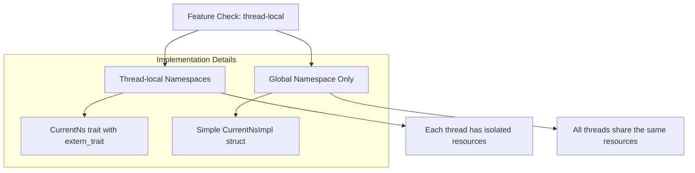
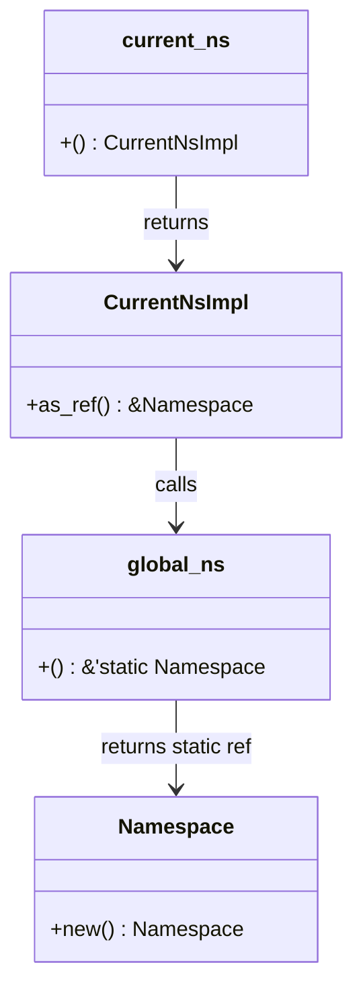
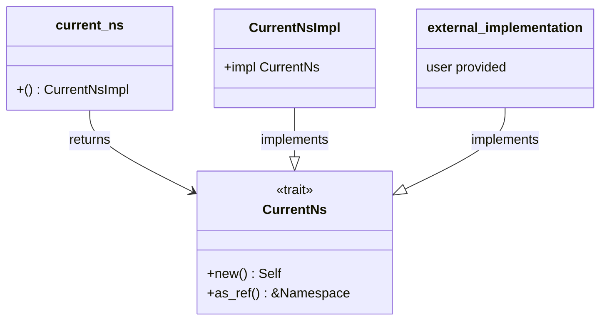
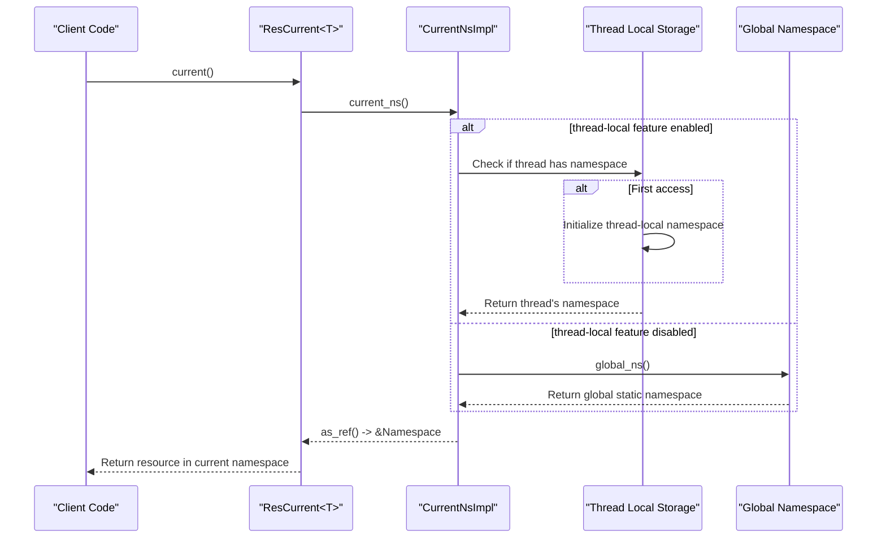
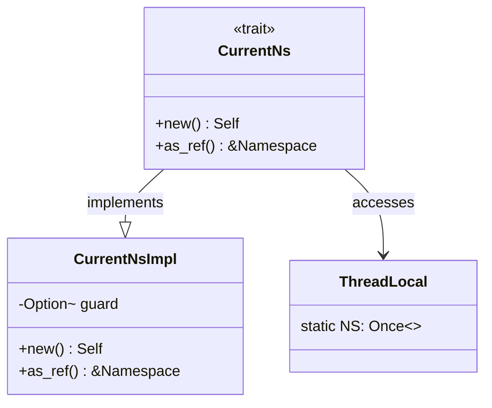
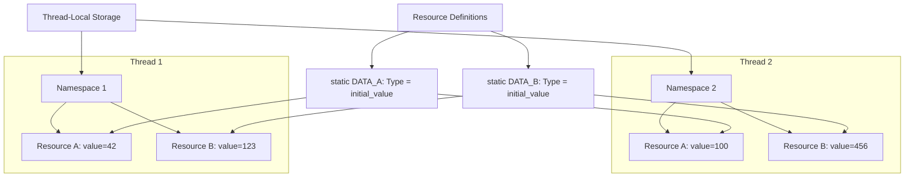
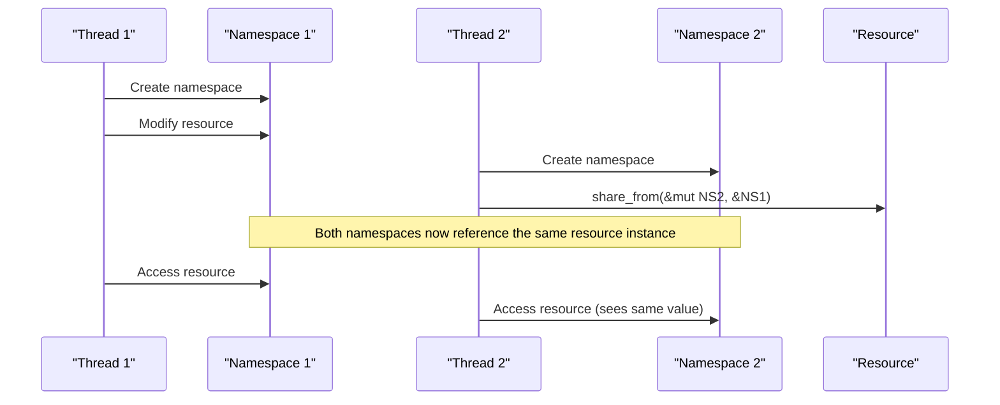
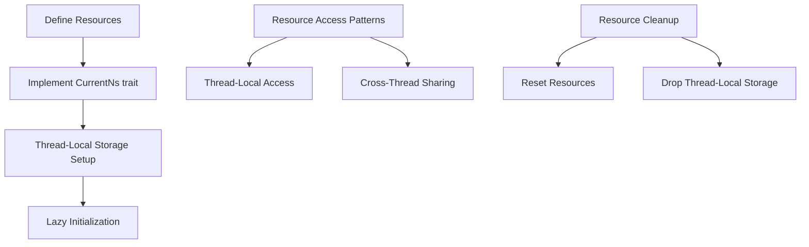

# Thread-Local Features

> **Relevant source files**
> * [Cargo.toml](https://github.com/Starry-OS/axns/blob/622a680e/Cargo.toml)
> * [src/lib.rs](https://github.com/Starry-OS/axns/blob/622a680e/src/lib.rs)
> * [tests/all.rs](https://github.com/Starry-OS/axns/blob/622a680e/tests/all.rs)

## Purpose and Scope

This page documents the thread-local namespace functionality in AXNS, which provides isolation of resources between threads. When enabled, this feature allows each thread to maintain its own separate namespace, as opposed to sharing a global namespace. For information about namespaces in general, see [Namespaces](/Starry-OS/axns/2.1-namespaces); for information about resource lifecycle management, see [Resource Lifecycle](/Starry-OS/axns/4-resource-lifecycle).

Sources: [src/lib.rs(L20 - L59)&emsp;](https://github.com/Starry-OS/axns/blob/622a680e/src/lib.rs#L20-L59) [Cargo.toml(L14 - L15)&emsp;](https://github.com/Starry-OS/axns/blob/622a680e/Cargo.toml#L14-L15)

## Feature Flag Overview

Thread-local functionality is controlled by the `thread-local` feature flag in AXNS. When this feature is enabled, it adds the ability for each thread to have its own isolated namespace for resources.

Thread-local Feature Control Flow

Sources: [Cargo.toml(L14 - L15)&emsp;](https://github.com/Starry-OS/axns/blob/622a680e/Cargo.toml#L14-L15) [src/lib.rs(L35 - L59)&emsp;](https://github.com/Starry-OS/axns/blob/622a680e/src/lib.rs#L35-L59)

## Implementation Architecture

The thread-local feature implementation centers around the `CurrentNs` trait, which is only defined when the feature flag is enabled. This trait abstracts the retrieval of the current namespace for a thread.

### With Thread-Local Feature Disabled

When the thread-local feature is disabled, all resource accesses use the global namespace. This is implemented through a simple `CurrentNsImpl` struct that returns the global namespace when asked for the current namespace.

Implementation without Thread-Local Feature

Sources: [src/lib.rs(L44 - L59)&emsp;](https://github.com/Starry-OS/axns/blob/622a680e/src/lib.rs#L44-L59) [src/lib.rs(L17 - L25)&emsp;](https://github.com/Starry-OS/axns/blob/622a680e/src/lib.rs#L17-L25)

### With Thread-Local Feature Enabled

When the thread-local feature is enabled, the system uses the `CurrentNs` trait which can be implemented by user code to provide thread-local namespaces. The trait is marked as unsafe because implementations must ensure proper thread safety.

Implementation with Thread-Local Feature

Sources: [src/lib.rs(L27 - L42)&emsp;](https://github.com/Starry-OS/axns/blob/622a680e/src/lib.rs#L27-L42) [src/lib.rs(L54 - L59)&emsp;](https://github.com/Starry-OS/axns/blob/622a680e/src/lib.rs#L54-L59)

## Accessing Resources with Thread-Local Namespaces

When a resource is accessed using its `current()` method, the behavior differs based on whether the thread-local feature is enabled:

Resource Access Flow with Thread-Local Feature

Sources: [src/lib.rs(L17 - L59)&emsp;](https://github.com/Starry-OS/axns/blob/622a680e/src/lib.rs#L17-L59) [tests/all.rs(L40 - L159)&emsp;](https://github.com/Starry-OS/axns/blob/622a680e/tests/all.rs#L40-L159)

## Implementation Example

The tests in the codebase provide a practical example of implementing thread-local namespaces. This implementation uses a thread-local `Once` value to store an `Arc<RwLock<Namespace>>`.

### Example Thread-Local Implementation

Thread-Local Implementation Example

Sources: [tests/all.rs(L49 - L70)&emsp;](https://github.com/Starry-OS/axns/blob/622a680e/tests/all.rs#L49-L70)

## Resource Isolation Between Threads

When the thread-local feature is enabled, resources can be isolated between threads. Each thread can create its own namespace and modify resources independently of other threads.

Thread Isolation with Thread-Local Namespaces

Sources: [tests/all.rs(L40 - L159)&emsp;](https://github.com/Starry-OS/axns/blob/622a680e/tests/all.rs#L40-L159)

## Resource Sharing Between Thread-Local Namespaces

Even with thread isolation, AXNS allows for controlled sharing of resources between namespaces using the `share_from` method. This creates a shared reference to the same resource instance across different namespaces.

Resource Sharing Between Thread-Local Namespaces

Sources: [tests/all.rs(L125 - L159)&emsp;](https://github.com/Starry-OS/axns/blob/622a680e/tests/all.rs#L125-L159)

## Thread-Local Features in Action

The following table summarizes key operations and their behavior with thread-local features enabled:

|Operation|With Thread-Local Enabled|With Thread-Local Disabled|
| --- | --- | --- |
|resource.current()|Returns resource from thread's namespace|Returns resource from global namespace|
|current_ns()|Returns thread-specificCurrentNsImpl|Returns global-referencingCurrentNsImpl|
|Resource Creation|Created in thread-local namespace|Created in global namespace|
|Resource Sharing|Must explicitly useshare_from()|Automatically shared (single namespace)|
|Resource Reset|Only affects thread's namespace|Affects all threads|

Sources: [src/lib.rs(L17 - L59)&emsp;](https://github.com/Starry-OS/axns/blob/622a680e/src/lib.rs#L17-L59) [tests/all.rs(L40 - L159)&emsp;](https://github.com/Starry-OS/axns/blob/622a680e/tests/all.rs#L40-L159)

## Best Practices for Thread-Local Features

When implementing thread-local namespaces, consider the following best practices:

1. **Initialization**: Initialize thread-local namespaces lazily (on first access)
2. **Thread Safety**: Ensure proper locking or synchronization when accessing the namespace
3. **Resource Management**: Be mindful of resource lifecycle with thread-local namespaces
4. **Custom Implementation**: Implement `CurrentNs` trait for your specific thread-local storage needs

Thread-Local Feature Usage Guide

Sources: [tests/all.rs(L40 - L159)&emsp;](https://github.com/Starry-OS/axns/blob/622a680e/tests/all.rs#L40-L159) [src/lib.rs(L27 - L42)&emsp;](https://github.com/Starry-OS/axns/blob/622a680e/src/lib.rs#L27-L42)

## Implementation Considerations

When designing an implementation of thread-local namespaces, you should address:

1. **Storage Strategy**: How thread-local namespaces are stored and retrieved
2. **Initialization Logic**: When and how thread-local namespaces are created
3. **Default Behavior**: What happens when a thread doesn't have a namespace
4. **Thread Cleanup**: Ensuring resources are properly cleaned up when threads exit

The test implementation provides one approach using thread-local storage with `Once` and `Arc<RwLock<Namespace>>`, but other approaches may be more suitable depending on your specific requirements.

Sources: [tests/all.rs(L49 - L70)&emsp;](https://github.com/Starry-OS/axns/blob/622a680e/tests/all.rs#L49-L70) [src/lib.rs(L27 - L42)&emsp;](https://github.com/Starry-OS/axns/blob/622a680e/src/lib.rs#L27-L42)