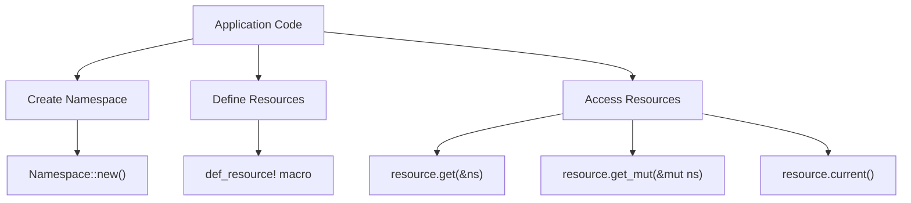
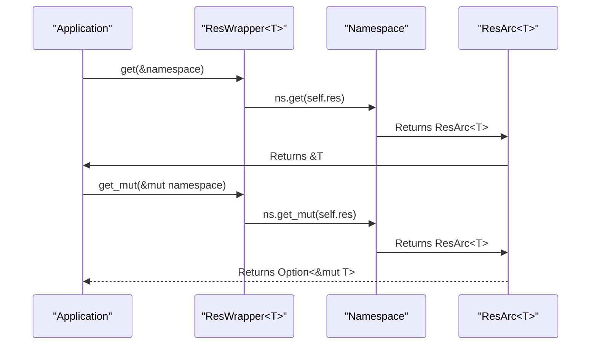
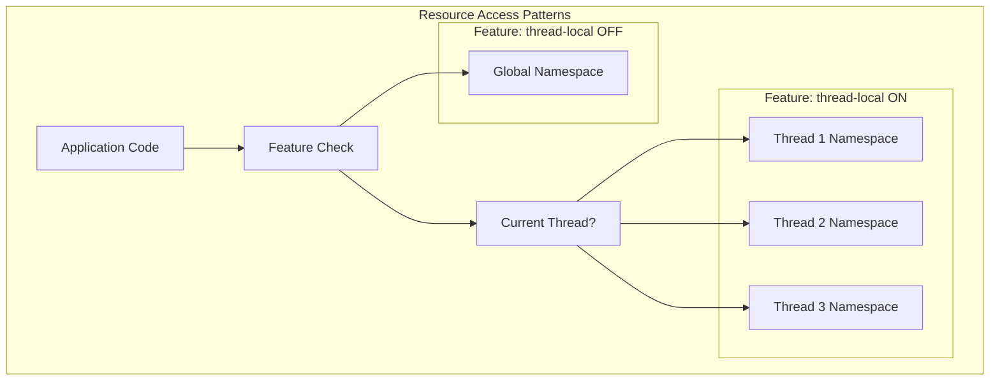
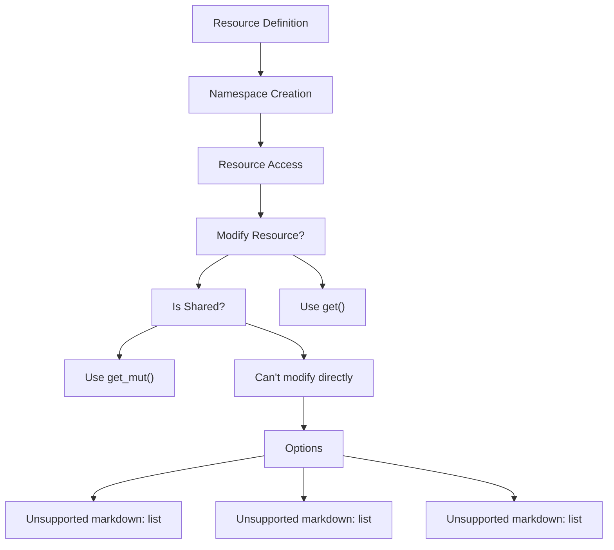

# Usage Guide

> **Relevant source files**
> * [src/lib.rs](https://github.com/Starry-OS/axns/blob/622a680e/src/lib.rs)
> * [src/res.rs](https://github.com/Starry-OS/axns/blob/622a680e/src/res.rs)
> * [tests/all.rs](https://github.com/Starry-OS/axns/blob/622a680e/tests/all.rs)

This guide provides practical instructions for using the AXNS library to manage resources across namespaces. It covers how to define resources, create namespaces, access and modify resources, and advanced operations like sharing and resetting resources. For conceptual understanding of the AXNS architecture, see [Core Concepts](/Starry-OS/axns/2-core-concepts), and for deeper details on resource lifecycle, see [Resource Lifecycle](/Starry-OS/axns/4-resource-lifecycle).

## Defining Resources

The first step to using AXNS is defining your resources using the `def_resource!` macro. This macro creates static resource instances with proper initialization and cleanup.

```css
def_resource! {
    /// A simple integer resource
    pub static COUNTER: i32 = 0;
    
    /// A more complex resource with custom type
    pub static CONFIG: Configuration = Configuration::default();
}
```

The macro creates a static `ResWrapper<T>` for each resource, providing methods to access and manipulate the resource within namespaces.

Sources: [src/res.rs(L144 - L168)&emsp;](https://github.com/Starry-OS/axns/blob/622a680e/src/res.rs#L144-L168)

## Creating and Managing Namespaces

A namespace is a container for resource instances. Create a new namespace using the `Namespace::new()` constructor:

```javascript
let mut my_namespace = Namespace::new();
```

When using the thread-local feature, you can also access the current namespace through resource wrappers:

```javascript
let counter_ref = COUNTER.current(); // Gets the resource in the current namespace
```

Sources: [src/lib.rs(L16 - L59)&emsp;](https://github.com/Starry-OS/axns/blob/622a680e/src/lib.rs#L16-L59)



## Basic Resource Access

AXNS provides several methods to access resources within namespaces:

### Read-only Access

To get a reference to a resource in a namespace:

```javascript
// Get reference to the resource in the specific namespace
let counter = COUNTER.get(&my_namespace);
```

### Mutable Access

To modify a resource in a namespace:

```javascript
// Get mutable reference if the resource isn't shared
if let Some(counter) = COUNTER.get_mut(&mut my_namespace) {
    *counter += 1;
}
```

Note that `get_mut()` returns `Option<&mut T>` because it will return `None` if the resource is shared with other namespaces.

### Current Namespace Access

When the thread-local feature is enabled, you can access resources in the current namespace:

```javascript
// Access resource in current namespace
let current_value = COUNTER.current();
```

Sources: [src/res.rs(L69 - L92)&emsp;](https://github.com/Starry-OS/axns/blob/622a680e/src/res.rs#L69-L92) [tests/all.rs(L15 - L25)&emsp;](https://github.com/Starry-OS/axns/blob/622a680e/tests/all.rs#L15-L25)



## Advanced Operations

### Sharing Resources Between Namespaces

To share a resource from one namespace to another:

```javascript
let src_namespace = Namespace::new();
let mut dst_namespace = Namespace::new();

// Share the COUNTER resource from src to dst
COUNTER.share_from(&mut dst_namespace, &src_namespace);
```

This creates a shared reference to the same resource instance in both namespaces. Note that once shared, you won't be able to get mutable access to the resource in either namespace via `get_mut()`.

### Resetting Resources

To reset a resource in a namespace to its default value:

```
// Reset the COUNTER resource to its default value
COUNTER.reset(&mut my_namespace);
```

This discards the current resource instance and creates a new one with the default value specified in the `def_resource!` macro.

Sources: [src/res.rs(L94 - L104)&emsp;](https://github.com/Starry-OS/axns/blob/622a680e/src/res.rs#L94-L104) [tests/all.rs(L96 - L123)&emsp;](https://github.com/Starry-OS/axns/blob/622a680e/tests/all.rs#L96-L123)

## Using Thread-Local Namespaces

When the `thread-local` feature is enabled, AXNS provides thread-local namespaces for resource isolation:

```javascript
// With thread-local feature enabled:
let counter = COUNTER.current(); // Gets from thread-local namespace

// You can implement the CurrentNs trait to define how thread-local
// namespaces are managed
```

The thread-local feature is particularly useful in multi-threaded applications where you want to isolate resources between threads.

Sources: [src/lib.rs(L35 - L42)&emsp;](https://github.com/Starry-OS/axns/blob/622a680e/src/lib.rs#L35-L42) [tests/all.rs(L40 - L159)&emsp;](https://github.com/Starry-OS/axns/blob/622a680e/tests/all.rs#L40-L159)



## Working with Custom Resource Types

AXNS can work with any type as a resource, including custom structs, atomics, and reference-counted types:

```rust
use std::sync::atomic::{AtomicUsize, Ordering};

struct Configuration {
    name: String,
    enabled: bool,
}

impl Configuration {
    fn default() -> Self {
        Self {
            name: "default".to_string(),
            enabled: false,
        }
    }
}

def_resource! {
    // Integer resource
    static COUNTER: i32 = 0;
    
    // Atomic for thread-safe access
    static ATOMIC_COUNTER: AtomicUsize = AtomicUsize::new(0);
    
    // Custom struct
    static CONFIG: Configuration = Configuration::default();
}

// Working with atomic resources
ATOMIC_COUNTER.current().fetch_add(1, Ordering::SeqCst);
```

Sources: [tests/all.rs(L1 - L38)&emsp;](https://github.com/Starry-OS/axns/blob/622a680e/tests/all.rs#L1-L38)

## Best Practices

1. **Use appropriate resource types**: For shared resources that need concurrent access, consider atomic types or other thread-safe structures.
2. **Minimize resource sharing**: While AXNS makes it easy to share resources between namespaces, excessive sharing can reduce the benefits of namespace isolation.
3. **Reset when done**: Reset resources when they're no longer needed to free up memory.
4. **Implement CurrentNs carefully**: If using the thread-local feature, ensure your `CurrentNs` implementation correctly handles namespace lifecycle.
5. **Check return value of get_mut()**: Always check if `get_mut()` returns `Some` before attempting to modify a resource, as it may be shared.



For more detailed information on specific aspects of AXNS, refer to:

* [Basic Resource Access](/Starry-OS/axns/5.1-basic-resource-access) for more examples of resource access patterns
* [Sharing and Resetting Resources](/Starry-OS/axns/5.2-sharing-and-resetting-resources) for advanced resource management techniques