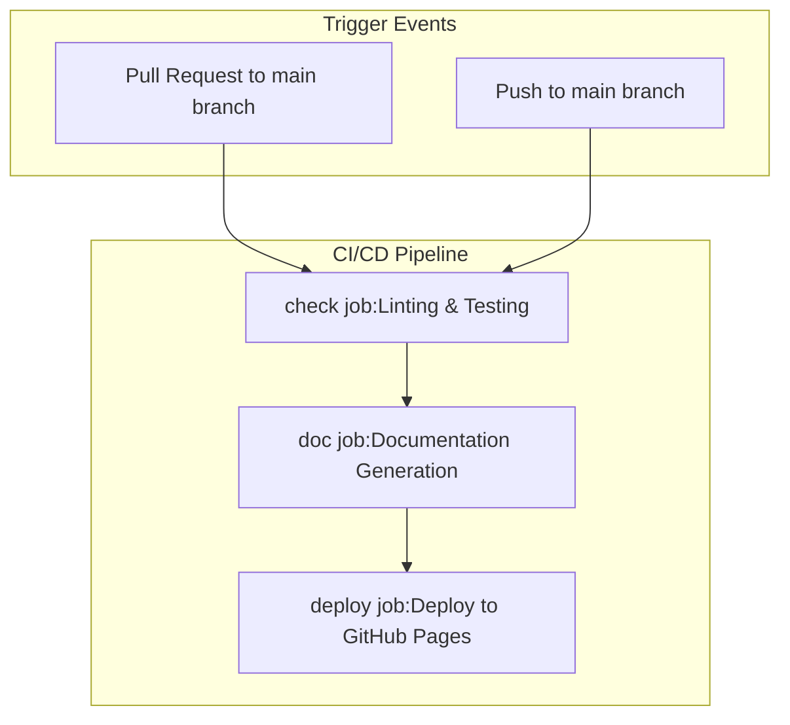
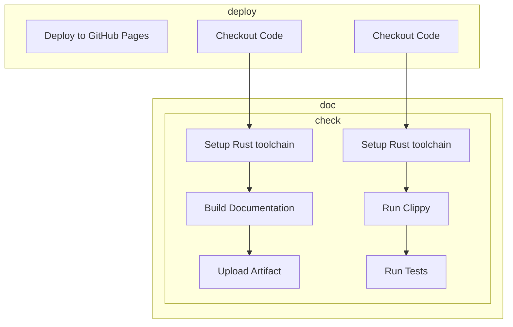
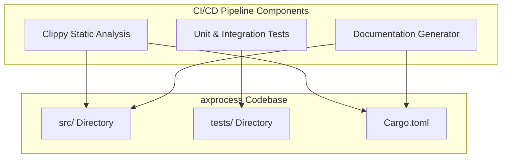
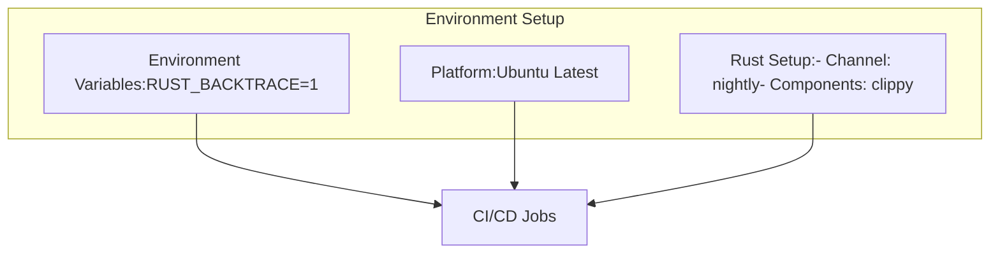
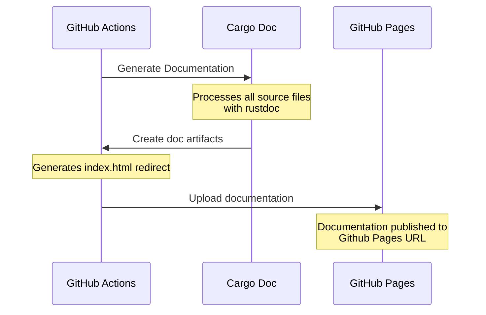

# CI/CD Pipeline

> **Relevant source files**
> * [.github/workflows/ci.yml](https://github.com/Starry-OS/axprocess/blob/57d44806/.github/workflows/ci.yml)
> * [Cargo.toml](https://github.com/Starry-OS/axprocess/blob/57d44806/Cargo.toml)

This document details the Continuous Integration and Continuous Deployment (CI/CD) pipeline configured for the `axprocess` repository. It explains how automated testing, linting, and documentation generation are set up to ensure code quality and maintain up-to-date documentation.

For information about testing approaches and how to run tests manually, see [Testing Approach](/Starry-OS/axprocess/6.1-testing-approach).

## Pipeline Overview

The `axprocess` repository uses GitHub Actions for its CI/CD pipeline, which automatically runs on code changes to verify quality and deploy documentation. The pipeline ensures that:

1. Code follows style guidelines and passes static analysis
2. All tests pass successfully
3. Documentation is automatically generated and deployed



Sources: [.github/workflows/ci.yml(L1 - L62)&emsp;](https://github.com/Starry-OS/axprocess/blob/57d44806/.github/workflows/ci.yml#L1-L62)

## Pipeline Trigger Events

The CI/CD pipeline is configured to run automatically in response to specific Git events:

|Event Type|Branch|Action|
| --- | --- | --- |
|Push|main|Run full pipeline|
|Pull Request|main|Run full pipeline|

The pipeline uses GitHub's concurrency controls to avoid redundant runs:

```css
concurrency:
  group: ${{ github.workflow }}-${{ github.ref }}-${{ github.event_name }}
  cancel-in-progress: true
```

This means that if multiple commits are pushed in quick succession, earlier workflow runs will be canceled in favor of the most recent one, saving CI resources.

Sources: [.github/workflows/ci.yml(L3 - L13)&emsp;](https://github.com/Starry-OS/axprocess/blob/57d44806/.github/workflows/ci.yml#L3-L13)

## CI Jobs and Steps

The pipeline consists of three main jobs:



Sources: [.github/workflows/ci.yml(L18 - L61)&emsp;](https://github.com/Starry-OS/axprocess/blob/57d44806/.github/workflows/ci.yml#L18-L61)

### Check Job

The `check` job runs on Ubuntu and performs the following steps:

1. Checks out the repository code
2. Sets up the Rust nightly toolchain with the Clippy component
3. Runs Clippy for static analysis with warnings treated as errors
4. Runs all tests with all features enabled

```yaml
check:
  runs-on: ubuntu-latest
  steps:
    - uses: actions/checkout@v4
    - name: Setup Rust toolchain
      run: |
        rustup default nightly
        rustup component add clippy
    - name: Clippy
      run: cargo clippy --all-features --all-targets -- -Dwarnings
    - name: Test
      run: cargo test --all-features
```

Sources: [.github/workflows/ci.yml(L19 - L30)&emsp;](https://github.com/Starry-OS/axprocess/blob/57d44806/.github/workflows/ci.yml#L19-L30)

### Documentation Job

The `doc` job is responsible for generating the Rust documentation:

1. Checks out the repository code
2. Sets up the Rust nightly toolchain
3. Builds the documentation with all features enabled
4. Creates an index.html redirect page
5. Uploads the generated documentation as an artifact

```yaml
doc:
  runs-on: ubuntu-latest
  steps:
    - uses: actions/checkout@v4
    - name: Setup Rust toolchain
      run: |
        rustup default nightly
    - name: Build docs
      run: |
        cargo doc --all-features --no-deps
        printf '<meta http-equiv="refresh" content="0;url=%s/index.html">' $(cargo tree | head -1 | cut -d' ' -f1 | tr '-' '_') > target/doc/index.html
    - name: Upload artifact
      uses: actions/upload-pages-artifact@v3
      with:
        path: target/doc
```

Sources: [.github/workflows/ci.yml(L32 - L46)&emsp;](https://github.com/Starry-OS/axprocess/blob/57d44806/.github/workflows/ci.yml#L32-L46)

### Deploy Job

The `deploy` job takes the documentation artifact and deploys it to GitHub Pages:

1. Uses GitHub's deploy-pages action to publish the documentation
2. Requires appropriate GitHub permissions configured in the workflow

```css
deploy:
  runs-on: ubuntu-latest
  needs: doc
  permissions:
    contents: read
    pages: write
    id-token: write
  environment:
    name: github-pages
    url: ${{ steps.deployment.outputs.page_url }}
  steps:
    - name: Deploy to GitHub Pages
      id: deployment
      uses: actions/deploy-pages@v4
```

Sources: [.github/workflows/ci.yml(L48 - L61)&emsp;](https://github.com/Starry-OS/axprocess/blob/57d44806/.github/workflows/ci.yml#L48-L61)

## Relationship to Code Structure

The CI/CD pipeline interacts with different parts of the axprocess codebase:



Sources: [.github/workflows/ci.yml(L1 - L62)&emsp;](https://github.com/Starry-OS/axprocess/blob/57d44806/.github/workflows/ci.yml#L1-L62) [Cargo.toml(L1 - L16)&emsp;](https://github.com/Starry-OS/axprocess/blob/57d44806/Cargo.toml#L1-L16)

## Environment Configuration

The CI/CD pipeline uses specific environment configurations:

1. Uses Rust nightly toolchain for all steps
2. Sets `RUST_BACKTRACE=1` for better error reporting
3. Runs on Ubuntu Linux



Sources: [.github/workflows/ci.yml(L15 - L16)&emsp;](https://github.com/Starry-OS/axprocess/blob/57d44806/.github/workflows/ci.yml#L15-L16) [.github/workflows/ci.yml(L23 - L26)&emsp;](https://github.com/Starry-OS/axprocess/blob/57d44806/.github/workflows/ci.yml#L23-L26)

## Documentation Deployment Flow

The documentation deployment process follows these steps:



Sources: [.github/workflows/ci.yml(L32 - L61)&emsp;](https://github.com/Starry-OS/axprocess/blob/57d44806/.github/workflows/ci.yml#L32-L61)

## Best Practices for Developers

When working with the axprocess repository, developers should be aware of the CI/CD pipeline requirements:

1. **Clippy Compliance**: All code must pass Clippy checks with no warnings (`-Dwarnings` flag is enabled)
2. **Test Coverage**: New features should include tests, which will be automatically run by the pipeline
3. **Documentation**: Code should be properly documented as it will be automatically published
4. **Build Requirements**: The pipeline uses the nightly Rust toolchain, so code should be compatible with it

## Conclusion

The CI/CD pipeline for axprocess provides automated quality checks and documentation deployment, ensuring that:

1. Code meets style and quality standards through static analysis
2. All tests pass on each change
3. Documentation is automatically built and deployed to GitHub Pages
4. Developers receive quick feedback on their code changes

This automation helps maintain a high-quality codebase and up-to-date documentation with minimal manual intervention.

Sources: [.github/workflows/ci.yml(L1 - L62)&emsp;](https://github.com/Starry-OS/axprocess/blob/57d44806/.github/workflows/ci.yml#L1-L62)