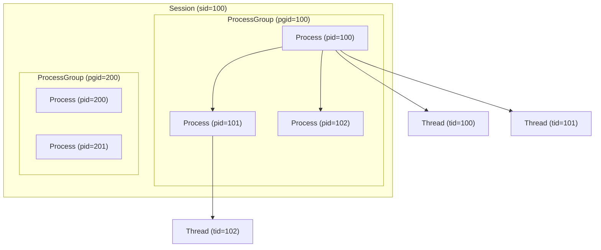
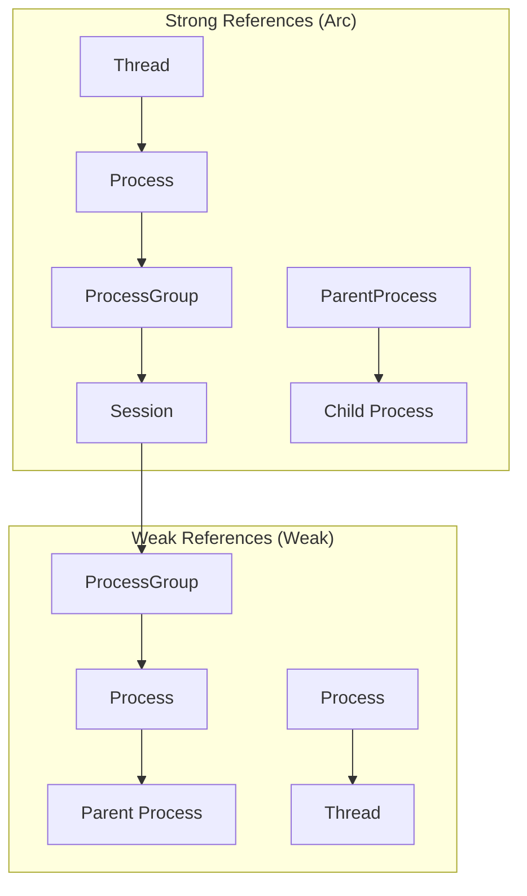
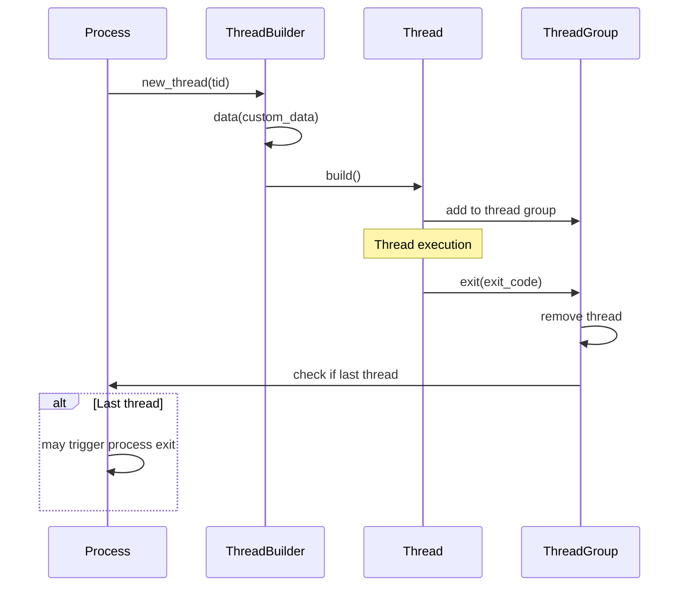
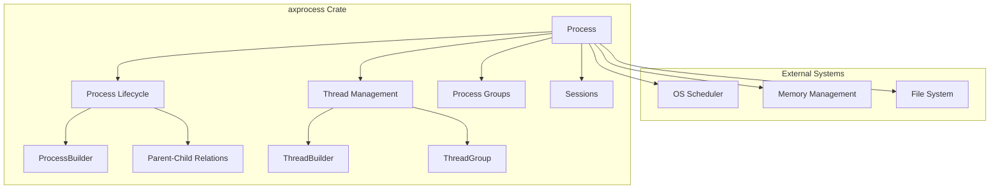

# Core Architecture

> **Relevant source files**
> * [src/lib.rs](https://github.com/Starry-OS/axprocess/blob/57d44806/src/lib.rs)
> * [src/process.rs](https://github.com/Starry-OS/axprocess/blob/57d44806/src/process.rs)
> * [src/process_group.rs](https://github.com/Starry-OS/axprocess/blob/57d44806/src/process_group.rs)
> * [src/session.rs](https://github.com/Starry-OS/axprocess/blob/57d44806/src/session.rs)
> * [src/thread.rs](https://github.com/Starry-OS/axprocess/blob/57d44806/src/thread.rs)

This document explains the high-level architecture of the axprocess system, focusing on the core components and their relationships. It describes the hierarchical structure, component interactions, and memory management strategy used in the system. For specific details about process lifecycle management, see [Process Lifecycle](/Starry-OS/axprocess/2.2-process-lifecycle), and for thread management details, see [Thread Management](/Starry-OS/axprocess/4-thread-management).

## Component Overview

The axprocess system consists of four primary components that form a hierarchical structure:

1. **Session**: A collection of process groups
2. **Process Group**: A collection of processes
3. **Process**: A basic unit of program execution that contains threads
4. **Thread**: An execution unit within a process

```

```

**Title: Core Component Hierarchy**

Sources: [src/process.rs](https://github.com/Starry-OS/axprocess/blob/57d44806/src/process.rs) [src/process_group.rs](https://github.com/Starry-OS/axprocess/blob/57d44806/src/process_group.rs) [src/session.rs](https://github.com/Starry-OS/axprocess/blob/57d44806/src/session.rs) [src/thread.rs](https://github.com/Starry-OS/axprocess/blob/57d44806/src/thread.rs)

## Hierarchical Structure

The system follows a Unix-like hierarchical structure where components are organized in a containment hierarchy:

1. **Sessions** contain multiple process groups and are identified by a session ID (sid)
2. **Process Groups** contain multiple processes and are identified by a process group ID (pgid)
3. **Processes** contain multiple threads and are identified by a process ID (pid)
4. **Threads** are the execution units and are identified by a thread ID (tid)

Additionally, processes can have parent-child relationships with other processes, forming a separate process hierarchy.



**Title: Hierarchical Container Relationships**

Sources: [src/process.rs(L34 - L164)&emsp;](https://github.com/Starry-OS/axprocess/blob/57d44806/src/process.rs#L34-L164) [src/process_group.rs(L12 - L17)&emsp;](https://github.com/Starry-OS/axprocess/blob/57d44806/src/process_group.rs#L12-L17) [src/session.rs(L12 - L16)&emsp;](https://github.com/Starry-OS/axprocess/blob/57d44806/src/session.rs#L12-L16)

## Component Relationships

### Session and Process Group Relationship

Sessions contain process groups, and each process group belongs to exactly one session:

* A session is identified by a unique `sid` (Session ID)
* Sessions maintain a weak map of process groups (`process_groups`)
* Process groups hold a strong reference (`Arc`) to their session
* New sessions are created using the `Session::new(sid)` method

Sources: [src/session.rs(L12 - L27)&emsp;](https://github.com/Starry-OS/axprocess/blob/57d44806/src/session.rs#L12-L27) [src/process_group.rs(L14 - L30)&emsp;](https://github.com/Starry-OS/axprocess/blob/57d44806/src/process_group.rs#L14-L30)

### Process Group and Process Relationship

Process groups contain processes, and each process belongs to exactly one process group:

* A process group is identified by a unique `pgid` (Process Group ID)
* Process groups maintain a weak map of processes (`processes`)
* Processes hold a strong reference (`Arc`) to their process group
* Processes can move between process groups using `Process::move_to_group()`

Sources: [src/process_group.rs(L12 - L47)&emsp;](https://github.com/Starry-OS/axprocess/blob/57d44806/src/process_group.rs#L12-L47) [src/process.rs(L84 - L164)&emsp;](https://github.com/Starry-OS/axprocess/blob/57d44806/src/process.rs#L84-L164)

### Process and Thread Relationship

Processes contain threads, and each thread belongs to exactly one process:

* A process contains a `ThreadGroup` which manages its threads
* Threads hold a strong reference (`Arc`) to their process
* Processes maintain weak references to their threads
* New threads are created using `Process::new_thread()` and built with `ThreadBuilder`

Sources: [src/process.rs(L18 - L31)&emsp;](https://github.com/Starry-OS/axprocess/blob/57d44806/src/process.rs#L18-L31) [src/process.rs(L167 - L192)&emsp;](https://github.com/Starry-OS/axprocess/blob/57d44806/src/process.rs#L167-L192) [src/thread.rs(L6 - L88)&emsp;](https://github.com/Starry-OS/axprocess/blob/57d44806/src/thread.rs#L6-L88)

### Process Parent-Child Relationship

Processes form a hierarchy through parent-child relationships:

* Each process (except the init process) has a parent process
* Processes maintain strong references to their children
* Processes maintain weak references to their parents
* Child processes are created using `Process::fork()`
* When a process exits, its children are inherited by the init process

Sources: [src/process.rs(L70 - L81)&emsp;](https://github.com/Starry-OS/axprocess/blob/57d44806/src/process.rs#L70-L81) [src/process.rs(L195 - L237)&emsp;](https://github.com/Starry-OS/axprocess/blob/57d44806/src/process.rs#L195-L237) [src/process.rs(L261 - L282)&emsp;](https://github.com/Starry-OS/axprocess/blob/57d44806/src/process.rs#L261-L282)

## Reference Management Strategy

The system uses a carefully designed reference counting strategy to prevent memory leaks while ensuring proper cleanup:



**Title: Reference Management Strategy**

Key patterns in the reference management strategy:

1. **Upward References**: Strong references (`Arc`) are used for upward relationships:

* Threads strongly reference their process
* Processes strongly reference their process group
* Process groups strongly reference their session
* Parent processes strongly reference their children
2. **Downward References**: Weak references (`Weak`) are used for downward relationships:

* Sessions weakly reference their process groups
* Process groups weakly reference their processes
* Processes weakly reference their threads
* Processes weakly reference their parent
3. **Maps and Collections**:

* `WeakMap` is used for downward references
* `StrongMap` is used for the children collection in a process

This strategy ensures that components are kept alive as long as they're needed while preventing reference cycles that would cause memory leaks.

Sources: [src/process.rs(L36 - L46)&emsp;](https://github.com/Starry-OS/axprocess/blob/57d44806/src/process.rs#L36-L46) [src/process_group.rs(L14 - L16)&emsp;](https://github.com/Starry-OS/axprocess/blob/57d44806/src/process_group.rs#L14-L16) [src/session.rs(L14 - L15)&emsp;](https://github.com/Starry-OS/axprocess/blob/57d44806/src/session.rs#L14-L15) [src/thread.rs(L7 - L11)&emsp;](https://github.com/Starry-OS/axprocess/blob/57d44806/src/thread.rs#L7-L11)

## Process and Thread Lifecycle

### Process Lifecycle

```

```

**Title: Process Lifecycle States**

The process lifecycle consists of these key stages:

1. **Creation**: A process is created using `ProcessBuilder::build()`

* Init process is created using `Process::new_init()`
* Child processes are created using `Process::fork()`
2. **Execution**: The process is active and can create threads
3. **Termination**: The process becomes a zombie when `Process::exit()` is called

* Its children are inherited by the init process
* It remains in the zombie state until freed
4. **Cleanup**: The process resources are freed when `Process::free()` is called

Sources: [src/process.rs(L195 - L237)&emsp;](https://github.com/Starry-OS/axprocess/blob/57d44806/src/process.rs#L195-L237) [src/process.rs(L261 - L331)&emsp;](https://github.com/Starry-OS/axprocess/blob/57d44806/src/process.rs#L261-L331)

### Thread Lifecycle



**Title: Thread Lifecycle Flow**

The thread lifecycle consists of these key stages:

1. **Creation**: A thread is created using `ThreadBuilder::build()`

* Process creates a new thread using `Process::new_thread()`
* Thread is added to the process's thread group
2. **Execution**: The thread executes its workload
3. **Termination**: The thread exits using `Thread::exit()`

* If it's the last thread, it may trigger process termination
* Thread is removed from the thread group

Sources: [src/thread.rs(L29 - L40)&emsp;](https://github.com/Starry-OS/axprocess/blob/57d44806/src/thread.rs#L29-L40) [src/thread.rs(L51 - L88)&emsp;](https://github.com/Starry-OS/axprocess/blob/57d44806/src/thread.rs#L51-L88) [src/process.rs(L167 - L177)&emsp;](https://github.com/Starry-OS/axprocess/blob/57d44806/src/process.rs#L167-L177)

## Builder Pattern Implementation

The system uses the Builder pattern for creating processes and threads, allowing for flexible configuration:

### Process Builder

```

```

**Title: Process Builder Pattern**

* `Process::new_init()` creates a `ProcessBuilder` for the init process
* `Process::fork()` creates a `ProcessBuilder` for a child process
* `ProcessBuilder::data()` sets custom data for the process
* `ProcessBuilder::build()` creates and initializes the process

Sources: [src/process.rs(L261 - L331)&emsp;](https://github.com/Starry-OS/axprocess/blob/57d44806/src/process.rs#L261-L331)

### Thread Builder

```

```

**Title: Thread Builder Pattern**

* `Process::new_thread()` creates a `ThreadBuilder`
* `ThreadBuilder::data()` sets custom data for the thread
* `ThreadBuilder::build()` creates and initializes the thread

Sources: [src/thread.rs(L51 - L88)&emsp;](https://github.com/Starry-OS/axprocess/blob/57d44806/src/thread.rs#L51-L88) [src/process.rs(L167 - L177)&emsp;](https://github.com/Starry-OS/axprocess/blob/57d44806/src/process.rs#L167-L177)

## System Integration

The axprocess crate is designed to provide process management capabilities for the ArceOS kernel:



**Title: System Integration Overview**

This process management system provides the foundation for:

1. Creating and managing processes and threads
2. Organizing processes into hierarchical structures
3. Managing process lifecycle from creation to cleanup
4. Supporting Unix-like process relationships

The design emphasizes:

* Memory safety through careful reference management
* Clear separation of concerns with distinct component types
* Flexibility through builder patterns
* Performance with minimal locking

Sources: [src/lib.rs](https://github.com/Starry-OS/axprocess/blob/57d44806/src/lib.rs) [src/process.rs](https://github.com/Starry-OS/axprocess/blob/57d44806/src/process.rs) [src/thread.rs](https://github.com/Starry-OS/axprocess/blob/57d44806/src/thread.rs)