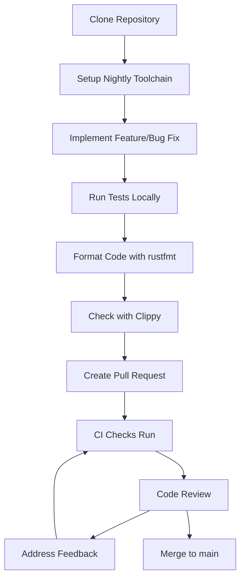
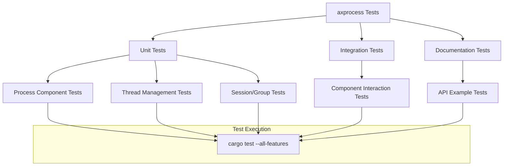
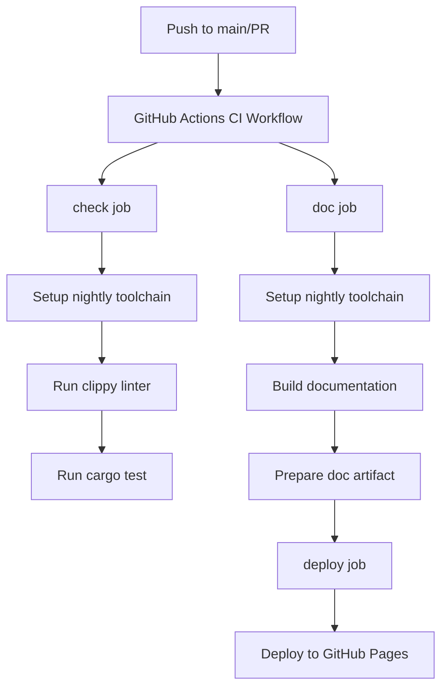
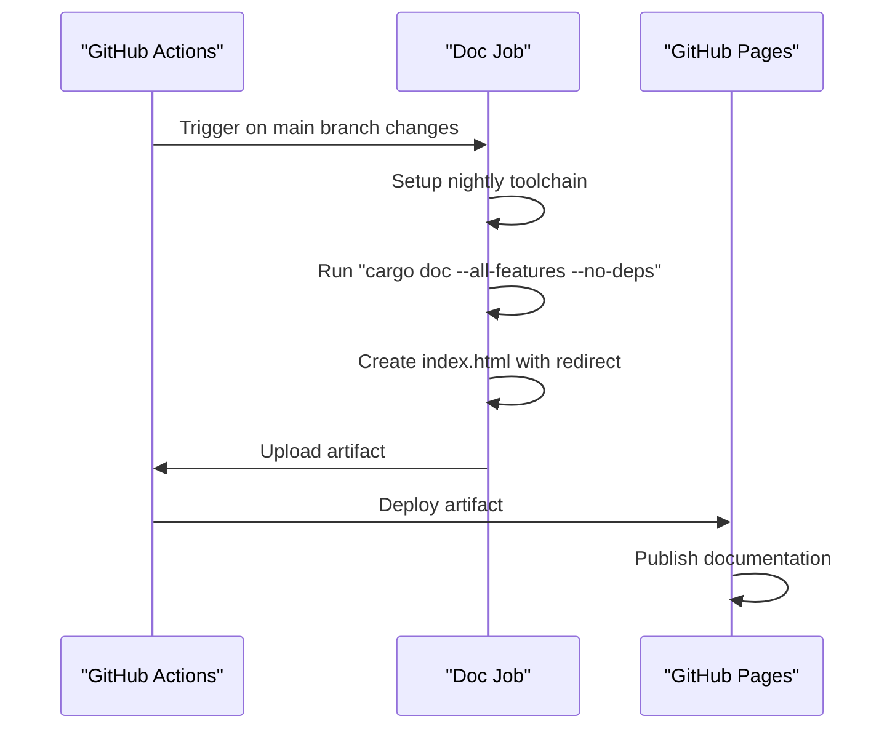

# Development and Testing

> **Relevant source files**
> * [.github/workflows/ci.yml](https://github.com/Starry-OS/axprocess/blob/57d44806/.github/workflows/ci.yml)
> * [rustfmt.toml](https://github.com/Starry-OS/axprocess/blob/57d44806/rustfmt.toml)

This document outlines the development practices, testing methodologies, and CI/CD pipeline for the axprocess crate. It provides information for developers who want to contribute to or modify the codebase, explaining how to set up a development environment, run tests, and understand the automated workflows in place.

For information about specific process management functionality, see [Process Management](/Starry-OS/axprocess/2-process-management) or [Thread Management](/Starry-OS/axprocess/4-thread-management).

## Development Environment

The axprocess crate is built using Rust's standard development tools and follows modern Rust development practices. The codebase uses the nightly Rust toolchain for development and testing.

### Code Style and Formatting

Code formatting is strictly defined through the project's `rustfmt.toml` configuration file. All code contributions should adhere to these formatting guidelines.

```markdown
# Key rustfmt settings
unstable_features = true
style_edition = "2024"
group_imports = "StdExternalCrate"
imports_granularity = "Crate"
normalize_comments = true
wrap_comments = true
reorder_impl_items = true
format_strings = true
format_code_in_doc_comments = true
```

To ensure consistent formatting, run `rustfmt` with the project's configuration before submitting any code changes:

```
cargo +nightly fmt
```

Sources: [rustfmt.toml(L1 - L19)&emsp;](https://github.com/Starry-OS/axprocess/blob/57d44806/rustfmt.toml#L1-L19)

### Development Workflow

**Typical Development Workflow**



Sources: [.github/workflows/ci.yml(L1 - L62)&emsp;](https://github.com/Starry-OS/axprocess/blob/57d44806/.github/workflows/ci.yml#L1-L62) [rustfmt.toml(L1 - L19)&emsp;](https://github.com/Starry-OS/axprocess/blob/57d44806/rustfmt.toml#L1-L19)

## Testing Methodology

The axprocess crate employs several testing approaches to ensure code quality and correctness. The codebase follows Rust's standard testing conventions, with tests organized within the source files themselves.

### Types of Tests

**Testing Structure in axprocess**



### Running Tests Locally

To run the full test suite locally:

```
cargo test --all-features
```

For running specific tests:

```
cargo test <test_name> --all-features
```

For verbose test output:

```
cargo test -- --nocapture
```

Sources: [.github/workflows/ci.yml(L29 - L30)&emsp;](https://github.com/Starry-OS/axprocess/blob/57d44806/.github/workflows/ci.yml#L29-L30)

## CI/CD Pipeline

The project uses GitHub Actions for continuous integration and deployment, ensuring that all code changes are automatically tested and documented.

### CI Workflow

**CI/CD Pipeline Architecture**



Sources: [.github/workflows/ci.yml(L1 - L62)&emsp;](https://github.com/Starry-OS/axprocess/blob/57d44806/.github/workflows/ci.yml#L1-L62)

### CI Jobs and Tasks

The CI pipeline consists of three main jobs:

|Job|Purpose|Key Tasks|
| --- | --- | --- |
|check|Code quality & testing|Run clippy linter, execute test suite|
|doc|Documentation|Build API documentation, prepare artifact|
|deploy|Publication|Deploy documentation to GitHub Pages|

The CI workflow is triggered on:

* Push events to the main branch
* Pull requests targeting the main branch

Each job in the workflow runs on the latest Ubuntu environment.

### Environment Variables

The CI environment sets the following variables:

```yaml
RUST_BACKTRACE: 1
```

This ensures that any test failures provide detailed backtraces to help identify the source of problems.

Sources: [.github/workflows/ci.yml(L15 - L16)&emsp;](https://github.com/Starry-OS/axprocess/blob/57d44806/.github/workflows/ci.yml#L15-L16)

### Documentation Generation

The documentation job automatically generates API documentation using `cargo doc` and deploys it to GitHub Pages. This ensures that the latest documentation is always available online.



Sources: [.github/workflows/ci.yml(L32 - L61)&emsp;](https://github.com/Starry-OS/axprocess/blob/57d44806/.github/workflows/ci.yml#L32-L61)

## Best Practices for Contributors

When contributing to the axprocess crate:

1. Always use the nightly Rust toolchain as specified in the CI configuration
2. Ensure code passes clippy linting with `cargo clippy --all-features --all-targets`
3. Add appropriate tests for new functionality
4. Format code according to the project's rustfmt configuration
5. Add documentation comments for public APIs
6. Verify that all tests pass before submitting a pull request

Following these practices ensures that contributions integrate smoothly with the existing codebase and pass the automated CI checks.

Sources: [.github/workflows/ci.yml(L1 - L62)&emsp;](https://github.com/Starry-OS/axprocess/blob/57d44806/.github/workflows/ci.yml#L1-L62) [rustfmt.toml(L1 - L19)&emsp;](https://github.com/Starry-OS/axprocess/blob/57d44806/rustfmt.toml#L1-L19)