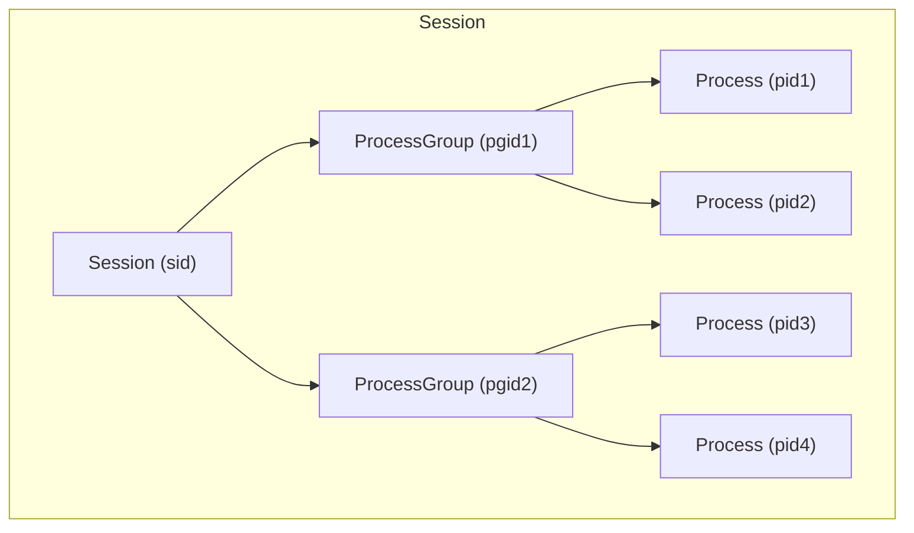
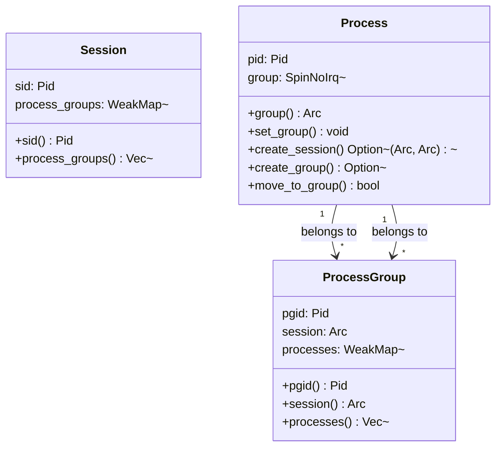
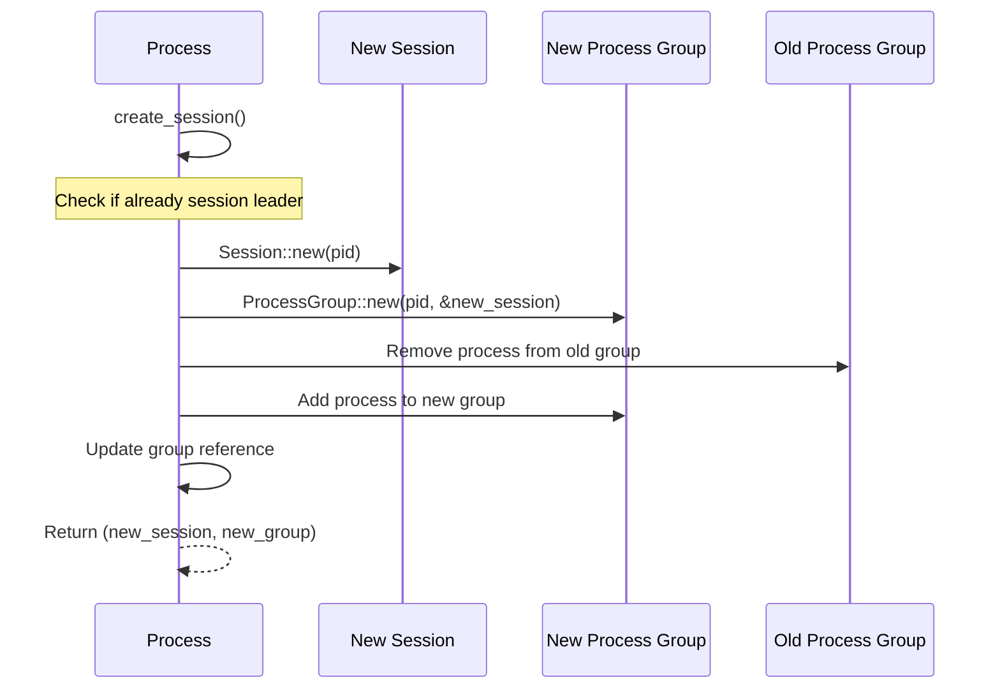
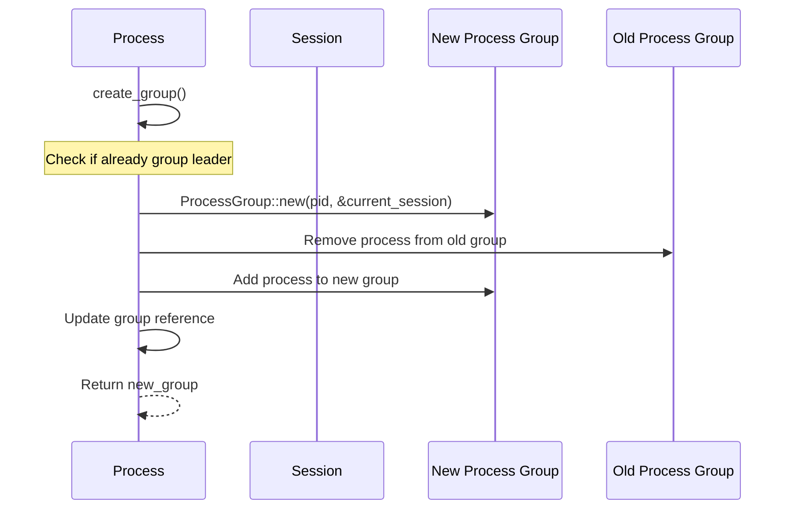
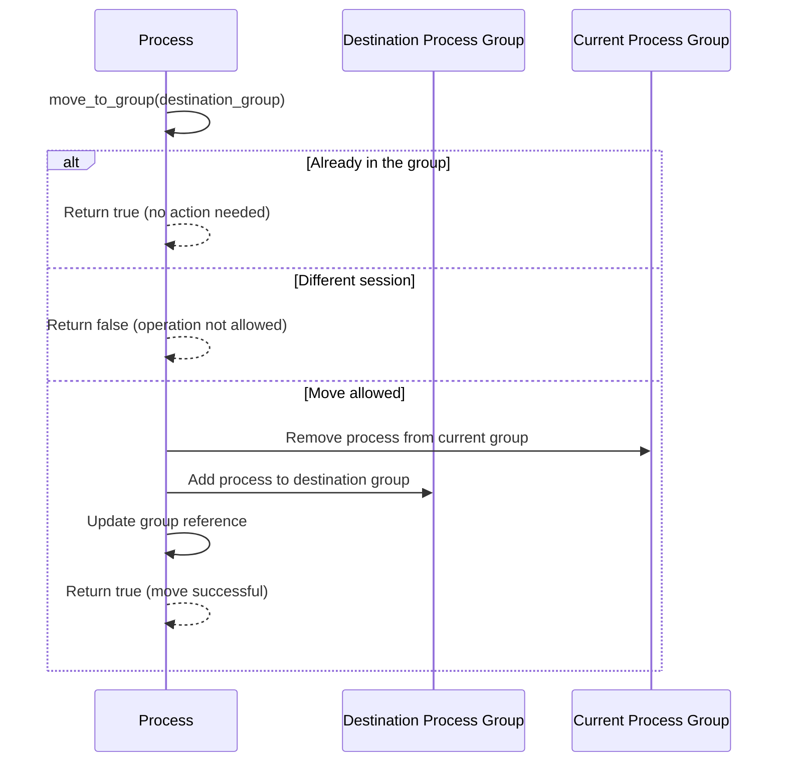
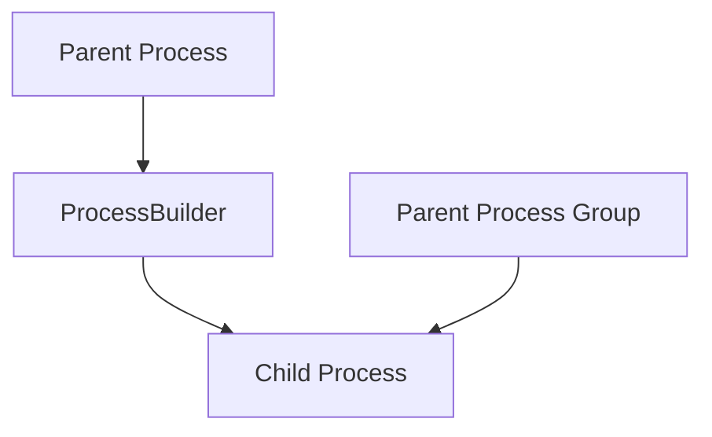
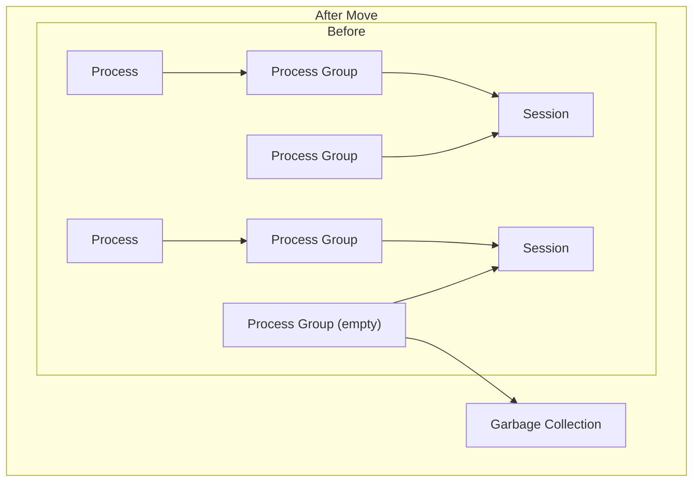
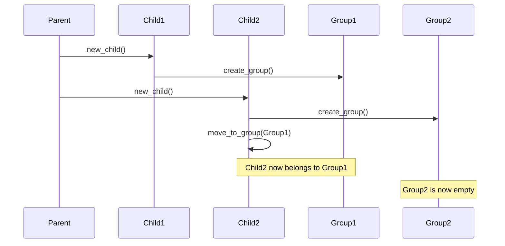

# Hierarchy and Movement

> **Relevant source files**
> * [src/process.rs](https://github.com/Starry-OS/axprocess/blob/57d44806/src/process.rs)
> * [src/process_group.rs](https://github.com/Starry-OS/axprocess/blob/57d44806/src/process_group.rs)
> * [src/session.rs](https://github.com/Starry-OS/axprocess/blob/57d44806/src/session.rs)
> * [tests/group.rs](https://github.com/Starry-OS/axprocess/blob/57d44806/tests/group.rs)
> * [tests/session.rs](https://github.com/Starry-OS/axprocess/blob/57d44806/tests/session.rs)

This page explains the hierarchical relationships between sessions, process groups, and processes in the `axprocess` crate, and details how processes can move between different groups and sessions. For information about parent-child relationships between processes, see [Parent-Child Relationships](/Starry-OS/axprocess/2.3-parent-child-relationships). For details about thread management within processes, see [Thread Management](/Starry-OS/axprocess/4-thread-management).

## Hierarchical Structure Overview

The `axprocess` system implements a three-level hierarchical structure inspired by Unix-like operating systems:

1. **Sessions**: The top-level container that groups related process groups
2. **Process Groups**: The middle-level container that groups related processes
3. **Processes**: The individual execution units that can contain multiple threads

This hierarchy is used for organizing processes and implementing features like job control. Each entity in the hierarchy is identified by a unique process identifier (Pid).

Sources: [src/session.rs(L1 - L45)&emsp;](https://github.com/Starry-OS/axprocess/blob/57d44806/src/session.rs#L1-L45) [src/process_group.rs(L1 - L56)&emsp;](https://github.com/Starry-OS/axprocess/blob/57d44806/src/process_group.rs#L1-L56) [src/process.rs(L83 - L89)&emsp;](https://github.com/Starry-OS/axprocess/blob/57d44806/src/process.rs#L83-L89)

## Process Group and Session Relationships

In the `axprocess` crate, the relationships between sessions, process groups, and processes are implemented using strong and weak references:

* Each process stores a strong reference (`Arc`) to its process group
* Each process group stores a strong reference to its session
* Both process groups and sessions store weak references (`WeakMap`) to their contained entities to prevent reference cycles

Sources: [src/session.rs(L12 - L18)&emsp;](https://github.com/Starry-OS/axprocess/blob/57d44806/src/session.rs#L12-L18) [src/process_group.rs(L12 - L17)&emsp;](https://github.com/Starry-OS/axprocess/blob/57d44806/src/process_group.rs#L12-L17) [src/process.rs(L83 - L164)&emsp;](https://github.com/Starry-OS/axprocess/blob/57d44806/src/process.rs#L83-L164)

## Creating New Sessions

A process can create a new session and become its session leader by calling the `create_session()` method. This operation also creates a new process group within the new session, with the process as the process group leader.

Key features of session creation:

* A process cannot create a new session if it is already a session leader (when `process.group().session.sid() == process.pid()`)
* When a new session is created, a new process group is also created with the same ID
* The process is moved from its old process group to the new one

Sources: [src/process.rs(L100 - L123)&emsp;](https://github.com/Starry-OS/axprocess/blob/57d44806/src/process.rs#L100-L123) [tests/session.rs(L21 - L44)&emsp;](https://github.com/Starry-OS/axprocess/blob/57d44806/tests/session.rs#L21-L44)

## Creating New Process Groups

A process can create a new process group within its current session and become its group leader by calling the `create_group()` method.

Key features of process group creation:

* A process cannot create a new process group if it is already a process group leader (when `process.group().pgid() == process.pid()`)
* The new process group is created within the process's current session
* The process is moved from its old process group to the new one

Sources: [src/process.rs(L124 - L143)&emsp;](https://github.com/Starry-OS/axprocess/blob/57d44806/src/process.rs#L124-L143) [tests/group.rs(L22 - L43)&emsp;](https://github.com/Starry-OS/axprocess/blob/57d44806/tests/group.rs#L22-L43)

## Moving Between Process Groups

A process can move to a different process group within the same session by calling the `move_to_group()` method.

Key constraints on process movement:

* A process can only move to a process group within the same session
* If a process is already in the specified process group, no action is taken
* The process is removed from its old process group and added to the new one

Sources: [src/process.rs(L145 - L163)&emsp;](https://github.com/Starry-OS/axprocess/blob/57d44806/src/process.rs#L145-L163) [tests/group.rs(L77 - L100)&emsp;](https://github.com/Starry-OS/axprocess/blob/57d44806/tests/group.rs#L77-L100) [tests/session.rs(L86 - L96)&emsp;](https://github.com/Starry-OS/axprocess/blob/57d44806/tests/session.rs#L86-L96)

## Process Creation and Inheritance

When a new process is created using `Process::fork()` and then `ProcessBuilder::build()`, it inherits its parent's process group by default. This behavior ensures that related processes stay within the same group unless explicitly moved.

Sources: [src/process.rs(L285 - L332)&emsp;](https://github.com/Starry-OS/axprocess/blob/57d44806/src/process.rs#L285-L332)

## Resource Cleanup and Memory Management

The hierarchical structure is designed to ensure proper cleanup of resources:

1. When a process moves to a different group, its reference to the old group is dropped
2. If a process was the last one in a group, the group will be automatically cleaned up when all references to it are dropped
3. Similarly, when a process group is removed from a session, the session will be cleaned up if it was the last group

This approach prevents memory leaks while maintaining the hierarchical relationships.

Sources: [tests/group.rs(L54 - L65)&emsp;](https://github.com/Starry-OS/axprocess/blob/57d44806/tests/group.rs#L54-L65) [tests/group.rs(L102 - L113)&emsp;](https://github.com/Starry-OS/axprocess/blob/57d44806/tests/group.rs#L102-L113) [tests/session.rs(L52 - L64)&emsp;](https://github.com/Starry-OS/axprocess/blob/57d44806/tests/session.rs#L52-L64)

## Example: Moving Processes Between Groups

Here's a practical example of how process groups can be manipulated in code:

This diagram illustrates the flow from tests where:

1. A parent process creates two child processes
2. Each child creates its own process group
3. The second child moves to the first child's group
4. The second child's original group becomes empty

Sources: [tests/group.rs(L77 - L100)&emsp;](https://github.com/Starry-OS/axprocess/blob/57d44806/tests/group.rs#L77-L100)

## Constraints and Rules Summary

The following rules govern process movement in the hierarchy:

|Operation|Condition|Result|
| --- | --- | --- |
|Create session|Process is already a session leader|Operation fails, returnsNone|
|Create session|Process is not a session leader|New session and group created, process moved|
|Create group|Process is already a group leader|Operation fails, returnsNone|
|Create group|Process is not a group leader|New group created, process moved|
|Move to group|Target group in different session|Operation fails, returnsfalse|
|Move to group|Target group in same session|Process moved, returnstrue|
|Move to group|Already in target group|No action, returnstrue|

Sources: [src/process.rs(L100 - L163)&emsp;](https://github.com/Starry-OS/axprocess/blob/57d44806/src/process.rs#L100-L163) [tests/group.rs(L44 - L52)&emsp;](https://github.com/Starry-OS/axprocess/blob/57d44806/tests/group.rs#L44-L52) [tests/session.rs(L46 - L48)&emsp;](https://github.com/Starry-OS/axprocess/blob/57d44806/tests/session.rs#L46-L48)

## Practical Implications

Understanding the hierarchical structure and movement capabilities in `axprocess` allows for effective process management:

1. Related processes can be grouped together for collective management
2. Session boundaries provide isolation between unrelated process groups
3. Process movement enables dynamic reorganization of processes based on their relationships or roles
4. The hierarchy forms the foundation for implementing job control and terminal management

By organizing processes into groups and sessions, the system can implement sophisticated process management features commonly found in Unix-like operating systems.

Sources: [src/process.rs(L83 - L164)&emsp;](https://github.com/Starry-OS/axprocess/blob/57d44806/src/process.rs#L83-L164) [src/process_group.rs(L1 - L56)&emsp;](https://github.com/Starry-OS/axprocess/blob/57d44806/src/process_group.rs#L1-L56) [src/session.rs(L1 - L45)&emsp;](https://github.com/Starry-OS/axprocess/blob/57d44806/src/session.rs#L1-L45)