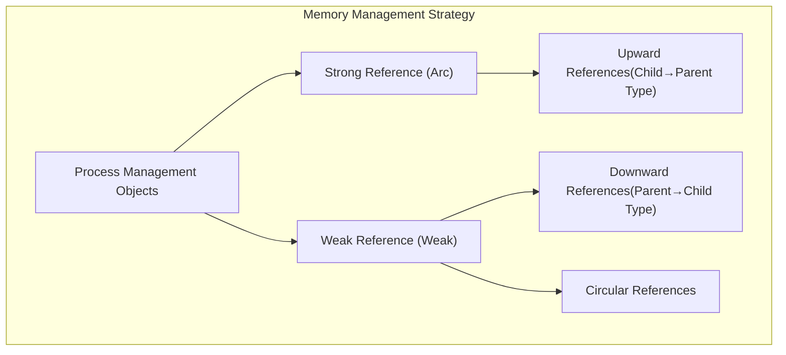
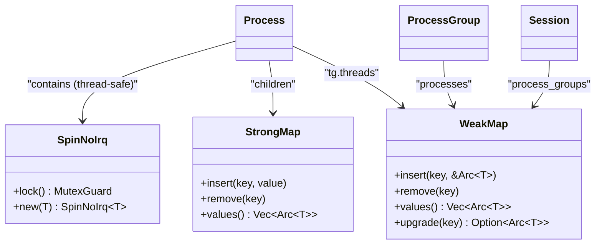
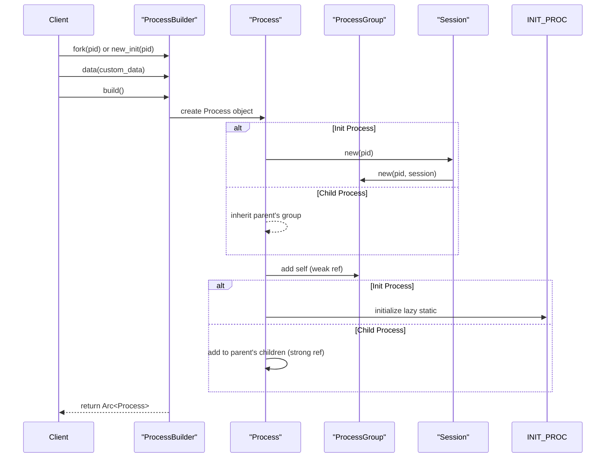

# Memory Management

> **Relevant source files**
> * [src/process.rs](https://github.com/Starry-OS/axprocess/blob/57d44806/src/process.rs)
> * [src/process_group.rs](https://github.com/Starry-OS/axprocess/blob/57d44806/src/process_group.rs)
> * [src/session.rs](https://github.com/Starry-OS/axprocess/blob/57d44806/src/session.rs)
> * [src/thread.rs](https://github.com/Starry-OS/axprocess/blob/57d44806/src/thread.rs)

This document explains how memory is managed in the axprocess crate, focusing on reference counting patterns, hierarchical object management, and cleanup mechanisms. For information about zombie processes and cleanup specifically, see [Zombie Processes and Cleanup](/Starry-OS/axprocess/5.2-zombie-processes-and-cleanup). For details about reference counting and ownership patterns, see [Reference Counting and Ownership](/Starry-OS/axprocess/5.1-reference-counting-and-ownership).

## Overview of Memory Management Strategy

The axprocess crate implements a hierarchical process management system that uses Rust's ownership model and reference counting patterns to ensure memory safety while maintaining proper object relationships. The system employs both strong references (Arc) and weak references (Weak) strategically to prevent memory leaks and reference cycles.



Sources: [src/process.rs(L1 - L10)&emsp;](https://github.com/Starry-OS/axprocess/blob/57d44806/src/process.rs#L1-L10) [src/process_group.rs(L1 - L9)&emsp;](https://github.com/Starry-OS/axprocess/blob/57d44806/src/process_group.rs#L1-L9) [src/session.rs(L1 - L9)&emsp;](https://github.com/Starry-OS/axprocess/blob/57d44806/src/session.rs#L1-L9)

## Reference Hierarchy and Ownership Model

The axprocess crate implements a hierarchical memory management model with carefully designed ownership relationships between different components:

```

```

Sources: [src/process.rs(L35 - L47)&emsp;](https://github.com/Starry-OS/axprocess/blob/57d44806/src/process.rs#L35-L47) [src/process_group.rs(L12 - L17)&emsp;](https://github.com/Starry-OS/axprocess/blob/57d44806/src/process_group.rs#L12-L17) [src/session.rs(L12 - L17)&emsp;](https://github.com/Starry-OS/axprocess/blob/57d44806/src/session.rs#L12-L17) [src/thread.rs(L7 - L11)&emsp;](https://github.com/Starry-OS/axprocess/blob/57d44806/src/thread.rs#L7-L11)

## Strong vs Weak References

The system carefully balances the use of strong references (Arc) and weak references (Weak) to maintain object relationships while preventing memory leaks:

|Component|Field|Reference Type|Purpose|
| --- | --- | --- | --- |
|Process|children|Strong|Keep child processes alive while parent exists|
|Process|parent|Weak|Prevent reference cycles between parent-child|
|Process|group|Strong|Keep process group alive while process exists|
|ProcessGroup|session|Strong|Keep session alive while process group exists|
|ProcessGroup|processes|Weak|Allow processes to be cleaned up independently|
|Session|process_groups|Weak|Allow process groups to be cleaned up independently|
|Thread|process|Strong|Keep process alive while thread exists|
|Process|tg.threads|Weak|Allow threads to be cleaned up independently|

Sources: [src/process.rs(L35 - L47)&emsp;](https://github.com/Starry-OS/axprocess/blob/57d44806/src/process.rs#L35-L47) [src/process_group.rs(L12 - L17)&emsp;](https://github.com/Starry-OS/axprocess/blob/57d44806/src/process_group.rs#L12-L17) [src/session.rs(L12 - L17)&emsp;](https://github.com/Starry-OS/axprocess/blob/57d44806/src/session.rs#L12-L17) [src/thread.rs(L7 - L11)&emsp;](https://github.com/Starry-OS/axprocess/blob/57d44806/src/thread.rs#L7-L11)

## Core Data Structures

The memory management system relies on specialized data structures for managing references:



Sources: [src/process.rs(L14)&emsp;](https://github.com/Starry-OS/axprocess/blob/57d44806/src/process.rs#L14-L14) [src/process.rs(L18 - L22)&emsp;](https://github.com/Starry-OS/axprocess/blob/57d44806/src/process.rs#L18-L22) [src/process_group.rs(L16)&emsp;](https://github.com/Starry-OS/axprocess/blob/57d44806/src/process_group.rs#L16-L16) [src/session.rs(L15)&emsp;](https://github.com/Starry-OS/axprocess/blob/57d44806/src/session.rs#L15-L15)

## Process Creation and Memory Allocation

The `ProcessBuilder` pattern manages memory allocation during process creation, ensuring proper initialization of reference relationships:



Sources: [src/process.rs(L260 - L341)&emsp;](https://github.com/Starry-OS/axprocess/blob/57d44806/src/process.rs#L260-L341) [src/process_group.rs(L19 - L29)&emsp;](https://github.com/Starry-OS/axprocess/blob/57d44806/src/process_group.rs#L19-L29) [src/session.rs(L19 - L27)&emsp;](https://github.com/Starry-OS/axprocess/blob/57d44806/src/session.rs#L19-L27)

## Zombie Process Management

When a process exits, it becomes a zombie, and its memory management changes:

```

```

During the zombie state:

1. Process marks itself as a zombie using atomic boolean
2. Child processes are reparented to the init process
3. Process resources are partially released
4. The parent must call `free()` to complete cleanup

Sources: [src/process.rs(L195 - L237)&emsp;](https://github.com/Starry-OS/axprocess/blob/57d44806/src/process.rs#L195-L237) [src/thread.rs(L29 - L40)&emsp;](https://github.com/Starry-OS/axprocess/blob/57d44806/src/thread.rs#L29-L40)

## Parent-Child Memory Management

The parent-child relationship memory management is particularly important:

```

```

The parent keeps strong references to children in a `StrongMap`, while children have weak references to their parent. This prevents reference cycles while maintaining the parent-child relationship.

Sources: [src/process.rs(L70 - L81)&emsp;](https://github.com/Starry-OS/axprocess/blob/57d44806/src/process.rs#L70-L81) [src/process.rs(L195 - L237)&emsp;](https://github.com/Starry-OS/axprocess/blob/57d44806/src/process.rs#L195-L237)

## Thread Memory Management

Threads are managed within a process using a thread group:

```

```

Threads maintain strong references to their parent process, ensuring the process stays alive as long as any thread is running. The process maintains weak references to its threads, preventing reference cycles.

Sources: [src/process.rs(L18 - L31)&emsp;](https://github.com/Starry-OS/axprocess/blob/57d44806/src/process.rs#L18-L31) [src/thread.rs(L7 - L40)&emsp;](https://github.com/Starry-OS/axprocess/blob/57d44806/src/thread.rs#L7-L40)

## Session and Process Group Memory Management

Sessions and process groups form the higher levels of the hierarchy:

```

```

Process groups maintain strong references to their session, while processes maintain strong references to their process group. This upward ownership pattern ensures that higher-level objects remain alive as long as any lower-level object needs them.

Sources: [src/process.rs(L83 - L164)&emsp;](https://github.com/Starry-OS/axprocess/blob/57d44806/src/process.rs#L83-L164) [src/process_group.rs(L12 - L47)&emsp;](https://github.com/Starry-OS/axprocess/blob/57d44806/src/process_group.rs#L12-L47) [src/session.rs(L12 - L45)&emsp;](https://github.com/Starry-OS/axprocess/blob/57d44806/src/session.rs#L12-L45)

## Memory Safety Mechanisms

The axprocess crate employs several mechanisms to ensure memory safety:

1. **Thread-safe access**: Using `SpinNoIrq` locks for shared mutable state
2. **Atomic operations**: Using `AtomicBool` for zombie state tracking
3. **Builder pattern**: Ensuring proper initialization with `ProcessBuilder` and `ThreadBuilder`
4. **Reference counting**: Using `Arc` and `Weak` for managing object lifetimes
5. **Explicit cleanup**: Using `exit()` and `free()` methods for proper resource cleanup

Sources: [src/process.rs(L35 - L47)&emsp;](https://github.com/Starry-OS/axprocess/blob/57d44806/src/process.rs#L35-L47) [src/process.rs(L195 - L237)&emsp;](https://github.com/Starry-OS/axprocess/blob/57d44806/src/process.rs#L195-L237) [src/thread.rs(L29 - L40)&emsp;](https://github.com/Starry-OS/axprocess/blob/57d44806/src/thread.rs#L29-L40)

## Summary

The memory management system in axprocess creates a hierarchical model where:

1. Objects lower in the hierarchy (threads, processes) hold strong references to objects higher up (process groups, sessions)
2. Objects higher in the hierarchy hold weak references to objects lower down
3. Special cases like parent-child process relationships use weak references for parents to avoid reference cycles
4. Thread-safe access is ensured through spinlocks and atomic operations
5. Zombie state management prevents premature cleanup while allowing proper resource release

This design ensures memory safety while maintaining the flexibility required for process management in an operating system.

Sources: [src/process.rs](https://github.com/Starry-OS/axprocess/blob/57d44806/src/process.rs) [src/process_group.rs](https://github.com/Starry-OS/axprocess/blob/57d44806/src/process_group.rs) [src/session.rs](https://github.com/Starry-OS/axprocess/blob/57d44806/src/session.rs) [src/thread.rs](https://github.com/Starry-OS/axprocess/blob/57d44806/src/thread.rs)