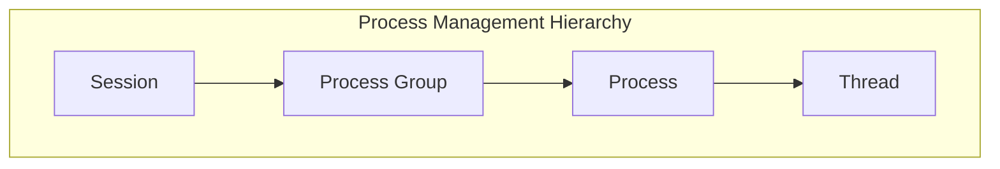
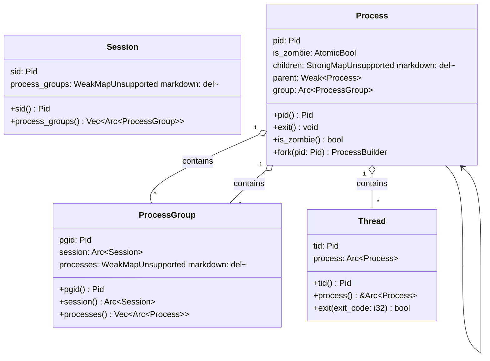
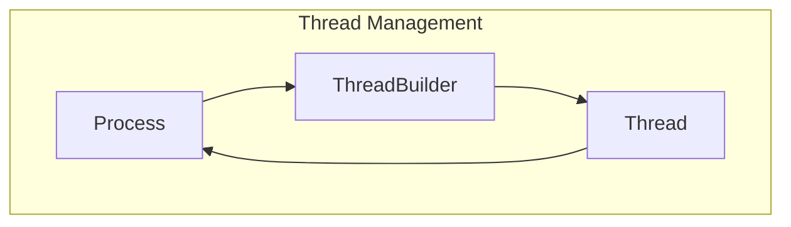
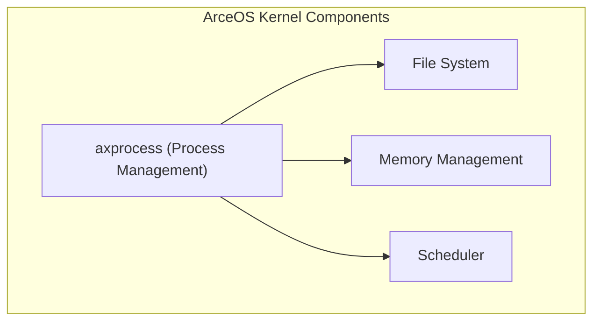

# Overview

> **Relevant source files**
> * [Cargo.toml](https://github.com/Starry-OS/axprocess/blob/57d44806/Cargo.toml)
> * [README.md](https://github.com/Starry-OS/axprocess/blob/57d44806/README.md)
> * [src/lib.rs](https://github.com/Starry-OS/axprocess/blob/57d44806/src/lib.rs)

`axprocess` is a process management crate designed for ArceOS that provides core abstractions and mechanisms for managing processes, threads, process groups, and sessions. This document introduces the high-level concepts, architecture, and components of the system.

For a deeper dive into the architecture, see [Core Architecture](/Starry-OS/axprocess/1.1-core-architecture).

## Purpose and Scope

The `axprocess` crate implements a hierarchical process management system inspired by Unix-like operating systems, providing the following capabilities:

* Process creation, management, and termination
* Thread management within processes
* Process grouping through process groups
* Session management for related process groups
* Parent-child process relationships

The crate manages the lifecycle of these entities while ensuring proper resource cleanup and memory safety using Rust's ownership model.

Sources: [src/lib.rs(L1 - L19)&emsp;](https://github.com/Starry-OS/axprocess/blob/57d44806/src/lib.rs#L1-L19) [Cargo.toml(L1 - L7)&emsp;](https://github.com/Starry-OS/axprocess/blob/57d44806/Cargo.toml#L1-L7) [README.md(L1 - L5)&emsp;](https://github.com/Starry-OS/axprocess/blob/57d44806/README.md#L1-L5)

## System Overview

`axprocess` implements a hierarchical system with four primary abstractions:



* **Session**: A collection of process groups, typically associated with a user login
* **Process Group**: A collection of related processes, useful for signal handling
* **Process**: An execution environment with its own address space and resources
* **Thread**: An execution context within a process

Sources: [src/lib.rs(L8 - L11)&emsp;](https://github.com/Starry-OS/axprocess/blob/57d44806/src/lib.rs#L8-L11) [src/lib.rs(L16 - L19)&emsp;](https://github.com/Starry-OS/axprocess/blob/57d44806/src/lib.rs#L16-L19)

## Core Components and Relationships

The system is organized in a hierarchical structure with well-defined relationships between components:



Key concepts in this relationship:

* Sessions contain multiple process groups
* Process groups contain multiple processes
* Processes contain threads
* Processes form parent-child relationships

Sources: [src/lib.rs(L13 - L14)&emsp;](https://github.com/Starry-OS/axprocess/blob/57d44806/src/lib.rs#L13-L14) [src/lib.rs(L16 - L19)&emsp;](https://github.com/Starry-OS/axprocess/blob/57d44806/src/lib.rs#L16-L19)

## Reference Management Strategy

The system uses a carefully designed reference management strategy to prevent memory leaks and ensure proper cleanup:

```

```

* **Strong references** (`Arc`): Used for upward relationships to ensure parent objects remain alive as long as their children need them
* **Weak references** (`Weak`): Used for downward and circular relationships to prevent reference cycles

This strategy ensures that resources are properly cleaned up when they're no longer needed, while maintaining the necessary relationships between components.

Sources: [Cargo.toml(L8 - L11)&emsp;](https://github.com/Starry-OS/axprocess/blob/57d44806/Cargo.toml#L8-L11)

## Process Lifecycle

Processes in the system follow a lifecycle from creation to termination:

```

```

This lifecycle management ensures proper resource cleanup and allows parent processes to retrieve exit status from terminated child processes.

For detailed information about process lifecycle, see [Process Lifecycle](/Starry-OS/axprocess/2.2-process-lifecycle).

Sources: [src/lib.rs(L16)&emsp;](https://github.com/Starry-OS/axprocess/blob/57d44806/src/lib.rs#L16-L16)

## Thread Management

Threads are execution contexts within a process:



Each process can have multiple threads, and the last thread's exit typically triggers the process to exit as well. Thread creation is handled through the `ThreadBuilder` pattern, providing a flexible way to configure new threads.

For more information on thread management, see [Thread Management](/Starry-OS/axprocess/4-thread-management).

Sources: [src/lib.rs(L19)&emsp;](https://github.com/Starry-OS/axprocess/blob/57d44806/src/lib.rs#L19-L19)

## Integration with ArceOS

`axprocess` serves as a foundational component in the ArceOS kernel, providing essential process management capabilities that other kernel subsystems build upon:



The abstractions provided by `axprocess` enable the development of higher-level operating system features and applications.

Sources: [Cargo.toml(L6)&emsp;](https://github.com/Starry-OS/axprocess/blob/57d44806/Cargo.toml#L6-L6) [README.md(L3)&emsp;](https://github.com/Starry-OS/axprocess/blob/57d44806/README.md#L3-L3)

## Next Steps

For more detailed information about specific components and features of the `axprocess` system, refer to these wiki pages:

* [Process Management](/Starry-OS/axprocess/2-process-management) - Detailed explanation of processes and their management
* [Process Groups and Sessions](/Starry-OS/axprocess/3-process-groups-and-sessions) - Information about process grouping mechanisms
* [Thread Management](/Starry-OS/axprocess/4-thread-management) - Details about threads and their relationship to processes
* [Memory Management](/Starry-OS/axprocess/5-memory-management) - How memory and resources are managed across the system