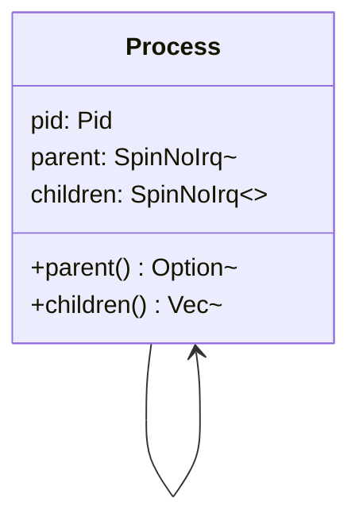
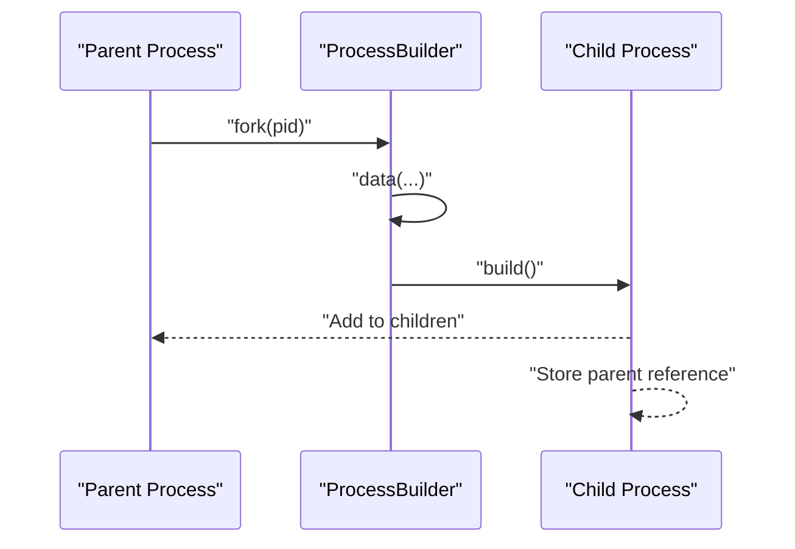
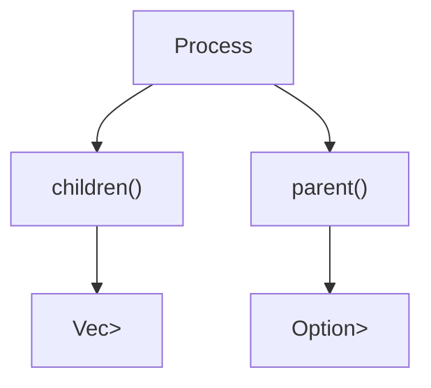
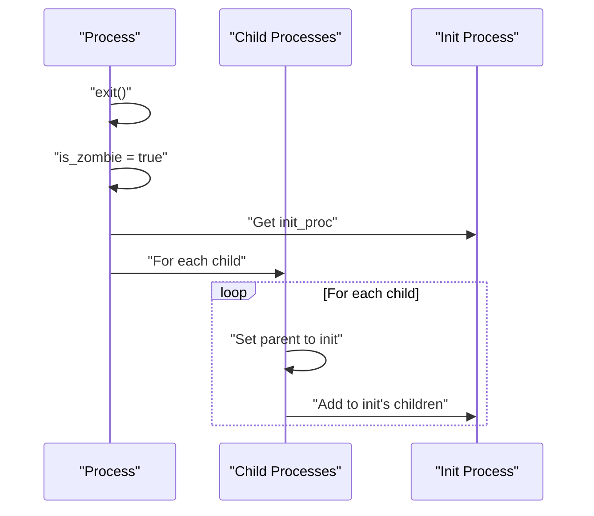
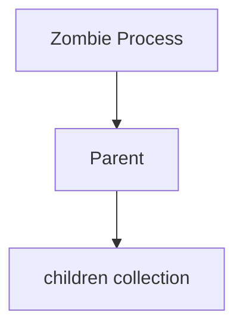
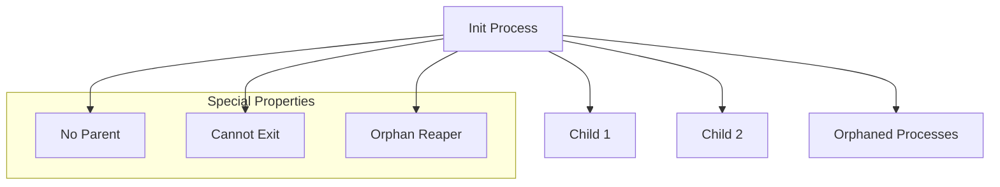

# Parent-Child Relationships

> **Relevant source files**
> * [src/process.rs](https://github.com/Starry-OS/axprocess/blob/57d44806/src/process.rs)
> * [tests/process.rs](https://github.com/Starry-OS/axprocess/blob/57d44806/tests/process.rs)

This document details how parent-child relationships between processes are managed in the `axprocess` crate. It covers the implementation of process hierarchy, relationship establishment, orphan handling, and cleanup mechanisms. For information about the complete process lifecycle, see [Process Lifecycle](/Starry-OS/axprocess/2.2-process-lifecycle).

## Relationship Structure

In the `axprocess` crate, processes are organized in a hierarchical structure similar to Unix-like operating systems. Each process maintains references to both its parent and its children.



**Process Hierarchy Implementation**

A process stores:

* A weak reference to its parent process (to avoid reference cycles)
* Strong references to all its child processes (ensuring children don't get dropped prematurely)

This implementation allows for proper resource management while maintaining the process hierarchy.

Sources: [src/process.rs(L43 - L44)&emsp;](https://github.com/Starry-OS/axprocess/blob/57d44806/src/process.rs#L43-L44) [src/process.rs(L73 - L80)&emsp;](https://github.com/Starry-OS/axprocess/blob/57d44806/src/process.rs#L73-L80)

## Establishing Parent-Child Relationships

Parent-child relationships are established during process creation. A new process is created using the `fork` method on an existing process, which returns a `ProcessBuilder`.



When `ProcessBuilder::build()` is called:

1. The new process stores a weak reference to its parent
2. The parent adds the new process to its children collection

Sources: [src/process.rs(L275 - L281)&emsp;](https://github.com/Starry-OS/axprocess/blob/57d44806/src/process.rs#L275-L281) [src/process.rs(L301 - L331)&emsp;](https://github.com/Starry-OS/axprocess/blob/57d44806/src/process.rs#L301-L331)

## Code Examples

Here's how the parent-child relationship is established during process creation:

1. Parent reference in the new process:

```yaml
parent: SpinNoIrq::new(parent.as_ref().map(Arc::downgrade).unwrap_or_default())
```

1. Adding the child to the parent's children:

```javascript
if let Some(parent) = parent {
    parent.children.lock().insert(pid, process.clone());
}
```

Sources: [src/process.rs(L318 - L328)&emsp;](https://github.com/Starry-OS/axprocess/blob/57d44806/src/process.rs#L318-L328)

## Accessing Relationships

Processes provide methods to access their relationships:



* `parent()`: Returns the parent process if it exists
* `children()`: Returns a vector of all child processes

Sources: [src/process.rs(L73 - L80)&emsp;](https://github.com/Starry-OS/axprocess/blob/57d44806/src/process.rs#L73-L80)

## Orphan Handling

When a process exits, its children become orphans. The `axprocess` system handles this by reparenting these orphan processes to the init process.



When a process calls `exit()`:

1. It's marked as a zombie
2. Its children are transferred to the init process:
* Each child updates its parent reference to point to init
* The child is added to init's children collection

This ensures no process becomes truly orphaned, maintaining the integrity of the process hierarchy.

Sources: [src/process.rs(L207 - L224)&emsp;](https://github.com/Starry-OS/axprocess/blob/57d44806/src/process.rs#L207-L224)

## Process Cleanup

When a zombie process is freed, it's removed from its parent's children collection:



This is performed by the `free()` method, which can only be called on zombie processes:

1. It checks that the process is a zombie
2. It removes itself from its parent's children collection

Sources: [src/process.rs(L230 - L236)&emsp;](https://github.com/Starry-OS/axprocess/blob/57d44806/src/process.rs#L230-L236)

## Special Role of the Init Process

The init process serves as the root of the process hierarchy and has special characteristics:



The init process:

* Is created without a parent
* Cannot exit (attempting to call `exit()` on it will panic)
* Serves as the adoptive parent for all orphaned processes
* Is created at system initialization and accessible via the `init_proc()` function

Sources: [src/process.rs(L208 - L210)&emsp;](https://github.com/Starry-OS/axprocess/blob/57d44806/src/process.rs#L208-L210) [src/process.rs(L262 - L272)&emsp;](https://github.com/Starry-OS/axprocess/blob/57d44806/src/process.rs#L262-L272) [src/process.rs(L333 - L341)&emsp;](https://github.com/Starry-OS/axprocess/blob/57d44806/src/process.rs#L333-L341)

## Testing Behavior

The process relationship behavior is verified through tests that demonstrate:

|Test Case|Description|
| --- | --- |
|child|Verifies child processes correctly reference their parent|
|exit|Checks that exited processes become zombies but remain in their parent's children list|
|free|Ensures freed zombie processes are removed from their parent's children list|
|reap|Confirms orphaned processes (children of an exited process) are reparented to the init process|

Sources: [tests/process.rs(L9 - L55)&emsp;](https://github.com/Starry-OS/axprocess/blob/57d44806/tests/process.rs#L9-L55)

## Complete Parent-Child Lifecycle

The following diagram shows the complete lifecycle of parent-child relationships from creation through exit to cleanup:

```

```

This diagram illustrates how a process moves through its lifecycle while maintaining appropriate parent-child relationships throughout.

Sources: [src/process.rs(L207 - L236)&emsp;](https://github.com/Starry-OS/axprocess/blob/57d44806/src/process.rs#L207-L236) [src/process.rs(L275 - L331)&emsp;](https://github.com/Starry-OS/axprocess/blob/57d44806/src/process.rs#L275-L331)