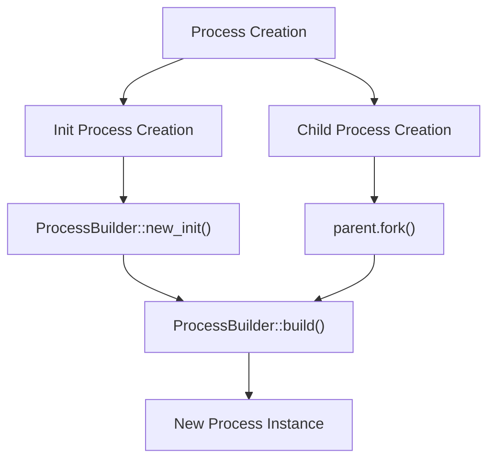
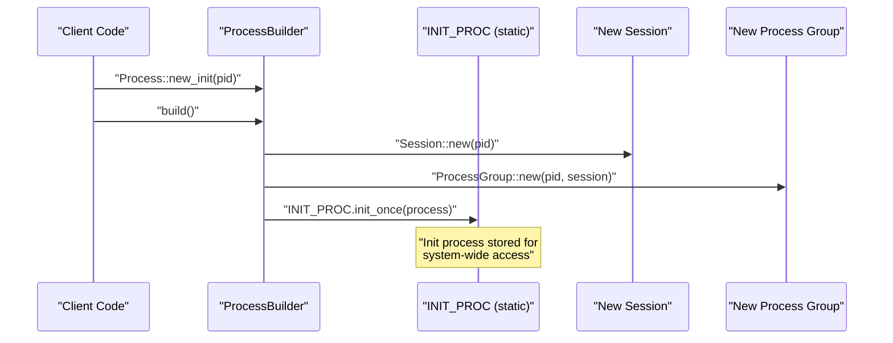
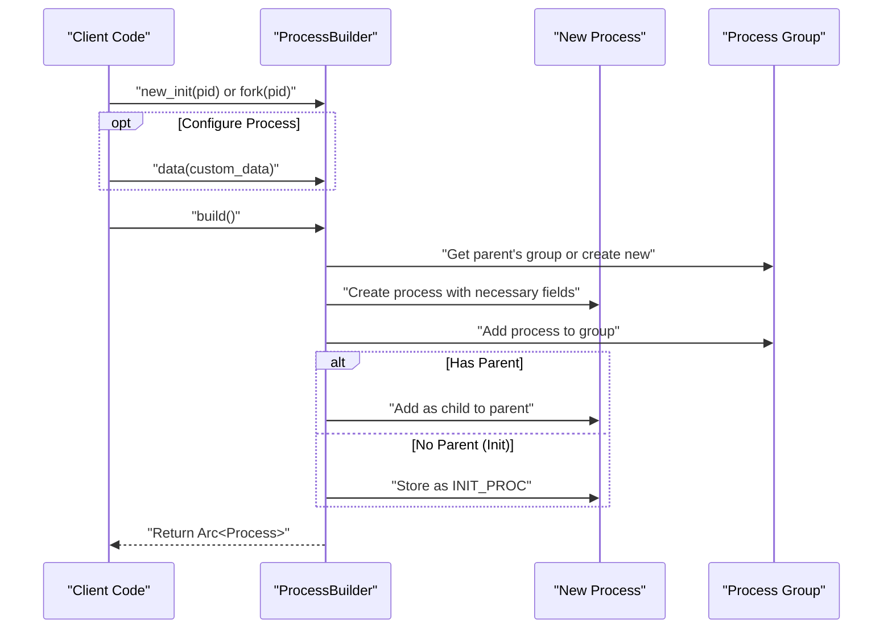
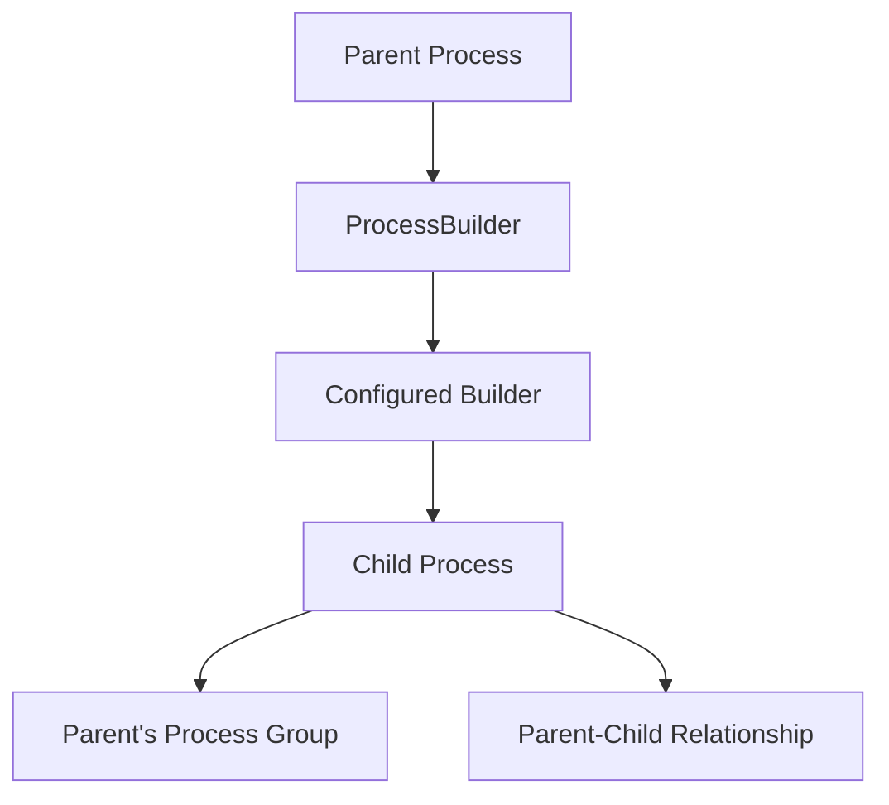
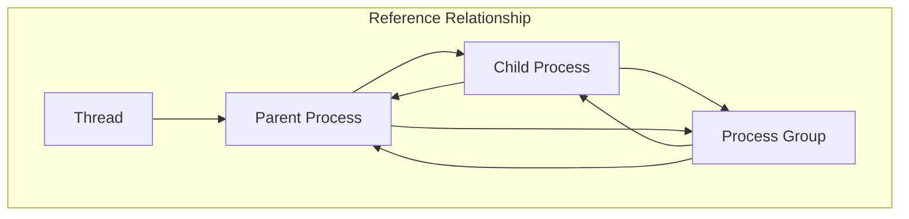
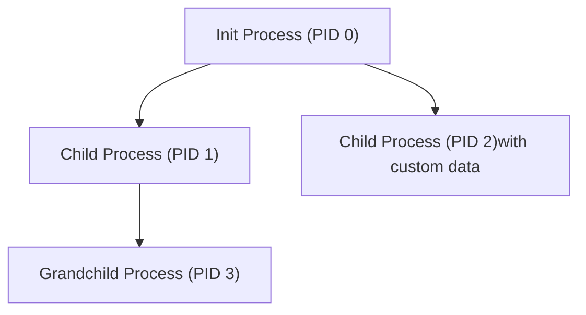

# Process Creation and Initialization

> **Relevant source files**
> * [src/process.rs](https://github.com/Starry-OS/axprocess/blob/57d44806/src/process.rs)
> * [tests/common/mod.rs](https://github.com/Starry-OS/axprocess/blob/57d44806/tests/common/mod.rs)

This page documents how processes are created and initialized in the axprocess crate. We'll explore the creation of the init process, the ProcessBuilder pattern for process construction, and how child processes are created through forking. For information about the complete process lifecycle, including termination and cleanup, see [Process Lifecycle](/Starry-OS/axprocess/2.2-process-lifecycle).

## Overview

In axprocess, all processes are created using a builder pattern that ensures proper initialization and establishment of hierarchical relationships. The system supports two primary creation paths:

1. Creating the special "init process" (the first process in the system)
2. Creating child processes by "forking" from existing parent processes



Sources: [src/process.rs(L262 - L332)&emsp;](https://github.com/Starry-OS/axprocess/blob/57d44806/src/process.rs#L262-L332)

## The Init Process

The init process is the first process in the system and serves as the "root" of the process hierarchy. It has no parent and adopts orphaned processes when their parents exit.

### Creating the Init Process

The init process is created using the `Process::new_init` method and stored in a static variable for system-wide access.



Sources: [src/process.rs(L262 - L272)&emsp;](https://github.com/Starry-OS/axprocess/blob/57d44806/src/process.rs#L262-L272) [src/process.rs(L301 - L331)&emsp;](https://github.com/Starry-OS/axprocess/blob/57d44806/src/process.rs#L301-L331) [src/process.rs(L334 - L341)&emsp;](https://github.com/Starry-OS/axprocess/blob/57d44806/src/process.rs#L334-L341)

### The Init Process Responsibilities

The init process has special responsibilities in the system:

* Cannot be terminated (the system enforces this)
* Adopts orphaned processes when their parents exit
* Provides the foundation for the process hierarchy

The code explicitly prevents the init process from exiting:

```rust
pub fn exit(self: &Arc<Self>) {
    if self.is_init() {
        panic!("init process cannot exit");
    }
    // Exit code continues...
}
```

Sources: [src/process.rs(L207 - L226)&emsp;](https://github.com/Starry-OS/axprocess/blob/57d44806/src/process.rs#L207-L226) [src/process.rs(L334 - L341)&emsp;](https://github.com/Starry-OS/axprocess/blob/57d44806/src/process.rs#L334-L341)

## The ProcessBuilder Pattern

The `ProcessBuilder` struct provides a flexible way to configure and create new processes. It follows the builder pattern, allowing optional configurations before building the actual process.

### ProcessBuilder Fields

|Field|Type|Description|
| --- | --- | --- |
|pid|Pid|Process identifier|
|parent|Option<Arc<Process>>|Parent process (None for init)|
|data|Box<dyn Any + Send + Sync>|Custom data associated with the process|

Sources: [src/process.rs(L285 - L289)&emsp;](https://github.com/Starry-OS/axprocess/blob/57d44806/src/process.rs#L285-L289)

### Process Construction Flow



Sources: [src/process.rs(L262 - L332)&emsp;](https://github.com/Starry-OS/axprocess/blob/57d44806/src/process.rs#L262-L332)

## Child Process Creation (Forking)

Child processes are created by "forking" from an existing parent process. This is done using the `fork` method on a parent process.

### Fork Process



Sources: [src/process.rs(L275 - L281)&emsp;](https://github.com/Starry-OS/axprocess/blob/57d44806/src/process.rs#L275-L281) [src/process.rs(L301 - L331)&emsp;](https://github.com/Starry-OS/axprocess/blob/57d44806/src/process.rs#L301-L331)

### Inheritance During Forking

When a process is forked, the child process inherits several properties from its parent:

1. **Process Group**: The child joins the parent's process group by default
2. **Parent Reference**: The child maintains a reference to its parent
3. **Children Collection**: The parent adds the child to its children collection

The code establishes these relationships during the `build` method:

```javascript
// Set parent-child relationship
if let Some(parent) = parent {
    parent.children.lock().insert(pid, process.clone());
}

// Child inherits parent's group or creates new group for init
let group = parent.as_ref().map_or_else(
    || {
        let session = Session::new(pid);
        ProcessGroup::new(pid, &session)
    },
    |p| p.group(),
);
```

Sources: [src/process.rs(L303 - L330)&emsp;](https://github.com/Starry-OS/axprocess/blob/57d44806/src/process.rs#L303-L330)

## Process Initialization Details

When a new process is created, several key initialization steps occur:

1. **Process Structure**: A new `Process` structure is allocated with the provided PID
2. **Zombie State**: Set to `false` initially
3. **Thread Group**: Empty thread group is initialized
4. **Custom Data**: Any provided custom data is stored
5. **Children Map**: Empty children map is created
6. **Parent Reference**: Weak reference to parent is stored (if any)
7. **Process Group**: Process joins parent's group or creates a new group
8. **Registration**: Process is registered with its group

### Memory Management Strategy

Process creation uses a careful reference counting strategy to prevent memory leaks:

1. **Strong References** (`Arc<Process>`):

* From parent to children
* From process group to processes
* From threads to their process
2. **Weak References** (`Weak<Process>`):

* From child to parent (prevents reference cycles)
* From process group to processes in weak maps



Sources: [src/process.rs(L301 - L331)&emsp;](https://github.com/Starry-OS/axprocess/blob/57d44806/src/process.rs#L301-L331)

## Practical Example

Here's how a process hierarchy might be created in code:

```javascript
// Create init process with PID 0
let init = Process::new_init(0).build();

// Create a child process with PID 1
let child1 = init.fork(1).build();

// Create another child with PID 2 and custom data
let child2 = init.fork(2).data(MyCustomData { value: 42 }).build();

// Create a "grandchild" process with PID 3
let grandchild = child1.fork(3).build();
```

The resulting hierarchy would look like:



Sources: [src/process.rs(L262 - L332)&emsp;](https://github.com/Starry-OS/axprocess/blob/57d44806/src/process.rs#L262-L332) [tests/common/mod.rs(L15 - L28)&emsp;](https://github.com/Starry-OS/axprocess/blob/57d44806/tests/common/mod.rs#L15-L28)

## Implementation of ProcessBuilder::build

The `build` method is the core of process initialization. It takes the builder's configuration and constructs a fully initialized process with proper relationships.

The method performs these key steps:

1. Determines the process group (from parent or creates new one)
2. Constructs the Process struct with all fields
3. Adds the process to its group
4. Establishes parent-child relationship or marks as init process
5. Returns the new process wrapped in an Arc

Sources: [src/process.rs(L301 - L331)&emsp;](https://github.com/Starry-OS/axprocess/blob/57d44806/src/process.rs#L301-L331)

## System Integration

The process creation system integrates with other components of axprocess:

1. **Thread Creation**: After a process is created, threads can be added using `process.new_thread(tid)`
2. **Process Group Management**: Processes can create or join process groups after creation
3. **Session Management**: Processes can create new sessions
4. **Parent-Child Relations**: The system maintains a hierarchy for resource inheritance and cleanup

Sources: [src/process.rs(L168 - L177)&emsp;](https://github.com/Starry-OS/axprocess/blob/57d44806/src/process.rs#L168-L177) [src/process.rs(L100 - L163)&emsp;](https://github.com/Starry-OS/axprocess/blob/57d44806/src/process.rs#L100-L163)

## Summary

The axprocess crate provides a robust system for process creation and initialization that:

1. Uses the builder pattern for flexible configuration
2. Establishes proper hierarchical relationships
3. Manages memory safely with appropriate reference counting
4. Supports special handling for the init process
5. Maintains proper process group and session memberships

This foundation enables the subsequent lifecycle management and inter-process relationships that are essential to an operating system's process subsystem.