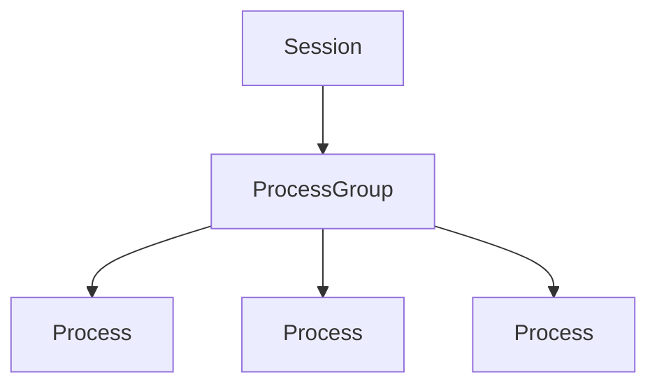
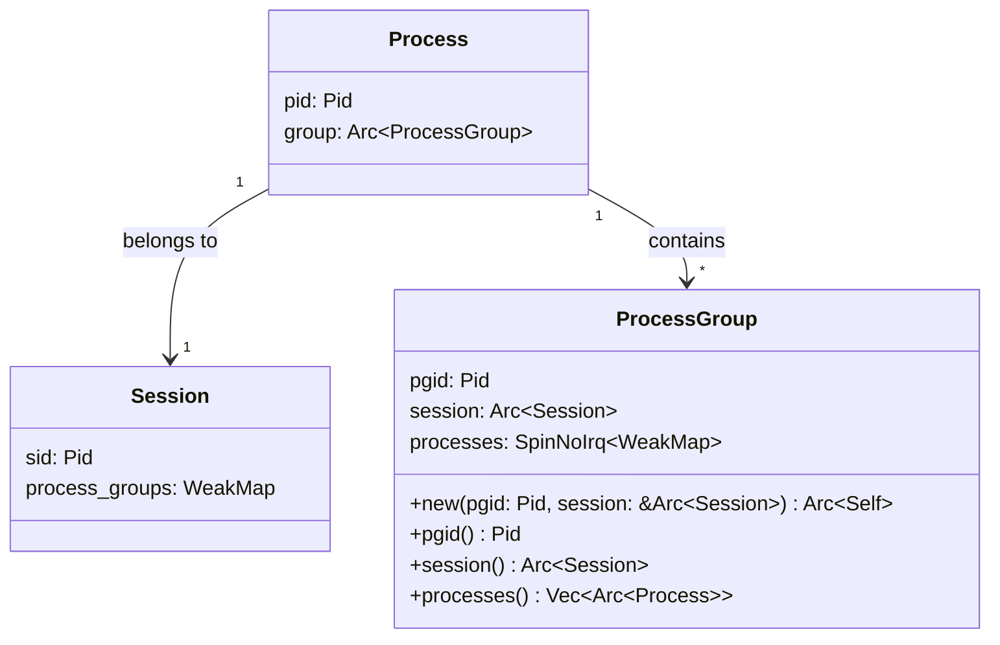
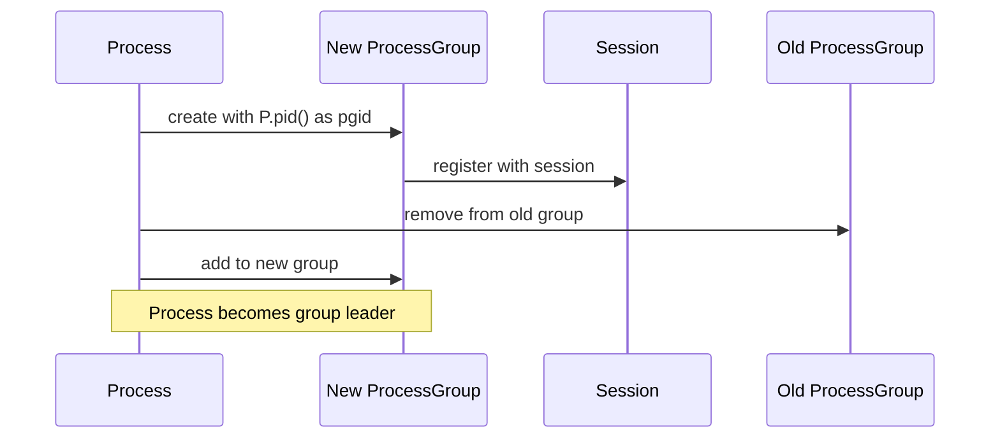
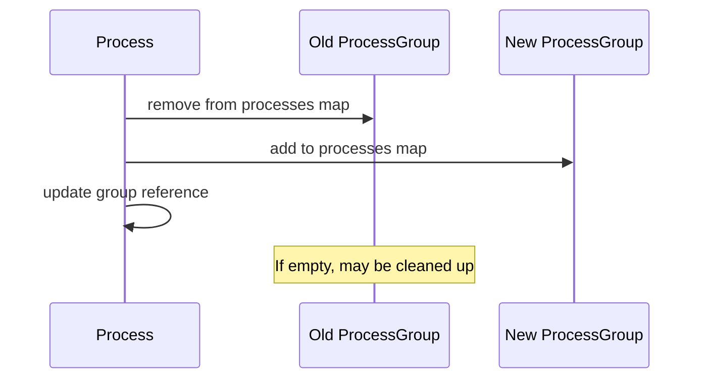
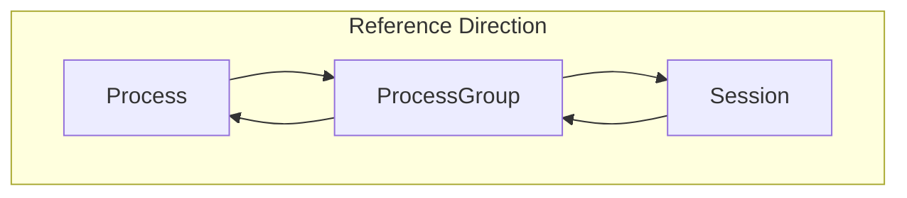
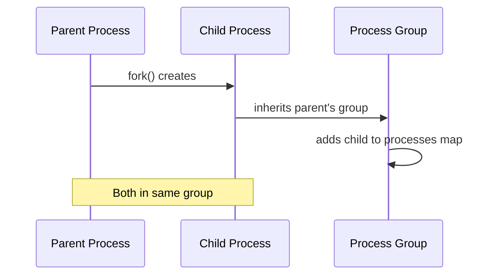

# Process Groups

> **Relevant source files**
> * [src/process_group.rs](https://github.com/Starry-OS/axprocess/blob/57d44806/src/process_group.rs)
> * [tests/group.rs](https://github.com/Starry-OS/axprocess/blob/57d44806/tests/group.rs)

## Purpose and Scope

This document explains process groups in the axprocess crate, their implementation, and how they fit into the process management hierarchy. Process groups are collections of related processes that enable group-based operations and organization. For information about sessions, which contain process groups, see [Sessions](/Starry-OS/axprocess/3.2-sessions). For parent-child process relationships, see [Parent-Child Relationships](/Starry-OS/axprocess/2.3-parent-child-relationships).

## Process Group Hierarchy

Process groups form a middle layer in the process management hierarchy of axprocess. They provide a way to organize related processes and enable group-based operations.

Sources: [src/process_group.rs(L12 - L17)&emsp;](https://github.com/Starry-OS/axprocess/blob/57d44806/src/process_group.rs#L12-L17)

## Process Group Implementation

A process group is represented by the `ProcessGroup` struct, which maintains references to a collection of processes and belongs to a session.

The key components of a process group are:

|Component|Type|Description|
| --- | --- | --- |
|pgid|Pid|The unique identifier for the process group|
|session|Arc<Session>|The session this process group belongs to|
|processes|SpinNoIrq<WeakMap<Pid, Weak<Process>>>|A map of processes belonging to this group|

Sources: [src/process_group.rs(L12 - L17)&emsp;](https://github.com/Starry-OS/axprocess/blob/57d44806/src/process_group.rs#L12-L17) [src/process_group.rs(L19 - L29)&emsp;](https://github.com/Starry-OS/axprocess/blob/57d44806/src/process_group.rs#L19-L29)

## Process Group Creation and Management

### Creation

Process groups are created within an existing session. Typically, a process creates a new group and becomes the leader of that group.

The process group ID (pgid) is typically set to the process ID (pid) of the creating process, making that process the group leader.

Sources: [src/process_group.rs(L19 - L29)&emsp;](https://github.com/Starry-OS/axprocess/blob/57d44806/src/process_group.rs#L19-L29) [tests/group.rs(L22 - L43)&emsp;](https://github.com/Starry-OS/axprocess/blob/57d44806/tests/group.rs#L22-L43)

### Process Movement Between Groups

Processes can move between process groups, which involves removing them from their current group and adding them to a new one.

When a process moves to a new group, it's removed from its old group's process map and added to the new group's map. If the old group becomes empty (no more processes), it may be cleaned up.

Sources: [tests/group.rs(L77 - L113)&emsp;](https://github.com/Starry-OS/axprocess/blob/57d44806/tests/group.rs#L77-L113)

## Memory Management

Process groups use a combination of strong (`Arc`) and weak (`Weak`) references to manage memory and prevent reference cycles:

1. Processes hold strong references (`Arc`) to their process group
2. Process groups hold weak references (`Weak`) to their processes
3. Sessions hold weak references to process groups

This reference strategy ensures proper cleanup when processes or groups are no longer needed.

Sources: [src/process_group.rs(L15 - L16)&emsp;](https://github.com/Starry-OS/axprocess/blob/57d44806/src/process_group.rs#L15-L16) [tests/group.rs(L54 - L65)&emsp;](https://github.com/Starry-OS/axprocess/blob/57d44806/tests/group.rs#L54-L65)

## Process Group Inheritance

When a process is forked (a new child is created), the child typically inherits the parent's process group. This maintains the group relationship across process creation.

Sources: [tests/group.rs(L67 - L75)&emsp;](https://github.com/Starry-OS/axprocess/blob/57d44806/tests/group.rs#L67-L75)

## Process Group Cleanup

Process groups are automatically cleaned up when:

1. All processes in the group have exited and been freed
2. There are no more strong references to the process group

This automatic cleanup is handled through Rust's reference counting mechanism and the weak reference strategy used in axprocess.

When the last process in a group is removed (either by exiting or moving to another group), the process group becomes eligible for cleanup if there are no other strong references to it.

Sources: [tests/group.rs(L54 - L65)&emsp;](https://github.com/Starry-OS/axprocess/blob/57d44806/tests/group.rs#L54-L65) [tests/group.rs(L102 - L113)&emsp;](https://github.com/Starry-OS/axprocess/blob/57d44806/tests/group.rs#L102-L113)

## API Summary

The `ProcessGroup` struct provides the following key methods:

|Method|Purpose|
| --- | --- |
|new(pgid, session)|Creates a new process group with the given ID in the specified session|
|pgid()|Returns the process group ID|
|session()|Returns a reference to the session this group belongs to|
|processes()|Returns a vector of all processes in this group|

Sources: [src/process_group.rs(L19 - L46)&emsp;](https://github.com/Starry-OS/axprocess/blob/57d44806/src/process_group.rs#L19-L46)

## Use Cases

Process groups serve several important purposes in operating systems:

1. **Job Control**: Allow signals to be sent to multiple related processes at once
2. **Organization**: Group related processes together (e.g., a shell pipeline)
3. **Termination Control**: Enable orderly shutdown of related processes

The implementation in axprocess follows patterns similar to Unix-like systems but with Rust's memory safety guarantees.

Sources: [tests/group.rs(L9 - L141)&emsp;](https://github.com/Starry-OS/axprocess/blob/57d44806/tests/group.rs#L9-L141)