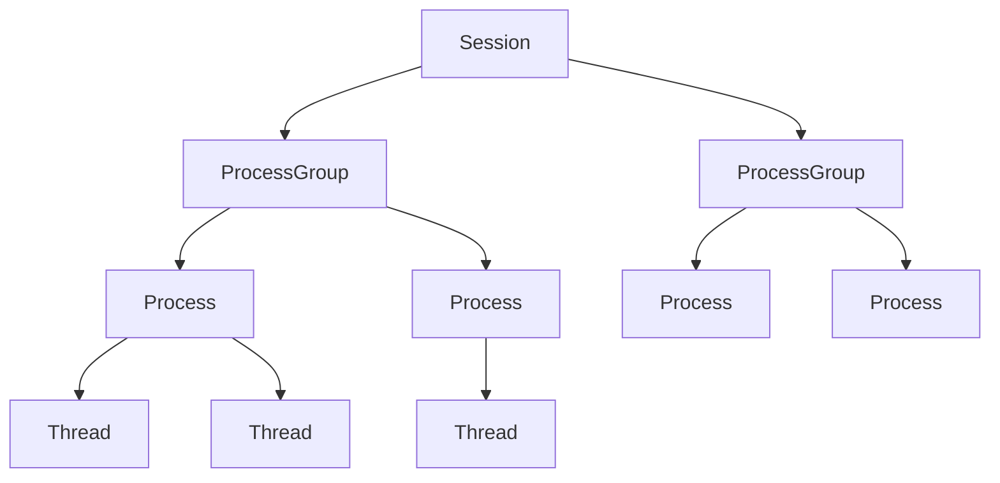
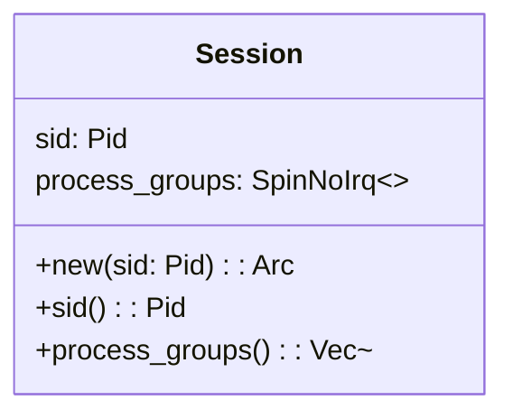
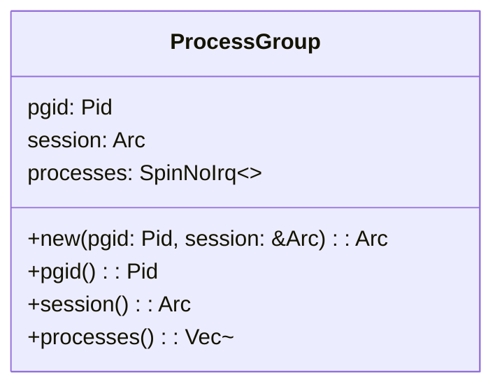
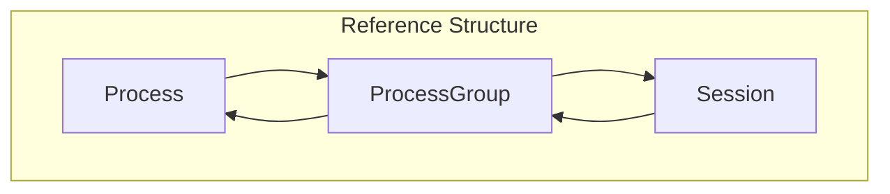
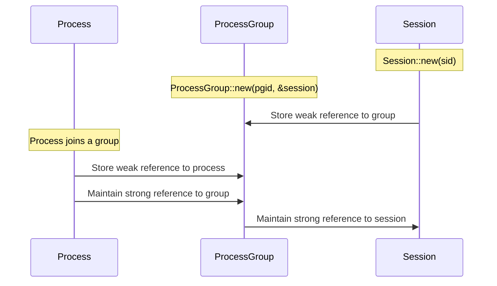

# Process Groups and Sessions

> **Relevant source files**
> * [src/process_group.rs](https://github.com/Starry-OS/axprocess/blob/57d44806/src/process_group.rs)
> * [src/session.rs](https://github.com/Starry-OS/axprocess/blob/57d44806/src/session.rs)

## Purpose and Scope

This document details the process group and session management subsystem in the axprocess crate. Process groups and sessions are hierarchical abstractions that organize processes into logical collections, similar to Unix-like operating systems. They play a crucial role in managing process relationships and controlling process behavior.

For information about specific process management and parent-child relationships, see [Process Management](/Starry-OS/axprocess/2-process-management) and [Parent-Child Relationships](/Starry-OS/axprocess/2.3-parent-child-relationships). For thread management within processes, see [Thread Management](/Starry-OS/axprocess/4-thread-management).

## Hierarchical Organization

Process groups and sessions form a three-level hierarchy in the process management system:



This hierarchical organization provides:

* Structured process management
* Logical grouping of related processes
* Potential for process control operations at different granularity levels

Sources: [src/session.rs(L12 - L17)&emsp;](https://github.com/Starry-OS/axprocess/blob/57d44806/src/session.rs#L12-L17) [src/process_group.rs(L12 - L17)&emsp;](https://github.com/Starry-OS/axprocess/blob/57d44806/src/process_group.rs#L12-L17)

## Session Implementation

A session is a collection of process groups, represented by the `Session` struct:



Key characteristics:

* Each session has a unique Session ID (`sid`)
* Sessions contain multiple process groups stored in a thread-safe weak reference map
* Process groups are referenced by their Process Group ID (`pgid`)
* The session implementation uses `SpinNoIrq` for synchronization and `WeakMap` for memory management

Sources: [src/session.rs(L12 - L45)&emsp;](https://github.com/Starry-OS/axprocess/blob/57d44806/src/session.rs#L12-L45)

## Process Group Implementation

A process group is a collection of processes, represented by the `ProcessGroup` struct:



Key characteristics:

* Each process group has a unique Process Group ID (`pgid`)
* Process groups maintain a strong reference to their containing session
* Processes within a group are stored in a thread-safe weak reference map
* Processes are referenced by their Process ID (`pid`)

Sources: [src/process_group.rs(L12 - L47)&emsp;](https://github.com/Starry-OS/axprocess/blob/57d44806/src/process_group.rs#L12-L47)

## Reference Management

The memory management strategy prevents memory leaks while ensuring objects remain alive as needed:



This approach:

* Uses strong references (`Arc`) for upward relationships (Process → Process Group → Session)
* Uses weak references for downward relationships (Session → Process Group → Process)
* Prevents reference cycles that could cause memory leaks
* Ensures objects persist when needed but can be garbage collected when no longer referenced

Sources: [src/session.rs(L7 - L16)&emsp;](https://github.com/Starry-OS/axprocess/blob/57d44806/src/session.rs#L7-L16) [src/process_group.rs(L7 - L17)&emsp;](https://github.com/Starry-OS/axprocess/blob/57d44806/src/process_group.rs#L7-L17)

## Creation and Relationship Management

The creation flow and relationship management between these entities follows a pattern:



Key operations:

1. Sessions are created with a unique SID
2. Process groups are created within a session with a unique PGID
3. Processes join process groups, establishing the necessary reference relationships
4. Reference counting manages the lifecycle of these objects

Sources: [src/session.rs(L19 - L26)&emsp;](https://github.com/Starry-OS/axprocess/blob/57d44806/src/session.rs#L19-L26) [src/process_group.rs(L19 - L29)&emsp;](https://github.com/Starry-OS/axprocess/blob/57d44806/src/process_group.rs#L19-L29)

## Memory Safety and Synchronization

The implementation ensures thread safety and proper memory management:

1. **Thread Safety**:

* `SpinNoIrq` locks protect shared data structures
* Used for both session's process groups and process group's processes
2. **Memory Management**:

* `WeakMap` collections store weak references to prevent reference cycles
* Strong references (`Arc`) ensure objects persist as long as needed
* Weak references allow objects to be garbage collected when no longer needed
3. **Collection Methods**:

* Both `Session` and `ProcessGroup` provide methods to retrieve contained objects
* Collection methods create strong references (`Arc`) from weak references
* Only live objects are returned from collection methods

Sources: [src/session.rs(L29 - L39)&emsp;](https://github.com/Starry-OS/axprocess/blob/57d44806/src/session.rs#L29-L39) [src/process_group.rs(L32 - L47)&emsp;](https://github.com/Starry-OS/axprocess/blob/57d44806/src/process_group.rs#L32-L47)

## Future Extensions

The session implementation contains a TODO comment about shell job control, suggesting future functional extensions:

```
// TODO: shell job control
```

This indicates planned future support for Unix-like shell job control features, which typically include:

* Foreground/background process management
* Job suspension and resumption
* Terminal signal handling for process groups

Sources: [src/session.rs(L16)&emsp;](https://github.com/Starry-OS/axprocess/blob/57d44806/src/session.rs#L16-L16)

## Relationship to Unix Process Management

The implementation mirrors Unix-like process management concepts:

|Concept|Unix-like Systems|axprocess Implementation|
| --- | --- | --- |
|Process|Basic execution unit|Processstruct|
|Process Group|Collection of related processes|ProcessGroupstruct|
|Session|Collection of process groups|Sessionstruct|
|Process Group Leader|First process in a group|Process with PID matching PGID|
|Session Leader|Process that creates a session|Process with PID matching SID|

This familiar design makes the system more intuitive for developers with Unix system programming experience while leveraging Rust's memory safety features.