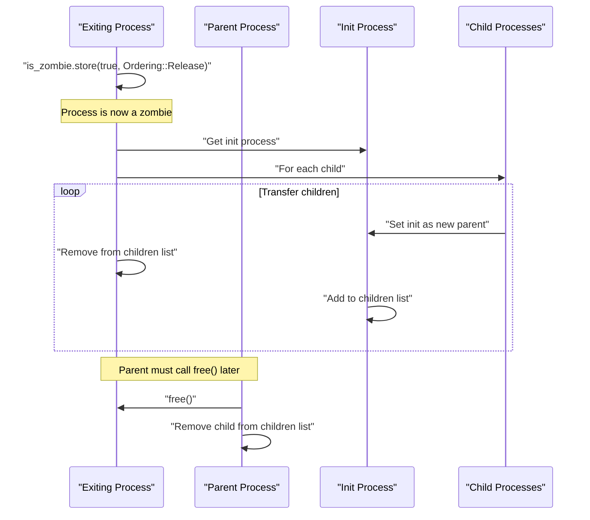
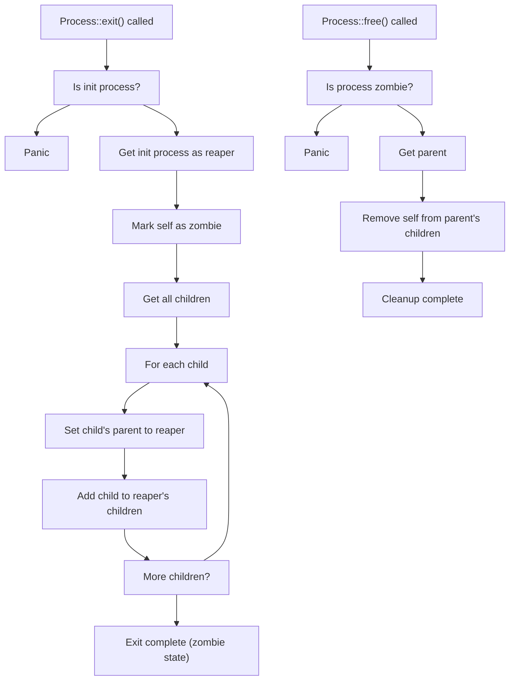

# Process Lifecycle

> **Relevant source files**
> * [src/process.rs](https://github.com/Starry-OS/axprocess/blob/57d44806/src/process.rs)
> * [tests/process.rs](https://github.com/Starry-OS/axprocess/blob/57d44806/tests/process.rs)

This document details the lifecycle of a process in the axprocess crate, from creation through execution to termination and cleanup. For information about process creation techniques and initialization, see [Process Creation and Initialization](/Starry-OS/axprocess/2.1-process-creation-and-initialization). For details on parent-child relationships, see [Parent-Child Relationships](/Starry-OS/axprocess/2.3-parent-child-relationships).

## Overview

Processes in the axprocess crate follow a well-defined lifecycle that ensures proper resource management and cleanup. The lifecycle consists of three primary states:

```

```

Sources: [src/process.rs(L207 - L236)&emsp;](https://github.com/Starry-OS/axprocess/blob/57d44806/src/process.rs#L207-L236) [src/process.rs(L285 - L332)&emsp;](https://github.com/Starry-OS/axprocess/blob/57d44806/src/process.rs#L285-L332)

## Process Creation

Processes are created using the `ProcessBuilder` pattern, which configures and then builds a new process instance.

### Init Process Creation

The initialization of the first process (init process) is a special case:

```javascript
// Create the init process
let init = Process::new_init(pid).build();
```

The init process is stored in a static `INIT_PROC` variable and serves as the ancestor of all other processes. It cannot be terminated and serves as the "reaper" for orphaned processes.

### Child Process Creation

Regular processes are created as children of existing processes using the `fork` method:

```javascript
// Creating a child process
let child = parent.fork(new_pid).build();
```

The `ProcessBuilder` allows customizing the process before creation, such as setting associated data:

```javascript
let child = parent.fork(new_pid)
    .data(custom_data)
    .build();
```

Sources: [src/process.rs(L262 - L282)&emsp;](https://github.com/Starry-OS/axprocess/blob/57d44806/src/process.rs#L262-L282) [src/process.rs(L285 - L332)&emsp;](https://github.com/Starry-OS/axprocess/blob/57d44806/src/process.rs#L285-L332)

## Process States and Transitions

```

```

Sources: [src/process.rs(L179 - L186)&emsp;](https://github.com/Starry-OS/axprocess/blob/57d44806/src/process.rs#L179-L186) [src/process.rs(L196 - L236)&emsp;](https://github.com/Starry-OS/axprocess/blob/57d44806/src/process.rs#L196-L236)

### Active State

An active process is fully functioning and can:

* Create child processes
* Create or join sessions and process groups
* Create threads
* Access and modify its associated data

An active process can be marked as "group exited" using the `group_exit()` method, which sets an internal flag but doesn't terminate the process.

Sources: [src/process.rs(L179 - L186)&emsp;](https://github.com/Starry-OS/axprocess/blob/57d44806/src/process.rs#L179-L186)

### Zombie State

When a process calls `exit()`, it enters the zombie state:

1. It is marked as a zombie using an atomic boolean flag
2. Its children are reassigned to the init process (or nearest subreaper)
3. Resources are partially released, but the process structure remains in memory
4. The process remains in its parent's child list

A zombie process retains minimal information needed for the parent to retrieve its exit status.

Sources: [src/process.rs(L196 - L225)&emsp;](https://github.com/Starry-OS/axprocess/blob/57d44806/src/process.rs#L196-L225)

### Process Cleanup

The final state transition occurs when a zombie process is freed using the `free()` method:

1. The process is removed from its parent's child list
2. This allows for complete deallocation when all references are dropped

The `free()` method will panic if called on a non-zombie process.

Sources: [src/process.rs(L227 - L236)&emsp;](https://github.com/Starry-OS/axprocess/blob/57d44806/src/process.rs#L227-L236)

## Process Exit Mechanism



Sources: [src/process.rs(L207 - L236)&emsp;](https://github.com/Starry-OS/axprocess/blob/57d44806/src/process.rs#L207-L236)

The exit mechanism includes several key aspects:

1. **Atomic state change**: The process uses atomic operations to mark itself as a zombie
2. **Child inheritance**: All children are transferred to the init process
3. **Parent notification**: The parent is responsible for calling `free()` to complete cleanup

Note that attempting to exit the init process will cause a panic, as the init process must always exist in the system.

Sources: [src/process.rs(L207 - L225)&emsp;](https://github.com/Starry-OS/axprocess/blob/57d44806/src/process.rs#L207-L225) [tests/process.rs(L32 - L35)&emsp;](https://github.com/Starry-OS/axprocess/blob/57d44806/tests/process.rs#L32-L35)

## Process Exit and Cleanup Code Flow



Sources: [src/process.rs(L207 - L236)&emsp;](https://github.com/Starry-OS/axprocess/blob/57d44806/src/process.rs#L207-L236)

## Special Considerations

### Init Process

The init process has special properties in the lifecycle:

* It cannot exit (attempting to call `exit()` on it will panic)
* It acts as the "reaper" for orphaned processes
* It is created at system initialization and persists until system shutdown

### Zombies and Resource Management

Zombie processes maintain minimal state while waiting for their parent to acknowledge their termination via `free()`. This approach:

1. Allows parents to retrieve exit status information
2. Prevents resource leaks by ensuring proper cleanup
3. Maintains a clean process hierarchy in the system

Sources: [src/process.rs(L196 - L236)&emsp;](https://github.com/Starry-OS/axprocess/blob/57d44806/src/process.rs#L196-L236) [tests/process.rs(L16 - L23)&emsp;](https://github.com/Starry-OS/axprocess/blob/57d44806/tests/process.rs#L16-L23) [tests/process.rs(L37 - L44)&emsp;](https://github.com/Starry-OS/axprocess/blob/57d44806/tests/process.rs#L37-L44)

## Testing Process Lifecycle

The process lifecycle is validated through several test cases:

|Test|Description|
| --- | --- |
|exit()|Verifies that a process can exit and becomes a zombie|
|free()|Ensures a zombie process can be freed and removed from parent|
|free_not_zombie()|Confirms that freeing a non-zombie process causes a panic|
|init_proc_exit()|Verifies that attempting to exit the init process causes a panic|
|reap()|Tests that children of an exited process are reassigned to init|

Sources: [tests/process.rs(L16 - L55)&emsp;](https://github.com/Starry-OS/axprocess/blob/57d44806/tests/process.rs#L16-L55)

## Implementation Details

The process lifecycle is primarily implemented in the `Process` struct, with key lifecycle methods:

* `ProcessBuilder::build()`: Creates and initializes a new process
* `Process::exit()`: Terminates the process, making it a zombie
* `Process::free()`: Removes the zombie process from its parent's children list
* `Process::is_zombie()`: Checks if the process is in the zombie state
* `Process::group_exit()`: Marks the process as group exited

Internally, the zombie state is tracked using an atomic boolean, ensuring thread-safe state transitions:

```rust
pub fn is_zombie(&self) -> bool {
    self.is_zombie.load(Ordering::Acquire)
}
```

Sources: [src/process.rs(L196 - L236)&emsp;](https://github.com/Starry-OS/axprocess/blob/57d44806/src/process.rs#L196-L236) [src/process.rs(L36 - L47)&emsp;](https://github.com/Starry-OS/axprocess/blob/57d44806/src/process.rs#L36-L47)