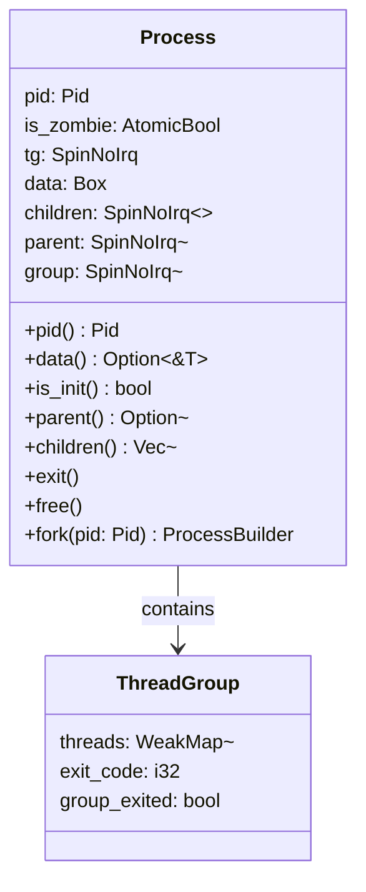
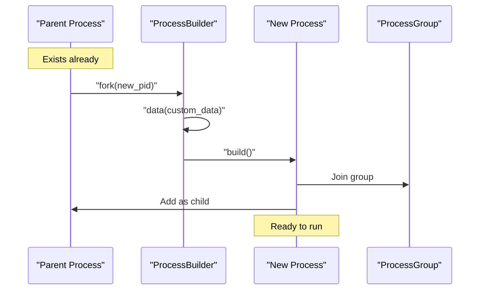
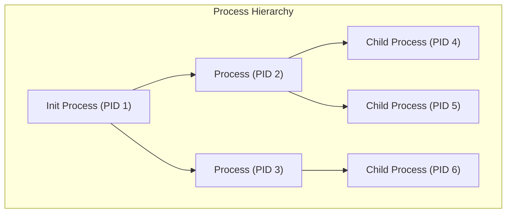

# Process Management

> **Relevant source files**
> * [src/process.rs](https://github.com/Starry-OS/axprocess/blob/57d44806/src/process.rs)
> * [tests/process.rs](https://github.com/Starry-OS/axprocess/blob/57d44806/tests/process.rs)

This document explains the process abstraction in the axprocess crate, detailing its internal structure, lifecycle, and key operations. The Process Management system provides the core functionality for creating, maintaining, and terminating processes within the ArceOS kernel.

For details on process creation, see [Process Creation and Initialization](/Starry-OS/axprocess/2.1-process-creation-and-initialization). For information on parent-child relationships, see [Parent-Child Relationships](/Starry-OS/axprocess/2.3-parent-child-relationships).

## Process Structure

The `Process` struct is the central component of the process management system, encapsulating all resources and state information for a running process.



Sources: [src/process.rs(L35 - L47)&emsp;](https://github.com/Starry-OS/axprocess/blob/57d44806/src/process.rs#L35-L47) [src/process.rs(L18 - L31)&emsp;](https://github.com/Starry-OS/axprocess/blob/57d44806/src/process.rs#L18-L31)

The `Process` struct maintains:

* A unique process ID (`pid`)
* Zombie state tracking (`is_zombie`)
* Thread management through `ThreadGroup`
* Custom data storage (`data`)
* Process hierarchy relationships (`children`, `parent`)
* Process group membership (`group`)

## Process Creation

Processes are created using the Builder pattern, which provides a flexible way to initialize a new process with various configurations.



Sources: [src/process.rs(L262 - L281)&emsp;](https://github.com/Starry-OS/axprocess/blob/57d44806/src/process.rs#L262-L281) [src/process.rs(L284 - L332)&emsp;](https://github.com/Starry-OS/axprocess/blob/57d44806/src/process.rs#L284-L332)

There are two primary ways to create processes:

1. **Init Process Creation**: The first process in the system is created using `Process::new_init()`, which returns a `ProcessBuilder` configured for the init process.
2. **Child Process Creation**: Existing processes can create child processes using `Process::fork()`, which returns a `ProcessBuilder` with the parent relationship already established.

The `ProcessBuilder` allows setting custom data before finalizing process creation with `build()`, which:

* Creates the process object
* Establishes parent-child relationships
* Adds the process to its process group
* Initializes the thread group

## Process Lifecycle

Processes in axprocess follow a defined lifecycle from creation to termination and cleanup.

```

```

Sources: [src/process.rs(L196 - L236)&emsp;](https://github.com/Starry-OS/axprocess/blob/57d44806/src/process.rs#L196-L236) [tests/process.rs(L16 - L44)&emsp;](https://github.com/Starry-OS/axprocess/blob/57d44806/tests/process.rs#L16-L44)

The process lifecycle consists of these key stages:

1. **Active**: After creation, a process is active and can create threads, spawn child processes, and perform operations.
2. **Zombie**: When a process terminates via `Process::exit()`, it becomes a zombie - the process has terminated but its resources are not fully released. At this point:

* The process is marked as zombie (`is_zombie = true`)
* Child processes are reassigned to the init process
* The process remains in its parent's children list
3. **Freed**: The parent process must call `Process::free()` on a zombie process to complete cleanup, which removes it from the parent's children list.

Note that the init process cannot exit, as enforced by a panic check in the `exit()` method.

## Process Hierarchy

Processes are organized in a hierarchical parent-child structure, similar to Unix-like systems.



Sources: [src/process.rs(L71 - L81)&emsp;](https://github.com/Starry-OS/axprocess/blob/57d44806/src/process.rs#L71-L81) [src/process.rs(L207 - L224)&emsp;](https://github.com/Starry-OS/axprocess/blob/57d44806/src/process.rs#L207-L224) [tests/process.rs(L47 - L55)&emsp;](https://github.com/Starry-OS/axprocess/blob/57d44806/tests/process.rs#L47-L55)

Key aspects of process hierarchy:

1. **Init Process**: The root of the process hierarchy, created during system initialization. It cannot be terminated and serves as the fallback parent for orphaned processes.
2. **Parent-Child Relationships**:

* Each process except init has exactly one parent
* A process can have multiple children
* These relationships are maintained using Arc/Weak references to prevent reference cycles
3. **Orphan Handling**: When a parent process exits, its children are reassigned to the init process (known as "reaping"). This ensures all processes always have a valid parent.

## Thread Management

Each process can contain multiple threads, managed through a thread group.

```

```

Sources: [src/process.rs(L18 - L31)&emsp;](https://github.com/Starry-OS/axprocess/blob/57d44806/src/process.rs#L18-L31) [src/process.rs(L167 - L191)&emsp;](https://github.com/Starry-OS/axprocess/blob/57d44806/src/process.rs#L167-L191)

The thread management system includes:

1. **ThreadGroup**: Each process contains a `ThreadGroup` that tracks:

* All threads belonging to the process
* Exit code information
* Group exit status
2. **Thread Creation**: New threads are created using:

```
process.new_thread(tid) -> ThreadBuilder
```
3. **Thread Listing**: All threads in a process can be retrieved with:

```
process.threads() -> Vec<Arc<Thread>>
```
4. **Group Exit**: A process can be marked as "group exited", which affects all its threads:

```
process.group_exit()
```

## Custom Process Data

The Process structure allows associating arbitrary data with each process through a type-erased container.

```
Process
└── data: Box<dyn Any + Send + Sync>
```

Sources: [src/process.rs(L40)&emsp;](https://github.com/Starry-OS/axprocess/blob/57d44806/src/process.rs#L40-L40) [src/process.rs(L55 - L58)&emsp;](https://github.com/Starry-OS/axprocess/blob/57d44806/src/process.rs#L55-L58) [src/process.rs(L293 - L297)&emsp;](https://github.com/Starry-OS/axprocess/blob/57d44806/src/process.rs#L293-L297)

Custom data can be:

* Set during process creation via `ProcessBuilder::data<T>(data: T)`
* Retrieved with `process.data<T>()`, which returns `Option<&T>`

This mechanism provides flexibility for higher-level subsystems to extend process functionality without modifying the core Process structure.

## Process Management API Summary

|Operation|Method|Description|
| --- | --- | --- |
|Create init process|Process::new_init(pid)|Creates the first process in the system|
|Create child process|parent.fork(pid)|Creates a new process with the specified parent|
|Get process ID|process.pid()|Returns the process ID|
|Get parent|process.parent()|Returns the parent process, if any|
|Get children|process.children()|Returns all child processes|
|Create thread|process.new_thread(tid)|Creates a new thread in the process|
|Check zombie state|process.is_zombie()|Returns true if process is a zombie|
|Terminate process|process.exit()|Terminates the process, making it a zombie|
|Clean up zombie|process.free()|Frees resources for a zombie process|
|Get custom data|process.data<T>()|Returns custom data associated with process|

Sources: [src/process.rs(L49 - L341)&emsp;](https://github.com/Starry-OS/axprocess/blob/57d44806/src/process.rs#L49-L341)