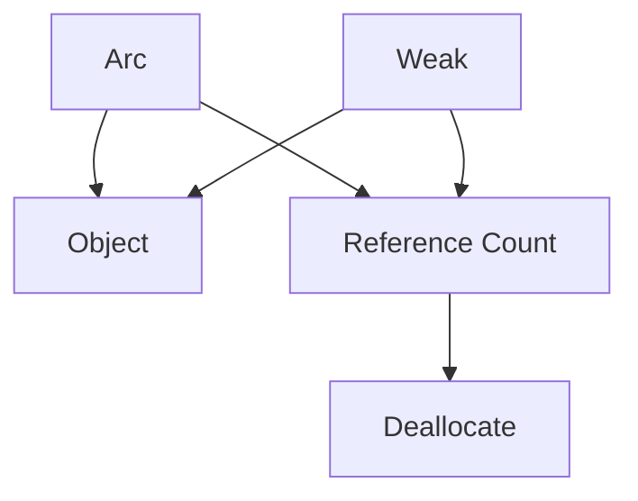
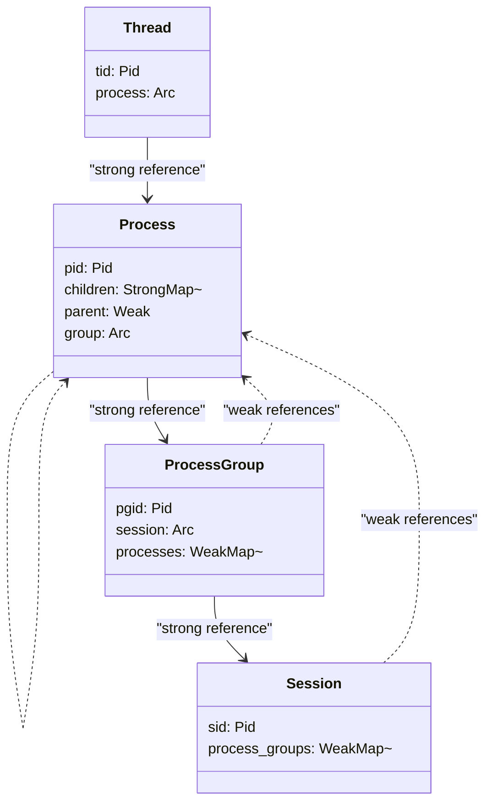
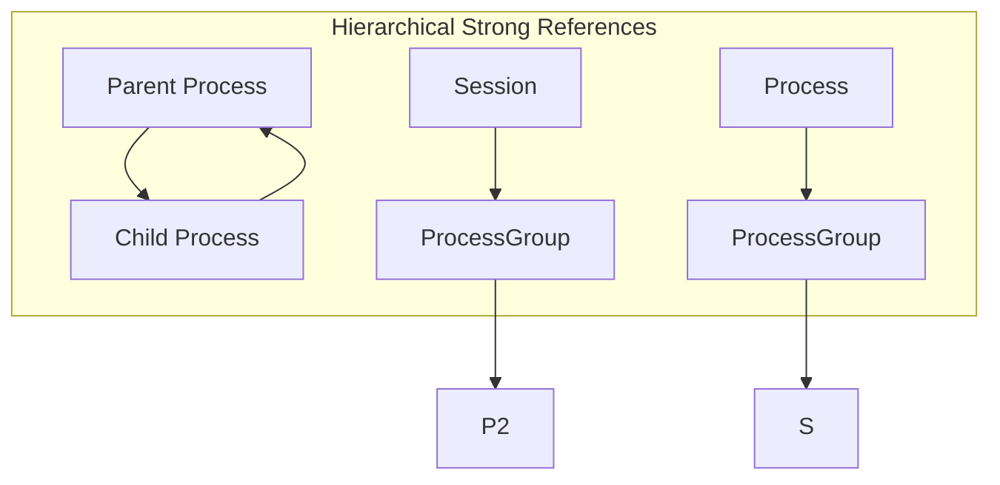
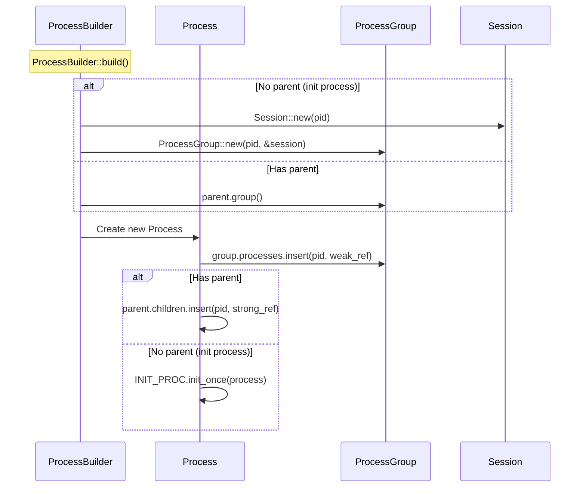
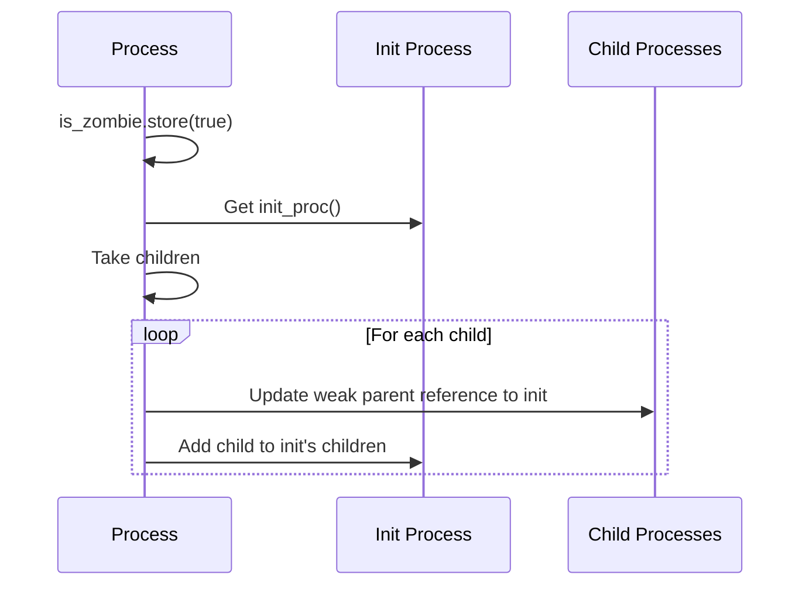

# Reference Counting and Ownership

> **Relevant source files**
> * [src/process.rs](https://github.com/Starry-OS/axprocess/blob/57d44806/src/process.rs)
> * [src/process_group.rs](https://github.com/Starry-OS/axprocess/blob/57d44806/src/process_group.rs)
> * [src/session.rs](https://github.com/Starry-OS/axprocess/blob/57d44806/src/session.rs)

This document explains how the axprocess crate implements memory management through Rust's reference counting mechanisms. It details the ownership patterns between system components (Sessions, ProcessGroups, Processes, and Threads) and how they prevent memory leaks while maintaining proper object lifetimes.

For information about cleanup of terminated processes, see [Zombie Processes and Cleanup](/Starry-OS/axprocess/5.2-zombie-processes-and-cleanup).

## Reference Counting Fundamentals

The axprocess crate relies on Rust's smart pointers to manage memory and object lifetimes:

* **Arc (Atomic Reference Counting)**: Provides shared ownership of a value with thread-safe reference counting
* **Weak**: A non-owning reference that doesn't prevent deallocation when all Arc references are dropped

This approach avoids both manual memory management and garbage collection, guaranteeing memory safety while maintaining predictable resource cleanup.



**Diagram: Reference Counting Basics**

Sources: [src/process.rs(L1 - L4)&emsp;](https://github.com/Starry-OS/axprocess/blob/57d44806/src/process.rs#L1-L4)

## Ownership Hierarchy in axprocess

The axprocess system employs a careful hierarchy of strong and weak references to maintain proper component ownership while preventing reference cycles.



**Diagram: Reference Relationships Between Components**

Sources: [src/process.rs(L35 - L47)&emsp;](https://github.com/Starry-OS/axprocess/blob/57d44806/src/process.rs#L35-L47) [src/process_group.rs(L13 - L17)&emsp;](https://github.com/Starry-OS/axprocess/blob/57d44806/src/process_group.rs#L13-L17) [src/session.rs(L13 - L17)&emsp;](https://github.com/Starry-OS/axprocess/blob/57d44806/src/session.rs#L13-L17)

## Reference Direction Strategy

The system uses a deliberate pattern for determining which direction uses strong vs. weak references:

### Upward Strong References

Components hold strong references (`Arc`) to their "container" components:

* Processes strongly reference their ProcessGroup
* ProcessGroups strongly reference their Session

This ensures container components remain alive as long as any child component needs them.

### Downward Weak References

Container components hold weak references to their "members":

* Sessions weakly reference their ProcessGroups
* ProcessGroups weakly reference their Processes
* ThreadGroups weakly reference their Threads

This prevents reference cycles while allowing containers to access their members.

### Hierarchical Strong References

Processes hold strong references to their children, ensuring child processes remain valid while the parent exists. This reflects the parent-child ownership model where parents are responsible for their children's lifecycle.



**Diagram: Reference Direction Strategy**

Sources: [src/process.rs(L43 - L46)&emsp;](https://github.com/Starry-OS/axprocess/blob/57d44806/src/process.rs#L43-L46) [src/process_group.rs(L14 - L16)&emsp;](https://github.com/Starry-OS/axprocess/blob/57d44806/src/process_group.rs#L14-L16) [src/session.rs(L14 - L15)&emsp;](https://github.com/Starry-OS/axprocess/blob/57d44806/src/session.rs#L14-L15)

## Implementation Details

### Process Ownership

The `Process` struct maintains:

* Strong references to children in a `StrongMap`
* Weak reference to its parent
* Strong reference to its ProcessGroup

```css
Process {
    children: SpinNoIrq<StrongMap<Pid, Arc<Process>>>,
    parent: SpinNoIrq<Weak<Process>>,
    group: SpinNoIrq<Arc<ProcessGroup>>,
}
```

Sources: [src/process.rs(L43 - L46)&emsp;](https://github.com/Starry-OS/axprocess/blob/57d44806/src/process.rs#L43-L46)

### ProcessGroup Ownership

The `ProcessGroup` struct maintains:

* Strong reference to its Session
* Weak references to its member Processes

```css
ProcessGroup {
    session: Arc<Session>,
    processes: SpinNoIrq<WeakMap<Pid, Weak<Process>>>,
}
```

Sources: [src/process_group.rs(L14 - L16)&emsp;](https://github.com/Starry-OS/axprocess/blob/57d44806/src/process_group.rs#L14-L16)

### Session Ownership

The `Session` struct maintains:

* Weak references to its member ProcessGroups

```css
Session {
    process_groups: SpinNoIrq<WeakMap<Pid, Weak<ProcessGroup>>>,
}
```

Sources: [src/session.rs(L14 - L15)&emsp;](https://github.com/Starry-OS/axprocess/blob/57d44806/src/session.rs#L14-L15)

## Reference Management During Object Creation

When creating objects, the system carefully establishes the appropriate references:

1. When a `Process` is created:

* It acquires a strong reference to its ProcessGroup
* The ProcessGroup stores a weak reference back to the Process
* If it has a parent, the parent stores a strong reference to it
* It stores a weak reference to its parent
2. When a `ProcessGroup` is created:

* It acquires a strong reference to its Session
* The Session stores a weak reference back to the ProcessGroup



**Diagram: Reference Setup During Process Creation**

Sources: [src/process.rs(L302 - L331)&emsp;](https://github.com/Starry-OS/axprocess/blob/57d44806/src/process.rs#L302-L331) [src/process_group.rs(L21 - L28)&emsp;](https://github.com/Starry-OS/axprocess/blob/57d44806/src/process_group.rs#L21-L28) [src/session.rs(L20 - L26)&emsp;](https://github.com/Starry-OS/axprocess/blob/57d44806/src/session.rs#L20-L26)

## Reference Management During Process Termination

When a Process exits:

1. It is marked as a zombie
2. Its children are re-parented to the init process
3. The children update their weak parent reference to point to the init process
4. The init process takes strong ownership of the children



**Diagram: Reference Management During Process Exit**

Sources: [src/process.rs(L207 - L225)&emsp;](https://github.com/Starry-OS/axprocess/blob/57d44806/src/process.rs#L207-L225)

## Memory Safety Considerations

The reference counting design in axprocess provides several safety guarantees:

|Safety Feature|Implementation|Benefit|
| --- | --- | --- |
|No reference cycles|Strategic use of weak references|Prevents memory leaks|
|Component lifetime guarantees|Upward strong references|Components can't be deallocated while in use|
|Clean resource release|Weak references in containers|Enables efficient cleanup without dangling pointers|
|Automatic cleanup|Arc drop semantics|Resources are freed when no longer needed|
|Thread safety|Arc's atomic reference counting|Safe to use across threads|

Sources: [src/process.rs(L35 - L47)&emsp;](https://github.com/Starry-OS/axprocess/blob/57d44806/src/process.rs#L35-L47) [src/process_group.rs(L13 - L17)&emsp;](https://github.com/Starry-OS/axprocess/blob/57d44806/src/process_group.rs#L13-L17) [src/session.rs(L13 - L17)&emsp;](https://github.com/Starry-OS/axprocess/blob/57d44806/src/session.rs#L13-L17)

## Practical Example: Process Lifecycle References

Let's trace the reference management during a process's lifecycle:

1. Process creation:

* Parent process creates a child using `fork()` and `ProcessBuilder::build()`
* Child gets a strong reference to parent's process group
* Parent stores a strong reference to child
* Child stores a weak reference to parent
2. Process execution:

* Process maintains its references throughout execution
3. Process termination:

* Process calls `exit()` and is marked as zombie
* Child processes are re-parented to init
* Parent process eventually calls `free()` to remove its strong reference
* When all strong references are gone, process is deallocated

Sources: [src/process.rs(L207 - L236)&emsp;](https://github.com/Starry-OS/axprocess/blob/57d44806/src/process.rs#L207-L236) [src/process.rs(L275 - L331)&emsp;](https://github.com/Starry-OS/axprocess/blob/57d44806/src/process.rs#L275-L331)

## Utility Functions for Reference Management

The codebase provides several methods to manage references between components:

|Method|Purpose|Reference Type|
| --- | --- | --- |
|Process::parent()|Get parent process|Weak → Strong conversion|
|Process::children()|Get child processes|Strong references|
|Process::group()|Get process group|Strong reference|
|ProcessGroup::session()|Get session|Strong reference|
|ProcessGroup::processes()|Get member processes|Weak → Strong conversion|
|Session::process_groups()|Get process groups|Weak → Strong conversion|

Sources: [src/process.rs(L73 - L80)&emsp;](https://github.com/Starry-OS/axprocess/blob/57d44806/src/process.rs#L73-L80) [src/process.rs(L86 - L88)&emsp;](https://github.com/Starry-OS/axprocess/blob/57d44806/src/process.rs#L86-L88) [src/process_group.rs(L33 - L46)&emsp;](https://github.com/Starry-OS/axprocess/blob/57d44806/src/process_group.rs#L33-L46) [src/session.rs(L30 - L38)&emsp;](https://github.com/Starry-OS/axprocess/blob/57d44806/src/session.rs#L30-L38)

## Conclusion

The reference counting and ownership model in axprocess provides a robust foundation for memory management by:

1. Using strong references strategically to ensure components remain alive as needed
2. Using weak references to prevent reference cycles
3. Following a consistent pattern of upward strong references and downward weak references
4. Maintaining proper parent-child relationships through appropriate reference types

This approach leverages Rust's ownership model to provide memory safety without garbage collection, ensuring efficient and predictable resource management.