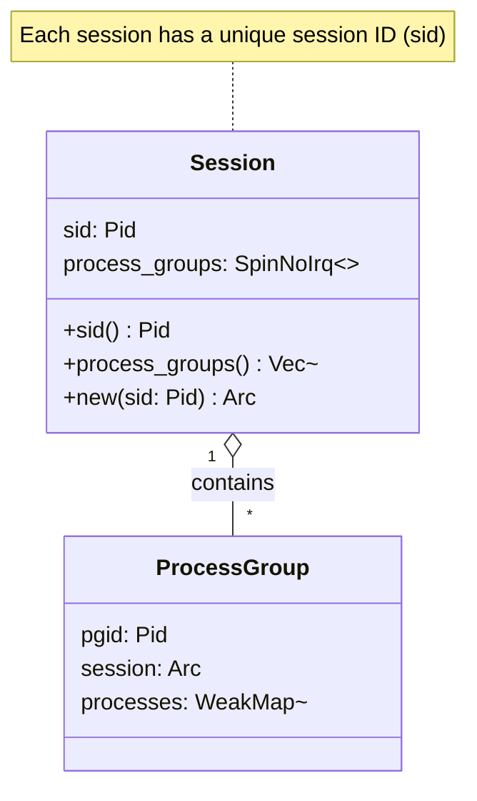
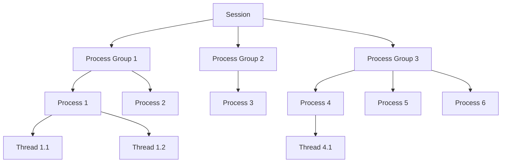
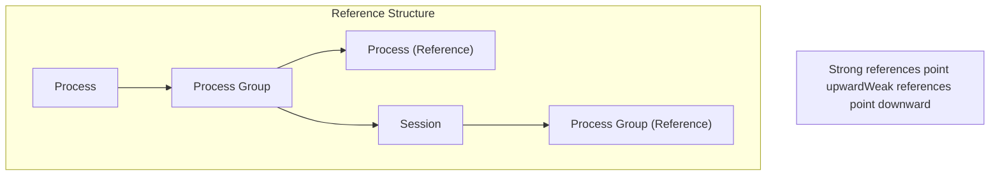
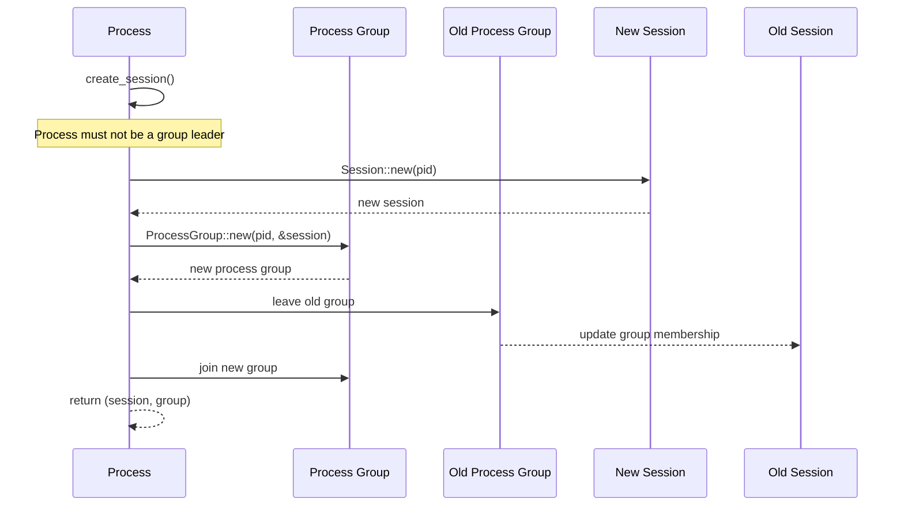
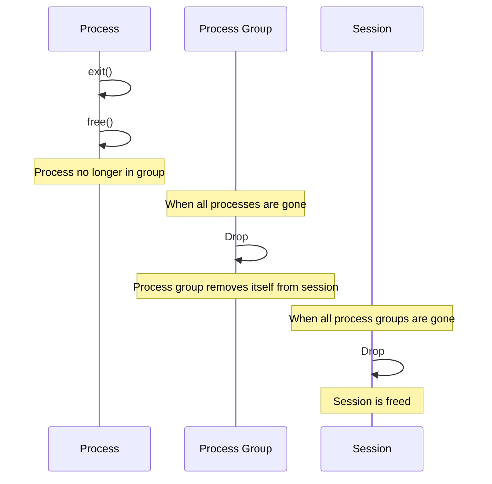

# Sessions

> **Relevant source files**
> * [src/session.rs](https://github.com/Starry-OS/axprocess/blob/57d44806/src/session.rs)
> * [tests/session.rs](https://github.com/Starry-OS/axprocess/blob/57d44806/tests/session.rs)

## Purpose and Scope

This document explains the concept of Sessions in the axprocess codebase. A Session represents a collection of [Process Groups](/Starry-OS/axprocess/3.1-process-groups) and forms the top level of the process hierarchy. Each process belongs to exactly one process group, and each process group belongs to exactly one session.

The session abstraction is inspired by Unix-like operating systems, where sessions are typically used to manage groups of related processes, such as those associated with a terminal login session.

Sources: [src/session.rs(L12 - L17)&emsp;](https://github.com/Starry-OS/axprocess/blob/57d44806/src/session.rs#L12-L17)

## Session Structure

A Session in axprocess is a simple structure that maintains a collection of process groups:



The `Session` struct contains:

* `sid`: A unique session ID (of type `Pid`)
* `process_groups`: A thread-safe weak map that links process group IDs to weak references of process groups

Sessions use weak references to their process groups to avoid reference cycles, as process groups hold strong references to their sessions.

Sources: [src/session.rs(L12 - L17)&emsp;](https://github.com/Starry-OS/axprocess/blob/57d44806/src/session.rs#L12-L17) [src/session.rs(L19 - L26)&emsp;](https://github.com/Starry-OS/axprocess/blob/57d44806/src/session.rs#L19-L26)

## Session Hierarchy

Sessions form the top level of the process management hierarchy in axprocess. Each element in the hierarchy has specific relationships with others:



This hierarchical structure allows for logical grouping of related processes and simplifies operations that need to be performed on sets of processes.

Sources: [src/session.rs(L12 - L17)&emsp;](https://github.com/Starry-OS/axprocess/blob/57d44806/src/session.rs#L12-L17) [tests/session.rs(L9 - L19)&emsp;](https://github.com/Starry-OS/axprocess/blob/57d44806/tests/session.rs#L9-L19)

## Memory Management

The session implementation uses a careful reference counting approach to prevent memory leaks and ensure proper cleanup:



Key aspects of memory management for sessions:

* Processes hold strong references to their process groups
* Process groups hold strong references to their sessions
* Sessions hold weak references to their process groups
* This prevents circular references while ensuring objects stay alive as needed

When all processes in a process group are freed, the process group is dropped, and when all process groups in a session are dropped, the session is freed.

Sources: [src/session.rs(L15)&emsp;](https://github.com/Starry-OS/axprocess/blob/57d44806/src/session.rs#L15-L15) [tests/session.rs(L51 - L64)&emsp;](https://github.com/Starry-OS/axprocess/blob/57d44806/tests/session.rs#L51-L64)

## Session Creation and Management

### Creation

A session is created when a process calls `create_session()`. The process becomes the leader of both the new session and a new process group:



The process must not already be a group leader to create a new session. This is enforced at runtime.

Sources: [src/session.rs(L19 - L26)&emsp;](https://github.com/Starry-OS/axprocess/blob/57d44806/src/session.rs#L19-L26) [tests/session.rs(L21 - L44)&emsp;](https://github.com/Starry-OS/axprocess/blob/57d44806/tests/session.rs#L21-L44) [tests/session.rs(L47 - L49)&emsp;](https://github.com/Starry-OS/axprocess/blob/57d44806/tests/session.rs#L47-L49)

### Session Management

Sessions provide methods to access their properties and process groups:

* `sid()`: Returns the session ID
* `process_groups()`: Returns all process groups that belong to this session

A process cannot move to a process group that belongs to a different session:

```

```

Sources: [src/session.rs(L29 - L39)&emsp;](https://github.com/Starry-OS/axprocess/blob/57d44806/src/session.rs#L29-L39) [tests/session.rs(L86 - L96)&emsp;](https://github.com/Starry-OS/axprocess/blob/57d44806/tests/session.rs#L86-L96)

### Cleanup

When all processes in a session exit and are freed, the session's process groups will be empty, and eventually, the session itself will be cleaned up through Rust's reference counting mechanism:



Sources: [tests/session.rs(L51 - L64)&emsp;](https://github.com/Starry-OS/axprocess/blob/57d44806/tests/session.rs#L51-L64) [tests/session.rs(L99 - L108)&emsp;](https://github.com/Starry-OS/axprocess/blob/57d44806/tests/session.rs#L99-L108)

## Practical Examples

### Basic Session Structure

The initial process (init) automatically creates a session and process group:

```javascript
let init = init_proc();
let group = init.group();
let session = group.session();

// The group and session IDs match the init process ID
assert_eq!(group.pgid(), init.pid());
assert_eq!(session.sid(), init.pid());
```

Sources: [tests/session.rs(L9 - L19)&emsp;](https://github.com/Starry-OS/axprocess/blob/57d44806/tests/session.rs#L9-L19)

### Creating a New Session

A child process can create its own session:

```javascript
let parent = init_proc();
let child = parent.new_child();
let (child_session, child_group) = child.create_session().unwrap();

// The child becomes the leader of both the new session and group
assert_eq!(child_group.pgid(), child.pid());
assert_eq!(child_session.sid(), child.pid());
```

Sources: [tests/session.rs(L21 - L44)&emsp;](https://github.com/Starry-OS/axprocess/blob/57d44806/tests/session.rs#L21-L44)

## Implementation Details

The `Session` struct is implemented in [src/session.rs](https://github.com/Starry-OS/axprocess/blob/57d44806/src/session.rs) with these key methods:

* `fn new(sid: Pid) -> Arc<Self>`: Creates a new session with the given session ID
* `fn sid(&self) -> Pid`: Returns the session ID
* `fn process_groups(&self) -> Vec<Arc<ProcessGroup>>`: Returns all process groups in this session

The implementation uses `SpinNoIrq` locks for thread safety and concurrent access to session data.

Sources: [src/session.rs(L19 - L39)&emsp;](https://github.com/Starry-OS/axprocess/blob/57d44806/src/session.rs#L19-L39)

## Related Topics

For more information about how process groups interact with sessions, see [Process Groups](/Starry-OS/axprocess/3.1-process-groups).

For details on how processes move between groups and the hierarchical relationship between sessions, groups, and processes, see [Hierarchy and Movement](/Starry-OS/axprocess/3.3-hierarchy-and-movement).