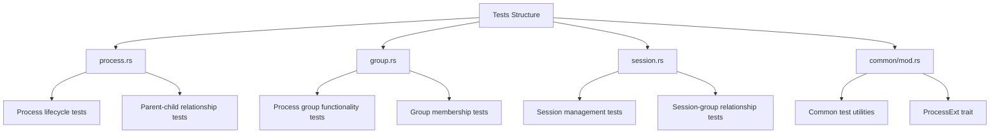
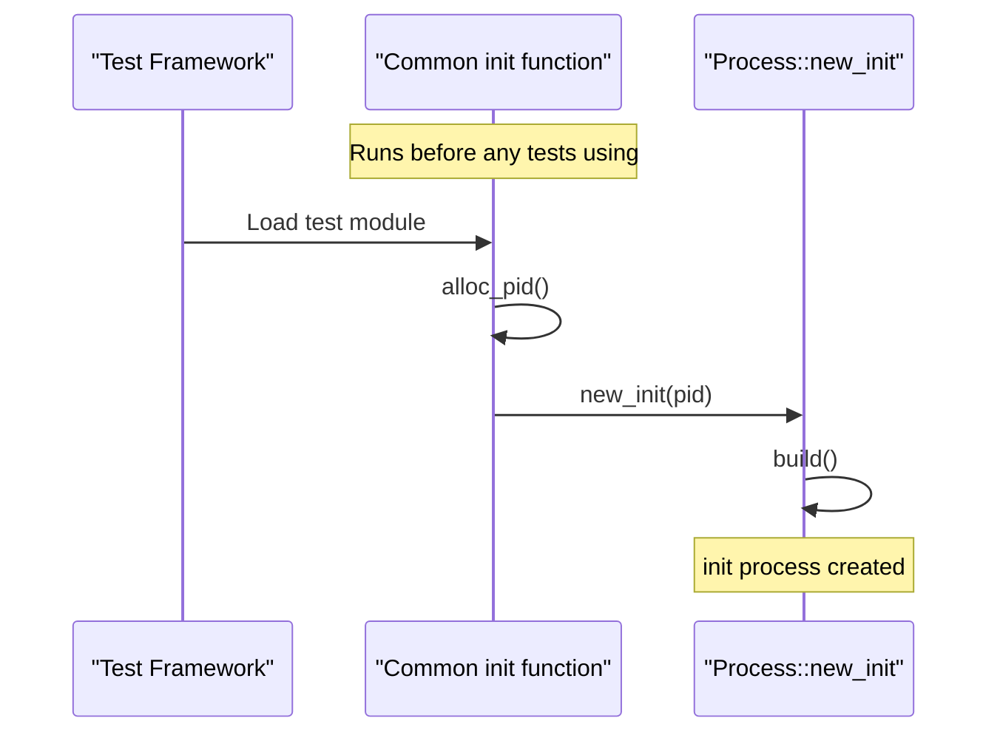
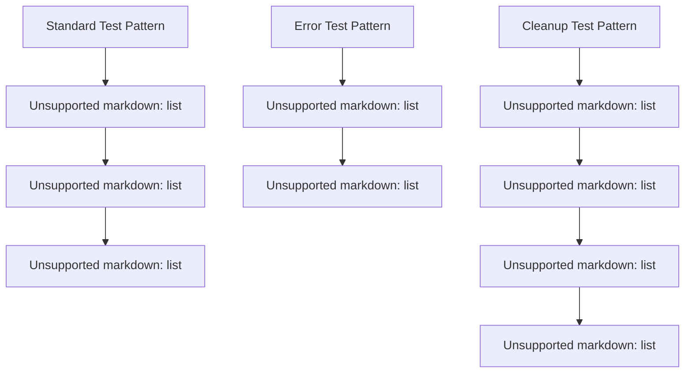
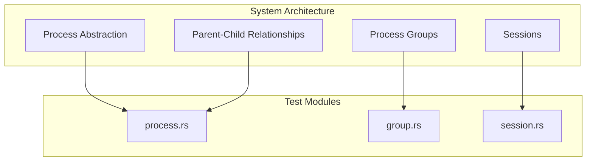

# Testing Approach

> **Relevant source files**
> * [tests/common/mod.rs](https://github.com/Starry-OS/axprocess/blob/57d44806/tests/common/mod.rs)
> * [tests/group.rs](https://github.com/Starry-OS/axprocess/blob/57d44806/tests/group.rs)
> * [tests/process.rs](https://github.com/Starry-OS/axprocess/blob/57d44806/tests/process.rs)
> * [tests/session.rs](https://github.com/Starry-OS/axprocess/blob/57d44806/tests/session.rs)

This document outlines the testing methodology used for the axprocess crate, focusing on how process management components are tested within the system. The axprocess crate leverages Rust's built-in testing framework to ensure proper functionality of process, process group, and session abstractions.

## Test Organization

The test suite is organized into multiple files, each focused on testing specific subsystems:



Sources: [tests/process.rs](https://github.com/Starry-OS/axprocess/blob/57d44806/tests/process.rs) [tests/group.rs](https://github.com/Starry-OS/axprocess/blob/57d44806/tests/group.rs) [tests/session.rs](https://github.com/Starry-OS/axprocess/blob/57d44806/tests/session.rs) [tests/common/mod.rs](https://github.com/Starry-OS/axprocess/blob/57d44806/tests/common/mod.rs)

## Testing Infrastructure

### Test Initialization

The axprocess tests utilize a common initialization mechanism that runs before any tests:



The `ctor` crate is used to automatically initialize the test environment by creating an initial process before any tests run:

Sources: [tests/common/mod.rs(L15 - L18)&emsp;](https://github.com/Starry-OS/axprocess/blob/57d44806/tests/common/mod.rs#L15-L18)

### PID Allocation

Tests use a simple atomic counter to allocate unique process IDs:

```rust
static PID: AtomicU32 = AtomicU32::new(0);

fn alloc_pid() -> u32 {
    PID.fetch_add(1, Ordering::SeqCst)
}
```

This ensures that each test process receives a unique PID without conflicts.

Sources: [tests/common/mod.rs(L9 - L13)&emsp;](https://github.com/Starry-OS/axprocess/blob/57d44806/tests/common/mod.rs#L9-L13)

### ProcessExt Trait

To simplify test code, a `ProcessExt` trait provides helper methods for common operations:

```rust
pub trait ProcessExt {
    fn new_child(&self) -> Self;
}

impl ProcessExt for Arc<Process> {
    fn new_child(&self) -> Self {
        self.fork(alloc_pid()).build()
    }
}
```

This extension trait makes test code more concise by providing shortcuts for creating child processes.

Sources: [tests/common/mod.rs(L20 - L28)&emsp;](https://github.com/Starry-OS/axprocess/blob/57d44806/tests/common/mod.rs#L20-L28)

## Test Categories

### Process Lifecycle Tests

These tests verify the fundamental process management capabilities:

|Test Name|Purpose|
| --- | --- |
|child|Verifies parent-child relationship creation|
|exit|Tests process termination and zombie state transition|
|free_not_zombie|Verifies that freeing non-zombie processes causes panic|
|init_proc_exit|Ensures init process cannot be terminated|
|free|Tests resource cleanup after process termination|
|reap|Verifies orphan handling when parent processes exit|

Example test verifying process exit:

```javascript
#[test]
fn exit() {
    let parent = init_proc();
    let child = parent.new_child();
    child.exit();
    assert!(child.is_zombie());
    assert!(parent.children().iter().any(|c| Arc::ptr_eq(c, &child)));
}
```

Sources: [tests/process.rs(L8 - L55)&emsp;](https://github.com/Starry-OS/axprocess/blob/57d44806/tests/process.rs#L8-L55)

### Process Group Tests

Tests in this category verify process group functionality:

|Test Name|Purpose|
| --- | --- |
|basic|Tests basic process group properties|
|create|Verifies process group creation|
|create_leader|Tests group leader constraints|
|cleanup|Verifies resource cleanup|
|inherit|Tests group inheritance by child processes|
|move_to|Tests moving processes between groups|
|move_cleanup|Verifies empty group cleanup|
|move_back|Tests moving processes back to previous groups|
|cleanup_processes|Tests group cleanup after processes exit|

Sources: [tests/group.rs(L8 - L141)&emsp;](https://github.com/Starry-OS/axprocess/blob/57d44806/tests/group.rs#L8-L141)

### Session Tests

These tests verify session functionality:

|Test Name|Purpose|
| --- | --- |
|basic|Tests basic session properties|
|create|Verifies session creation|
|create_leader|Tests session leader constraints|
|cleanup|Verifies resource cleanup|
|create_group|Tests group creation within a session|
|move_to_different_session|Verifies cross-session move constraints|
|cleanup_groups|Tests session cleanup after groups disappear|

Sources: [tests/session.rs(L8 - L108)&emsp;](https://github.com/Starry-OS/axprocess/blob/57d44806/tests/session.rs#L8-L108)

## Test Method Patterns

The axprocess test suite follows several patterns:



Sources: [tests/process.rs](https://github.com/Starry-OS/axprocess/blob/57d44806/tests/process.rs) [tests/group.rs](https://github.com/Starry-OS/axprocess/blob/57d44806/tests/group.rs) [tests/session.rs](https://github.com/Starry-OS/axprocess/blob/57d44806/tests/session.rs)

### Standard Tests

Most tests follow a structure of:

1. Initialize the test environment (create necessary processes)
2. Perform the operation being tested
3. Assert the expected outcomes using `assert!` or similar functions

Example from group.rs:

```javascript
#[test]
fn basic() {
    let init = init_proc();
    let group = init.group();
    assert_eq!(group.pgid(), init.pid());
    
    let child = init.new_child();
    assert!(Arc::ptr_eq(&group, &child.group()));
    
    let processes = group.processes();
    assert!(processes.iter().any(|p| Arc::ptr_eq(p, &init)));
    assert!(processes.iter().any(|p| Arc::ptr_eq(p, &child)));
}
```

Sources: [tests/group.rs(L8 - L20)&emsp;](https://github.com/Starry-OS/axprocess/blob/57d44806/tests/group.rs#L8-L20)

### Error Tests

Tests that verify error handling use the `#[should_panic]` attribute:

```rust
#[test]
#[should_panic]
fn free_not_zombie() {
    init_proc().new_child().free();
}
```

This verifies that attempting to free a non-zombie process triggers a panic as expected.

Sources: [tests/process.rs(L25 - L29)&emsp;](https://github.com/Starry-OS/axprocess/blob/57d44806/tests/process.rs#L25-L29)

### Resource Cleanup Tests

Tests that verify proper resource cleanup often use weak references to ensure resources are properly deallocated:

```javascript
#[test]
fn cleanup() {
    let child = init_proc().new_child();
    
    let group = Arc::downgrade(&child.create_group().unwrap());
    assert!(group.upgrade().is_some());
    
    child.exit();
    child.free();
    drop(child);
    assert!(group.upgrade().is_none());
}
```

Sources: [tests/group.rs(L54 - L65)&emsp;](https://github.com/Starry-OS/axprocess/blob/57d44806/tests/group.rs#L54-L65)

## Running the Tests

Tests can be run using the standard Cargo test command:

```
cargo test
```

For more specific subsets of tests:

```markdown
cargo test --test process  # Run only process tests
cargo test --test group    # Run only group tests
cargo test --test session  # Run only session tests
```

## Relationship to System Architecture

The testing approach directly mirrors the core architecture of the axprocess system:



This one-to-one mapping between system components and test modules ensures comprehensive test coverage.

Sources: [tests/process.rs](https://github.com/Starry-OS/axprocess/blob/57d44806/tests/process.rs) [tests/group.rs](https://github.com/Starry-OS/axprocess/blob/57d44806/tests/group.rs) [tests/session.rs](https://github.com/Starry-OS/axprocess/blob/57d44806/tests/session.rs)

## Best Practices for Adding Tests

Based on the existing test patterns, here are the best practices for adding new tests to the axprocess crate:

1. **Use the common utilities**: Leverage the `ProcessExt` trait and other utilities in `common/mod.rs`
2. **Follow the established patterns**: Maintain consistency with existing test structure
3. **Test one behavior per test**: Each test should focus on a specific functionality
4. **Test both success and failure paths**: Add `#[should_panic]` tests for error conditions
5. **Verify resource cleanup**: Use weak references to verify proper resource deallocation
6. **Maintain independence**: Tests should not depend on each other's state

By following these practices, new tests will integrate well with the existing test suite and maintain test quality.