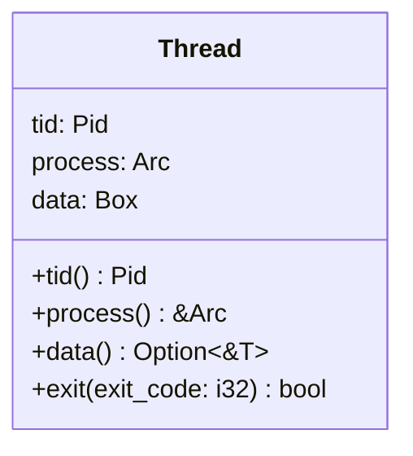
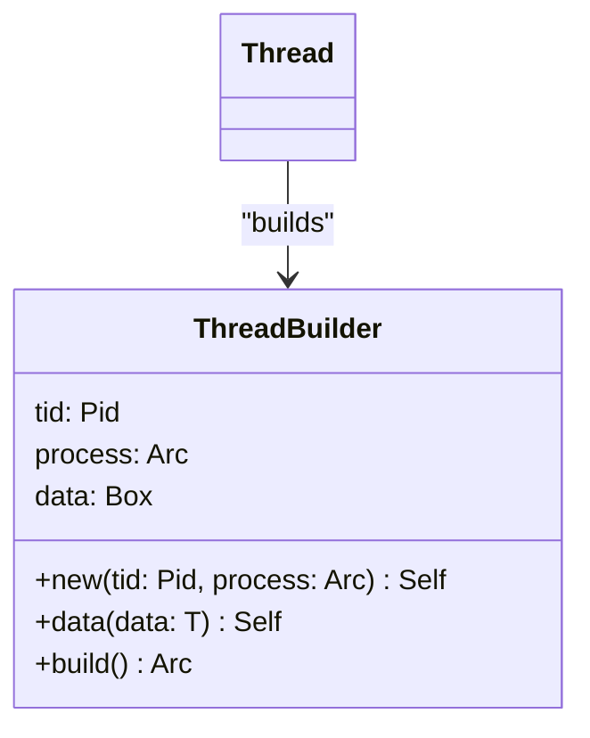
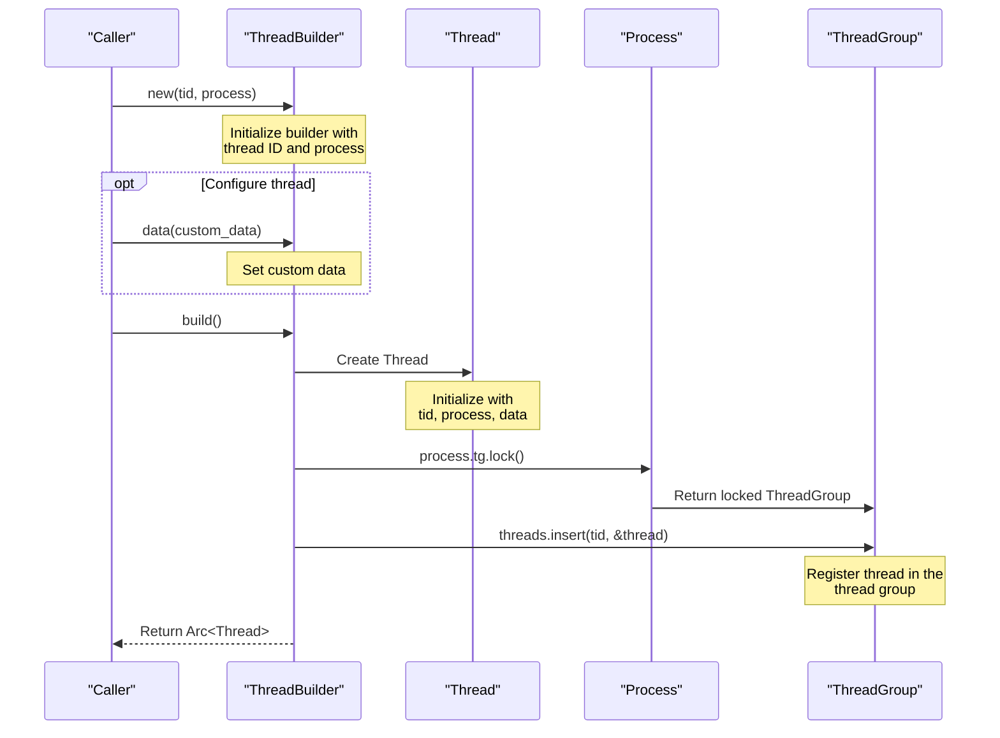
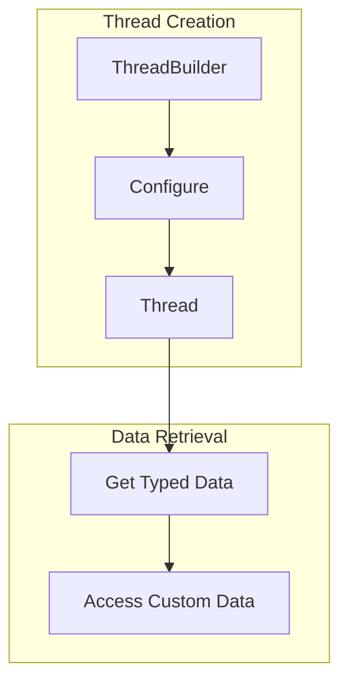
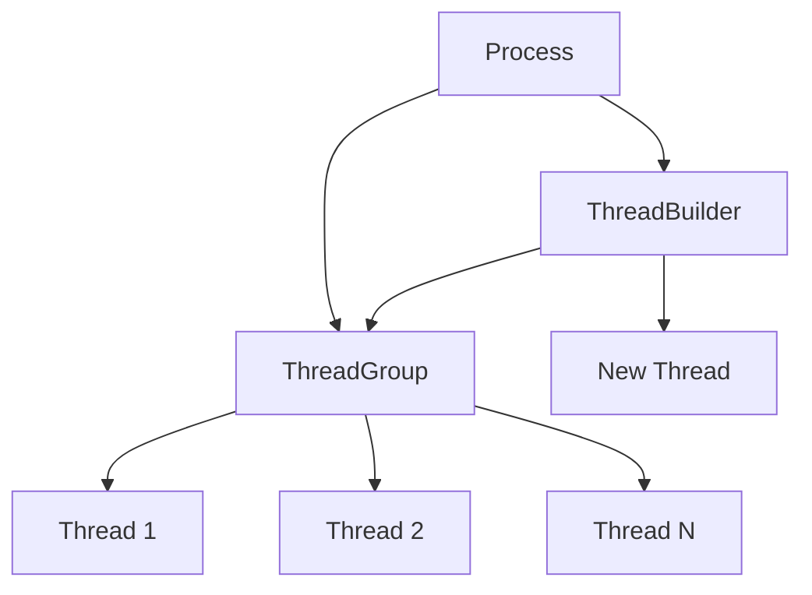
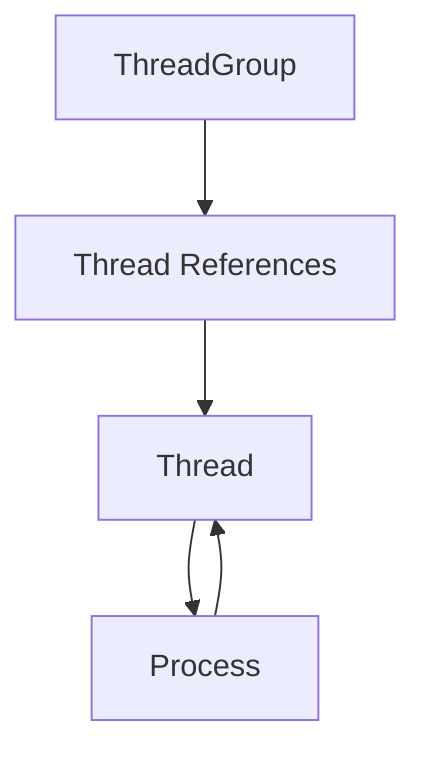

# Thread Creation and Builder

> **Relevant source files**
> * [src/thread.rs](https://github.com/Starry-OS/axprocess/blob/57d44806/src/thread.rs)

## Purpose and Scope

This document explains the thread creation process and the ThreadBuilder pattern in axprocess. It covers how new threads are instantiated, configured, and registered with their parent processes. For information about the thread lifecycle and exit procedures, see [Thread Lifecycle and Exit](/Starry-OS/axprocess/4.2-thread-lifecycle-and-exit).

## Thread Structure

In axprocess, a thread is represented by the `Thread` struct, which contains the following key components:

|Field|Type|Description|
| --- | --- | --- |
|tid|Pid|Unique thread identifier|
|process|Arc<Process>|Reference to the process that owns the thread|
|data|Box<dyn Any + Send + Sync>|Custom data associated with the thread|

The `Thread` struct provides methods to access its properties and manage its lifecycle:

Sources: [src/thread.rs(L6 - L40)&emsp;](https://github.com/Starry-OS/axprocess/blob/57d44806/src/thread.rs#L6-L40)

## ThreadBuilder Pattern

Thread creation follows the builder pattern through the `ThreadBuilder` struct. This pattern allows for flexible configuration before final construction.

The ThreadBuilder provides a clean interface for configuring a thread before its construction:

1. Instantiate the builder with a thread ID and process reference
2. Optionally set custom data
3. Build the thread, which registers it with the process's thread group

Sources: [src/thread.rs(L51 - L88)&emsp;](https://github.com/Starry-OS/axprocess/blob/57d44806/src/thread.rs#L51-L88)

## Thread Creation Flow

The thread creation process involves several steps from initialization to registration with the thread group:

Sources: [src/thread.rs(L59 - L87)&emsp;](https://github.com/Starry-OS/axprocess/blob/57d44806/src/thread.rs#L59-L87)

## ThreadBuilder API

The ThreadBuilder API provides the following methods:

1. `new(tid: Pid, process: Arc<Process>)` - Creates a new ThreadBuilder with the specified thread ID and process
2. `data<T: Any + Send + Sync>(data: T)` - Associates custom data with the thread
3. `build()` - Constructs the Thread and registers it with the process's thread group

### Thread Construction

When `build()` is called, the ThreadBuilder performs these steps:

1. Creates a new `Thread` instance with the configured parameters
2. Wraps the thread in an `Arc` for shared ownership
3. Registers the thread with the process's thread group
4. Returns the `Arc<Thread>` to the caller

Sources: [src/thread.rs(L76 - L87)&emsp;](https://github.com/Starry-OS/axprocess/blob/57d44806/src/thread.rs#L76-L87)

## Thread Data Management

The `data` field in both `Thread` and `ThreadBuilder` uses Rust's `Any` trait to allow storing any type that is `Send` and `Sync`. This enables the thread to associate arbitrary data types with itself.

The `data<T>()` method on `Thread` allows retrieving this custom data as a specific type by using the `downcast_ref` method provided by the `Any` trait.

Sources: [src/thread.rs(L25 - L27)&emsp;](https://github.com/Starry-OS/axprocess/blob/57d44806/src/thread.rs#L25-L27) [src/thread.rs(L68 - L73)&emsp;](https://github.com/Starry-OS/axprocess/blob/57d44806/src/thread.rs#L68-L73)

## Integration with Process and Thread Group

Threads are managed within a Process through a ThreadGroup:

When a thread is created using `ThreadBuilder.build()`, it is automatically registered with its process's thread group (stored in the `tg` field of the `Process` struct). This registration happens by inserting the thread's ID and a reference to the thread into the thread group's threads collection.

Sources: [src/thread.rs(L84)&emsp;](https://github.com/Starry-OS/axprocess/blob/57d44806/src/thread.rs#L84-L84)

## Thread Identity and Ownership

Each thread has a unique thread ID (`tid`), which is a `Pid` type. The thread maintains a strong reference (`Arc`) to its parent process, establishing a clear ownership relationship:

This reference pattern ensures:

1. A thread cannot outlive its process
2. Processes can track their threads without creating reference cycles
3. Thread cleanup can occur properly when a thread exits

Sources: [src/thread.rs(L7 - L11)&emsp;](https://github.com/Starry-OS/axprocess/blob/57d44806/src/thread.rs#L7-L11) [src/thread.rs(L19 - L22)&emsp;](https://github.com/Starry-OS/axprocess/blob/57d44806/src/thread.rs#L19-L22)