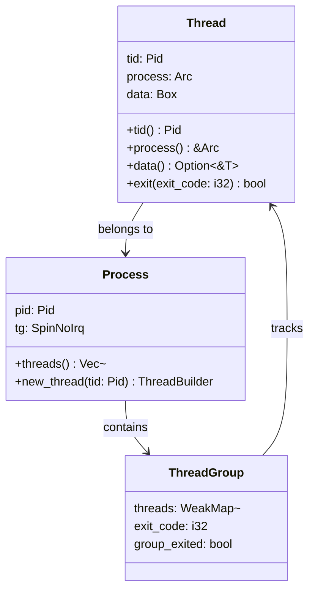
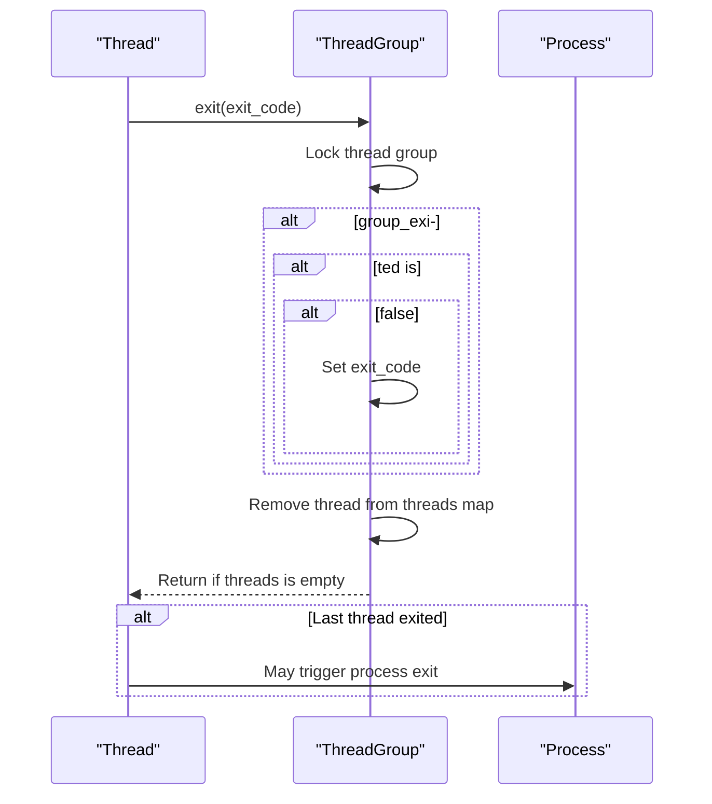
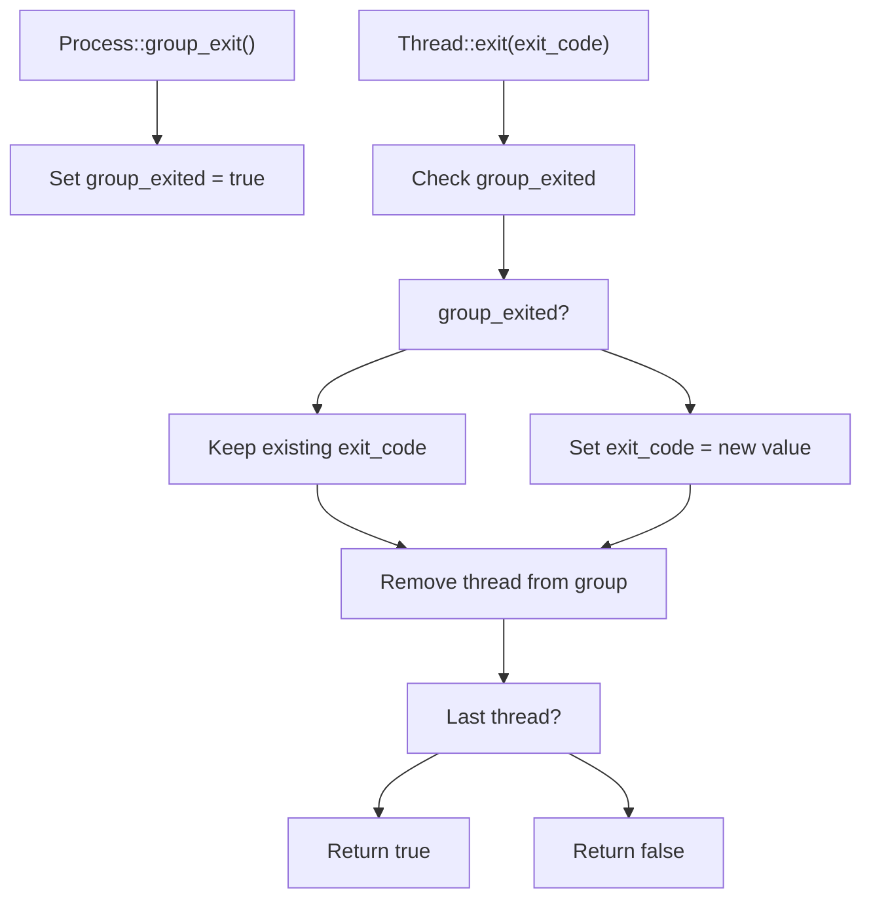
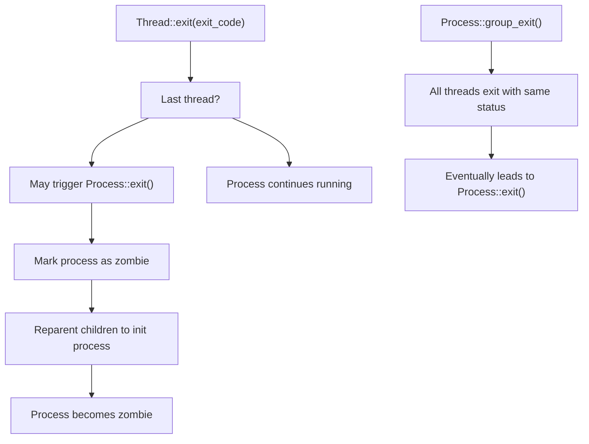
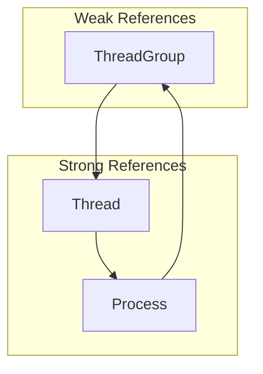

# Thread Lifecycle and Exit

> **Relevant source files**
> * [src/process.rs](https://github.com/Starry-OS/axprocess/blob/57d44806/src/process.rs)
> * [src/thread.rs](https://github.com/Starry-OS/axprocess/blob/57d44806/src/thread.rs)

## Purpose and Scope

This document explains the lifecycle of threads within the axprocess system, focusing on thread creation, execution, and termination processes. It details how threads are managed within processes and the impact of thread exit on the overall process lifecycle. For information about thread creation specifically, see [Thread Creation and Builder](/Starry-OS/axprocess/4.1-thread-creation-and-builder).

## Thread Structure and Components

In the axprocess system, a thread represents an execution context within a process. Each thread has its own identity and data but operates within the context of its parent process.



Thread-to-Process Relationship Diagram

Sources: [src/thread.rs(L7 - L27)&emsp;](https://github.com/Starry-OS/axprocess/blob/57d44806/src/thread.rs#L7-L27) [src/process.rs(L18 - L31)&emsp;](https://github.com/Starry-OS/axprocess/blob/57d44806/src/process.rs#L18-L31) [src/process.rs(L167 - L191)&emsp;](https://github.com/Starry-OS/axprocess/blob/57d44806/src/process.rs#L167-L191)

### Key Components

1. **Thread**: A single execution unit with its own thread ID (`tid`), a reference to its parent process, and associated data.
2. **ThreadGroup**: Manages all threads within a process, tracking:

* Active threads
* Exit code
* Group exit status
3. **Process**: Contains the thread group and provides methods for thread management.

Sources: [src/thread.rs(L7 - L27)&emsp;](https://github.com/Starry-OS/axprocess/blob/57d44806/src/thread.rs#L7-L27) [src/process.rs(L18 - L31)&emsp;](https://github.com/Starry-OS/axprocess/blob/57d44806/src/process.rs#L18-L31) [src/process.rs(L34 - L47)&emsp;](https://github.com/Starry-OS/axprocess/blob/57d44806/src/process.rs#L34-L47)

## Thread Lifecycle States

Threads in axprocess move through several distinct states throughout their existence:

```

```

Thread Lifecycle States Diagram

Sources: [src/thread.rs(L76 - L87)&emsp;](https://github.com/Starry-OS/axprocess/blob/57d44806/src/thread.rs#L76-L87) [src/thread.rs(L29 - L39)&emsp;](https://github.com/Starry-OS/axprocess/blob/57d44806/src/thread.rs#L29-L39)

### State Transitions

1. **Creation**: A thread is created using `ThreadBuilder::build()`, which:

* Creates a new `Thread` object with the specified parameters
* Adds the thread to the process's thread group
* Returns an `Arc<Thread>` for subsequent operations
2. **Running**: After creation, a thread is considered to be in the running state (though actual scheduling is handled outside axprocess)
3. **Exit**: When `Thread::exit(exit_code)` is called:

* The thread is removed from the thread group
* If this was not a group exit, the exit code is stored
* The method returns a boolean indicating if this was the last thread in the group

Sources: [src/thread.rs(L76 - L87)&emsp;](https://github.com/Starry-OS/axprocess/blob/57d44806/src/thread.rs#L76-L87) [src/thread.rs(L29 - L39)&emsp;](https://github.com/Starry-OS/axprocess/blob/57d44806/src/thread.rs#L29-L39)

## Thread Exit Process

When a thread exits, a specific sequence of operations occurs to handle cleanup and potential process termination:



Thread Exit Process Sequence Diagram

Sources: [src/thread.rs(L29 - L39)&emsp;](https://github.com/Starry-OS/axprocess/blob/57d44806/src/thread.rs#L29-L39) [src/process.rs(L195 - L225)&emsp;](https://github.com/Starry-OS/axprocess/blob/57d44806/src/process.rs#L195-L225)

### Exit Process Details

1. **Acquire Lock**: The thread acquires a lock on the process's thread group.
2. **Update Exit Code**: If the thread group hasn't already been marked as exited (through `group_exit()`), the exit code is updated with the provided value.
3. **Remove Thread**: The thread is removed from the thread group's thread map.
4. **Check Last Thread**: The method returns `true` if this thread was the last one in the group, which may trigger further actions:

```javascript
pub fn exit(&self, exit_code: i32) -> bool {
    let mut tg = self.process.tg.lock();
    if !tg.group_exited {
        tg.exit_code = exit_code;
    }
    tg.threads.remove(&self.tid);
    tg.threads.is_empty()
}
```
5. **Process Termination**: If the last thread exits, the caller is responsible for handling process termination if needed.

Sources: [src/thread.rs(L29 - L39)&emsp;](https://github.com/Starry-OS/axprocess/blob/57d44806/src/thread.rs#L29-L39)

## Group Exit Mechanism

The thread group can be marked for group exit, which affects how individual thread exits are handled:



Group Exit Mechanism Diagram

Sources: [src/process.rs(L179 - L186)&emsp;](https://github.com/Starry-OS/axprocess/blob/57d44806/src/process.rs#L179-L186) [src/thread.rs(L29 - L39)&emsp;](https://github.com/Starry-OS/axprocess/blob/57d44806/src/thread.rs#L29-L39)

### Group Exit Details

1. **Initiation**: A process can be marked for group exit by calling `Process::group_exit()`:

```rust
pub fn group_exit(&self) {
    self.tg.lock().group_exited = true;
}
```
2. **Effect on Threads**: When threads exit after group exit is set:

* The exit code from individual threads is ignored
* The previously set exit code (before group exit) is preserved
3. **Exit Status Preservation**: This mechanism allows the exit status to be fixed at a specific value regardless of how individual threads exit.

Sources: [src/process.rs(L179 - L186)&emsp;](https://github.com/Starry-OS/axprocess/blob/57d44806/src/process.rs#L179-L186) [src/thread.rs(L32 - L34)&emsp;](https://github.com/Starry-OS/axprocess/blob/57d44806/src/thread.rs#L32-L34)

## Impact on Process Lifecycle

Thread exits play a critical role in the process lifecycle:



Thread Exit Impact on Process Diagram

Sources: [src/thread.rs(L29 - L39)&emsp;](https://github.com/Starry-OS/axprocess/blob/57d44806/src/thread.rs#L29-L39) [src/process.rs(L195 - L225)&emsp;](https://github.com/Starry-OS/axprocess/blob/57d44806/src/process.rs#L195-L225)

### Key Considerations

1. **Last Thread Exit**: When the last thread exits, the process itself may need to exit, which is typically handled by the scheduler or executor.
2. **Zombie Process**: When a process exits, it becomes a zombie until its parent collects its exit status and frees it:

```rust
pub fn exit(self: &Arc<Self>) {
    // Check not init process
    // Mark as zombie
    self.is_zombie.store(true, Ordering::Release);
    // Reparent children to init process
    // Additional cleanup
}
```
3. **Resource Cleanup**:

* Thread resources are cleaned up when the thread is removed from the thread group
* Process resources are only fully cleaned up when the zombie process is freed

Sources: [src/process.rs(L195 - L236)&emsp;](https://github.com/Starry-OS/axprocess/blob/57d44806/src/process.rs#L195-L236)

## Memory Management and Reference Counting

The axprocess system employs careful memory management to ensure proper resource cleanup:



Reference Relationship Diagram

Sources: [src/thread.rs(L7 - L11)&emsp;](https://github.com/Starry-OS/axprocess/blob/57d44806/src/thread.rs#L7-L11) [src/process.rs(L18 - L22)&emsp;](https://github.com/Starry-OS/axprocess/blob/57d44806/src/process.rs#L18-L22) [src/thread.rs(L76 - L87)&emsp;](https://github.com/Starry-OS/axprocess/blob/57d44806/src/thread.rs#L76-L87)

### Key Memory Management Patterns

1. **Thread to Process**: Threads maintain strong references (`Arc`) to their parent processes to ensure the process remains alive as long as any thread is running.
2. **ThreadGroup to Thread**: The thread group uses weak references to threads, allowing threads to be dropped when they exit.
3. **Creation**: When a thread is created, it's added to the process's thread group using a weak reference.
4. **Cleanup**: When a thread exits, it's removed from the thread group, allowing its memory to be reclaimed if there are no other references.

Sources: [src/thread.rs(L76 - L87)&emsp;](https://github.com/Starry-OS/axprocess/blob/57d44806/src/thread.rs#L76-L87) [src/thread.rs(L29 - L39)&emsp;](https://github.com/Starry-OS/axprocess/blob/57d44806/src/thread.rs#L29-L39) [src/process.rs(L18 - L22)&emsp;](https://github.com/Starry-OS/axprocess/blob/57d44806/src/process.rs#L18-L22)

## Thread-Process Interaction Summary

The lifecycle of threads is tightly coupled with the lifecycle of their parent process:

|Thread Action|Process Effect|
| --- | --- |
|Thread creation|Added to process's thread group|
|Normal thread exit|Removed from thread group, exit code recorded if first exit|
|Last thread exit|May trigger process termination|
|Process group exit|All subsequent thread exits preserve initial exit code|
|Process exit|All resources partially released, becomes zombie|
|Process free|All resources fully released|

Sources: [src/thread.rs(L29 - L39)&emsp;](https://github.com/Starry-OS/axprocess/blob/57d44806/src/thread.rs#L29-L39) [src/process.rs(L167 - L191)&emsp;](https://github.com/Starry-OS/axprocess/blob/57d44806/src/process.rs#L167-L191) [src/process.rs(L195 - L236)&emsp;](https://github.com/Starry-OS/axprocess/blob/57d44806/src/process.rs#L195-L236)

## Conclusion

Understanding the thread lifecycle and exit process is crucial for effective process management in the axprocess system. Threads are the execution units of processes, and their creation and termination directly impact the process lifecycle. The system provides mechanisms for individual thread exit as well as coordinated group exit, with careful resource management through Rust's ownership model.