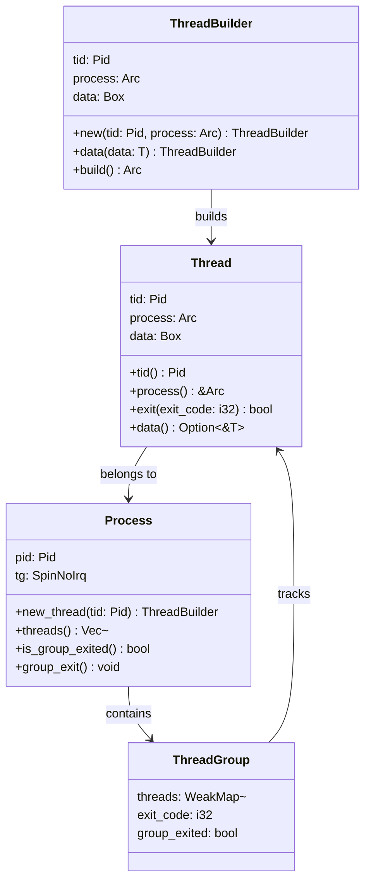
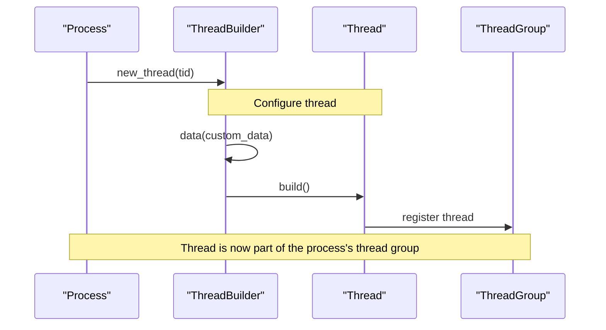
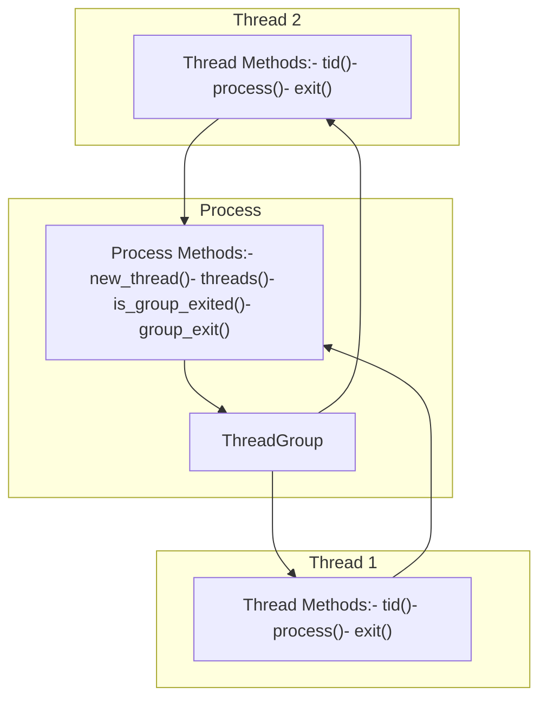

# Thread Management

> **Relevant source files**
> * [src/process.rs](https://github.com/Starry-OS/axprocess/blob/57d44806/src/process.rs)
> * [src/thread.rs](https://github.com/Starry-OS/axprocess/blob/57d44806/src/thread.rs)

This document explains how threads are implemented and managed within the axprocess crate. It covers thread creation, lifecycle, and the relationship between threads and processes. For process-specific features, see [Process Management](/Starry-OS/axprocess/2-process-management), and for memory management aspects, see [Memory Management](/Starry-OS/axprocess/5-memory-management).

## Thread Structure and Components

The thread management system consists of several key components that work together to provide thread functionality:



Sources: [src/thread.rs(L6 - L28)&emsp;](https://github.com/Starry-OS/axprocess/blob/57d44806/src/thread.rs#L6-L28) [src/thread.rs(L51 - L88)&emsp;](https://github.com/Starry-OS/axprocess/blob/57d44806/src/thread.rs#L51-L88) [src/process.rs(L18 - L32)&emsp;](https://github.com/Starry-OS/axprocess/blob/57d44806/src/process.rs#L18-L32) [src/process.rs(L167 - L192)&emsp;](https://github.com/Starry-OS/axprocess/blob/57d44806/src/process.rs#L167-L192)

### Thread Structure

The `Thread` struct represents an individual thread within a process:

* It has a unique thread ID (`tid`) of type `Pid`
* It maintains a strong reference to its parent process using `Arc<Process>`
* It can store arbitrary data via a type-erased `Box<dyn Any + Send + Sync>`
* It provides methods to access its properties and manage its lifecycle

Sources: [src/thread.rs(L6 - L28)&emsp;](https://github.com/Starry-OS/axprocess/blob/57d44806/src/thread.rs#L6-L28)

### Thread Group

Each process contains a `ThreadGroup` which manages all threads within that process:

* The `ThreadGroup` maintains a collection of weak references to threads using `WeakMap<Pid, Weak<Thread>>`
* It tracks the process exit code, which is set when threads exit
* It has a `group_exited` flag that can be set to indicate the entire thread group should exit

Sources: [src/process.rs(L18 - L32)&emsp;](https://github.com/Starry-OS/axprocess/blob/57d44806/src/process.rs#L18-L32)

## Thread Creation Process

Threads are created through a multi-step process using the builder pattern:



Sources: [src/process.rs(L168 - L171)&emsp;](https://github.com/Starry-OS/axprocess/blob/57d44806/src/process.rs#L168-L171) [src/thread.rs(L58 - L88)&emsp;](https://github.com/Starry-OS/axprocess/blob/57d44806/src/thread.rs#L58-L88)

1. Thread creation begins by calling `Process::new_thread(tid)`, which returns a `ThreadBuilder` instance
2. The builder can be configured with custom data using the `data()` method
3. Calling `build()` on the builder creates the actual thread
4. During building, the thread is registered in the process's thread group
5. The builder returns an `Arc<Thread>` as the final product

This builder pattern allows for optional configuration while ensuring proper registration of the thread with its process.

Sources: [src/thread.rs(L51 - L88)&emsp;](https://github.com/Starry-OS/axprocess/blob/57d44806/src/thread.rs#L51-L88) [src/process.rs(L168 - L171)&emsp;](https://github.com/Starry-OS/axprocess/blob/57d44806/src/process.rs#L168-L171)

## Thread Lifecycle Management

Threads in axprocess go through several states during their lifetime:

```

```

Sources: [src/thread.rs(L29 - L39)&emsp;](https://github.com/Starry-OS/axprocess/blob/57d44806/src/thread.rs#L29-L39) [src/process.rs(L167 - L192)&emsp;](https://github.com/Starry-OS/axprocess/blob/57d44806/src/process.rs#L167-L192)

### Thread Exit

The thread exit process is a critical part of thread management:

1. When a thread is ready to terminate, it calls `Thread::exit(exit_code)`
2. This method:

* Updates the thread group's exit code (if group exit hasn't been set)
* Removes the thread from the process's thread group
* Returns a boolean indicating if it was the last thread in the group
3. If the thread was the last one to exit, typically the caller would trigger process termination

Sources: [src/thread.rs(L29 - L39)&emsp;](https://github.com/Starry-OS/axprocess/blob/57d44806/src/thread.rs#L29-L39)

## Process-Thread Relationship

The relationship between processes and threads is fundamental to the system design:



Sources: [src/process.rs(L167 - L192)&emsp;](https://github.com/Starry-OS/axprocess/blob/57d44806/src/process.rs#L167-L192) [src/thread.rs(L6 - L39)&emsp;](https://github.com/Starry-OS/axprocess/blob/57d44806/src/thread.rs#L6-L39)

### Process Thread Management Functions

A process provides several methods to manage its threads:

* `new_thread(tid)`: Creates a new thread with the given thread ID
* `threads()`: Returns a list of all threads in the process
* `is_group_exited()`: Checks if the thread group has been marked for exit
* `group_exit()`: Marks the thread group as exited, signaling all threads to terminate

When a process's `group_exit()` method is called, its `group_exited` flag is set to true. This doesn't directly terminate threads, but serves as a signal that they should exit. Individual threads need to check this flag and respond accordingly.

Sources: [src/process.rs(L167 - L192)&emsp;](https://github.com/Starry-OS/axprocess/blob/57d44806/src/process.rs#L167-L192)

### Thread Exit and Process Status

When a thread exits, it may affect the process state:

1. If the exiting thread is the last thread in the process, the process should typically be terminated
2. The thread's exit code may become the process's exit code (unless `group_exited` is true)
3. When all threads exit, resources associated with the thread group can be cleaned up

Sources: [src/thread.rs(L29 - L39)&emsp;](https://github.com/Starry-OS/axprocess/blob/57d44806/src/thread.rs#L29-L39) [src/process.rs(L167 - L192)&emsp;](https://github.com/Starry-OS/axprocess/blob/57d44806/src/process.rs#L167-L192)

## Data Storage in Threads

Both `Thread` and `Process` contain a `data` field of type `Box<dyn Any + Send + Sync>`, which allows storing arbitrary data that satisfies the `Send` and `Sync` traits:

* The `data<T: Any + Send + Sync>()` method on both types allows retrieving this data when its exact type is known
* The builder patterns for both types allow setting this data during creation
* This mechanism provides a flexible way to associate custom data with threads and processes

This type-erased data storage enables client code to store task-specific information without modifying the core thread and process implementations.

Sources: [src/thread.rs(L24 - L27)&emsp;](https://github.com/Starry-OS/axprocess/blob/57d44806/src/thread.rs#L24-L27) [src/thread.rs(L67 - L73)&emsp;](https://github.com/Starry-OS/axprocess/blob/57d44806/src/thread.rs#L67-L73)

## Thread Management Best Practices

When working with the thread management system in axprocess, consider these guidelines:

1. Always check the return value of `Thread::exit()` to determine if process termination is needed
2. Use the builder pattern properly by calling methods in a chain and ending with `build()`
3. Manage thread references carefully to prevent memory leaks
4. Be aware of the process lifecycle and how thread termination affects it

The thread management system in axprocess provides a flexible foundation for multithreaded applications while maintaining proper resource management and cleanup.