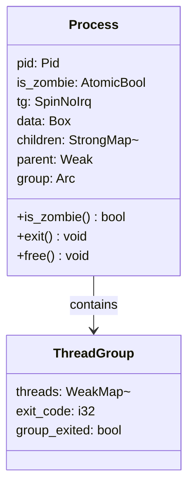
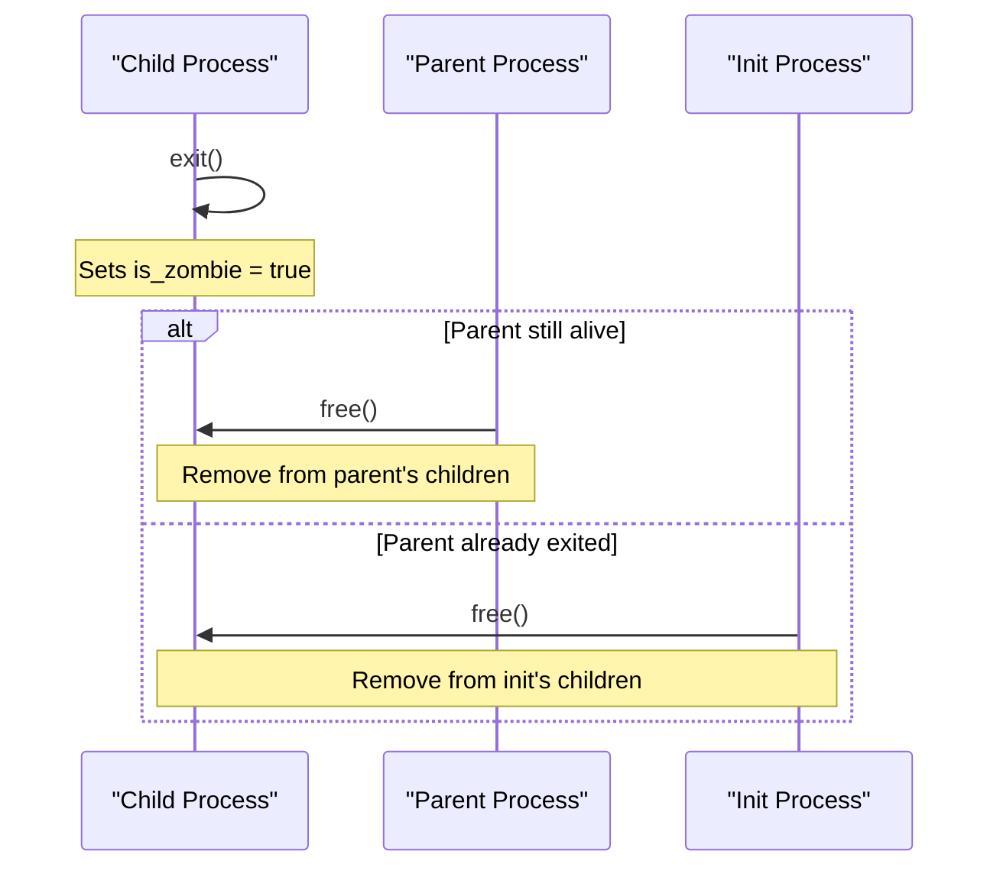
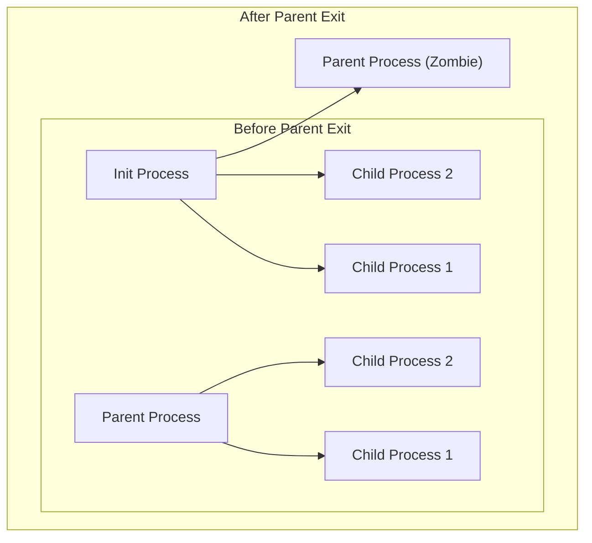
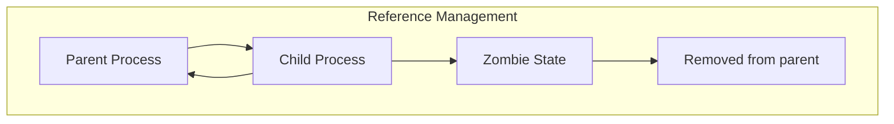

# Zombie Processes and Cleanup

> **Relevant source files**
> * [src/process.rs](https://github.com/Starry-OS/axprocess/blob/57d44806/src/process.rs)
> * [tests/process.rs](https://github.com/Starry-OS/axprocess/blob/57d44806/tests/process.rs)

This document explains how axprocess manages terminated processes (zombies) and their eventual cleanup. It covers the zombie state, resource management, process inheritance, and the cleanup mechanisms that ensure proper resource deallocation. For related information about the overall process lifecycle, see [Process Lifecycle](/Starry-OS/axprocess/2.2-process-lifecycle).

## Zombie Process Concept

In axprocess, a zombie process is a process that has terminated execution but still exists in the system's process table. When a process exits, it doesn't immediately disappear - it enters a zombie state where some minimal information is retained until its parent process acknowledges the termination.

```

```

Sources: [src/process.rs(L196 - L236)&emsp;](https://github.com/Starry-OS/axprocess/blob/57d44806/src/process.rs#L196-L236)

## Zombie State Implementation

When a process terminates, it's marked as a zombie through the `Process::exit()` method, which sets the `is_zombie` atomic flag to true. In this state:

1. The process is no longer executing but still exists in the process table
2. Resources are partially released
3. Exit status is preserved for the parent process to retrieve
4. Child processes are reassigned to the init process

The zombie state allows the parent process to retrieve exit information from its children before they're completely deallocated.



Sources: [src/process.rs(L35 - L47)&emsp;](https://github.com/Starry-OS/axprocess/blob/57d44806/src/process.rs#L35-L47) [src/process.rs(L196 - L225)&emsp;](https://github.com/Starry-OS/axprocess/blob/57d44806/src/process.rs#L196-L225)

## Zombie Process Cleanup

Cleanup of zombie processes is a two-step process:

1. A process terminates by calling `Process::exit()`, which marks it as a zombie
2. The parent process calls `Process::free()` to complete the cleanup

The `free()` method removes the zombie process from its parent's children list. If a process is freed before it's marked as a zombie, the system will panic to prevent incorrect resource management.



Sources: [src/process.rs(L227 - L236)&emsp;](https://github.com/Starry-OS/axprocess/blob/57d44806/src/process.rs#L227-L236) [tests/process.rs(L25 - L44)&emsp;](https://github.com/Starry-OS/axprocess/blob/57d44806/tests/process.rs#L25-L44)

## Resource Management During Exit

The `exit()` implementation handles several key cleanup tasks:

1. Marks the process as a zombie using atomic operations
2. Reassigns child processes to a reaper (currently always the init process)
3. Updates parent references in all child processes
4. Maintains the process in the parent's children list for later cleanup

Table: Key Resources in Zombie Processes

|Resource|Status in Zombie Process|Cleaned Up By|
| --- | --- | --- |
|Memory for Process structure|Still allocated|free()method|
|Child process references|Transferred to init|exit()method|
|Parent reference|Maintained|Parent'schildrenmap|
|Process Group membership|Maintained|Not removed untilfree()|
|Exit code|Preserved|Stored in ThreadGroup|

Sources: [src/process.rs(L196 - L225)&emsp;](https://github.com/Starry-OS/axprocess/blob/57d44806/src/process.rs#L196-L225)

## Orphan Process Handling

When a parent process exits before its children, the children become "orphaned" and are inherited by the init process. This prevents zombie processes from becoming permanent if their parents exit without cleaning them up.



Implementation details:

1. When a process exits, it transfers all its children to the init process (or designated subreaper)
2. Each child's parent reference is updated to point to the new parent
3. These processes now appear in the init process's children collection
4. The init process becomes responsible for cleaning them up when they exit

Sources: [src/process.rs(L207 - L224)&emsp;](https://github.com/Starry-OS/axprocess/blob/57d44806/src/process.rs#L207-L224) [tests/process.rs(L47 - L55)&emsp;](https://github.com/Starry-OS/axprocess/blob/57d44806/tests/process.rs#L47-L55)

## Cleanup Implementation Details

The zombie cleanup is implemented through reference management. Let's examine how this is done:



Key implementation points:

1. The parent holds strong references (`Arc<Process>`) to its children in a `StrongMap`
2. Children hold weak references (`Weak<Process>`) to their parent
3. When `free()` is called, the zombie process is removed from its parent's `children` map
4. This removes the strong reference, allowing memory deallocation when all references are gone

The `Process::free()` method also checks that a process is actually a zombie before freeing it, to prevent accidental cleanup of active processes.

Sources: [src/process.rs(L227 - L236)&emsp;](https://github.com/Starry-OS/axprocess/blob/57d44806/src/process.rs#L227-L236) [tests/process.rs(L25 - L29)&emsp;](https://github.com/Starry-OS/axprocess/blob/57d44806/tests/process.rs#L25-L29)

## Special Case: Init Process

The init process requires special handling in the context of zombies:

1. The init process cannot exit (calling `exit()` on it will panic)
2. It's responsible for cleaning up orphaned processes
3. It must properly handle zombie processes inherited from terminated parents

This special status ensures that there's always a process available to clean up orphaned zombies, preventing resource leaks.

Sources: [src/process.rs(L207 - L209)&emsp;](https://github.com/Starry-OS/axprocess/blob/57d44806/src/process.rs#L207-L209) [tests/process.rs(L31 - L35)&emsp;](https://github.com/Starry-OS/axprocess/blob/57d44806/tests/process.rs#L31-L35)

## Resource Management Considerations

Proper zombie process management is essential for preventing resource leaks:

1. Memory leaks: Zombie processes that are never freed can accumulate and waste memory
2. Process ID exhaustion: Each zombie still occupies a process ID
3. Parent responsibility: Parents must clean up their zombie children

Users of this API must ensure they properly handle the cleanup of zombie processes by calling `free()` after retrieving any needed exit information.

Sources: [src/process.rs(L227 - L236)&emsp;](https://github.com/Starry-OS/axprocess/blob/57d44806/src/process.rs#L227-L236)