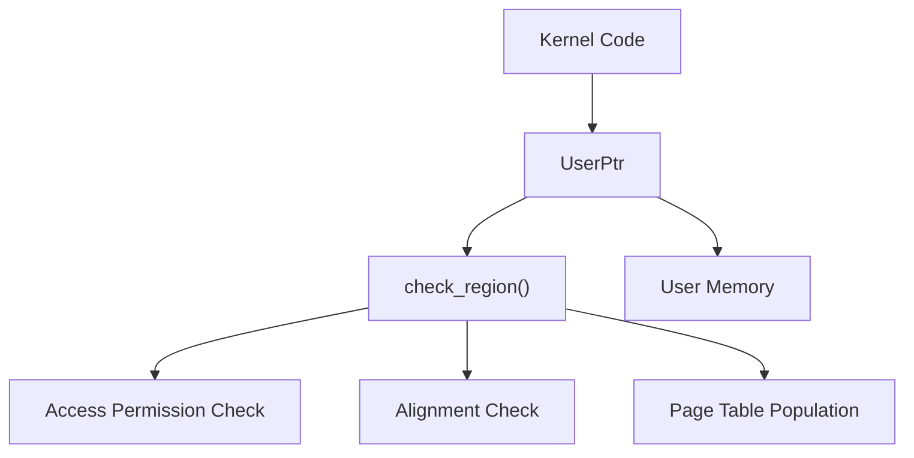
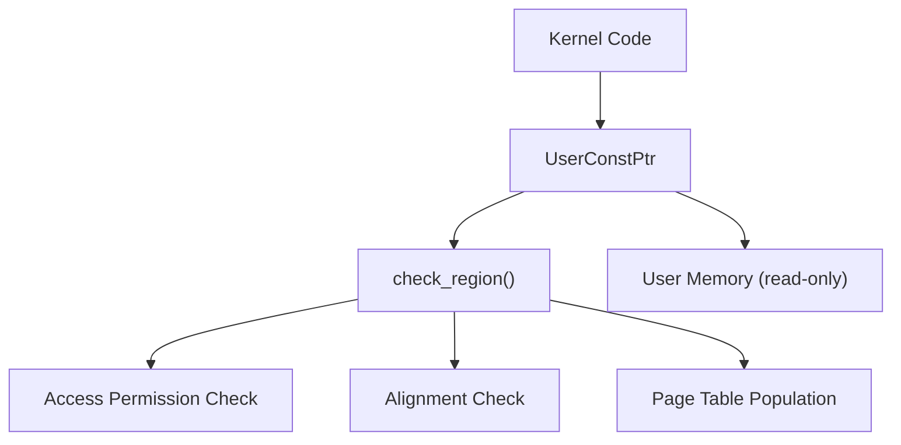
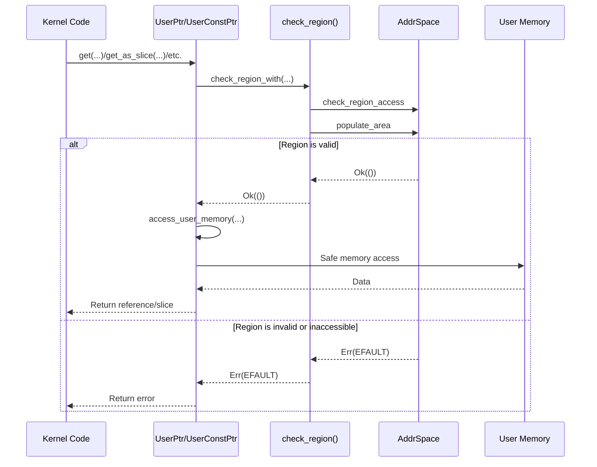
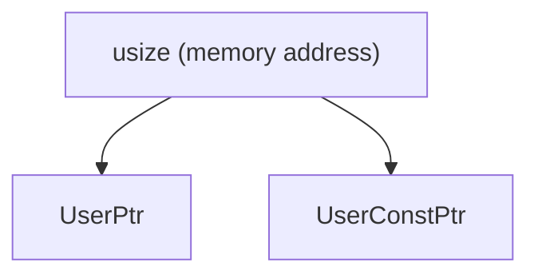
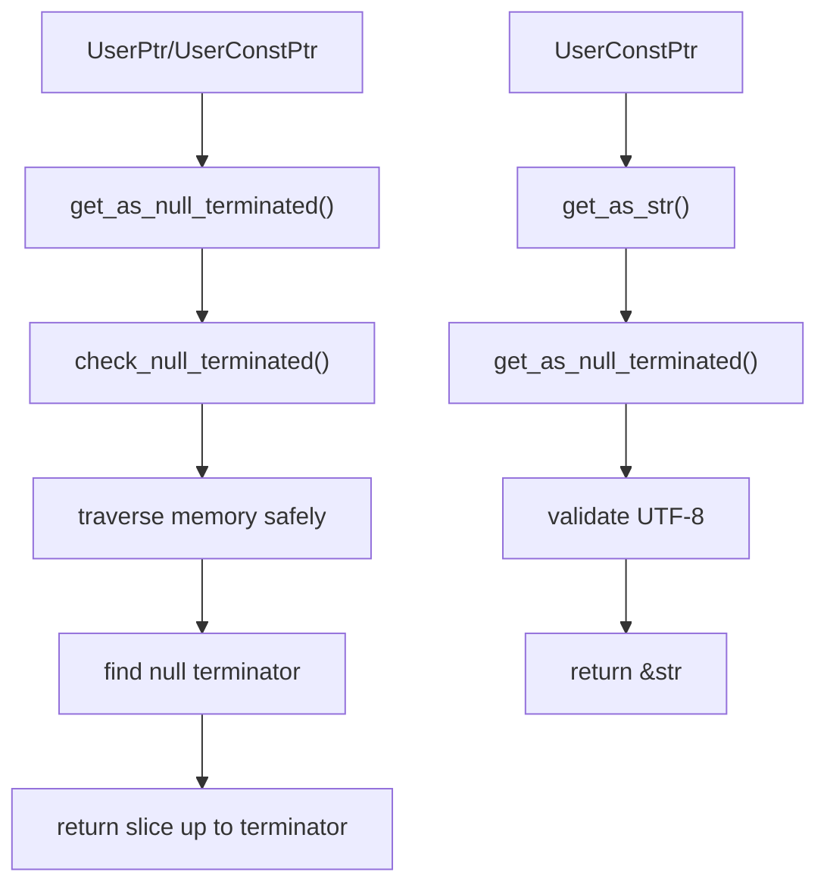

# API Reference

> **Relevant source files**
> * [src/lib.rs](https://github.com/Starry-OS/axptr/blob/7341852d/src/lib.rs)

This page provides a comprehensive reference for the axptr library, which offers safe abstractions for accessing user-space memory from kernel code. The API is designed to prevent memory-related security vulnerabilities and crashes that can occur when kernel code interacts with potentially unsafe user memory.

For architectural concepts and safety mechanisms, refer to [Memory Safety Architecture](/Starry-OS/axptr/2-memory-safety-architecture) and [Safety Mechanisms](/Starry-OS/axptr/3-safety-mechanisms).

## API Components Overview

```

```

Sources: [src/lib.rs(L119 - L126)&emsp;](https://github.com/Starry-OS/axptr/blob/7341852d/src/lib.rs#L119-L126) [src/lib.rs(L128 - L217)&emsp;](https://github.com/Starry-OS/axptr/blob/7341852d/src/lib.rs#L128-L217) [src/lib.rs(L219 - L303)&emsp;](https://github.com/Starry-OS/axptr/blob/7341852d/src/lib.rs#L219-L303) [src/lib.rs(L18 - L20)&emsp;](https://github.com/Starry-OS/axptr/blob/7341852d/src/lib.rs#L18-L20)

## Core Types

### UserPtr<T>

`UserPtr<T>` is a wrapper around a raw mutable pointer (`*mut T`) to user-space memory. It provides safe methods to access and manipulate user memory with validation checks.



Sources: [src/lib.rs(L128 - L217)&emsp;](https://github.com/Starry-OS/axptr/blob/7341852d/src/lib.rs#L128-L217)

#### Constants

|Constant|Type|Description|
| --- | --- | --- |
|ACCESS_FLAGS|MappingFlags|Read and write access flags for the pointer (MappingFlags::READ.union(MappingFlags::WRITE))|

Sources: [src/lib.rs(L137)&emsp;](https://github.com/Starry-OS/axptr/blob/7341852d/src/lib.rs#L137-L137)

#### Methods

|Method|Signature|Description|
| --- | --- | --- |
|address|fn address(&self) -> VirtAddr|Returns the virtual address of the pointer|
|as_ptr|unsafe fn as_ptr(&self) -> *mut T|Unwraps the pointer into a raw pointer (unsafe)|
|cast|fn cast<U>(self) -> UserPtr<U>|Casts the pointer to a different type|
|is_null|fn is_null(&self) -> bool|Checks if the pointer is null|
|nullable|fn nullable(self) -> Option<Self>|Converts the pointer to anOption, returningNoneif null|
|get|fn get(&mut self, aspace: impl AddrSpaceProvider) -> LinuxResult<&mut T>|Safely accesses the value, validating the memory region|
|get_as_slice|fn get_as_slice(&mut self, aspace: impl AddrSpaceProvider, length: usize) -> LinuxResult<&mut [T]>|Gets the value as a slice of specified length|
|get_as_null_terminated|fn get_as_null_terminated(&mut self, aspace: impl AddrSpaceProvider) -> LinuxResult<&mut [T]>|Gets the value as a slice terminated by a null value|

Sources: [src/lib.rs(L136 - L169)&emsp;](https://github.com/Starry-OS/axptr/blob/7341852d/src/lib.rs#L136-L169) [src/lib.rs(L171 - L198)&emsp;](https://github.com/Starry-OS/axptr/blob/7341852d/src/lib.rs#L171-L198) [src/lib.rs(L201 - L217)&emsp;](https://github.com/Starry-OS/axptr/blob/7341852d/src/lib.rs#L201-L217)

### UserConstPtr<T>

`UserConstPtr<T>` is a wrapper around a raw constant pointer (`*const T`) to user-space memory. It provides similar functionality to `UserPtr<T>` but for read-only access.



Sources: [src/lib.rs(L219 - L303)&emsp;](https://github.com/Starry-OS/axptr/blob/7341852d/src/lib.rs#L219-L303)

#### Constants

|Constant|Type|Description|
| --- | --- | --- |
|ACCESS_FLAGS|MappingFlags|Read-only access flags for the pointer (MappingFlags::READ)|

Sources: [src/lib.rs(L228)&emsp;](https://github.com/Starry-OS/axptr/blob/7341852d/src/lib.rs#L228-L228)

#### Methods

|Method|Signature|Description|
| --- | --- | --- |
|address|fn address(&self) -> VirtAddr|Returns the virtual address of the pointer|
|as_ptr|unsafe fn as_ptr(&self) -> *const T|Unwraps the pointer into a raw pointer (unsafe)|
|cast|fn cast<U>(self) -> UserConstPtr<U>|Casts the pointer to a different type|
|is_null|fn is_null(&self) -> bool|Checks if the pointer is null|
|nullable|fn nullable(self) -> Option<Self>|Converts the pointer to anOption, returningNoneif null|
|get|fn get(&self, aspace: impl AddrSpaceProvider) -> LinuxResult<&T>|Safely accesses the value, validating the memory region|
|get_as_slice|fn get_as_slice(&self, aspace: impl AddrSpaceProvider, length: usize) -> LinuxResult<&[T]>|Gets the value as a slice of specified length|
|get_as_null_terminated|fn get_as_null_terminated(&self, aspace: impl AddrSpaceProvider) -> LinuxResult<&[T]>|Gets the value as a slice terminated by a null value|

Sources: [src/lib.rs(L227 - L254)&emsp;](https://github.com/Starry-OS/axptr/blob/7341852d/src/lib.rs#L227-L254) [src/lib.rs(L256 - L278)&emsp;](https://github.com/Starry-OS/axptr/blob/7341852d/src/lib.rs#L256-L278) [src/lib.rs(L280 - L292)&emsp;](https://github.com/Starry-OS/axptr/blob/7341852d/src/lib.rs#L280-L292)

#### Special Methods for UserConstPtr<c_char>

`UserConstPtr<c_char>` has an additional method for working with strings:

|Method|Signature|Description|
| --- | --- | --- |
|get_as_str|fn get_as_str(&self, aspace: impl AddrSpaceProvider) -> LinuxResult<&'static str>|Gets the pointer as a Rust string, validating UTF-8 encoding|

Sources: [src/lib.rs(L294 - L303)&emsp;](https://github.com/Starry-OS/axptr/blob/7341852d/src/lib.rs#L294-L303)

### AddrSpaceProvider Trait

The `AddrSpaceProvider` trait is used to abstract the address space operations used by both pointer types. It provides a way to access the underlying address space.

```

```

Sources: [src/lib.rs(L119 - L126)&emsp;](https://github.com/Starry-OS/axptr/blob/7341852d/src/lib.rs#L119-L126)

#### Methods

|Method|Signature|Description|
| --- | --- | --- |
|with_addr_space|fn with_addr_space<R>(&mut self, f: impl FnOnce(&mut AddrSpace) -> R) -> R|Provides a reference to the address space for use with a callback function|

Sources: [src/lib.rs(L119 - L121)&emsp;](https://github.com/Starry-OS/axptr/blob/7341852d/src/lib.rs#L119-L121)

## Helper Functions

The axptr library provides utility functions for working with user-space memory:

|Function|Signature|Description|
| --- | --- | --- |
|is_accessing_user_memory|fn is_accessing_user_memory() -> bool|Checks if we are currently accessing user memory, used for page fault handling|
|access_user_memory|fn access_user_memory<R>(f: impl FnOnce() -> R) -> R|Internal function to set a flag during user memory access|

Sources: [src/lib.rs(L11 - L29)&emsp;](https://github.com/Starry-OS/axptr/blob/7341852d/src/lib.rs#L11-L29)

## Memory Access Process

The diagram below illustrates the process that occurs when kernel code attempts to access user memory through the axptr API:



Sources: [src/lib.rs(L31 - L54)&emsp;](https://github.com/Starry-OS/axptr/blob/7341852d/src/lib.rs#L31-L54) [src/lib.rs(L109 - L117)&emsp;](https://github.com/Starry-OS/axptr/blob/7341852d/src/lib.rs#L109-L117) [src/lib.rs(L22 - L29)&emsp;](https://github.com/Starry-OS/axptr/blob/7341852d/src/lib.rs#L22-L29)

## Type Conversion and Construction

Both `UserPtr<T>` and `UserConstPtr<T>` implement `From<usize>` for convenient construction from raw addresses:



Sources: [src/lib.rs(L130 - L134)&emsp;](https://github.com/Starry-OS/axptr/blob/7341852d/src/lib.rs#L130-L134) [src/lib.rs(L221 - L225)&emsp;](https://github.com/Starry-OS/axptr/blob/7341852d/src/lib.rs#L221-L225)

## Null-Terminated Data Handling

The library provides special handling for null-terminated data structures like C strings:



Sources: [src/lib.rs(L56 - L107)&emsp;](https://github.com/Starry-OS/axptr/blob/7341852d/src/lib.rs#L56-L107) [src/lib.rs(L201 - L217)&emsp;](https://github.com/Starry-OS/axptr/blob/7341852d/src/lib.rs#L201-L217) [src/lib.rs(L280 - L292)&emsp;](https://github.com/Starry-OS/axptr/blob/7341852d/src/lib.rs#L280-L292) [src/lib.rs(L294 - L303)&emsp;](https://github.com/Starry-OS/axptr/blob/7341852d/src/lib.rs#L294-L303)