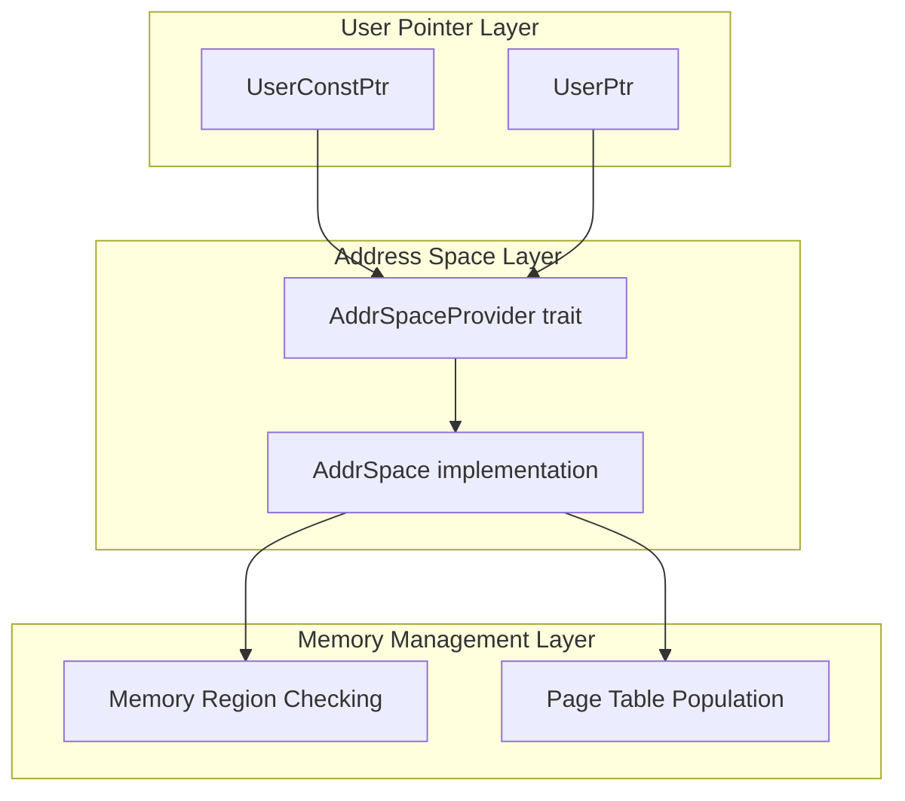
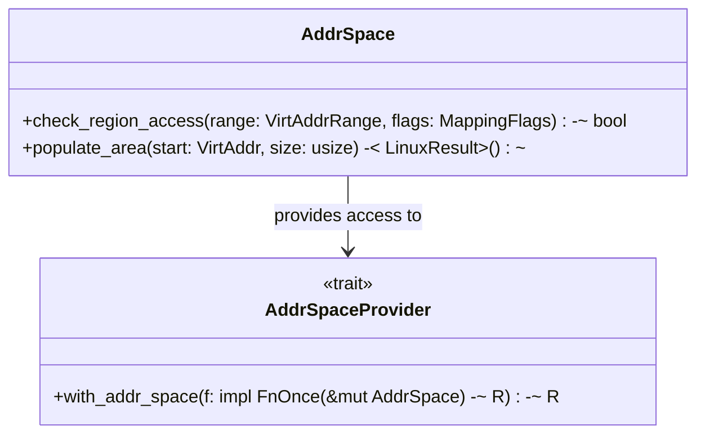
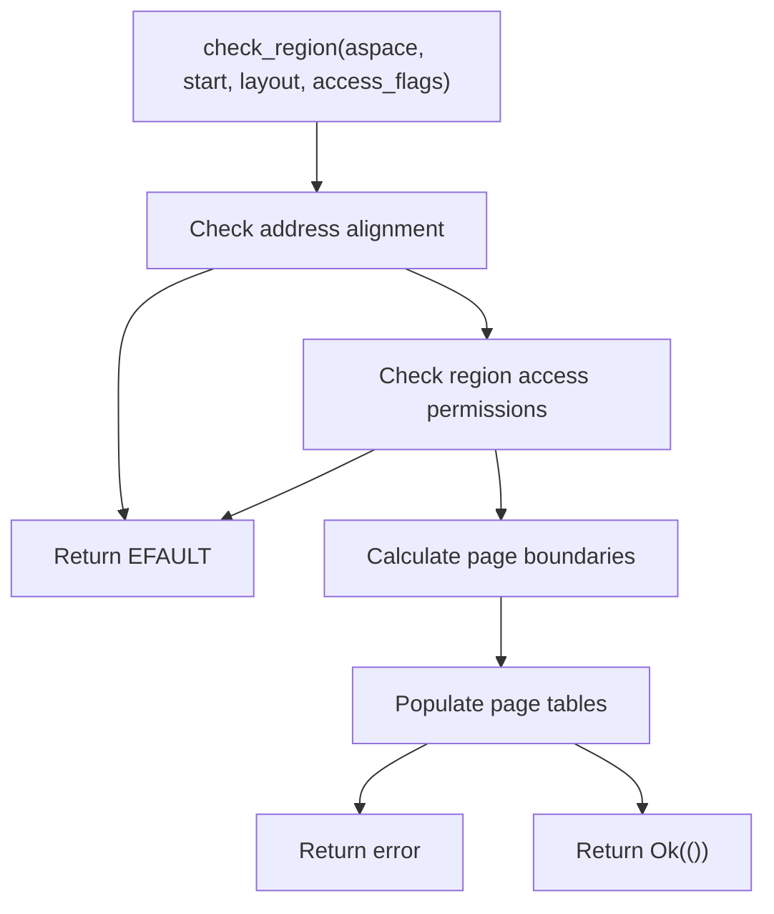
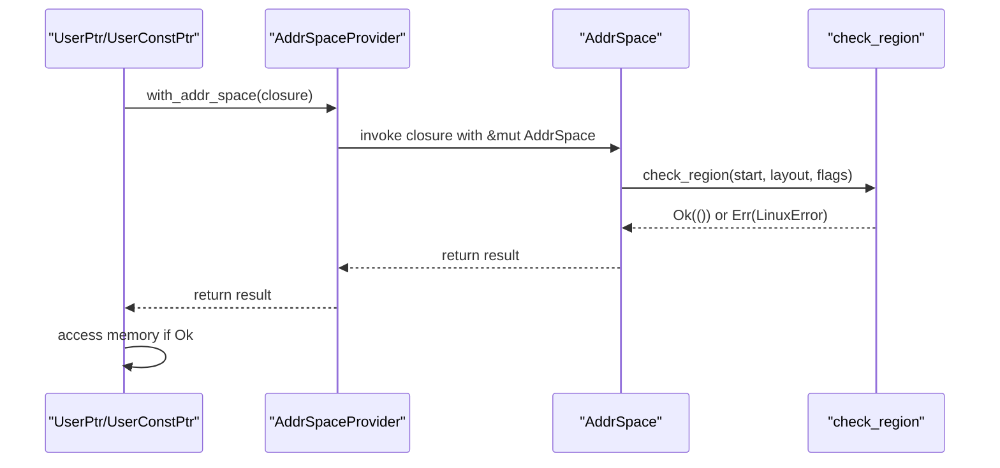
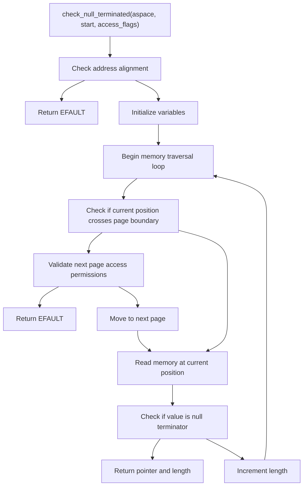
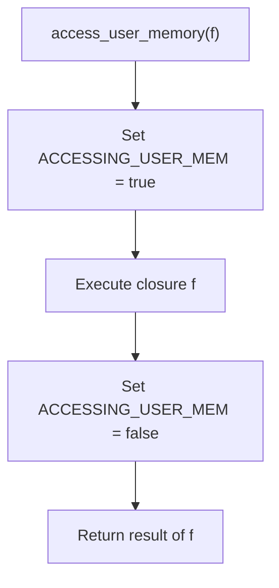

# Address Space Management

> **Relevant source files**
> * [src/lib.rs](https://github.com/Starry-OS/axptr/blob/7341852d/src/lib.rs)

## Purpose and Scope

This document covers the address space management components within the axptr library. The address space management layer provides an abstraction for safely interacting with user-space memory through virtual address spaces and page tables. For information about the user space pointers that utilize this abstraction, see [User Space Pointers](/Starry-OS/axptr/2.1-user-space-pointers).

## Overview

Address space management in axptr is built around the `AddrSpaceProvider` trait, which serves as a bridge between user pointers (`UserPtr`/`UserConstPtr`) and the underlying memory management system. This abstraction allows for flexible implementation of address space operations while maintaining memory safety guarantees.



Sources: [src/lib.rs(L119 - L126)&emsp;](https://github.com/Starry-OS/axptr/blob/7341852d/src/lib.rs#L119-L126) [src/lib.rs(L31 - L54)&emsp;](https://github.com/Starry-OS/axptr/blob/7341852d/src/lib.rs#L31-L54)

## AddrSpaceProvider Trait

The `AddrSpaceProvider` trait defines a contract for accessing an address space. It contains a single method that allows temporary access to an `AddrSpace` object through a closure.



Sources: [src/lib.rs(L119 - L121)&emsp;](https://github.com/Starry-OS/axptr/blob/7341852d/src/lib.rs#L119-L121) [src/lib.rs(L122 - L126)&emsp;](https://github.com/Starry-OS/axptr/blob/7341852d/src/lib.rs#L122-L126)

### Implementation and Usage

The library provides a default implementation of `AddrSpaceProvider` for `&mut AddrSpace`:

```rust
impl AddrSpaceProvider for &mut AddrSpace {
    fn with_addr_space<R>(&mut self, f: impl FnOnce(&mut AddrSpace) -> R) -> R {
        f(self)
    }
}
```

This simple implementation allows a mutable reference to an `AddrSpace` to be used as an `AddrSpaceProvider`. The implementation pattern ensures that the `AddrSpace` is only accessible within the provided closure, enforcing proper resource management.

Sources: [src/lib.rs(L122 - L126)&emsp;](https://github.com/Starry-OS/axptr/blob/7341852d/src/lib.rs#L122-L126)

## Memory Region Management

The address space management layer is responsible for two primary operations:

1. Checking if a memory region is accessible with specific permissions
2. Populating page tables to ensure memory is mapped when accessed

These operations are encapsulated in the `check_region` function:



Sources: [src/lib.rs(L31 - L54)&emsp;](https://github.com/Starry-OS/axptr/blob/7341852d/src/lib.rs#L31-L54)

### Region Checking Process

The `check_region` function performs several validation steps:

1. **Alignment Check**: Verifies that the memory address is properly aligned for the requested data type
2. **Permission Check**: Ensures the memory region has the appropriate access flags (read/write)
3. **Page Table Population**: Maps the necessary pages in virtual memory

This function returns a `LinuxResult<()>` which is `Ok(())` if the region is valid and accessible, or `Err(LinuxError::EFAULT)` if the region cannot be accessed.

Sources: [src/lib.rs(L31 - L54)&emsp;](https://github.com/Starry-OS/axptr/blob/7341852d/src/lib.rs#L31-L54)

## Integration with User Pointers

The address space management layer is primarily used by the user pointer types (`UserPtr` and `UserConstPtr`) to safely access user-space memory. These types call into the address space abstraction whenever they need to validate memory accesses.



Sources: [src/lib.rs(L175 - L182)&emsp;](https://github.com/Starry-OS/axptr/blob/7341852d/src/lib.rs#L175-L182) [src/lib.rs(L258 - L266)&emsp;](https://github.com/Starry-OS/axptr/blob/7341852d/src/lib.rs#L258-L266)

### Helper Function: check_region_with

To simplify the interaction between user pointers and address space providers, the library includes a `check_region_with` helper function:

```rust
fn check_region_with(
    mut aspace: impl AddrSpaceProvider,
    start: VirtAddr,
    layout: Layout,
    access_flags: MappingFlags,
) -> LinuxResult<()> {
    aspace.with_addr_space(|aspace| check_region(aspace, start, layout, access_flags))
}
```

This function takes an `AddrSpaceProvider` and delegates to the `check_region` function, simplifying the code in the user pointer methods.

Sources: [src/lib.rs(L110 - L117)&emsp;](https://github.com/Starry-OS/axptr/blob/7341852d/src/lib.rs#L110-L117)

## Null-Terminated Data Handling

Special handling is provided for null-terminated data (like C strings) through the `check_null_terminated` function. This function safely traverses memory until it finds a null terminator, validating each page as needed.



Sources: [src/lib.rs(L56 - L107)&emsp;](https://github.com/Starry-OS/axptr/blob/7341852d/src/lib.rs#L56-L107)

The `check_null_terminated` function uses the `access_user_memory` helper to set a thread-local flag that indicates user memory is being accessed, allowing the kernel to handle page faults correctly.

## Memory Access Context Management

To safely handle page faults during user memory access, the address space management system uses a thread-local flag:



Sources: [src/lib.rs(L22 - L29)&emsp;](https://github.com/Starry-OS/axptr/blob/7341852d/src/lib.rs#L22-L29) [src/lib.rs(L11 - L20)&emsp;](https://github.com/Starry-OS/axptr/blob/7341852d/src/lib.rs#L11-L20)

The `is_accessing_user_memory()` function provides a way for the OS to check if a page fault occurred during a legitimate user memory access, allowing it to handle these faults differently from other kernel faults.

Sources: [src/lib.rs(L14 - L20)&emsp;](https://github.com/Starry-OS/axptr/blob/7341852d/src/lib.rs#L14-L20)

## Implementation Notes

* The address space management layer is designed to be minimal yet flexible, providing only the necessary abstractions for safe user memory access
* The `AddrSpaceProvider` trait follows the resource acquisition is initialization (RAII) pattern, ensuring proper resource management
* All memory checks are performed before memory is accessed, preventing undefined behavior
* Page table population is done lazily, only when memory is actually accessed

Sources: [src/lib.rs(L119 - L126)&emsp;](https://github.com/Starry-OS/axptr/blob/7341852d/src/lib.rs#L119-L126) [src/lib.rs(L31 - L54)&emsp;](https://github.com/Starry-OS/axptr/blob/7341852d/src/lib.rs#L31-L54)