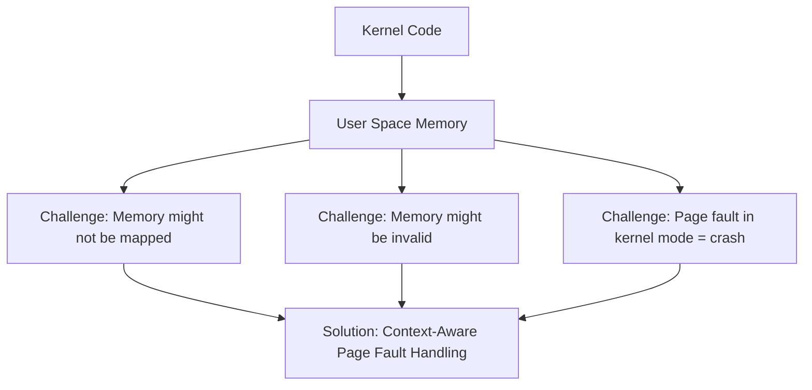
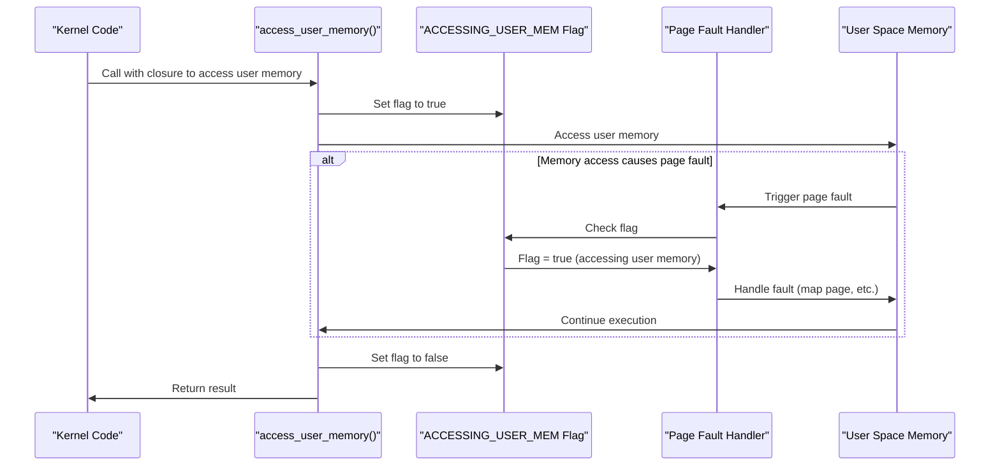
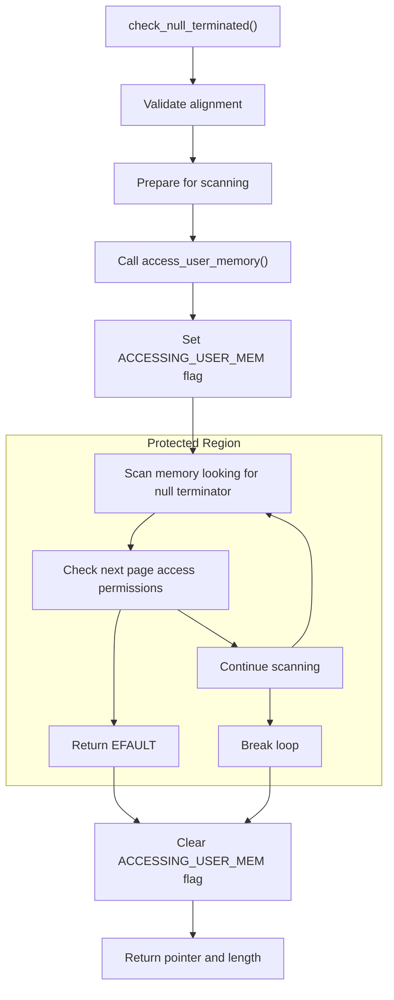

# Context-Aware Page Fault Handling

> **Relevant source files**
> * [src/lib.rs](https://github.com/Starry-OS/axptr/blob/7341852d/src/lib.rs)

## Purpose and Scope

This document explains the mechanism used by axptr to safely handle page faults that may occur when the kernel accesses user space memory. The system uses a per-CPU flag to inform the operating system when user memory access is in progress, allowing the kernel to differentiate between legitimate page faults during user memory access and actual kernel bugs. For information about how memory regions are validated before access, see [Memory Region Checking](/Starry-OS/axptr/3.1-memory-region-checking).

## The Challenge of Accessing User Memory

When kernel code accesses user space memory, multiple issues can arise:

1. The memory might not be currently mapped (page fault)
2. The user process might have just freed the memory
3. The user might have provided an invalid pointer

Without proper handling, these scenarios would cause a kernel panic, as page faults in kernel mode are typically considered fatal errors. Context-aware page fault handling provides a solution to this problem.



Sources: [src/lib.rs(L11 - L20)&emsp;](https://github.com/Starry-OS/axptr/blob/7341852d/src/lib.rs#L11-L20)

## ACCESSING_USER_MEM Flag

The core of this mechanism is a per-CPU boolean flag named `ACCESSING_USER_MEM`. This flag indicates whether the kernel is currently accessing user memory, allowing the page fault handler to make an informed decision about how to respond to a page fault.

```
#[percpu::def_percpu]
static mut ACCESSING_USER_MEM: bool = false;
```

This flag is:

* Defined as a per-CPU variable, so each CPU core has its own instance
* Initially set to `false`
* Set to `true` immediately before accessing user memory
* Reset to `false` after the access is complete

The operating system checks this flag when a page fault occurs to determine whether to treat it as a legitimate page fault (allowing recovery) or as a kernel bug (triggering a panic).

Sources: [src/lib.rs(L11 - L12)&emsp;](https://github.com/Starry-OS/axptr/blob/7341852d/src/lib.rs#L11-L12)

## How Context-Aware Handling Works

The context-aware page fault handling process follows these steps:



Sources: [src/lib.rs(L22 - L29)&emsp;](https://github.com/Starry-OS/axptr/blob/7341852d/src/lib.rs#L22-L29)

## Implementation Details

### The is_accessing_user_memory Function

This function allows the operating system's page fault handler to check whether a page fault occurred during legitimate user memory access:

```rust
pub fn is_accessing_user_memory() -> bool {
    ACCESSING_USER_MEM.read_current()
}
```

As the documentation states: "OS implementation shall allow page faults from kernel when this function returns true."

Sources: [src/lib.rs(L14 - L20)&emsp;](https://github.com/Starry-OS/axptr/blob/7341852d/src/lib.rs#L14-L20)

### The access_user_memory Function

This function manages the context flag around a closure that accesses user memory:

```javascript
fn access_user_memory<R>(f: impl FnOnce() -> R) -> R {
    ACCESSING_USER_MEM.with_current(|v| {
        *v = true;
        let result = f();
        *v = false;
        result
    })
}
```

Key points:

* Takes a closure `f` that performs the actual user memory access
* Sets the flag before executing the closure
* Captures the result from the closure
* Clears the flag after execution
* Returns the result

Sources: [src/lib.rs(L22 - L29)&emsp;](https://github.com/Starry-OS/axptr/blob/7341852d/src/lib.rs#L22-L29)

## Integration with Memory Access Functions

The context-aware page fault handling is primarily used when accessing potentially problematic user memory, such as when reading null-terminated arrays or strings.

### Example: Null-Terminated Data Handling

The `check_null_terminated` function uses this mechanism to safely scan user memory for a null terminator:



The function:

1. Validates the initial alignment of the memory region
2. Sets up scanning variables
3. **Crucially** wraps the scanning loop in `access_user_memory()`
4. Within the protected region, handles page boundaries and potential faults
5. Returns a pointer and length when successful

Sources: [src/lib.rs(L56 - L107)&emsp;](https://github.com/Starry-OS/axptr/blob/7341852d/src/lib.rs#L56-L107)

## System Interactions

Here's how the context-aware page fault handling interacts with different system components:

```

```

Sources: [src/lib.rs(L11 - L29)&emsp;](https://github.com/Starry-OS/axptr/blob/7341852d/src/lib.rs#L11-L29) [src/lib.rs(L56 - L107)&emsp;](https://github.com/Starry-OS/axptr/blob/7341852d/src/lib.rs#L56-L107) [src/lib.rs(L204 - L216)&emsp;](https://github.com/Starry-OS/axptr/blob/7341852d/src/lib.rs#L204-L216) [src/lib.rs(L282 - L291)&emsp;](https://github.com/Starry-OS/axptr/blob/7341852d/src/lib.rs#L282-L291)

## Example Use Case

Consider what happens when a kernel function tries to access a user-provided null-terminated string that spans multiple pages, where some pages might not be mapped yet:

|Step|Description|Flag State|System Behavior|
| --- | --- | --- | --- |
|1|User calls kernel with string pointer|false|Normal operation|
|2|Kernel callsUserConstPtr::get_as_str()|false|Normal operation|
|3|access_user_memory()is called|true|Prepared for potential page faults|
|4|Memory is accessed, causing page fault|true|OS handles fault instead of panicking|
|5|OS maps the page|true|Execution continues|
|6|String scan completes|false(reset)|Return to normal operation|

Without this mechanism, any unmapped page in the user string would crash the kernel, even if the user's access was legitimate.

Sources: [src/lib.rs(L295 - L302)&emsp;](https://github.com/Starry-OS/axptr/blob/7341852d/src/lib.rs#L295-L302)

## Key Benefits

1. **Safety**: Prevents kernel crashes from legitimate user memory accesses
2. **Transparency**: Kernel code can access user memory without explicit fault handling
3. **Efficiency**: No need for complex user/kernel copying mechanisms
4. **Robustness**: Properly handles both valid and invalid memory access scenarios

Sources: [src/lib.rs(L11 - L29)&emsp;](https://github.com/Starry-OS/axptr/blob/7341852d/src/lib.rs#L11-L29)