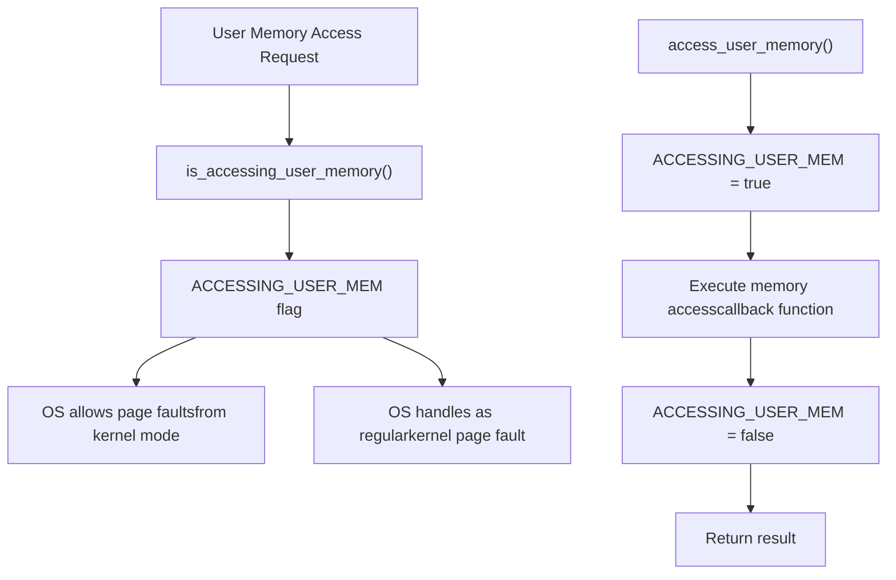
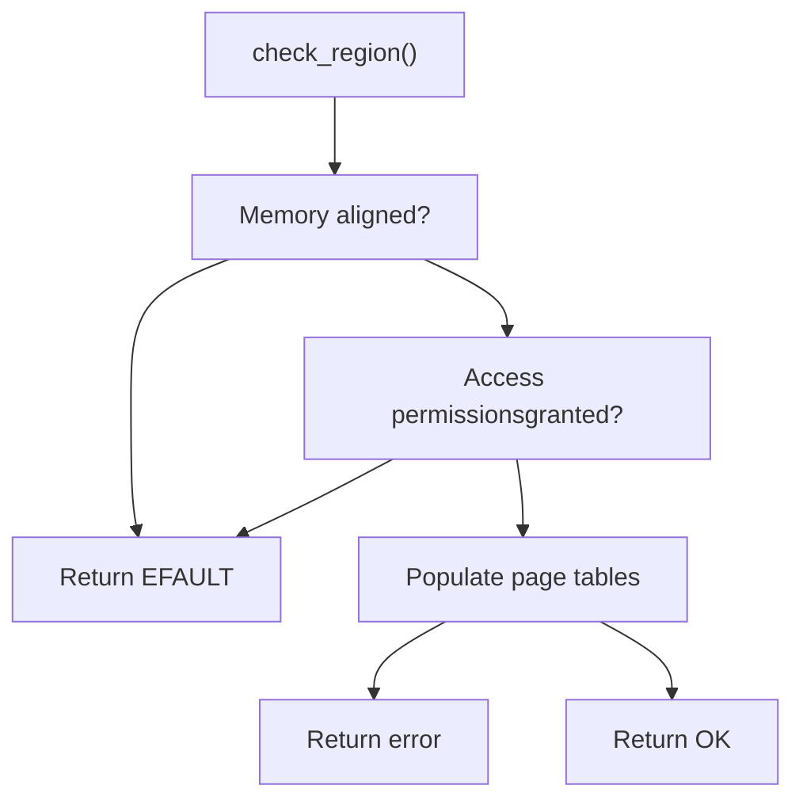
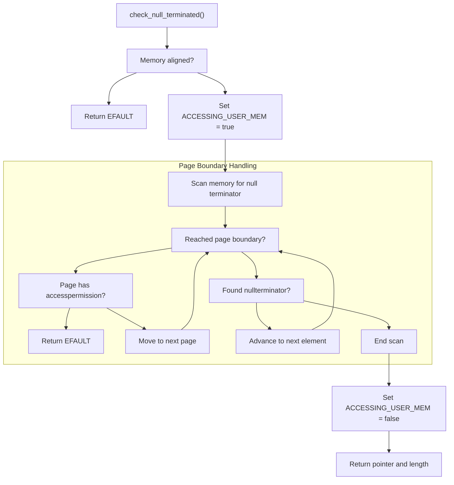

# Helper Functions

> **Relevant source files**
> * [src/lib.rs](https://github.com/Starry-OS/axptr/blob/7341852d/src/lib.rs)

This document describes the utility functions in the axptr library that support safe user-space memory access in kernel code. These helper functions implement the core safety mechanisms behind the `UserPtr` and `UserConstPtr` types but are not typically used directly by client code. For information about the user pointer types themselves, see [UserPtr API](/Starry-OS/axptr/5.1-userptr-api) and [UserConstPtr API](/Starry-OS/axptr/5.2-userconstptr-api).

## Per-CPU Flag System

The foundation of axptr's safety system is a per-CPU boolean flag that tracks when the kernel is accessing user memory.



Sources: [src/lib.rs(L11 - L29)&emsp;](https://github.com/Starry-OS/axptr/blob/7341852d/src/lib.rs#L11-L29)

The library provides two key functions for working with this system:

1. **`is_accessing_user_memory()`**: A public function that returns the current state of the `ACCESSING_USER_MEM` flag. Operating system implementations should check this flag when handling page faults in kernel mode - if it returns true, page faults should be allowed to proceed (as they might be from legitimate user memory access attempts).
2. **`access_user_memory<R>(f: impl FnOnce() -> R) -> R`**: An internal function that executes a callback with the user memory access flag set to true. This function:

* Sets the `ACCESSING_USER_MEM` flag to true
* Executes the provided callback function
* Restores the flag to false
* Returns the result of the callback

The `ACCESSING_USER_MEM` flag is implemented as a per-CPU variable using the `percpu` crate to ensure thread safety without locking overhead.

## Memory Region Validation

Before accessing user memory, axptr performs thorough validation using the `check_region` function.



Sources: [src/lib.rs(L31 - L54)&emsp;](https://github.com/Starry-OS/axptr/blob/7341852d/src/lib.rs#L31-L54)

The `check_region` function performs several critical checks:

1. **Alignment Validation**: Verifies that the start address has proper alignment for the requested data type. If misaligned, returns `EFAULT`.
2. **Access Permission Check**: Uses the `AddrSpace.check_region_access()` method to verify that the memory region has the appropriate access permissions (read/write).
3. **Page Table Population**: Calls `AddrSpace.populate_area()` to ensure that page tables are set up correctly for the memory region. This may involve mapping physical pages if they're not already mapped.

The library also provides a wrapper function `check_region_with` that works with the `AddrSpaceProvider` trait, simplifying its usage from the pointer types.

## Null-Terminated Data Processing

A specialized helper function handles the common case of accessing null-terminated data (like C strings) from user space.



Sources: [src/lib.rs(L56 - L107)&emsp;](https://github.com/Starry-OS/axptr/blob/7341852d/src/lib.rs#L56-L107)

The `check_null_terminated<T>` function provides a safe way to access variable-length, null-terminated data from user space:

1. **Initial Alignment Check**: Verifies the start address has proper alignment for type T.
2. **Page-by-Page Scanning**: Processes memory one page at a time, checking permissions at each page boundary. This approach allows handling of strings that span multiple pages.
3. **Safe Memory Access**: Uses the `access_user_memory()` function to set the `ACCESSING_USER_MEM` flag during scanning, allowing proper handling of page faults that might occur.
4. **Null Terminator Detection**: Reads each element using `read_volatile()` and compares it to the default value (`T::default()`) to find the null terminator.

This function supports the implementation of `get_as_null_terminated()` in both `UserPtr` and `UserConstPtr` types, as well as `get_as_str()` for `UserConstPtr<c_char>`.

## Integration With Address Space Provider

The helper functions integrate with the address space abstraction through the `check_region_with` function.

```

```

Sources: [src/lib.rs(L110 - L117)&emsp;](https://github.com/Starry-OS/axptr/blob/7341852d/src/lib.rs#L110-L117) [src/lib.rs(L119 - L126)&emsp;](https://github.com/Starry-OS/axptr/blob/7341852d/src/lib.rs#L119-L126)

The `check_region_with` function serves as a bridge between the high-level pointer types and the low-level memory region validation:

1. It accepts an `AddrSpaceProvider` implementation (typically a reference to an `AddrSpace`)
2. It calls `with_addr_space()` on the provider to get access to the actual `AddrSpace`
3. It passes `check_region()` as a callback, forwarding the memory validation request
4. It returns the result of the validation

This design reduces code duplication and avoids excessive generic function instantiations, as noted in the source code comment.

## Helper Function Usage Patterns

The following table summarizes how the helper functions are used by the public API:

|Helper Function|Used By|Purpose|
| --- | --- | --- |
|is_accessing_user_memory()|OS implementation|Determine if page faults in kernel mode should be allowed|
|access_user_memory()|check_null_terminated()|Set flag during user memory scanning|
|check_region()|check_region_with()|Validate memory region alignment and permissions|
|check_null_terminated()|get_as_null_terminated()|Safely scan for null-terminated data|
|check_region_with()|UserPtr::get(),UserConstPtr::get(), etc.|Bridge between pointer types and memory validation|

Sources: [src/lib.rs(L175 - L182)&emsp;](https://github.com/Starry-OS/axptr/blob/7341852d/src/lib.rs#L175-L182) [src/lib.rs(L204 - L216)&emsp;](https://github.com/Starry-OS/axptr/blob/7341852d/src/lib.rs#L204-L216) [src/lib.rs(L258 - L266)&emsp;](https://github.com/Starry-OS/axptr/blob/7341852d/src/lib.rs#L258-L266) [src/lib.rs(L282 - L291)&emsp;](https://github.com/Starry-OS/axptr/blob/7341852d/src/lib.rs#L282-L291)

These helper functions work together to create a comprehensive safety system that prevents the kernel from crashing when accessing user memory, while maintaining good performance and ergonomics.