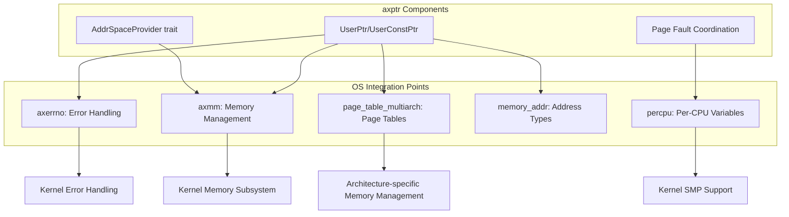
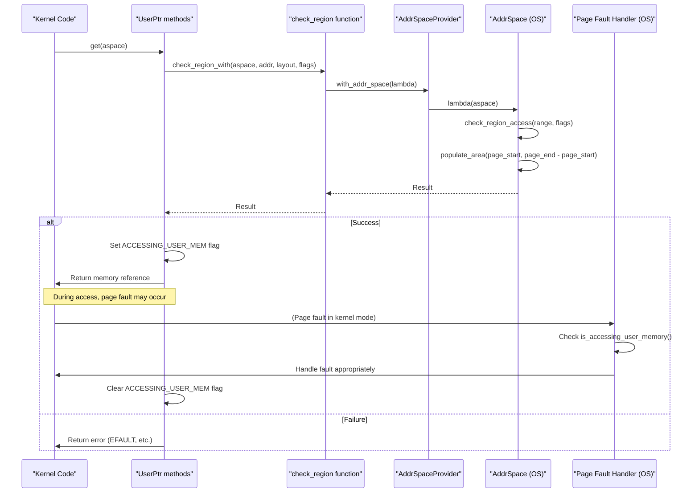
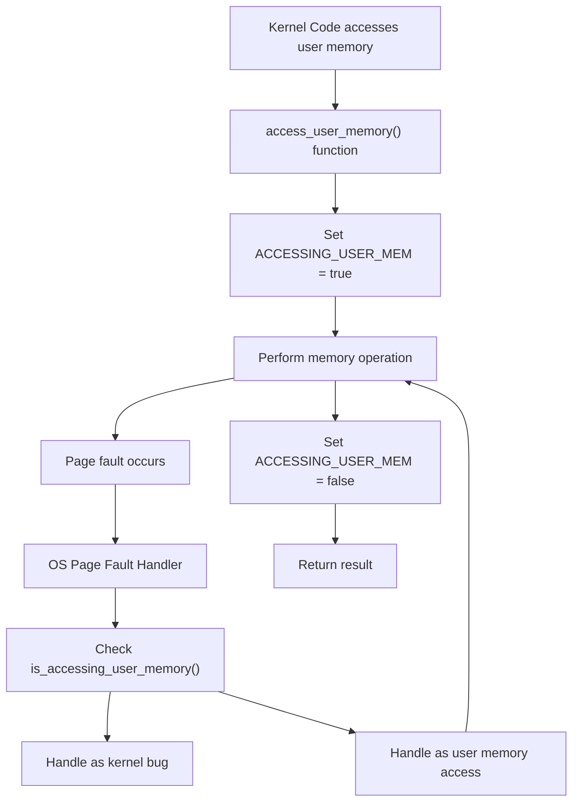
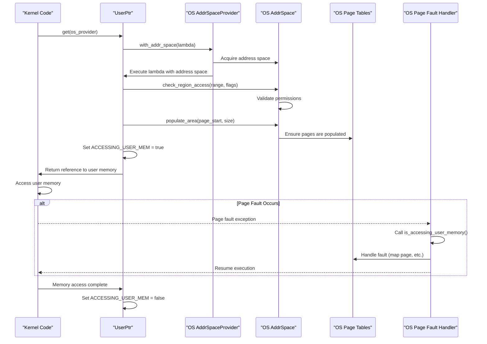

# Integration with Operating System

> **Relevant source files**
> * [Cargo.toml](https://github.com/Starry-OS/axptr/blob/7341852d/Cargo.toml)
> * [src/lib.rs](https://github.com/Starry-OS/axptr/blob/7341852d/src/lib.rs)

This page documents how the `axptr` library integrates with the underlying operating system components to provide safe user memory access from kernel code. We cover the dependency architecture, memory management integration, error handling, and page fault coordination that enable `axptr` to function within a broader OS environment.

For information about the core pointer types and their usage, see [User Space Pointers](/Starry-OS/axptr/2.1-user-space-pointers). For details on safety mechanisms, see [Safety Mechanisms](/Starry-OS/axptr/3-safety-mechanisms).

## Dependency Architecture

The `axptr` library depends on several OS components to provide its functionality:



The diagram illustrates how `axptr` interfaces with various operating system components through its dependencies. These dependencies allow `axptr` to leverage the kernel's existing infrastructure for memory management, error handling, and multi-core support.

Sources: [Cargo.toml(L7 - L12)&emsp;](https://github.com/Starry-OS/axptr/blob/7341852d/Cargo.toml#L7-L12) [src/lib.rs(L4 - L11)&emsp;](https://github.com/Starry-OS/axptr/blob/7341852d/src/lib.rs#L4-L11)

## Memory Management Integration

`axptr` integrates with the OS memory management system primarily through the `axmm` crate, which provides the `AddrSpace` abstraction. This integration enables `axptr` to:

1. Check permissions for memory regions
2. Populate page tables as needed
3. Enforce proper memory alignment
4. Handle page faults gracefully

### Address Space Provider Mechanism

The `AddrSpaceProvider` trait serves as the primary integration point between `axptr` and the OS memory management subsystem:

```

```

The trait is designed to be simple enough that OS-specific implementations can easily provide access to the appropriate address space, while still allowing for thread-safety and context-specific behavior.

Sources: [src/lib.rs(L119 - L126)&emsp;](https://github.com/Starry-OS/axptr/blob/7341852d/src/lib.rs#L119-L126)

### Memory Access Workflow

When kernel code attempts to access user memory through `UserPtr` or `UserConstPtr`, the following sequence occurs:



This workflow demonstrates how `axptr` coordinates with the OS memory management subsystem to safely access user memory, involving permission checks, page table population, and page fault handling.

Sources: [src/lib.rs(L31 - L54)&emsp;](https://github.com/Starry-OS/axptr/blob/7341852d/src/lib.rs#L31-L54) [src/lib.rs(L175 - L198)&emsp;](https://github.com/Starry-OS/axptr/blob/7341852d/src/lib.rs#L175-L198) [src/lib.rs(L258 - L277)&emsp;](https://github.com/Starry-OS/axptr/blob/7341852d/src/lib.rs#L258-L277)

## Error Handling Integration

`axptr` uses the `axerrno` crate for Linux-compatible error codes. This integration ensures that errors from user memory access operations can be properly propagated to OS-specific error handling systems.

The primary error codes used by `axptr` include:

|Error Code|Description|Usage inaxptr|
| --- | --- | --- |
|EFAULT|Bad address|Returned for misaligned or inaccessible memory regions|
|EILSEQ|Illegal byte sequence|Returned when string conversion fails inget_as_str|

The error handling flow integrates with the OS through the `LinuxResult` type, which is a `Result<T, LinuxError>` that can be directly used by OS components or converted to OS-specific error types.

Sources: [src/lib.rs(L4)&emsp;](https://github.com/Starry-OS/axptr/blob/7341852d/src/lib.rs#L4-L4) [src/lib.rs(L36 - L47)&emsp;](https://github.com/Starry-OS/axptr/blob/7341852d/src/lib.rs#L36-L47) [src/lib.rs(L301)&emsp;](https://github.com/Starry-OS/axptr/blob/7341852d/src/lib.rs#L301-L301)

## Page Fault Coordination

One of the most critical aspects of OS integration is the coordination between `axptr` and the OS page fault handler. This is achieved through the `ACCESSING_USER_MEM` per-CPU flag:



This mechanism requires the OS page fault handler to check `is_accessing_user_memory()` when a page fault occurs in kernel mode. If true, the fault should be treated as a normal user memory access that may require page table updates or signal delivery. If false, it should be treated as a bug in the kernel.

Sources: [src/lib.rs(L11 - L29)&emsp;](https://github.com/Starry-OS/axptr/blob/7341852d/src/lib.rs#L11-L29) [src/lib.rs(L73 - L104)&emsp;](https://github.com/Starry-OS/axptr/blob/7341852d/src/lib.rs#L73-L104)

## Implementation of AddrSpaceProvider

Operating systems integrating with `axptr` must provide an implementation of the `AddrSpaceProvider` trait. The library provides a simple implementation for `&mut AddrSpace`, but OS-specific implementations might include:

1. Process-specific address space providers
2. Thread-specific address space providers
3. Providers that switch to user address spaces temporarily

The implementation should ensure that:

* The correct address space is used for the current context
* Any necessary locking or synchronization is handled
* The address space remains valid throughout the operation

Example of the default implementation:

```rust
impl AddrSpaceProvider for &mut AddrSpace {
    fn with_addr_space<R>(&mut self, f: impl FnOnce(&mut AddrSpace) -> R) -> R {
        f(self)
    }
}
```

Sources: [src/lib.rs(L119 - L126)&emsp;](https://github.com/Starry-OS/axptr/blob/7341852d/src/lib.rs#L119-L126)

## Dependency Requirements

The operating system must provide or accommodate the following components for proper integration with `axptr`:

|Dependency|Required Features|
| --- | --- |
|axmm|AddrSpace implementation with check_region_access and populate_area methods|
|page_table_multiarch|Support for mapping flags (READ, WRITE)|
|memory_addr|Address types and manipulation (VirtAddr, VirtAddrRange)|
|percpu|Per-CPU variable support for the ACCESSING_USER_MEM flag|
|axerrno|Linux-compatible error codes|

Each dependency provides essential functionality that `axptr` relies on to safely access user memory. The operating system must ensure these dependencies are properly implemented and available.

Sources: [Cargo.toml(L7 - L12)&emsp;](https://github.com/Starry-OS/axptr/blob/7341852d/Cargo.toml#L7-L12) [src/lib.rs(L4 - L11)&emsp;](https://github.com/Starry-OS/axptr/blob/7341852d/src/lib.rs#L4-L11)

## Integration Example Flow

The complete flow of integration between `axptr` and the operating system for a typical user memory access operation:



This diagram illustrates the complete integration flow, showing how various OS components interact with `axptr` during a user memory access operation, including the handling of page faults.

Sources: [src/lib.rs(L18 - L29)&emsp;](https://github.com/Starry-OS/axptr/blob/7341852d/src/lib.rs#L18-L29) [src/lib.rs(L31 - L54)&emsp;](https://github.com/Starry-OS/axptr/blob/7341852d/src/lib.rs#L31-L54) [src/lib.rs(L175 - L198)&emsp;](https://github.com/Starry-OS/axptr/blob/7341852d/src/lib.rs#L175-L198)