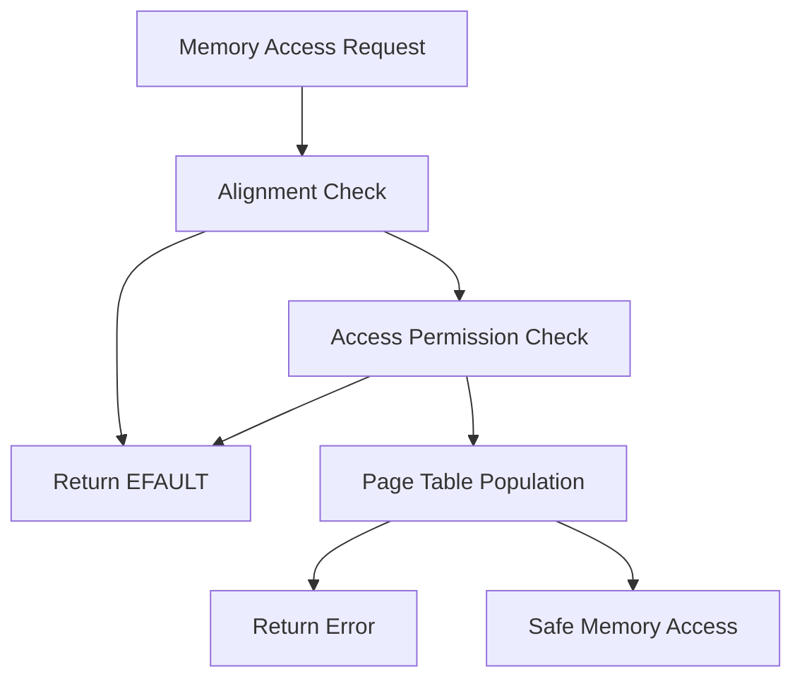
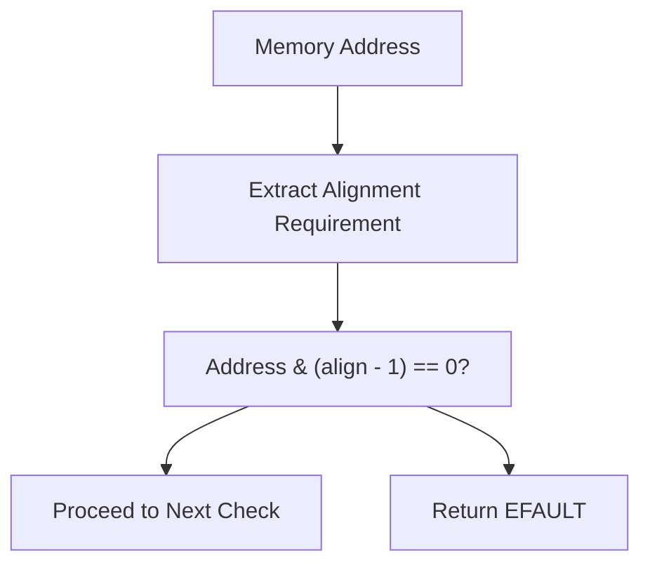
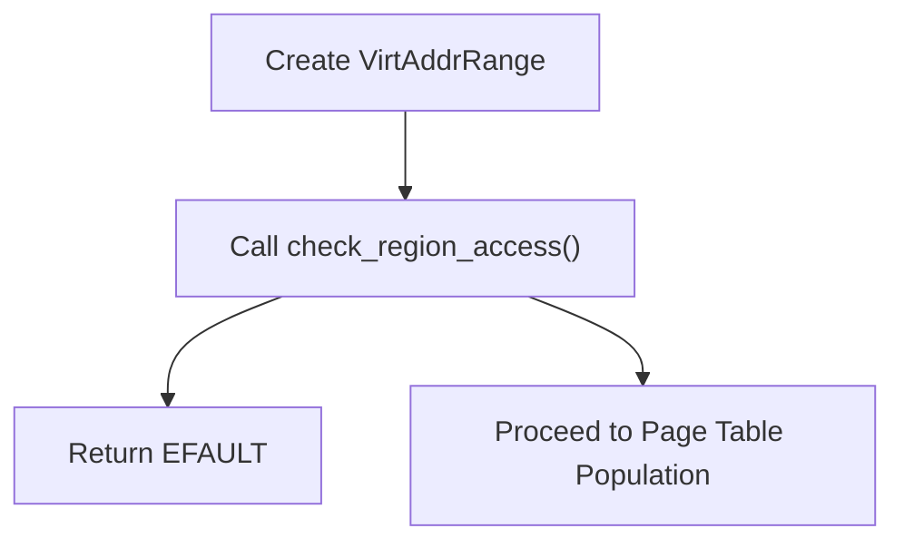
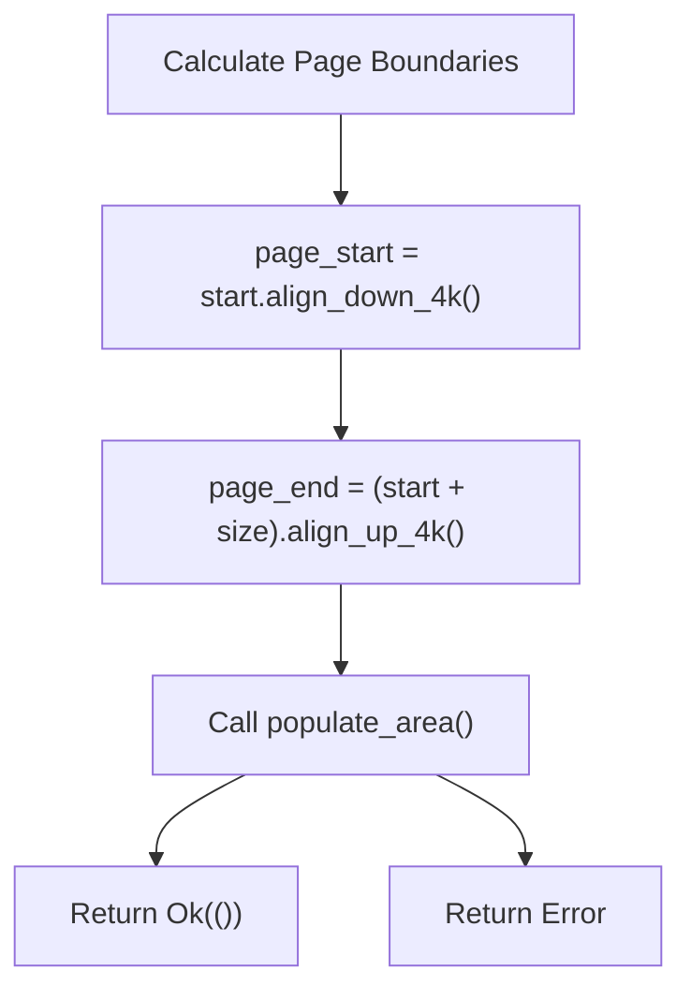
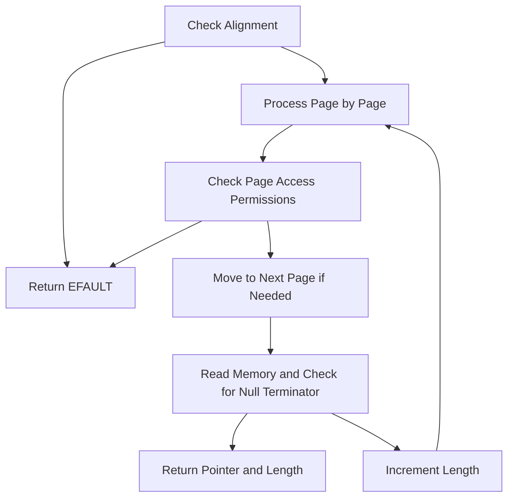
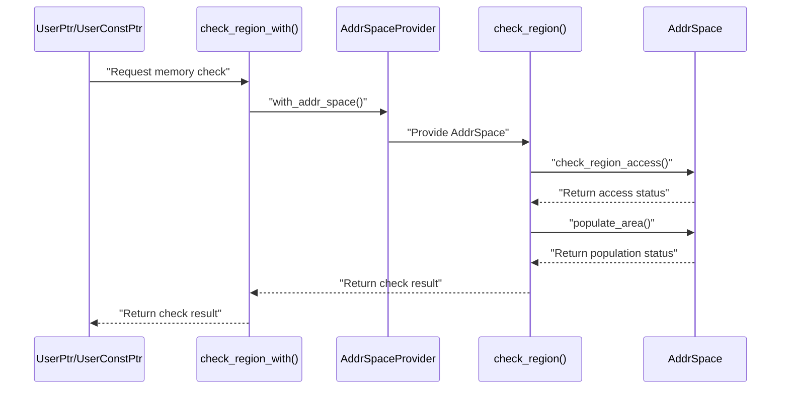

# Memory Region Checking

> **Relevant source files**
> * [src/lib.rs](https://github.com/Starry-OS/axptr/blob/7341852d/src/lib.rs)

## Purpose and Scope

This document explains the memory region checking mechanisms in the axptr library that validate user-space memory regions before they are accessed by kernel code. These validation mechanisms ensure memory safety by verifying alignment, access permissions, and page table population before allowing actual memory access. This is a critical component of the safety mechanisms in axptr.

For information about how page faults are handled during memory access, see [Context-Aware Page Fault Handling](/Starry-OS/axptr/3.2-context-aware-page-fault-handling).

## Overview

Memory region checking is a multi-step validation process that occurs before any user-space memory access. This process ensures that the kernel does not crash when accessing potentially invalid memory regions.



Sources: [src/lib.rs(L31 - L54)&emsp;](https://github.com/Starry-OS/axptr/blob/7341852d/src/lib.rs#L31-L54)

## Memory Region Checking Process

The memory region checking process happens in three main stages:

1. **Alignment Verification**: Ensures the memory address aligns with the required alignment for the data type
2. **Access Permission Checking**: Verifies the process has appropriate permissions for the memory region
3. **Page Table Population**: Ensures pages are mapped into memory before access

### Core Implementation

The central function for memory region checking is `check_region`, which takes an address space, starting address, memory layout, and access flags as parameters:

```

```

Sources: [src/lib.rs(L31 - L54)&emsp;](https://github.com/Starry-OS/axptr/blob/7341852d/src/lib.rs#L31-L54) [src/lib.rs(L110 - L117)&emsp;](https://github.com/Starry-OS/axptr/blob/7341852d/src/lib.rs#L110-L117)

## Alignment Verification

The first check performed is alignment verification, which ensures that the memory address is properly aligned for the data type being accessed.



For a memory address to be properly aligned, the memory address modulo the alignment requirement must be zero. This is checked using the bitwise AND operation:

```css
if start.as_usize() & (align - 1) != 0 {
    return Err(LinuxError::EFAULT);
}
```

Sources: [src/lib.rs(L37 - L40)&emsp;](https://github.com/Starry-OS/axptr/blob/7341852d/src/lib.rs#L37-L40) [src/lib.rs(L61 - L64)&emsp;](https://github.com/Starry-OS/axptr/blob/7341852d/src/lib.rs#L61-L64)

## Access Permission Checking

The second check verifies that the memory region has the appropriate access permissions:



The `check_region_access` method on the `AddrSpace` object determines if the current process has the necessary permissions to access the memory range with the specified access flags. The access flags are different for `UserPtr` (READ|WRITE) and `UserConstPtr` (READ only).

Sources: [src/lib.rs(L42 - L47)&emsp;](https://github.com/Starry-OS/axptr/blob/7341852d/src/lib.rs#L42-L47) [src/lib.rs(L137)&emsp;](https://github.com/Starry-OS/axptr/blob/7341852d/src/lib.rs#L137-L137) [src/lib.rs(L228)&emsp;](https://github.com/Starry-OS/axptr/blob/7341852d/src/lib.rs#L228-L228)

## Page Table Population

The final step is to ensure that the pages containing the memory region are mapped into physical memory:



This step aligns the address range to page boundaries and calls `populate_area` to ensure that all necessary pages are mapped and available for access.

Sources: [src/lib.rs(L49 - L53)&emsp;](https://github.com/Starry-OS/axptr/blob/7341852d/src/lib.rs#L49-L53)

## Null-Terminated Data Handling

A specialized checking mechanism exists for null-terminated data like C strings:



The `check_null_terminated` function scans memory page by page, checking access permissions for each page, until it finds the null terminator. This is used by the `get_as_null_terminated` methods on both pointer types.

Sources: [src/lib.rs(L56 - L107)&emsp;](https://github.com/Starry-OS/axptr/blob/7341852d/src/lib.rs#L56-L107) [src/lib.rs(L204 - L217)&emsp;](https://github.com/Starry-OS/axptr/blob/7341852d/src/lib.rs#L204-L217) [src/lib.rs(L282 - L291)&emsp;](https://github.com/Starry-OS/axptr/blob/7341852d/src/lib.rs#L282-L291)

## Integration With User Pointer Types

Memory region checking is integrated into the `UserPtr` and `UserConstPtr` types through their access methods:

```

```

Each access method performs the appropriate memory region checks before allowing access to the memory.

|Access Method|Purpose|Checks Performed|
| --- | --- | --- |
|get()|Access a single item|Alignment, permissions, page population|
|get_as_slice()|Access an array of items|Alignment, permissions, page population|
|get_as_null_terminated()|Access a null-terminated array|Alignment, permissions, page-by-page scanning|
|get_as_str()|Access a C string (UserConstPtr only)|All checks fromget_as_null_terminated()plus UTF-8 validation|

Sources: [src/lib.rs(L175 - L183)&emsp;](https://github.com/Starry-OS/axptr/blob/7341852d/src/lib.rs#L175-L183) [src/lib.rs(L186 - L198)&emsp;](https://github.com/Starry-OS/axptr/blob/7341852d/src/lib.rs#L186-L198) [src/lib.rs(L204 - L217)&emsp;](https://github.com/Starry-OS/axptr/blob/7341852d/src/lib.rs#L204-L217) [src/lib.rs(L258 - L266)&emsp;](https://github.com/Starry-OS/axptr/blob/7341852d/src/lib.rs#L258-L266) [src/lib.rs(L269 - L277)&emsp;](https://github.com/Starry-OS/axptr/blob/7341852d/src/lib.rs#L269-L277) [src/lib.rs(L282 - L291)&emsp;](https://github.com/Starry-OS/axptr/blob/7341852d/src/lib.rs#L282-L291) [src/lib.rs(L296 - L302)&emsp;](https://github.com/Starry-OS/axptr/blob/7341852d/src/lib.rs#L296-L302)

## Error Handling

Memory region checking functions propagate errors using the `LinuxResult` type. The primary error returned is `LinuxError::EFAULT`, which indicates an invalid address or permission error:

|Error Condition|Error Value|
| --- | --- |
|Misaligned address|EFAULT|
|Access permission denied|EFAULT|
|Page population failure|(Propagated frompopulate_area)|
|Invalid UTF-8 in string (forget_as_str)|EILSEQ|

Memory region checking ensures that these errors are detected before any actual memory access occurs, preventing kernel crashes.

Sources: [src/lib.rs(L39)&emsp;](https://github.com/Starry-OS/axptr/blob/7341852d/src/lib.rs#L39-L39) [src/lib.rs(L46)&emsp;](https://github.com/Starry-OS/axptr/blob/7341852d/src/lib.rs#L46-L46) [src/lib.rs(L51)&emsp;](https://github.com/Starry-OS/axptr/blob/7341852d/src/lib.rs#L51-L51) [src/lib.rs(L301)&emsp;](https://github.com/Starry-OS/axptr/blob/7341852d/src/lib.rs#L301-L301)

## Relationship with Address Space Management

Memory region checking relies on the address space management capabilities provided by the `AddrSpace` type:



The `AddrSpaceProvider` trait abstracts the process of obtaining an `AddrSpace` object, which provides the necessary methods for checking access permissions and populating page tables.

For more information about address space management, see [Address Space Management](/Starry-OS/axptr/2.2-address-space-management).

Sources: [src/lib.rs(L110 - L126)&emsp;](https://github.com/Starry-OS/axptr/blob/7341852d/src/lib.rs#L110-L126)

## Performance Considerations

Memory region checking adds overhead to each user memory access, but this overhead is necessary to maintain memory safety. The implementation includes some optimizations:

1. Alignment checks are performed first as they are the cheapest
2. Permission checks are done before attempting to populate page tables
3. Page population is done at page granularity to minimize the number of operations

For null-terminated data, the checking is more complex and potentially more expensive, as it must scan the data page by page until it finds the null terminator.

Sources: [src/lib.rs(L31 - L54)&emsp;](https://github.com/Starry-OS/axptr/blob/7341852d/src/lib.rs#L31-L54) [src/lib.rs(L56 - L107)&emsp;](https://github.com/Starry-OS/axptr/blob/7341852d/src/lib.rs#L56-L107)