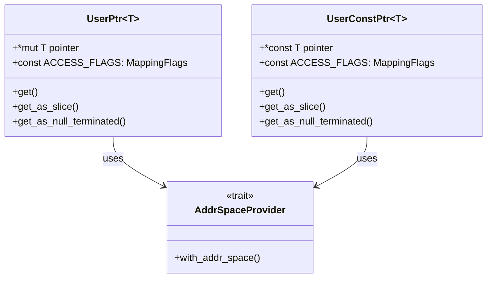
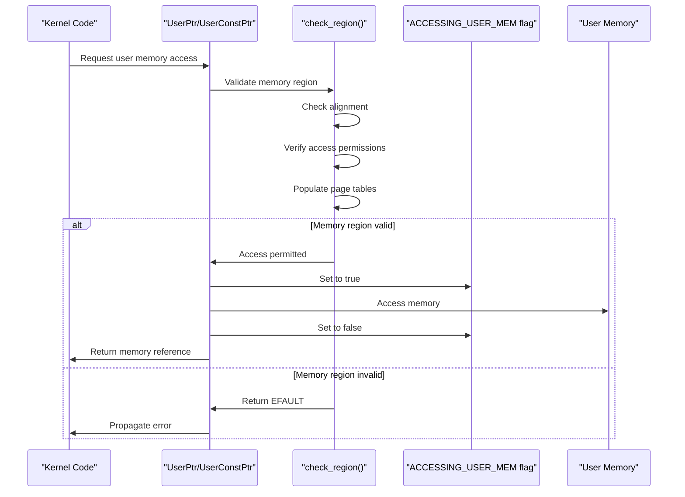
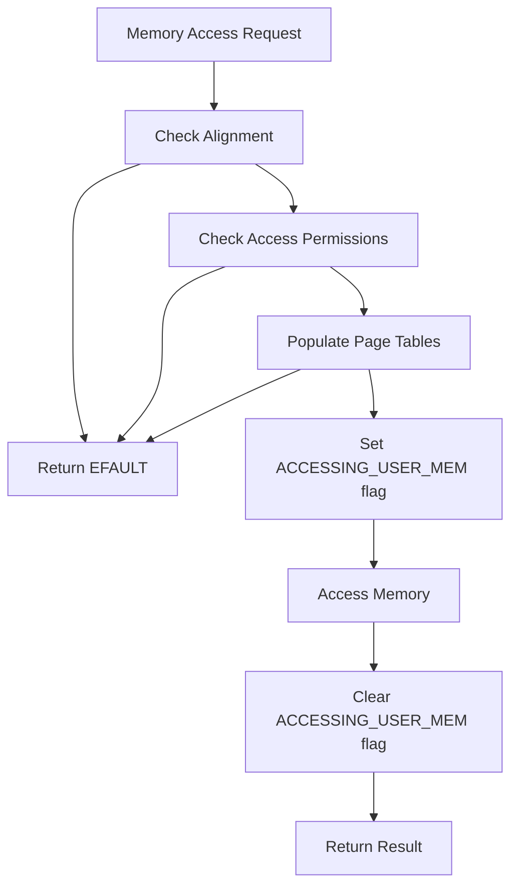
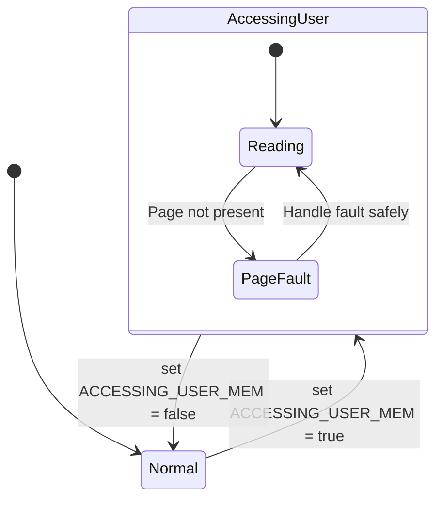
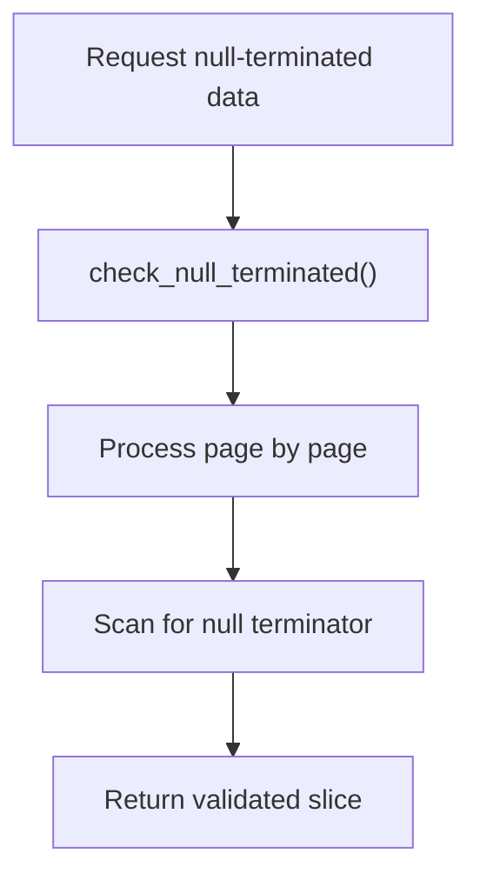
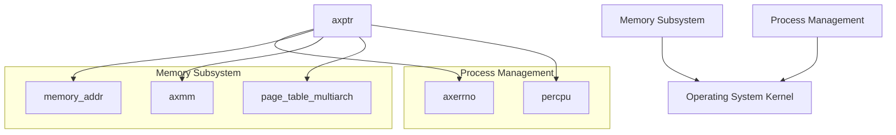

# Memory Safety Architecture

> **Relevant source files**
> * [Cargo.toml](https://github.com/Starry-OS/axptr/blob/7341852d/Cargo.toml)
> * [src/lib.rs](https://github.com/Starry-OS/axptr/blob/7341852d/src/lib.rs)

This document explains the core architecture and design principles of the memory safety system in the axptr library. It focuses on how the system provides a safe interface for kernel code to access user-space memory while preventing potential security vulnerabilities or system crashes. For details about specific pointer types, see [User Space Pointers](/Starry-OS/axptr/2.1-user-space-pointers), and for information about safety mechanisms, see [Safety Mechanisms](/Starry-OS/axptr/3-safety-mechanisms).

## Overview of Memory Safety Architecture

The axptr library implements a robust architecture to ensure memory operations across privilege boundaries (kernel accessing user memory) remain safe. The architecture is built around three key principles:

1. **Type-safe access** - Using strongly-typed pointer wrappers
2. **Memory region validation** - Ensuring pointers reference valid user memory regions
3. **Context-aware fault handling** - Managing page faults during user memory access

```

```

Sources: [src/lib.rs(L129 - L183)&emsp;](https://github.com/Starry-OS/axptr/blob/7341852d/src/lib.rs#L129-L183) [src/lib.rs(L219 - L254)&emsp;](https://github.com/Starry-OS/axptr/blob/7341852d/src/lib.rs#L219-L254)

## Core Components

The memory safety architecture consists of these fundamental components:

|Component|Description|Role|
| --- | --- | --- |
|UserPtr<T>|Typed wrapper for mutable user pointers|Provides safe access to user memory with read/write permissions|
|UserConstPtr<T>|Typed wrapper for immutable user pointers|Provides safe access to user memory with read-only permissions|
|AddrSpaceProvider|Trait for address space operations|Abstracts address space lookup and access control|
|Memory checking functions|Safety validation utilities|Verifies memory region alignment, permissions, and availability|
|Context tracking|Page fault handling mechanism|Manages page faults during user memory access|



Sources: [src/lib.rs(L119 - L126)&emsp;](https://github.com/Starry-OS/axptr/blob/7341852d/src/lib.rs#L119-L126) [src/lib.rs(L129 - L134)&emsp;](https://github.com/Starry-OS/axptr/blob/7341852d/src/lib.rs#L129-L134) [src/lib.rs(L219 - L225)&emsp;](https://github.com/Starry-OS/axptr/blob/7341852d/src/lib.rs#L219-L225)

## Memory Access Workflow

The core workflow for safely accessing user memory follows these steps:



Sources: [src/lib.rs(L31 - L54)&emsp;](https://github.com/Starry-OS/axptr/blob/7341852d/src/lib.rs#L31-L54) [src/lib.rs(L11 - L29)&emsp;](https://github.com/Starry-OS/axptr/blob/7341852d/src/lib.rs#L11-L29) [src/lib.rs(L175 - L183)&emsp;](https://github.com/Starry-OS/axptr/blob/7341852d/src/lib.rs#L175-L183)

## Memory Region Validation

Before any user memory access, a series of validation steps ensure memory safety:

1. **Alignment Checking**: Ensures the pointer is properly aligned for the requested type
2. **Access Permission Verification**: Checks that the memory region has appropriate read/write permissions
3. **Page Table Population**: Ensures that all required pages are mapped in the address space



Sources: [src/lib.rs(L31 - L54)&emsp;](https://github.com/Starry-OS/axptr/blob/7341852d/src/lib.rs#L31-L54) [src/lib.rs(L110 - L117)&emsp;](https://github.com/Starry-OS/axptr/blob/7341852d/src/lib.rs#L110-L117)

## Context-Aware Page Fault Handling

A key aspect of the memory safety architecture is handling page faults during user memory access. This is accomplished through the `ACCESSING_USER_MEM` flag, which indicates when the kernel is accessing user memory.



The architecture uses a per-CPU variable to track this state:

```
#[percpu::def_percpu]
static mut ACCESSING_USER_MEM: bool = false;
```

When set to true, the OS knows that any page faults occurring should be handled differently than regular kernel page faults, preventing kernel crashes from invalid user memory accesses.

Sources: [src/lib.rs(L11 - L29)&emsp;](https://github.com/Starry-OS/axptr/blob/7341852d/src/lib.rs#L11-L29) [src/lib.rs(L22 - L29)&emsp;](https://github.com/Starry-OS/axptr/blob/7341852d/src/lib.rs#L22-L29)

## Null-Terminated Data Handling

The architecture includes specialized handling for null-terminated data like C strings, which is particularly important for OS interfaces:



This process efficiently handles null-terminated structures while maintaining safety guarantees by:

1. Validating pages incrementally as needed
2. Handling page faults appropriately during traversal
3. Returning the correctly sized slice or string when the null terminator is found

Sources: [src/lib.rs(L56 - L107)&emsp;](https://github.com/Starry-OS/axptr/blob/7341852d/src/lib.rs#L56-L107) [src/lib.rs(L202 - L217)&emsp;](https://github.com/Starry-OS/axptr/blob/7341852d/src/lib.rs#L202-L217) [src/lib.rs(L280 - L303)&emsp;](https://github.com/Starry-OS/axptr/blob/7341852d/src/lib.rs#L280-L303)

## Security Implications

The memory safety architecture provides critical security guarantees:

1. **Protection against invalid memory access**: Prevents kernel crashes from accessing invalid user memory
2. **Defense against privilege escalation**: Ensures kernel code can only access user memory with proper permissions
3. **Safety from malicious user input**: Validates user-provided pointers before use

By combining strong typing, rigorous validation, and context-aware fault handling, the architecture creates a comprehensive barrier against memory-related security vulnerabilities when crossing privilege boundaries.

Sources: [src/lib.rs(L31 - L54)&emsp;](https://github.com/Starry-OS/axptr/blob/7341852d/src/lib.rs#L31-L54) [src/lib.rs(L11 - L29)&emsp;](https://github.com/Starry-OS/axptr/blob/7341852d/src/lib.rs#L11-L29)

## Integration with Operating System

The architecture is designed to integrate with operating systems through:



The architecture's dependencies enable it to work with the underlying memory management system while providing a consistent error handling mechanism through Linux-compatible error codes.

Sources: [Cargo.toml(L7 - L12)&emsp;](https://github.com/Starry-OS/axptr/blob/7341852d/Cargo.toml#L7-L12)