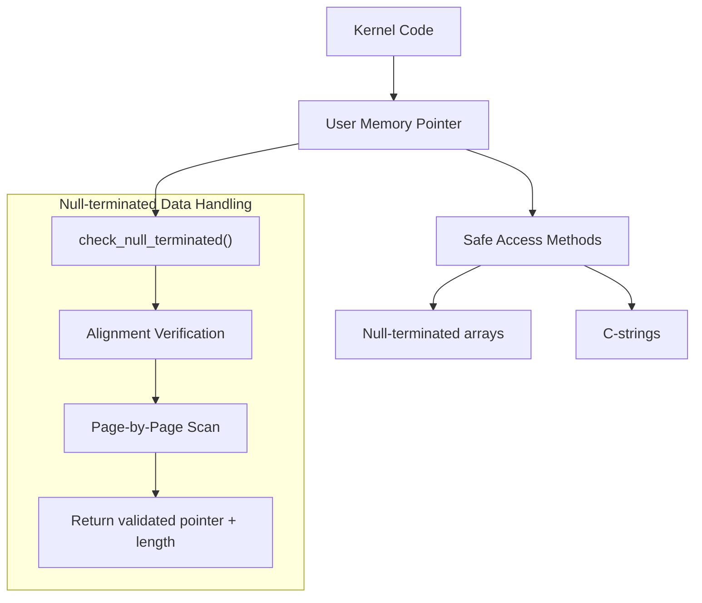
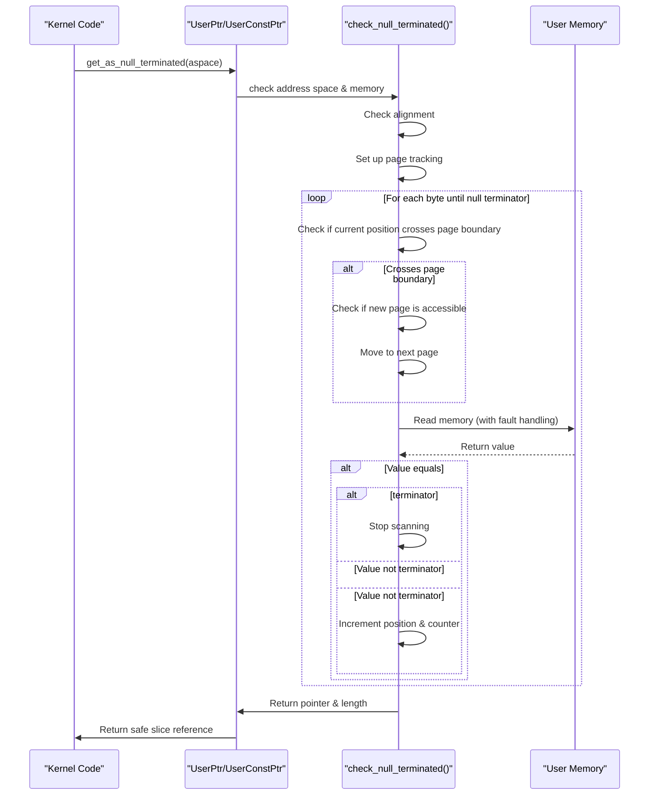
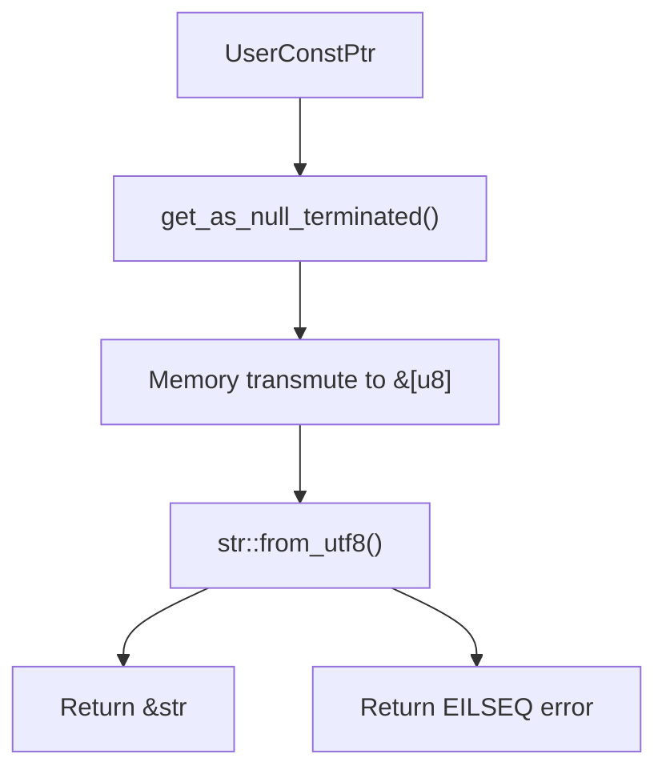

# Null-Terminated Data Handling

> **Relevant source files**
> * [src/lib.rs](https://github.com/Starry-OS/axptr/blob/7341852d/src/lib.rs)

## Purpose and Scope

This document explains how the axptr library safely handles null-terminated data structures in user memory, such as C-style strings and arrays. These special data structures have variable length and are terminated by a sentinel "null" value rather than having an explicit length parameter. For information about general memory region checking, see [Memory Region Checking](/Starry-OS/axptr/3.1-memory-region-checking).

## Overview

Null-terminated data structures present unique challenges for safe memory access. Unlike fixed-size arrays, their length cannot be determined without scanning the memory until a null terminator is found. This requires special handling to ensure memory safety while efficiently accessing these structures.



Sources: [src/lib.rs(L56 - L107)&emsp;](https://github.com/Starry-OS/axptr/blob/7341852d/src/lib.rs#L56-L107) [src/lib.rs(L204 - L217)&emsp;](https://github.com/Starry-OS/axptr/blob/7341852d/src/lib.rs#L204-L217) [src/lib.rs(L282 - L292)&emsp;](https://github.com/Starry-OS/axptr/blob/7341852d/src/lib.rs#L282-L292) [src/lib.rs(L294 - L303)&emsp;](https://github.com/Starry-OS/axptr/blob/7341852d/src/lib.rs#L294-L303)

## Core Mechanism

The axptr library implements a specialized mechanism for safely handling null-terminated data from user space. This is performed by the `check_null_terminated` function.



Sources: [src/lib.rs(L56 - L107)&emsp;](https://github.com/Starry-OS/axptr/blob/7341852d/src/lib.rs#L56-L107)

### Memory Layout Processing

The function processes null-terminated data by checking memory one page at a time, efficiently handling arbitrarily long data structures without needing to know their size in advance.

1. **Alignment Check**: Ensures the starting address is properly aligned for the specified type.
2. **Page-by-Page Processing**: Handles memory in page-sized chunks, validating each page before access.
3. **Safe Memory Reading**: Uses the `access_user_memory` function to safely read user memory with proper fault handling.
4. **Terminator Detection**: Scans until it finds the terminator value (default value of type T).

The function returns a raw pointer to the start of the data and its length (excluding the terminator).

Sources: [src/lib.rs(L56 - L107)&emsp;](https://github.com/Starry-OS/axptr/blob/7341852d/src/lib.rs#L56-L107)

## Access Methods for Null-Terminated Data

The library provides specialized methods for both `UserPtr<T>` and `UserConstPtr<T>` to handle null-terminated data.

### Methods for UserPtr

`UserPtr<T>` provides the `get_as_null_terminated` method for accessing mutable null-terminated arrays:

```

```

For types that implement `Eq + Default`, this method:

1. Calls `check_null_terminated` with the appropriate access flags
2. Converts the raw pointer and length into a safe mutable slice
3. Returns the slice wrapped in a `LinuxResult`

Sources: [src/lib.rs(L204 - L217)&emsp;](https://github.com/Starry-OS/axptr/blob/7341852d/src/lib.rs#L204-L217)

### Methods for UserConstPtr

Similarly, `UserConstPtr<T>` provides a read-only version of the same functionality:

```

```

Sources: [src/lib.rs(L282 - L292)&emsp;](https://github.com/Starry-OS/axptr/blob/7341852d/src/lib.rs#L282-L292)

## C-String Handling

The library includes specialized handling for C-style strings through the `get_as_str` method on `UserConstPtr<c_char>`.

### Processing Flow



Sources: [src/lib.rs(L294 - L303)&emsp;](https://github.com/Starry-OS/axptr/blob/7341852d/src/lib.rs#L294-L303)

This method:

1. Gets the null-terminated array of `c_char` characters
2. Transmutes the slice from `&[c_char]` to `&[u8]` (safe since `c_char` is `u8`)
3. Attempts to parse the byte slice as a UTF-8 string
4. Returns either a valid string slice or an error if the string is not valid UTF-8

Sources: [src/lib.rs(L294 - L303)&emsp;](https://github.com/Starry-OS/axptr/blob/7341852d/src/lib.rs#L294-L303)

## Technical Implementation Details

### Accessing User Memory Safely

The `check_null_terminated` function uses the `access_user_memory` helper to safely access user memory while handling page faults properly. This ensures that:

1. The `ACCESSING_USER_MEM` flag is set to true during memory access
2. Any page faults occurring during the operation are handled correctly
3. The flag is reset to false after the operation completes

### Type Constraints

The null-terminated handling functions require that the type `T` implements both:

* `Eq` - To compare values for equality with the terminator
* `Default` - To create the terminator value (usually zero/null)

This allows the system to work with different types of null-terminated data beyond just strings.

### Memory Safety Guarantees

The null-terminated data handling system provides the following safety guarantees:

|Aspect|Guarantee|
| --- | --- |
|Memory Alignment|Ensures the pointer is properly aligned for type T|
|Access Permissions|Verifies each page has appropriate read/write permissions|
|Page Faults|Handles page faults during user memory access|
|Memory Boundaries|Safely traverses page boundaries|
|Data Validation|Ensures data is properly terminated|
|UTF-8 Validation|Validates UTF-8 encoding for strings|

Sources: [src/lib.rs(L56 - L107)&emsp;](https://github.com/Starry-OS/axptr/blob/7341852d/src/lib.rs#L56-L107) [src/lib.rs(L204 - L217)&emsp;](https://github.com/Starry-OS/axptr/blob/7341852d/src/lib.rs#L204-L217) [src/lib.rs(L282 - L292)&emsp;](https://github.com/Starry-OS/axptr/blob/7341852d/src/lib.rs#L282-L292) [src/lib.rs(L294 - L303)&emsp;](https://github.com/Starry-OS/axptr/blob/7341852d/src/lib.rs#L294-L303)

## Practical Considerations

### Performance Characteristics

Scanning for null terminators can potentially traverse many pages of memory, especially for long strings or arrays. The implementation optimizes this by:

1. Checking page boundaries only when necessary
2. Validating permissions at the page level, not for each element
3. Using volatile reads for maximum safety with minimal overhead

### Error Handling

The null-terminated data methods return `LinuxResult` values with appropriate error codes:

* `EFAULT` - If memory is inaccessible or improperly aligned
* `EILSEQ` - If string data is not valid UTF-8 (for `get_as_str`)

Sources: [src/lib.rs(L56 - L107)&emsp;](https://github.com/Starry-OS/axptr/blob/7341852d/src/lib.rs#L56-L107) [src/lib.rs(L294 - L303)&emsp;](https://github.com/Starry-OS/axptr/blob/7341852d/src/lib.rs#L294-L303)