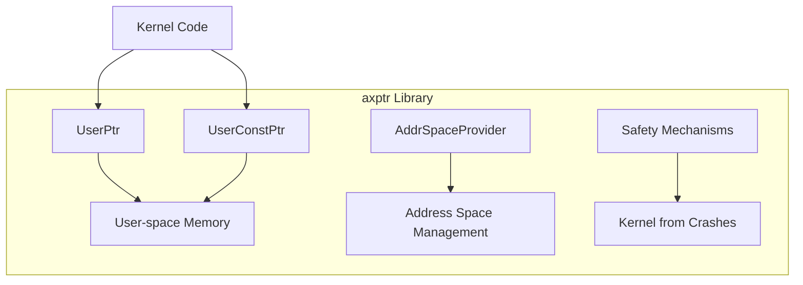
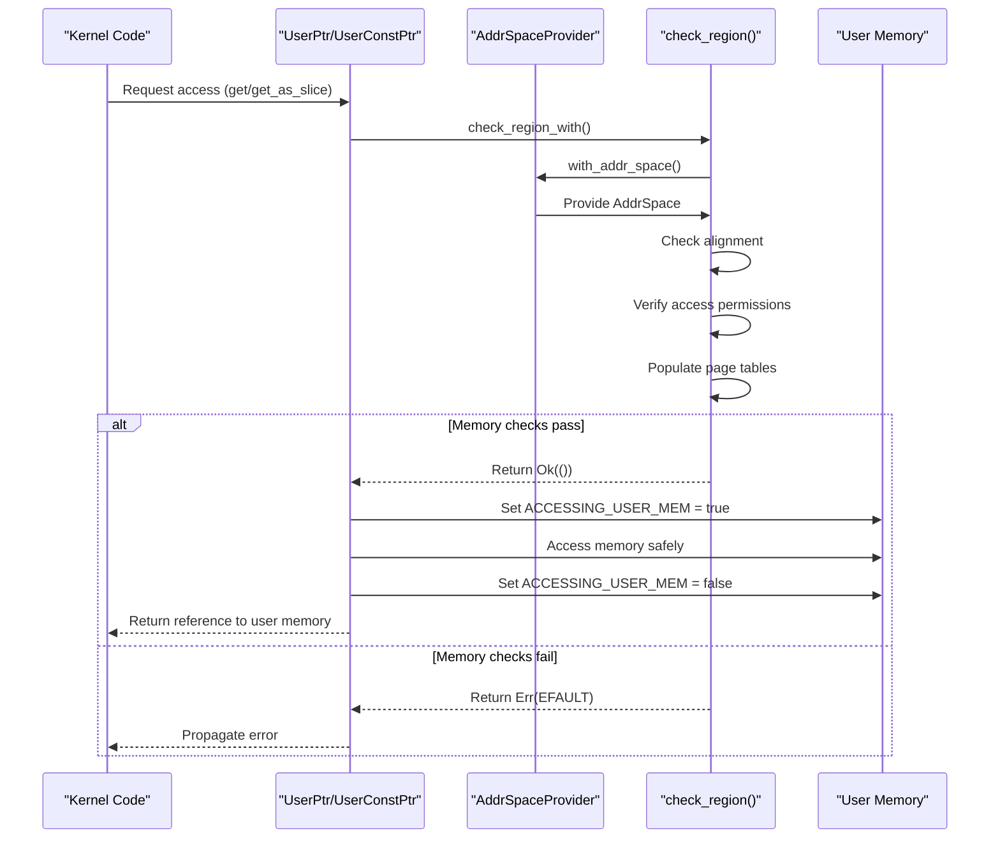
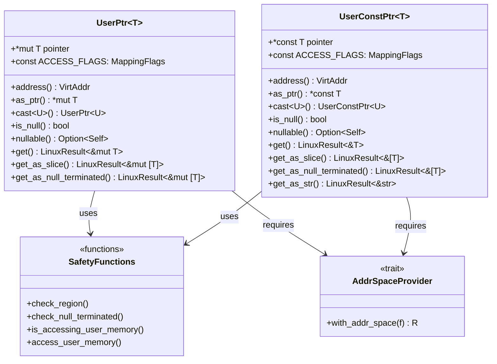
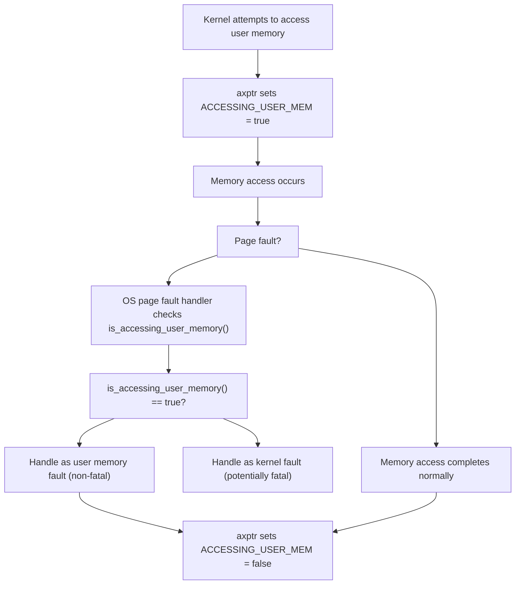

# Overview

> **Relevant source files**
> * [.gitignore](https://github.com/Starry-OS/axptr/blob/7341852d/.gitignore)
> * [Cargo.toml](https://github.com/Starry-OS/axptr/blob/7341852d/Cargo.toml)
> * [src/lib.rs](https://github.com/Starry-OS/axptr/blob/7341852d/src/lib.rs)

The `axptr` library provides a safe abstraction for kernel code to access user-space memory. It prevents the kernel from crashing when accessing potentially invalid user memory while providing a convenient API for common user memory operations. This page introduces the main components of `axptr` and provides a high-level understanding of its architecture.

For detailed information about the specific pointer types used for memory safety, see [User Space Pointers](/Starry-OS/axptr/2.1-user-space-pointers). For comprehensive information about the safety mechanisms, see [Safety Mechanisms](/Starry-OS/axptr/3-safety-mechanisms).

## Purpose and Scope

`axptr` addresses a common challenge in operating system development: safely accessing memory that belongs to user processes. User-provided pointers can't be trusted directly because they might:

* Point to invalid memory addresses
* Have insufficient access permissions
* Be improperly aligned
* Cause page faults that could crash the kernel

This library provides a robust solution by wrapping raw pointers with safety checks and contextual page fault handling.

Sources: [src/lib.rs(L1)&emsp;](https://github.com/Starry-OS/axptr/blob/7341852d/src/lib.rs#L1-L1)

## Key Components

The library consists of several key components that work together to provide safe access to user-space memory:

1. **User pointers**:

* `UserPtr<T>`: A wrapper around `*mut T` for safe mutable access to user memory
* `UserConstPtr<T>`: A wrapper around `*const T` for safe read-only access to user memory
2. **Address space abstraction**:

* `AddrSpaceProvider`: A trait that abstracts operations for working with address spaces
3. **Safety mechanisms**:

* Alignment checking
* Access permission validation
* Page table population
* Context-aware page fault handling

Sources: [src/lib.rs(L128 - L170)&emsp;](https://github.com/Starry-OS/axptr/blob/7341852d/src/lib.rs#L128-L170) [src/lib.rs(L219 - L254)&emsp;](https://github.com/Starry-OS/axptr/blob/7341852d/src/lib.rs#L219-L254) [src/lib.rs(L119 - L126)&emsp;](https://github.com/Starry-OS/axptr/blob/7341852d/src/lib.rs#L119-L126) [src/lib.rs(L31 - L54)&emsp;](https://github.com/Starry-OS/axptr/blob/7341852d/src/lib.rs#L31-L54)

## Memory Access Flow

The following diagram illustrates the typical flow when kernel code accesses user-space memory through `axptr`:

When a kernel function wants to access user memory:

1. It calls a method like `get()` or `get_as_slice()` on a user pointer
2. The user pointer performs safety checks through `check_region()`
3. If checks pass, the pointer accesses memory with special handling for page faults
4. A reference to the memory is returned or an error if access is invalid

Sources: [src/lib.rs(L171 - L198)&emsp;](https://github.com/Starry-OS/axptr/blob/7341852d/src/lib.rs#L171-L198) [src/lib.rs(L256 - L277)&emsp;](https://github.com/Starry-OS/axptr/blob/7341852d/src/lib.rs#L256-L277) [src/lib.rs(L31 - L54)&emsp;](https://github.com/Starry-OS/axptr/blob/7341852d/src/lib.rs#L31-L54) [src/lib.rs(L22 - L29)&emsp;](https://github.com/Starry-OS/axptr/blob/7341852d/src/lib.rs#L22-L29)

## Code Architecture

The following diagram shows the relationship between the main types and their important methods:

The architecture follows these principles:

* Separate types for mutable (`UserPtr`) and read-only (`UserConstPtr`) access
* A trait (`AddrSpaceProvider`) to abstract address space operations
* Helper functions to manage safety checks and context-aware page fault handling
* Methods on user pointer types for common operations like getting a single value, a slice, or a null-terminated array

Sources: [src/lib.rs(L128 - L217)&emsp;](https://github.com/Starry-OS/axptr/blob/7341852d/src/lib.rs#L128-L217) [src/lib.rs(L219 - L303)&emsp;](https://github.com/Starry-OS/axptr/blob/7341852d/src/lib.rs#L219-L303) [src/lib.rs(L119 - L126)&emsp;](https://github.com/Starry-OS/axptr/blob/7341852d/src/lib.rs#L119-L126) [src/lib.rs(L18 - L107)&emsp;](https://github.com/Starry-OS/axptr/blob/7341852d/src/lib.rs#L18-L107)

## Context-Aware Page Fault Handling

One of the key safety features of `axptr` is context-aware page fault handling:

This mechanism allows the OS to distinguish between:

* Page faults that occur when intentionally accessing user memory (expected and should be handled gracefully)
* Page faults in kernel code (may indicate a kernel bug and could be treated more severely)

The `is_accessing_user_memory()` function is provided for OS page fault handlers to check this context.

Sources: [src/lib.rs(L11 - L20)&emsp;](https://github.com/Starry-OS/axptr/blob/7341852d/src/lib.rs#L11-L20) [src/lib.rs(L22 - L29)&emsp;](https://github.com/Starry-OS/axptr/blob/7341852d/src/lib.rs#L22-L29)

## Dependencies

`axptr` has the following key dependencies:

|Dependency|Purpose|
| --- | --- |
|axerrno|Provides error codes and result types (LinuxError,LinuxResult)|
|axmm|Memory management, providesAddrSpace|
|memory_addr|Virtual address manipulation|
|page_table_multiarch|Page table and memory mapping flags|
|percpu|Per-CPU variable support|

Sources: [src/lib.rs(L4 - L7)&emsp;](https://github.com/Starry-OS/axptr/blob/7341852d/src/lib.rs#L4-L7) [Cargo.toml(L7 - L12)&emsp;](https://github.com/Starry-OS/axptr/blob/7341852d/Cargo.toml#L7-L12)

## Conclusion

The `axptr` library provides a comprehensive solution for safely accessing user-space memory from kernel code. By wrapping raw pointers in smart container types that perform necessary safety checks and implement context-aware page fault handling, it helps prevent kernel crashes while providing a convenient API.

For more detailed information about specific components, refer to the following pages:

* [Memory Safety Architecture](/Starry-OS/axptr/2-memory-safety-architecture)
* [User Space Pointers](/Starry-OS/axptr/2.1-user-space-pointers)
* [Address Space Management](/Starry-OS/axptr/2.2-address-space-management)
* [Safety Mechanisms](/Starry-OS/axptr/3-safety-mechanisms)
* [API Reference](/Starry-OS/axptr/5-api-reference)