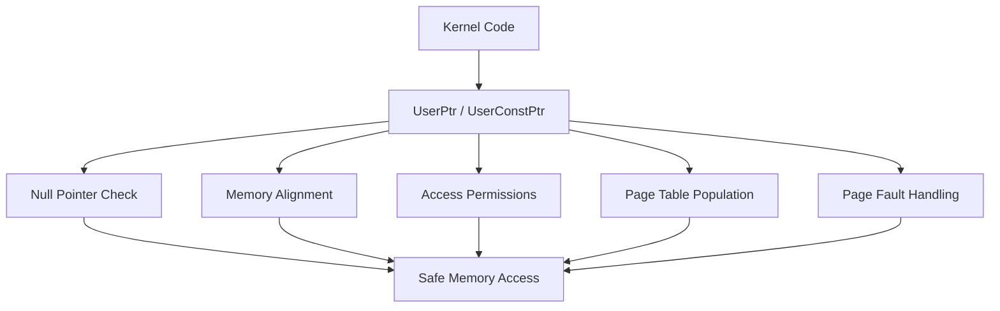
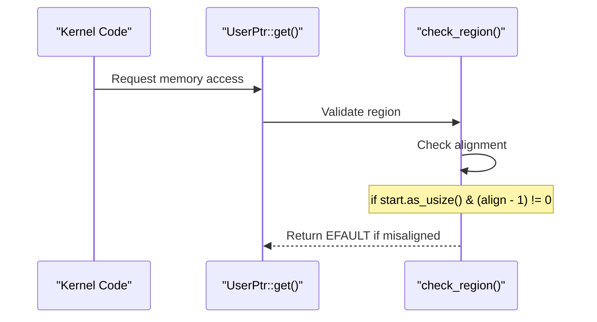
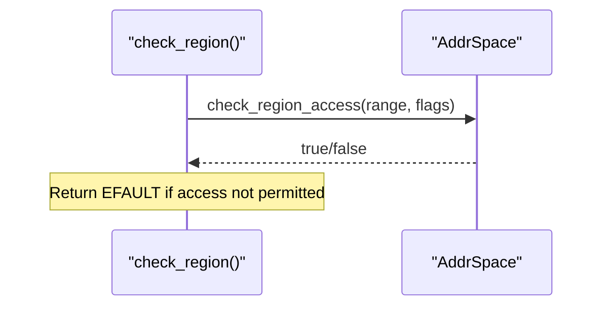
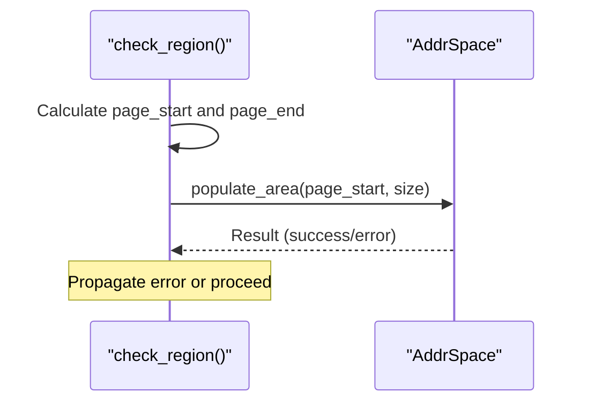
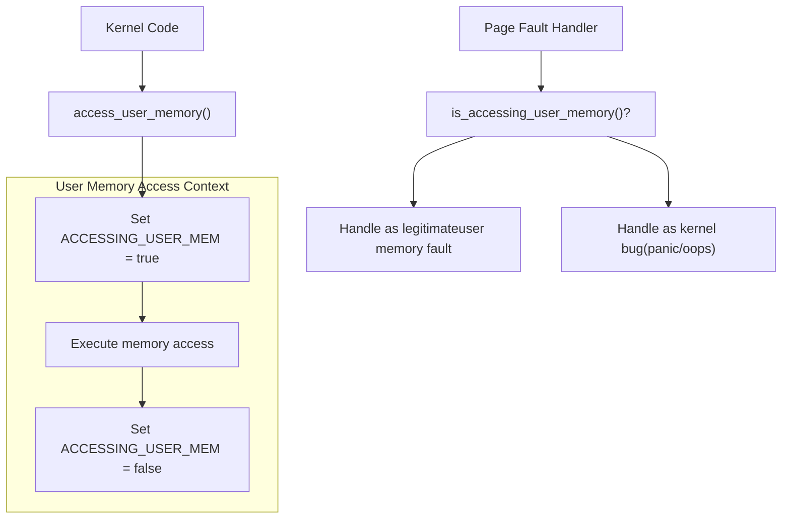
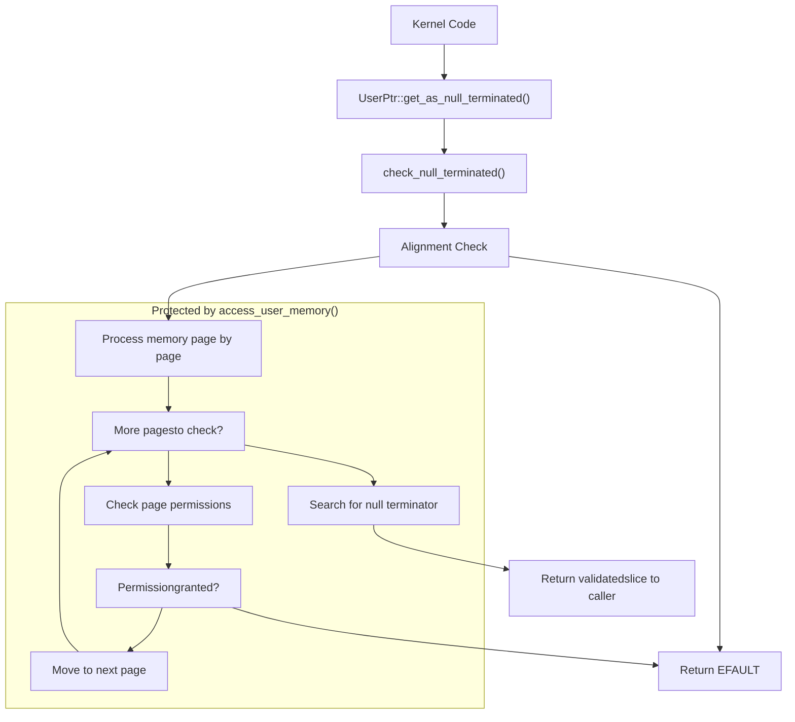
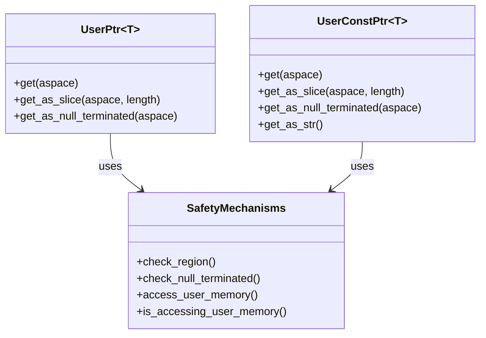

# Safety Mechanisms

> **Relevant source files**
> * [src/lib.rs](https://github.com/Starry-OS/axptr/blob/7341852d/src/lib.rs)

This document details the safety mechanisms implemented in the axptr library to prevent kernel crashes when accessing user memory. These mechanisms form a critical layer of protection for kernel code that needs to interact with user-space memory securely and robustly. For information about the basic types used for user memory access, see [User Space Pointers](/Starry-OS/axptr/2.1-user-space-pointers) and for address space abstractions, see [Address Space Management](/Starry-OS/axptr/2.2-address-space-management).

## Overview of Safety Layers

The axptr library implements multiple safety layers that work together to ensure user memory access is handled safely from kernel code.

Sources: [src/lib.rs(L31 - L54)&emsp;](https://github.com/Starry-OS/axptr/blob/7341852d/src/lib.rs#L31-L54) [src/lib.rs(L11 - L29)&emsp;](https://github.com/Starry-OS/axptr/blob/7341852d/src/lib.rs#L11-L29) [src/lib.rs(L175 - L216)&emsp;](https://github.com/Starry-OS/axptr/blob/7341852d/src/lib.rs#L175-L216) [src/lib.rs(L258 - L302)&emsp;](https://github.com/Starry-OS/axptr/blob/7341852d/src/lib.rs#L258-L302)

## Memory Region Checking

Before any user memory access is permitted, axptr performs thorough validation of the memory region to be accessed.

### Alignment Verification

Sources: [src/lib.rs(L37 - L40)&emsp;](https://github.com/Starry-OS/axptr/blob/7341852d/src/lib.rs#L37-L40)

Memory alignment verification ensures that pointers are properly aligned for the data type being accessed. Misaligned memory access can cause hardware exceptions on some architectures or inefficient memory operations on others.

### Access Permission Validation

Sources: [src/lib.rs(L42 - L47)&emsp;](https://github.com/Starry-OS/axptr/blob/7341852d/src/lib.rs#L42-L47)

The function checks that the memory range is accessible with the requested permissions (read-only or read-write). This prevents the kernel from attempting to access protected user memory regions.

### Page Table Population

Sources: [src/lib.rs(L49 - L52)&emsp;](https://github.com/Starry-OS/axptr/blob/7341852d/src/lib.rs#L49-L52)

The system ensures that page tables are populated for the entire memory region being accessed. This helps prevent page faults during access by pre-populating the necessary page tables.

## Context-Aware Page Fault Handling

A critical safety feature is the context-aware page fault handling mechanism, which allows the OS to distinguish between legitimate page faults while accessing user memory and actual kernel bugs.

Sources: [src/lib.rs(L11 - L29)&emsp;](https://github.com/Starry-OS/axptr/blob/7341852d/src/lib.rs#L11-L29) [src/lib.rs(L73 - L104)&emsp;](https://github.com/Starry-OS/axptr/blob/7341852d/src/lib.rs#L73-L104)

The system uses a per-CPU flag `ACCESSING_USER_MEM` to track whether kernel code is actively accessing user memory. This information is crucial for the OS's page fault handler, allowing it to:

1. Properly handle page faults occurring during legitimate user memory access
2. Correctly identify true kernel bugs that would otherwise cause crashes

This approach enables the kernel to access user memory regions that may trigger page faults (e.g., due to swapped pages) without crashing.

## Null-Terminated Data Handling

The axptr library provides special handling for null-terminated data from user space, such as C-style strings.

Sources: [src/lib.rs(L56 - L107)&emsp;](https://github.com/Starry-OS/axptr/blob/7341852d/src/lib.rs#L56-L107) [src/lib.rs(L202 - L217)&emsp;](https://github.com/Starry-OS/axptr/blob/7341852d/src/lib.rs#L202-L217) [src/lib.rs(L280 - L292)&emsp;](https://github.com/Starry-OS/axptr/blob/7341852d/src/lib.rs#L280-L292) [src/lib.rs(L294 - L303)&emsp;](https://github.com/Starry-OS/axptr/blob/7341852d/src/lib.rs#L294-L303)

This process handles the special case of null-terminated data structures (like C strings) where the length is not known in advance. The implementation:

1. Validates memory alignment
2. Checks permissions page by page as it traverses the data
3. Executes within the `access_user_memory()` context to safely handle potential page faults
4. Efficiently searches for the null terminator
5. Returns a safe slice reference once validation is complete

## Code Structure and Implementation

The table below summarizes how the safety mechanisms are implemented across various functions:

|Safety Mechanism|Implementation|Key Functions|
| --- | --- | --- |
|Null Pointer Detection|Built into UserPtr/UserConstPtr|is_null(),nullable()|
|Alignment Verification|Check incheck_region()function|check_region()|
|Permission Validation|Validation viaAddrSpace|check_region_access()|
|Page Table Population|Ensures pages are ready for access|populate_area()|
|Page Fault Protection|Per-CPU flag tracks access context|access_user_memory(),is_accessing_user_memory()|
|Null-Terminated Data Handling|Special validation routine|check_null_terminated()|

Sources: [src/lib.rs(L31 - L54)&emsp;](https://github.com/Starry-OS/axptr/blob/7341852d/src/lib.rs#L31-L54) [src/lib.rs(L56 - L107)&emsp;](https://github.com/Starry-OS/axptr/blob/7341852d/src/lib.rs#L56-L107) [src/lib.rs(L11 - L29)&emsp;](https://github.com/Starry-OS/axptr/blob/7341852d/src/lib.rs#L11-L29) [src/lib.rs(L158 - L169)&emsp;](https://github.com/Starry-OS/axptr/blob/7341852d/src/lib.rs#L158-L169) [src/lib.rs(L245 - L253)&emsp;](https://github.com/Starry-OS/axptr/blob/7341852d/src/lib.rs#L245-L253)

## Integration with Memory Access Functions

The safety mechanisms are integrated into all user memory access methods. The diagram below illustrates how UserPtr and UserConstPtr utilize these mechanisms:

Sources: [src/lib.rs(L175 - L198)&emsp;](https://github.com/Starry-OS/axptr/blob/7341852d/src/lib.rs#L175-L198) [src/lib.rs(L202 - L216)&emsp;](https://github.com/Starry-OS/axptr/blob/7341852d/src/lib.rs#L202-L216) [src/lib.rs(L258 - L277)&emsp;](https://github.com/Starry-OS/axptr/blob/7341852d/src/lib.rs#L258-L277) [src/lib.rs(L280 - L302)&emsp;](https://github.com/Starry-OS/axptr/blob/7341852d/src/lib.rs#L280-L302)

Each access method (`get()`, `get_as_slice()`, etc.) applies the appropriate safety mechanisms before permitting memory access, ensuring that all user memory operations are properly validated and protected.

## Error Handling

When safety checks fail, the system returns appropriate error codes to the caller rather than crashing:

* Misaligned memory: `EFAULT`
* Inaccessible memory regions: `EFAULT`
* Page table population failures: Various errors propagated from the underlying system
* Invalid UTF-8 in strings: `EILSEQ`

This approach allows kernel code to gracefully handle user memory access failures without compromising system stability.

Sources: [src/lib.rs(L39 - L40)&emsp;](https://github.com/Starry-OS/axptr/blob/7341852d/src/lib.rs#L39-L40) [src/lib.rs(L46 - L47)&emsp;](https://github.com/Starry-OS/axptr/blob/7341852d/src/lib.rs#L46-L47) [src/lib.rs(L301 - L302)&emsp;](https://github.com/Starry-OS/axptr/blob/7341852d/src/lib.rs#L301-L302)