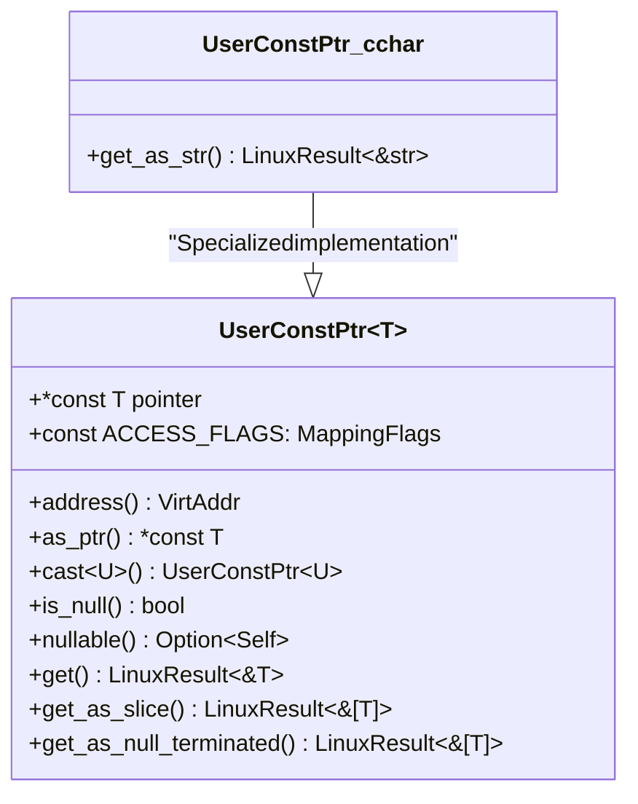
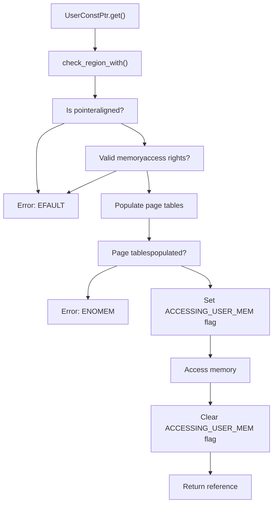
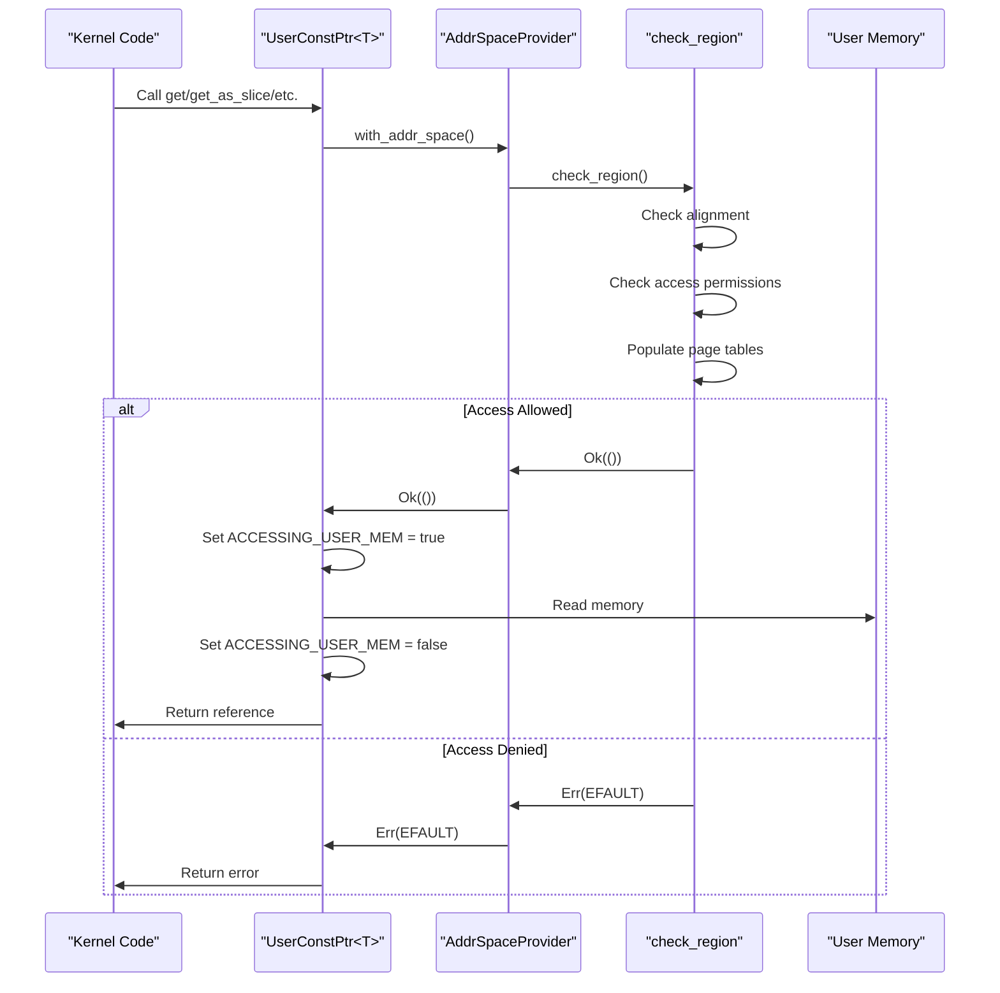

# UserConstPtr API

> **Relevant source files**
> * [src/lib.rs](https://github.com/Starry-OS/axptr/blob/7341852d/src/lib.rs)

This document provides a comprehensive reference for the `UserConstPtr<T>` type, which enables safe read-only access to user-space memory from kernel code. For information about mutable access to user memory, see [UserPtr API](/Starry-OS/axptr/5.1-userptr-api).

## Overview

`UserConstPtr<T>` is a generic wrapper around a raw const pointer (`*const T`) that provides memory-safe operations for reading data from user space. It implements safety checks that prevent common issues like null pointer dereferences, buffer overflows, and illegal memory accesses.



Sources: [src/lib.rs(L219 - L303)&emsp;](https://github.com/Starry-OS/axptr/blob/7341852d/src/lib.rs#L219-L303)

## Memory Safety Architecture

The `UserConstPtr<T>` type is part of a comprehensive memory safety system that prevents the kernel from crashing when accessing potentially invalid user memory. Unlike raw pointers, `UserConstPtr<T>` operations perform several safety checks before accessing user memory:



Sources: [src/lib.rs(L31 - L54)&emsp;](https://github.com/Starry-OS/axptr/blob/7341852d/src/lib.rs#L31-L54) [src/lib.rs(L258 - L266)&emsp;](https://github.com/Starry-OS/axptr/blob/7341852d/src/lib.rs#L258-L266)

## Type Definition

`UserConstPtr<T>` is defined as a transparent wrapper around a raw const pointer:

```javascript
#[repr(transparent)]
pub struct UserConstPtr<T>(*const T);
```

The `#[repr(transparent)]` attribute ensures that `UserConstPtr<T>` has the same memory layout as `*const T`, making it efficient for passing across FFI boundaries.

Sources: [src/lib.rs(L219 - L221)&emsp;](https://github.com/Starry-OS/axptr/blob/7341852d/src/lib.rs#L219-L221)

## Constants

|Constant|Type|Description|
| --- | --- | --- |
|ACCESS_FLAGS|MappingFlags|Specifies required memory access flags (READ) for user memory regions|

Sources: [src/lib.rs(L227 - L228)&emsp;](https://github.com/Starry-OS/axptr/blob/7341852d/src/lib.rs#L227-L228)

## Basic Methods

### Conversion and Type Manipulation

|Method|Signature|Description|
| --- | --- | --- |
|From<usize>|fn from(value: usize) -> Self|Creates aUserConstPtr<T>from a raw address|
|address|fn address(&self) -> VirtAddr|Returns the virtual address of the pointer|
|as_ptr|unsafe fn as_ptr(&self) -> *const T|Returns the underlying raw pointer (unsafe)|
|cast|fn cast<U>(self) -> UserConstPtr<U>|Casts the pointer to a different type|

Sources: [src/lib.rs(L221 - L243)&emsp;](https://github.com/Starry-OS/axptr/blob/7341852d/src/lib.rs#L221-L243)

### Null Checking

|Method|Signature|Description|
| --- | --- | --- |
|is_null|fn is_null(&self) -> bool|Checks if the pointer is null|
|nullable|fn nullable(self) -> Option<Self>|Converts toNoneif null, orSome(self)otherwise|

Sources: [src/lib.rs(L245 - L253)&emsp;](https://github.com/Starry-OS/axptr/blob/7341852d/src/lib.rs#L245-L253)

## Memory Access Methods

### Single Value Access

```rust
fn get(&self, aspace: impl AddrSpaceProvider) -> LinuxResult<&T>
```

Safely retrieves a reference to the value pointed to by `UserConstPtr<T>`:

* Validates memory alignment
* Checks user memory access permissions
* Populates page tables if necessary
* Returns a reference or `EFAULT` error if access failed

Sources: [src/lib.rs(L258 - L266)&emsp;](https://github.com/Starry-OS/axptr/blob/7341852d/src/lib.rs#L258-L266)

### Slice Access

```rust
fn get_as_slice(&self, aspace: impl AddrSpaceProvider, length: usize) -> LinuxResult<&[T]>
```

Safely retrieves a slice of values:

* Validates memory region for the entire slice
* Verifies alignment and access permissions
* Returns a slice reference or error if access failed

Sources: [src/lib.rs(L269 - L277)&emsp;](https://github.com/Starry-OS/axptr/blob/7341852d/src/lib.rs#L269-L277)

### Null-Terminated Data

```rust
fn get_as_null_terminated(&self, aspace: impl AddrSpaceProvider) -> LinuxResult<&[T]>
where
    T: Eq + Default,
```

Retrieves a slice of values terminated by a null value (default value of type `T`):

* Scans memory until it finds a null value
* Checks access permissions page-by-page during scan
* Returns a slice that includes all values up to (but not including) the null terminator

Sources: [src/lib.rs(L282 - L291)&emsp;](https://github.com/Starry-OS/axptr/blob/7341852d/src/lib.rs#L282-L291)

## String-Specific Operations

`UserConstPtr<c_char>` has an additional method for safely retrieving strings from user space:

```rust
fn get_as_str(&self, aspace: impl AddrSpaceProvider) -> LinuxResult<&'static str>
```

This method:

1. Gets the null-terminated array using `get_as_null_terminated`
2. Transmutes the char array to bytes
3. Validates that the bytes form valid UTF-8
4. Returns a string reference or `EILSEQ` error if invalid UTF-8

Sources: [src/lib.rs(L294 - L302)&emsp;](https://github.com/Starry-OS/axptr/blob/7341852d/src/lib.rs#L294-L302)

## Memory Access Flow

The following diagram illustrates the complete flow of operations when accessing user memory with `UserConstPtr`:



Sources: [src/lib.rs(L22 - L29)&emsp;](https://github.com/Starry-OS/axptr/blob/7341852d/src/lib.rs#L22-L29) [src/lib.rs(L31 - L54)&emsp;](https://github.com/Starry-OS/axptr/blob/7341852d/src/lib.rs#L31-L54) [src/lib.rs(L258 - L266)&emsp;](https://github.com/Starry-OS/axptr/blob/7341852d/src/lib.rs#L258-L266)

## Usage Example

Here's a conceptual example of using `UserConstPtr`:

1. Receive a user address as a `usize`
2. Convert it to a `UserConstPtr<T>`
3. Check if it's null
4. Access the user memory safely
5. Handle any errors appropriately

## Differences from UserPtr

While `UserPtr<T>` provides mutable access with both read and write permissions, `UserConstPtr<T>` is specifically designed for read-only access:

|Feature|UserPtr|UserConstPtr|
| --- | --- | --- |
|Underlying type|*mut T|*const T|
|Access flags|`READ|WRITE`|
|Reference type|&mut T|&T|
|Usage|Reading and writing|Reading only|

Sources: [src/lib.rs(L137)&emsp;](https://github.com/Starry-OS/axptr/blob/7341852d/src/lib.rs#L137-L137) [src/lib.rs(L227 - L228)&emsp;](https://github.com/Starry-OS/axptr/blob/7341852d/src/lib.rs#L227-L228)

## Thread Safety

`UserConstPtr<T>` operations use a thread-local variable `ACCESSING_USER_MEM` that informs the page fault handler that a page fault during memory access should be handled rather than causing a kernel panic. This flag is automatically set and cleared during memory access operations.

Sources: [src/lib.rs(L11 - L12)&emsp;](https://github.com/Starry-OS/axptr/blob/7341852d/src/lib.rs#L11-L12) [src/lib.rs(L22 - L29)&emsp;](https://github.com/Starry-OS/axptr/blob/7341852d/src/lib.rs#L22-L29)