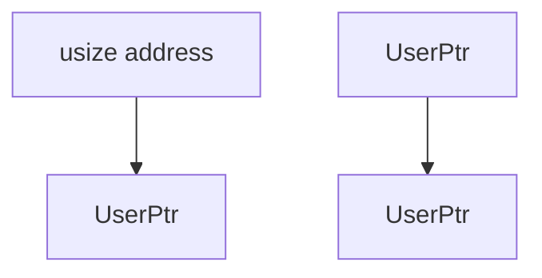
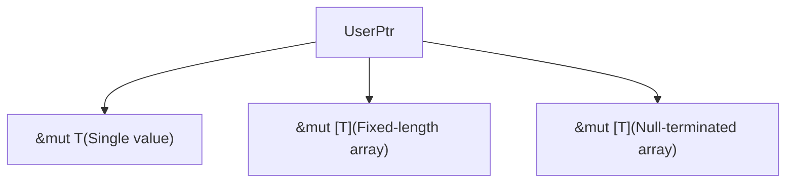
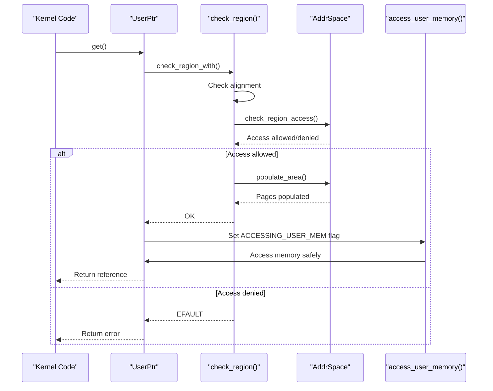
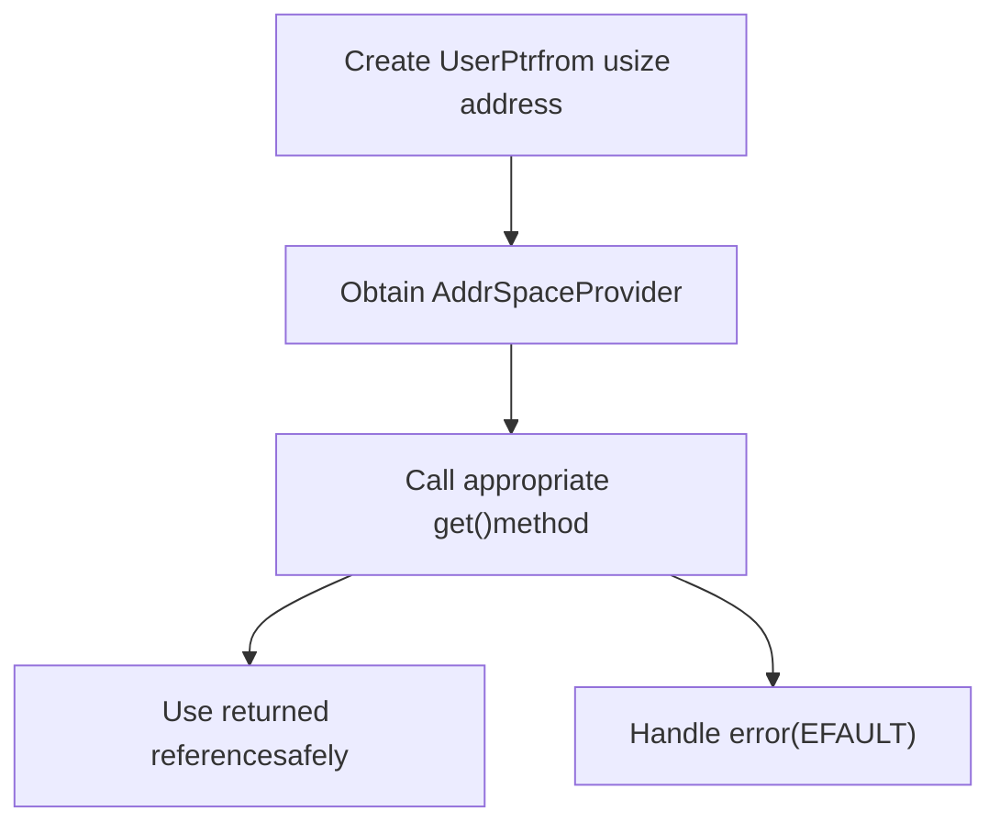

# UserPtr API

> **Relevant source files**
> * [src/lib.rs](https://github.com/Starry-OS/axptr/blob/7341852d/src/lib.rs)

## Purpose and Overview

This document provides detailed information about the `UserPtr<T>` type, which enables safe access to mutable user-space memory from kernel code. The API ensures memory safety through rigorous access validation, proper alignment checking, and context-aware page fault handling.

For information about the read-only equivalent, see [UserConstPtr API](/Starry-OS/axptr/5.2-userconstptr-api).

`UserPtr<T>` wraps a raw pointer (`*mut T`) to user-space memory and provides methods to safely access it through the kernel, preventing common vulnerabilities like null pointer dereferences and buffer overflows.

Sources: [src/lib.rs(L1 - L7)&emsp;](https://github.com/Starry-OS/axptr/blob/7341852d/src/lib.rs#L1-L7) [src/lib.rs(L129 - L130)&emsp;](https://github.com/Starry-OS/axptr/blob/7341852d/src/lib.rs#L129-L130)

## Type Definition and Core Properties

`UserPtr<T>` is defined as a transparent wrapper around a `*mut T` raw pointer:

```
#[repr(transparent)]
pub struct UserPtr<T>(*mut T);
```

Key properties:

* **Transparent representation**: Ensures the struct has the same memory layout as a raw pointer
* **Generic over type `T`**: Can point to any type
* **Access flags**: Includes both READ and WRITE permissions

```

```

Sources: [src/lib.rs(L129 - L130)&emsp;](https://github.com/Starry-OS/axptr/blob/7341852d/src/lib.rs#L129-L130) [src/lib.rs(L137 - L138)&emsp;](https://github.com/Starry-OS/axptr/blob/7341852d/src/lib.rs#L137-L138)

## Basic Methods

### Construction and Conversion

`UserPtr<T>` can be constructed from a raw `usize` memory address:



### Pointer Manipulation Methods

|Method|Description|Return Type|
| --- | --- | --- |
|address()|Gets the virtual address|VirtAddr|
|as_ptr()|Unwraps to a raw pointer (unsafe)|*mut T|
|cast<U>()|Casts to a different type|UserPtr<U>|
|is_null()|Checks if the pointer is null|bool|
|nullable()|Converts to an Option (None if null)|Option<Self>|

Sources: [src/lib.rs(L130 - L169)&emsp;](https://github.com/Starry-OS/axptr/blob/7341852d/src/lib.rs#L130-L169)

## Memory Access Methods

The `UserPtr<T>` API provides three primary methods for safely accessing user-space memory:



### get()

Retrieves a single value of type `T` from user-space memory:

```rust
pub fn get(&mut self, aspace: impl AddrSpaceProvider) -> LinuxResult<&mut T>
```

This method:

1. Validates the memory region
2. Checks alignment
3. Verifies read/write permissions
4. Populates the page tables if necessary
5. Returns a mutable reference if successful, or an error (EFAULT) if access is invalid

Sources: [src/lib.rs(L175 - L183)&emsp;](https://github.com/Starry-OS/axptr/blob/7341852d/src/lib.rs#L175-L183)

### get_as_slice()

Retrieves a fixed-length slice of elements from user-space memory:

```rust
pub fn get_as_slice(
    &mut self,
    aspace: impl AddrSpaceProvider,
    length: usize
) -> LinuxResult<&mut [T]>
```

This method performs the same safety checks as `get()` but for an array of specified length.

Sources: [src/lib.rs(L186 - L199)&emsp;](https://github.com/Starry-OS/axptr/blob/7341852d/src/lib.rs#L186-L199)

### get_as_null_terminated()

Retrieves a null-terminated array from user-space memory:

```rust
pub fn get_as_null_terminated(
    &mut self,
    aspace: impl AddrSpaceProvider
) -> LinuxResult<&mut [T]>
```

This specialized method:

1. Searches for a null value (T::default()) to determine array length
2. Validates each memory page during the search
3. Returns a mutable slice containing all elements up to (but not including) the null terminator

This method requires that type `T` implements `Eq + Default` traits.

Sources: [src/lib.rs(L204 - L217)&emsp;](https://github.com/Starry-OS/axptr/blob/7341852d/src/lib.rs#L204-L217)

## Memory Safety Mechanism

The `UserPtr<T>` API employs a multi-layered safety mechanism to prevent kernel crashes when accessing user-space memory:



Key safety components:

1. **Alignment Checking**: Ensures the pointer is properly aligned for the target type
2. **Access Validation**: Verifies memory region is accessible with appropriate permissions
3. **Page Table Population**: Prepares memory pages before access
4. **Context-Aware Page Fault Handling**: Uses the `ACCESSING_USER_MEM` flag to permit controlled page faults
5. **Error Propagation**: Returns `LinuxError::EFAULT` when access is denied

Sources: [src/lib.rs(L11 - L54)&emsp;](https://github.com/Starry-OS/axptr/blob/7341852d/src/lib.rs#L11-L54) [src/lib.rs(L175 - L183)&emsp;](https://github.com/Starry-OS/axptr/blob/7341852d/src/lib.rs#L175-L183)

## Usage Pattern

The typical usage pattern for `UserPtr<T>` involves:



### Example Usage Flow

1. Obtain a user-space address (typically from a system call parameter)
2. Convert it to a `UserPtr<T>`
3. Get an address space provider (typically from the current process)
4. Call one of the `get*` methods to safely access the memory
5. Use the returned reference to read or modify user memory
6. Handle any errors (typically EFAULT for invalid access)

Sources: [src/lib.rs(L175 - L217)&emsp;](https://github.com/Starry-OS/axptr/blob/7341852d/src/lib.rs#L175-L217)

## Relationship with AddrSpaceProvider

The `UserPtr<T>` API relies on the `AddrSpaceProvider` trait to abstract away the details of the underlying memory management system:

```

```

This abstraction allows the same `UserPtr<T>` implementation to work with different memory management systems, as long as they implement the `AddrSpaceProvider` trait.

Sources: [src/lib.rs(L119 - L126)&emsp;](https://github.com/Starry-OS/axptr/blob/7341852d/src/lib.rs#L119-L126) [src/lib.rs(L175 - L183)&emsp;](https://github.com/Starry-OS/axptr/blob/7341852d/src/lib.rs#L175-L183)

## Implementation Details

### Memory Region Validation

When accessing user memory, `UserPtr<T>` validates the memory region through the `check_region` function, which:

1. Verifies proper alignment for the target type
2. Checks access permissions (READ+WRITE for `UserPtr<T>`)
3. Ensures the memory pages are populated

For null-terminated arrays, the specialized `check_null_terminated` function:

1. Validates memory page by page while searching for the null terminator
2. Handles page faults that might occur during the search
3. Determines the total length of the array up to the null terminator

Sources: [src/lib.rs(L31 - L54)&emsp;](https://github.com/Starry-OS/axptr/blob/7341852d/src/lib.rs#L31-L54) [src/lib.rs(L56 - L107)&emsp;](https://github.com/Starry-OS/axptr/blob/7341852d/src/lib.rs#L56-L107)