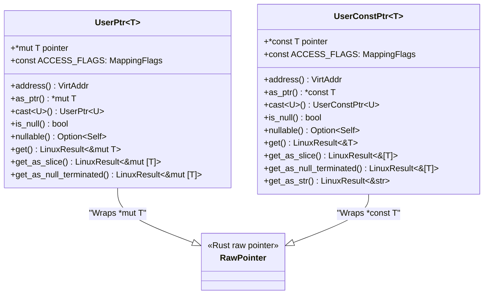
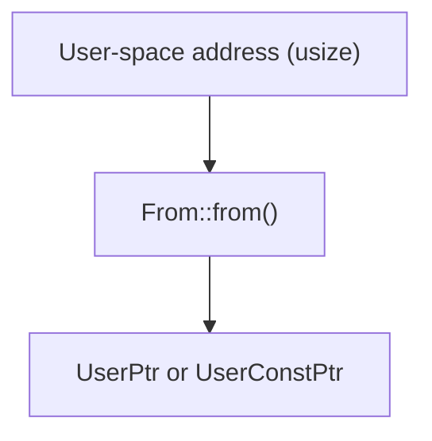
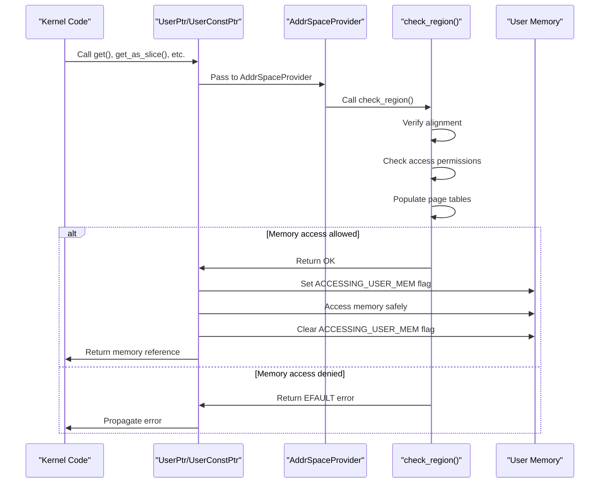
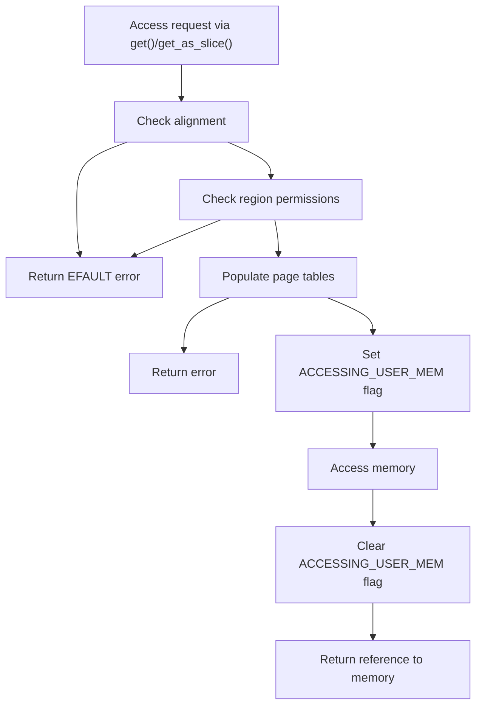
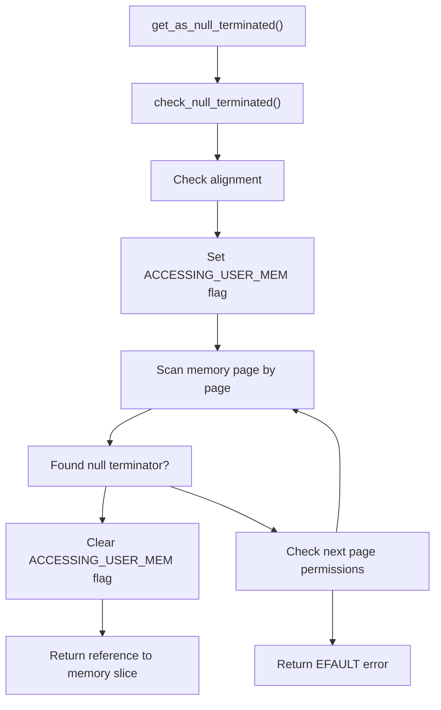
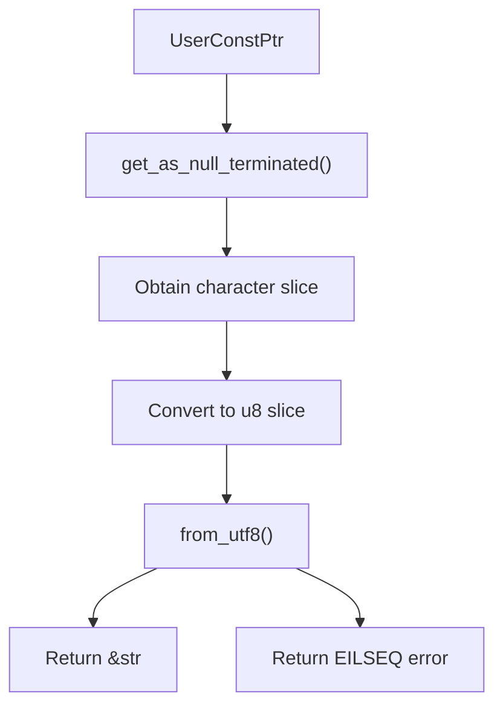
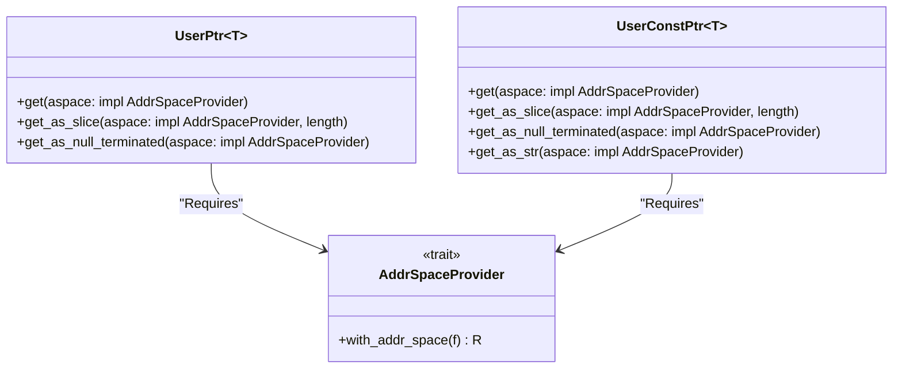
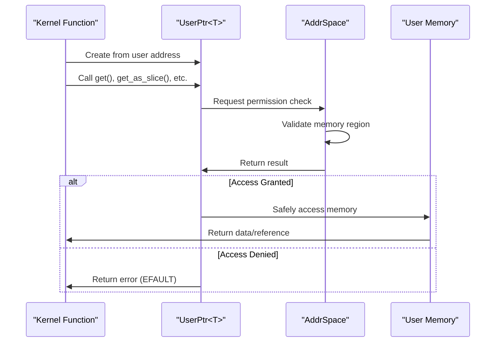

# User Space Pointers

> **Relevant source files**
> * [src/lib.rs](https://github.com/Starry-OS/axptr/blob/7341852d/src/lib.rs)

This page details the `UserPtr` and `UserConstPtr` types provided by the axptr library, which serve as safe abstractions for accessing user-space memory from kernel code. These pointer types prevent common errors that could lead to kernel crashes when handling user memory, such as invalid pointers, improper alignment, and unauthorized memory access.

For information about address space management that these pointers rely on, see [Address Space Management](/Starry-OS/axptr/2.2-address-space-management). For details on the safety mechanisms they implement, see [Safety Mechanisms](/Starry-OS/axptr/3-safety-mechanisms).

## Core Pointer Types

The axptr library provides two primary pointer types for accessing user-space memory:

1. **`UserPtr<T>`**: For read-write access to user-space memory
2. **`UserConstPtr<T>`**: For read-only access to user-space memory

Both types are represented as transparent wrappers around raw pointers (`*mut T` and `*const T` respectively), providing a safe interface for kernel code to access user-space memory.

Sources: [src/lib.rs(L128 - L130)&emsp;](https://github.com/Starry-OS/axptr/blob/7341852d/src/lib.rs#L128-L130) [src/lib.rs(L219 - L221)&emsp;](https://github.com/Starry-OS/axptr/blob/7341852d/src/lib.rs#L219-L221)

## Creating User Space Pointers

Both pointer types can be created from a user-space address represented as a `usize`:

Sources: [src/lib.rs(L130 - L134)&emsp;](https://github.com/Starry-OS/axptr/blob/7341852d/src/lib.rs#L130-L134) [src/lib.rs(L221 - L225)&emsp;](https://github.com/Starry-OS/axptr/blob/7341852d/src/lib.rs#L221-L225)

## Memory Access Flow

The main purpose of these pointer types is to provide safe access to user-space memory. The following diagram illustrates the flow of operations when accessing user memory:

Sources: [src/lib.rs(L11 - L20)&emsp;](https://github.com/Starry-OS/axptr/blob/7341852d/src/lib.rs#L11-L20) [src/lib.rs(L22 - L29)&emsp;](https://github.com/Starry-OS/axptr/blob/7341852d/src/lib.rs#L22-L29) [src/lib.rs(L31 - L54)&emsp;](https://github.com/Starry-OS/axptr/blob/7341852d/src/lib.rs#L31-L54) [src/lib.rs(L175 - L183)&emsp;](https://github.com/Starry-OS/axptr/blob/7341852d/src/lib.rs#L175-L183) [src/lib.rs(L258 - L266)&emsp;](https://github.com/Starry-OS/axptr/blob/7341852d/src/lib.rs#L258-L266)

## Core Methods

### Common Methods

Both `UserPtr<T>` and `UserConstPtr<T>` provide the following methods:

|Method|Return Type|Description|
| --- | --- | --- |
|address()|VirtAddr|Gets the virtual address of the pointer|
|as_ptr()|*mut T/*const T|Unwraps the pointer into a raw pointer (unsafe)|
|cast<U>()|UserPtr<U>/UserConstPtr<U>|Casts the pointer to a different type|
|is_null()|bool|Checks if the pointer is null|
|nullable()|Option<Self>|Converts toOption<Self>, returningNoneif null|

Sources: [src/lib.rs(L136 - L169)&emsp;](https://github.com/Starry-OS/axptr/blob/7341852d/src/lib.rs#L136-L169) [src/lib.rs(L227 - L254)&emsp;](https://github.com/Starry-OS/axptr/blob/7341852d/src/lib.rs#L227-L254)

### Memory Access Methods

#### ForUserPtr<T>:

|Method|Return Type|Description|
| --- | --- | --- |
|get(aspace)|LinuxResult<&mut T>|Gets mutable access to the pointed value|
|get_as_slice(aspace, length)|LinuxResult<&mut [T]>|Gets mutable access to a slice of values|
|get_as_null_terminated(aspace)|LinuxResult<&mut [T]>|Gets mutable access to a null-terminated array|

Sources: [src/lib.rs(L171 - L198)&emsp;](https://github.com/Starry-OS/axptr/blob/7341852d/src/lib.rs#L171-L198) [src/lib.rs(L201 - L217)&emsp;](https://github.com/Starry-OS/axptr/blob/7341852d/src/lib.rs#L201-L217)

#### ForUserConstPtr<T>:

|Method|Return Type|Description|
| --- | --- | --- |
|get(aspace)|LinuxResult<&T>|Gets read-only access to the pointed value|
|get_as_slice(aspace, length)|LinuxResult<&[T]>|Gets read-only access to a slice of values|
|get_as_null_terminated(aspace)|LinuxResult<&[T]>|Gets read-only access to a null-terminated array|
|get_as_str()(only forUserConstPtr<c_char>)|LinuxResult<&'static str>|Gets read-only access as a UTF-8 string|

Sources: [src/lib.rs(L256 - L278)&emsp;](https://github.com/Starry-OS/axptr/blob/7341852d/src/lib.rs#L256-L278) [src/lib.rs(L280 - L292)&emsp;](https://github.com/Starry-OS/axptr/blob/7341852d/src/lib.rs#L280-L292) [src/lib.rs(L294 - L303)&emsp;](https://github.com/Starry-OS/axptr/blob/7341852d/src/lib.rs#L294-L303)

## Safety Mechanisms

The main safety mechanisms implemented by these types include:

1. **Memory Region Validation**: Before accessing user memory, the pointer types check if the memory region is accessible with the required permissions.
2. **Alignment Checks**: Ensures the memory is properly aligned for the requested type.
3. **Page Table Population**: Automatically populates page tables if necessary.
4. **Page Fault Handling**: Using a flag to indicate when accessing user memory to properly handle page faults.

Sources: [src/lib.rs(L31 - L54)&emsp;](https://github.com/Starry-OS/axptr/blob/7341852d/src/lib.rs#L31-L54) [src/lib.rs(L11 - L12)&emsp;](https://github.com/Starry-OS/axptr/blob/7341852d/src/lib.rs#L11-L12) [src/lib.rs(L18 - L20)&emsp;](https://github.com/Starry-OS/axptr/blob/7341852d/src/lib.rs#L18-L20) [src/lib.rs(L22 - L29)&emsp;](https://github.com/Starry-OS/axptr/blob/7341852d/src/lib.rs#L22-L29)

## Null-Terminated Data Handling

A special feature of the pointer types is their ability to safely handle null-terminated data (such as C strings). The `get_as_null_terminated()` method performs a specialized check that scans the user memory page by page until it finds a null terminator.

Sources: [src/lib.rs(L56 - L107)&emsp;](https://github.com/Starry-OS/axptr/blob/7341852d/src/lib.rs#L56-L107) [src/lib.rs(L201 - L217)&emsp;](https://github.com/Starry-OS/axptr/blob/7341852d/src/lib.rs#L201-L217) [src/lib.rs(L280 - L292)&emsp;](https://github.com/Starry-OS/axptr/blob/7341852d/src/lib.rs#L280-L292)

## Type-Specific Operations

The `UserConstPtr<c_char>` type provides additional functionality specifically for handling C strings:

Sources: [src/lib.rs(L294 - L303)&emsp;](https://github.com/Starry-OS/axptr/blob/7341852d/src/lib.rs#L294-L303)

## Integration with Address Space Management

The user pointer types work with the `AddrSpaceProvider` trait to abstract address space operations. This allows them to work with different address space implementations as long as they implement this trait.

Sources: [src/lib.rs(L119 - L126)&emsp;](https://github.com/Starry-OS/axptr/blob/7341852d/src/lib.rs#L119-L126) [src/lib.rs(L175 - L183)&emsp;](https://github.com/Starry-OS/axptr/blob/7341852d/src/lib.rs#L175-L183) [src/lib.rs(L258 - L266)&emsp;](https://github.com/Starry-OS/axptr/blob/7341852d/src/lib.rs#L258-L266)

## Common Usage Patterns

The typical usage pattern for user space pointers in kernel code involves:

1. Receiving a user-space address as a `usize`
2. Converting it to a `UserPtr<T>` or `UserConstPtr<T>`
3. Using the appropriate get method to safely access the memory
4. Handling potential errors (EFAULT, EILSEQ, etc.)

Sources: [src/lib.rs(L130 - L134)&emsp;](https://github.com/Starry-OS/axptr/blob/7341852d/src/lib.rs#L130-L134) [src/lib.rs(L221 - L225)&emsp;](https://github.com/Starry-OS/axptr/blob/7341852d/src/lib.rs#L221-L225) [src/lib.rs(L175 - L183)&emsp;](https://github.com/Starry-OS/axptr/blob/7341852d/src/lib.rs#L175-L183) [src/lib.rs(L258 - L266)&emsp;](https://github.com/Starry-OS/axptr/blob/7341852d/src/lib.rs#L258-L266)