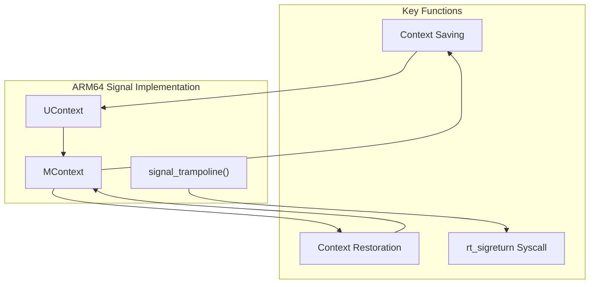
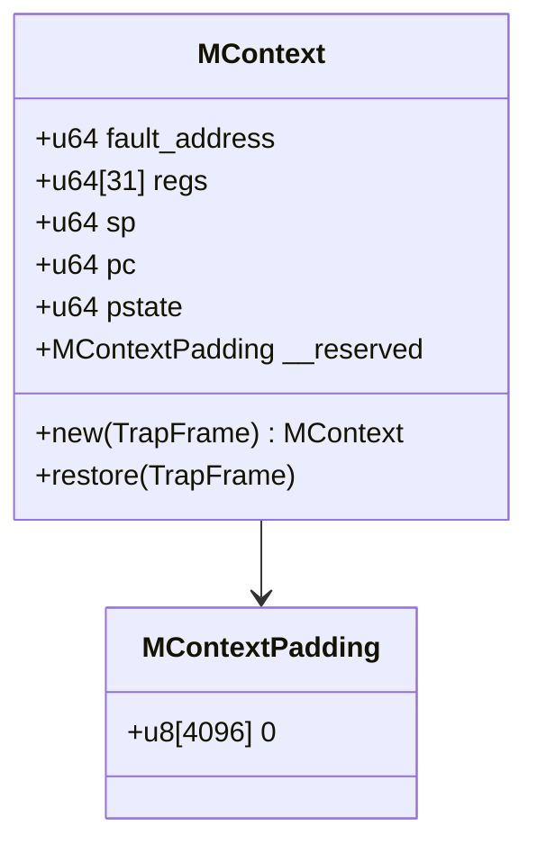
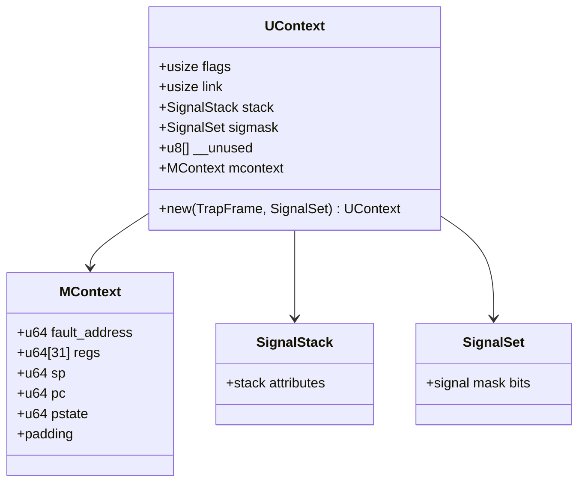
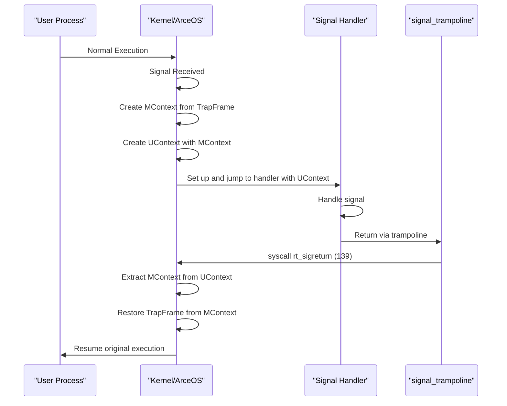
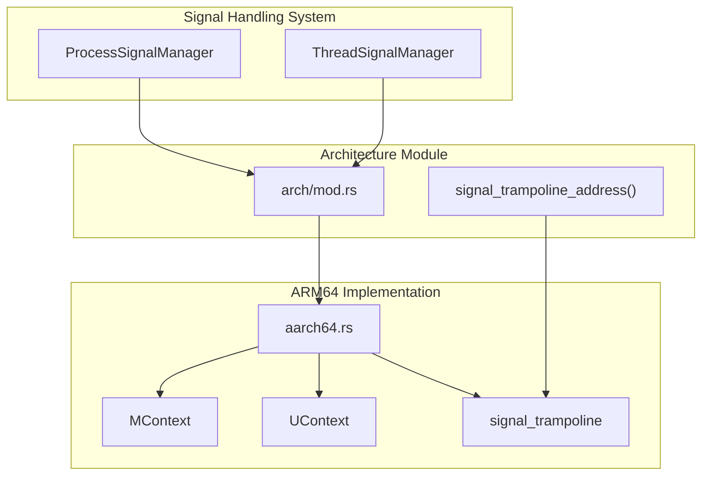

# ARM64 Implementation

> **Relevant source files**
> * [src/arch/aarch64.rs](https://github.com/Starry-OS/axsignal/blob/b5b6089c/src/arch/aarch64.rs)
> * [src/arch/mod.rs](https://github.com/Starry-OS/axsignal/blob/b5b6089c/src/arch/mod.rs)

This document describes the ARM64 (AArch64) architecture-specific implementation of the signal handling system in ArceOS. It details how signal context management, trampolines, and architecture-specific data structures are implemented for ARM64 processors. For information about other architecture implementations, see [x86_64 Implementation](/Starry-OS/axsignal/4.1-x86_64-implementation), [RISC-V Implementation](/Starry-OS/axsignal/4.3-risc-v-implementation), or [LoongArch64 Implementation](/Starry-OS/axsignal/4.4-loongarch64-implementation).

## Overview

The ARM64 implementation provides the architecture-specific components needed for signal handling, including:

1. A signal trampoline for transferring control to user signal handlers
2. Context management structures for saving and restoring CPU state
3. Context conversion utilities between trap frames and signal contexts



Sources: [src/arch/aarch64.rs](https://github.com/Starry-OS/axsignal/blob/b5b6089c/src/arch/aarch64.rs) [src/arch/mod.rs](https://github.com/Starry-OS/axsignal/blob/b5b6089c/src/arch/mod.rs)

## Signal Trampoline

The signal trampoline is a small piece of assembly code that serves as the return path from signal handlers. When a signal handler completes execution, the trampoline is called to restore the original execution context and return to the interrupted code.

```

```

The ARM64 signal trampoline is implemented as:

1. A page-aligned assembly function that makes syscall 139 (typically `rt_sigreturn` in Unix-like systems)
2. The function is padded to fill an entire 4096-byte page

The implementation in assembly is:

```yaml
signal_trampoline:
    mov x8, #139   ; Load syscall number 139 into x8 register
    svc #0         ; Trigger supervisor call (system call)
```

This trampoline is accessed via the `signal_trampoline_address()` function, which returns its memory address for use during signal handler setup.

Sources: [src/arch/aarch64.rs(L5 - L16)&emsp;](https://github.com/Starry-OS/axsignal/blob/b5b6089c/src/arch/aarch64.rs#L5-L16) [src/arch/mod.rs(L19 - L25)&emsp;](https://github.com/Starry-OS/axsignal/blob/b5b6089c/src/arch/mod.rs#L19-L25)

## Machine Context (MContext)

The `MContext` structure is responsible for storing the complete CPU state necessary to restore execution after signal handling. It captures all registers and processor state flags.



The `MContext` structure:

* Is 16-byte aligned for optimal performance on ARM64
* Contains all 31 general-purpose registers (x0-x30)
* Stores critical CPU state including stack pointer, program counter, and processor state
* Includes a large reserved padding area
* Provides methods to create from and restore to a trap frame

This structure effectively captures the entire execution state that must be preserved during signal handling.

Sources: [src/arch/aarch64.rs(L18 - L51)&emsp;](https://github.com/Starry-OS/axsignal/blob/b5b6089c/src/arch/aarch64.rs#L18-L51)

## User Context (UContext)

The `UContext` structure provides a higher-level abstraction that combines the machine context with additional signal-related information. This matches the structure expected by user-level signal handlers.



The `UContext` structure includes:

* Flags for context management
* A link field that can point to another context
* A `SignalStack` for defining the stack used during signal handling
* A `SignalSet` representing the signal mask during handler execution
* Reserved space to ensure proper sizing and alignment
* The `MContext` containing all CPU registers and state

During signal handling, this structure is used to:

1. Save the current execution context before calling the handler
2. Configure the signal environment for the handler execution
3. Restore the original context when the handler completes

Sources: [src/arch/aarch64.rs(L53 - L75)&emsp;](https://github.com/Starry-OS/axsignal/blob/b5b6089c/src/arch/aarch64.rs#L53-L75)

## Context Management Flow

The following diagram illustrates how the ARM64 implementation manages context during signal handling:



When a signal is delivered:

1. The current CPU state is captured in a `TrapFrame`
2. This state is converted to an `MContext`
3. An `UContext` is built including the `MContext` and signal information
4. The signal handler is called with this context
5. When the handler returns, the signal trampoline is executed
6. The syscall in the trampoline triggers the kernel to restore the original context
7. Regular execution continues from where it was interrupted

Sources: [src/arch/aarch64.rs(L34 - L45)&emsp;](https://github.com/Starry-OS/axsignal/blob/b5b6089c/src/arch/aarch64.rs#L34-L45) [src/arch/aarch64.rs(L45 - L50)&emsp;](https://github.com/Starry-OS/axsignal/blob/b5b6089c/src/arch/aarch64.rs#L45-L50) [src/arch/aarch64.rs(L65 - L74)&emsp;](https://github.com/Starry-OS/axsignal/blob/b5b6089c/src/arch/aarch64.rs#L65-L74)

## Context Conversion Process

The ARM64 implementation provides efficient methods for converting between trap frames and contexts:

```

```

### Creation Process

When creating an `MContext` from a `TrapFrame`, the following fields are mapped:

* General registers (r0-r30) are copied directly
* The user stack pointer (usp) becomes the stack pointer (sp)
* The exception link register (elr) becomes the program counter (pc)
* The saved program status register (spsr) becomes the processor state (pstate)

### Restoration Process

When restoring a `TrapFrame` from an `MContext`, the reverse mappings occur:

* General registers are copied back
* The stack pointer is restored to usp
* The program counter is restored to elr
* The processor state is restored to spsr

This bidirectional conversion ensures that execution context is properly preserved during signal handling.

Sources: [src/arch/aarch64.rs(L34 - L45)&emsp;](https://github.com/Starry-OS/axsignal/blob/b5b6089c/src/arch/aarch64.rs#L34-L45) [src/arch/aarch64.rs(L45 - L50)&emsp;](https://github.com/Starry-OS/axsignal/blob/b5b6089c/src/arch/aarch64.rs#L45-L50)

## Integration with Signal Handling System

The ARM64 implementation integrates with the overall signal handling system through the architecture abstraction layer defined in `arch/mod.rs`. This layer provides a unified interface for all supported architectures while allowing architecture-specific implementations of critical components.



The key integration points are:

1. The architecture module exposes the `signal_trampoline_address()` function
2. The signal handling system uses this function to set up signal handlers
3. The `MContext` and `UContext` structures are used to manage execution state
4. The architecture-specific context conversion methods are used during signal delivery and return

This abstraction allows the core signal handling logic to remain architecture-agnostic while leveraging the ARM64-specific implementation for context management.

Sources: [src/arch/mod.rs(L1 - L17)&emsp;](https://github.com/Starry-OS/axsignal/blob/b5b6089c/src/arch/mod.rs#L1-L17) [src/arch/mod.rs(L19 - L25)&emsp;](https://github.com/Starry-OS/axsignal/blob/b5b6089c/src/arch/mod.rs#L19-L25)

## Summary

The ARM64 implementation provides the architecture-specific components required for signal handling on AArch64 processors:

1. **Signal Trampoline**: A carefully positioned assembly function that makes the `rt_sigreturn` syscall
2. **Machine Context (MContext)**: A structure capturing all ARM64 CPU registers and state
3. **User Context (UContext)**: A higher-level structure combining machine context with signal information
4. **Context Management Methods**: Functions to convert between trap frames and contexts

These components work together to ensure that signal handling can properly save and restore execution state on ARM64 platforms.

Sources: [src/arch/aarch64.rs](https://github.com/Starry-OS/axsignal/blob/b5b6089c/src/arch/aarch64.rs) [src/arch/mod.rs](https://github.com/Starry-OS/axsignal/blob/b5b6089c/src/arch/mod.rs)