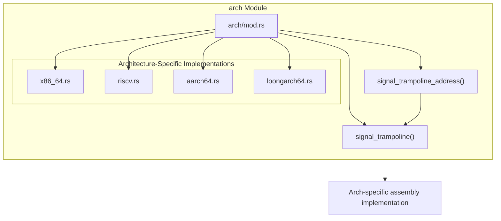
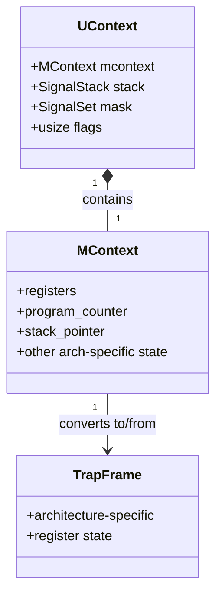
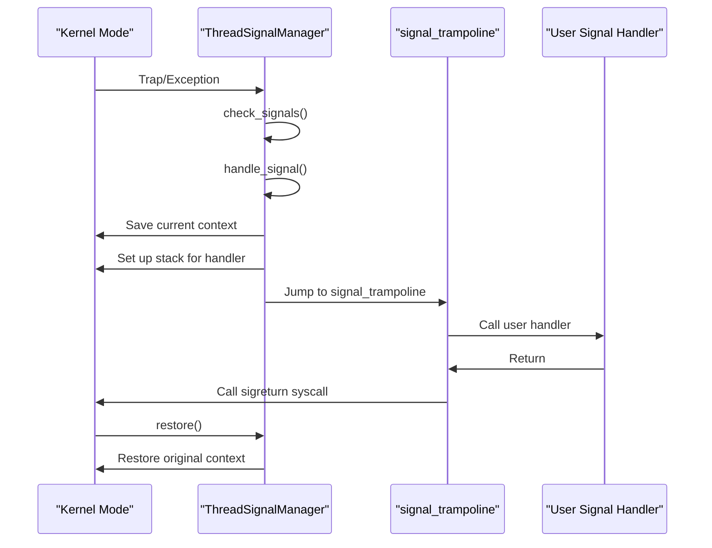
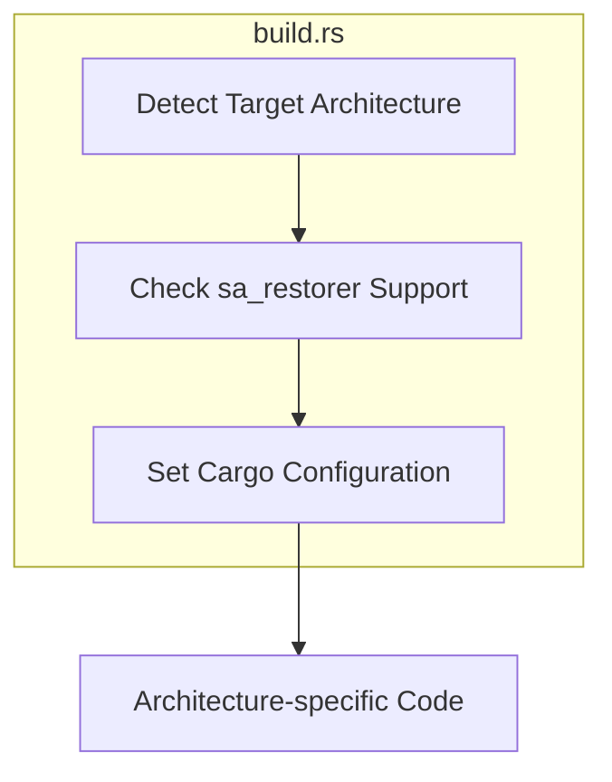
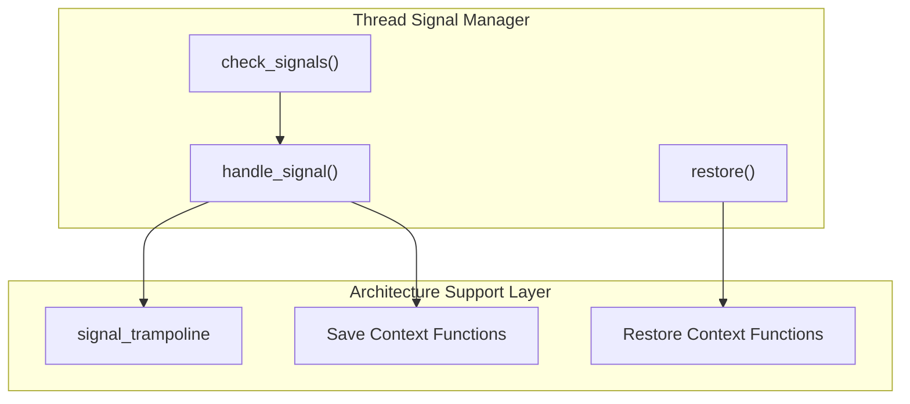

# Architecture Support

> **Relevant source files**
> * [build.rs](https://github.com/Starry-OS/axsignal/blob/b5b6089c/build.rs)
> * [src/arch/mod.rs](https://github.com/Starry-OS/axsignal/blob/b5b6089c/src/arch/mod.rs)
> * [src/lib.rs](https://github.com/Starry-OS/axsignal/blob/b5b6089c/src/lib.rs)

This document covers the architecture-specific implementation layer of the `axsignal` crate, which enables signal handling across multiple CPU architectures. The architecture support subsystem provides platform-specific code for handling CPU context during signal delivery and processing, allowing the signal handling system to work consistently across different hardware platforms.

For information about specific architecture implementations, see:

* [x86_64 Implementation](/Starry-OS/axsignal/4.1-x86_64-implementation)
* [ARM64 Implementation](/Starry-OS/axsignal/4.2-arm64-implementation)
* [RISC-V Implementation](/Starry-OS/axsignal/4.3-risc-v-implementation)
* [LoongArch64 Implementation](/Starry-OS/axsignal/4.4-loongarch64-implementation)

## Architecture Abstraction Layer

The architecture support subsystem employs conditional compilation to select the appropriate implementation based on the target architecture. It provides a consistent interface to the rest of the signal handling system while handling architecture-specific details internally.

**Diagram: Architecture Module Structure**

Sources: [src/arch/mod.rs(L1 - L25)&emsp;](https://github.com/Starry-OS/axsignal/blob/b5b6089c/src/arch/mod.rs#L1-L25) [src/lib.rs(L8 - L9)&emsp;](https://github.com/Starry-OS/axsignal/blob/b5b6089c/src/lib.rs#L8-L9)

The architecture abstraction layer is implemented using Rust's conditional compilation feature through the `cfg_if` macro. Each supported architecture has its own implementation file that is selected at compile time based on the target architecture.

## Common Architecture Interface

Every architecture-specific implementation must provide the following key components:

|Component|Purpose|
| --- | --- |
|MContext|Machine context - architecture-specific CPU state|
|UContext|User context - complete execution context including signal mask|
|signal_trampoline|Assembly routine for calling signal handlers|
|Context manipulation functions|Save/restore CPU state during signal handling|

Sources: [src/arch/mod.rs(L19 - L25)&emsp;](https://github.com/Starry-OS/axsignal/blob/b5b6089c/src/arch/mod.rs#L19-L25)

## Signal Context Management

One of the crucial aspects of signal handling is saving and restoring the execution context. The architecture support layer defines two main structures for this purpose:

**Diagram: Signal Context Data Structures**

When a signal is delivered to a process or thread, the current execution context must be saved to allow the signal handler to run. After the signal handler completes, the original context is restored. The architecture-specific implementation handles how CPU registers and other hardware state are saved and restored.

## Signal Trampoline Mechanism

A critical component provided by the architecture layer is the signal trampoline:

**Diagram: Signal Trampoline Flow**

Sources: [src/arch/mod.rs(L19 - L25)&emsp;](https://github.com/Starry-OS/axsignal/blob/b5b6089c/src/arch/mod.rs#L19-L25)

The `signal_trampoline` function is a small assembly routine that:

1. Calls the user's signal handler with appropriate arguments
2. After the handler returns, performs a `sigreturn` syscall to restore the original execution context

This function is critical because it bridges between the kernel's signal delivery mechanism and the user-space signal handler, ensuring proper setup and cleanup.

## Build System Integration

The architecture support layer also interacts with the build system to enable or disable certain features based on the target architecture:

**Diagram: Build System Integration**

Sources: [build.rs(L1 - L25)&emsp;](https://github.com/Starry-OS/axsignal/blob/b5b6089c/build.rs#L1-L25)

The build script (`build.rs`) checks whether the target architecture supports the `sa_restorer` feature, which is needed for proper signal handler return in some architectures. This configuration is used by the architecture-specific code to adapt its implementation.

## Architecture-Specific Features

While all architectures implement the common interface, they differ in several important ways:

|Feature|Variations Across Architectures|
| --- | --- |
|Register Set|Number and types of registers vary by architecture|
|Context Size|x86_64 and ARM64 typically have more registers than RISC-V|
|Signal Frame|Different memory layout for saved context|
|Return Mechanism|Some usesa_restorer, others use direct jumps|
|Stack Alignment|Requirements differ (e.g., 16-byte for x86_64)|

Sources: [src/arch/mod.rs(L1 - L17)&emsp;](https://github.com/Starry-OS/axsignal/blob/b5b6089c/src/arch/mod.rs#L1-L17) [build.rs(L3 - L15)&emsp;](https://github.com/Starry-OS/axsignal/blob/b5b6089c/build.rs#L3-L15)

## Integration with Signal Managers

The architecture support layer integrates with the signal management system as follows:

**Diagram: Integration with Signal Management**

When the `ThreadSignalManager` needs to deliver a signal, it uses the architecture-specific functions to:

1. Save the current execution context
2. Set up the stack frame for the signal handler
3. Jump to the architecture-specific `signal_trampoline`
4. Upon return from the signal handler, restore the original context

This design allows the higher-level signal management logic to remain architecture-independent while delegating platform-specific operations to the architecture support layer.

## Summary

The architecture support subsystem provides a critical abstraction layer that enables the signal handling system to work consistently across different CPU architectures. By encapsulating architecture-specific details and providing a uniform interface, it allows the rest of the system to operate in an architecture-agnostic manner while still benefiting from hardware-specific optimizations.

Each architecture implementation provides specialized routines for:

* Context saving and restoration
* Signal trampoline implementation
* Conversion between trap frames and user contexts
* Stack management for signal handlers

This modular design makes it easier to add support for new architectures while maintaining compatibility with existing code.

Sources: [src/arch/mod.rs(L1 - L25)&emsp;](https://github.com/Starry-OS/axsignal/blob/b5b6089c/src/arch/mod.rs#L1-L25) [src/lib.rs(L8 - L9)&emsp;](https://github.com/Starry-OS/axsignal/blob/b5b6089c/src/lib.rs#L8-L9) [build.rs(L1 - L25)&emsp;](https://github.com/Starry-OS/axsignal/blob/b5b6089c/build.rs#L1-L25)