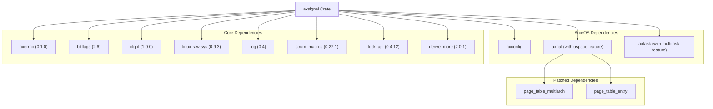
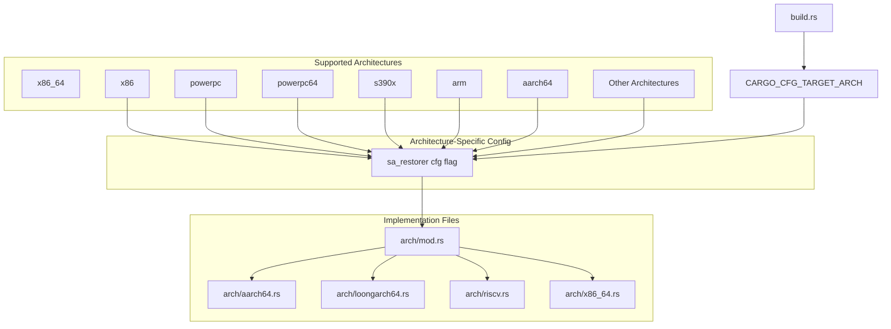
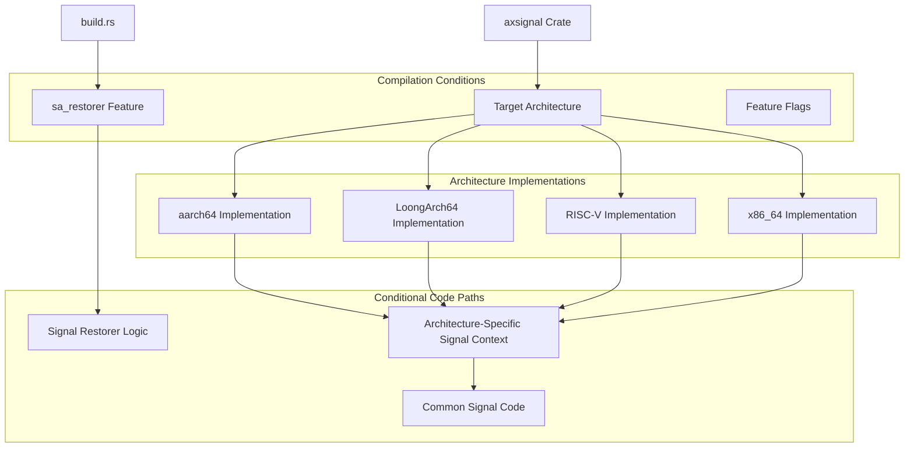
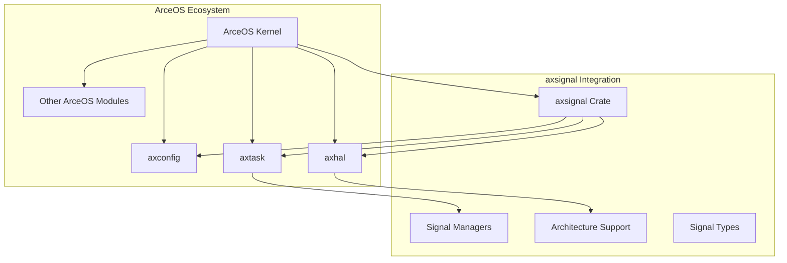

# Build Configuration and Dependencies

> **Relevant source files**
> * [.gitignore](https://github.com/Starry-OS/axsignal/blob/b5b6089c/.gitignore)
> * [Cargo.toml](https://github.com/Starry-OS/axsignal/blob/b5b6089c/Cargo.toml)
> * [build.rs](https://github.com/Starry-OS/axsignal/blob/b5b6089c/build.rs)

## Purpose and Scope

This document details the build configuration and dependency management aspects of the `axsignal` crate. It explains how the crate is configured for different target architectures, its external dependencies, build-time configuration mechanisms, and integration with the ArceOS ecosystem. For information about the signal handling implementation details, refer to [Signal Management System](/Starry-OS/axsignal/2-signal-management-system) and [Architecture Support](/Starry-OS/axsignal/4-architecture-support).

## Dependency Structure

The `axsignal` crate is designed with carefully selected dependencies to provide Unix-like signal handling functionality within the ArceOS framework.



**Diagram: Dependency Structure of axsignal Crate**

Sources: [Cargo.toml(L6 - L26)&emsp;](https://github.com/Starry-OS/axsignal/blob/b5b6089c/Cargo.toml#L6-L26)

### Standard Dependencies

The `axsignal` crate relies on several standard Rust crates:

|Dependency|Version|Purpose|
| --- | --- | --- |
|axerrno|0.1.0|Provides error code definitions for system calls|
|bitflags|2.6|Used for creating type-safe bit flags (e.g., signal sets)|
|cfg-if|1.0.0|Simplifies conditional compilation|
|linux-raw-sys|0.9.3|Provides low-level Linux system call definitions|
|log|0.4|Logging functionality|
|strum_macros|0.27.1|Used for enum string conversions|
|lock_api|0.4.12|Abstractions for synchronization primitives|
|derive_more|2.0.1|Additional derive macros for common traits|

The `linux-raw-sys` dependency is configured with `default-features = false` and explicitly enables the `general` and `no_std` features, ensuring compatibility with the no_std environment of ArceOS.

Sources: [Cargo.toml(L6 - L26)&emsp;](https://github.com/Starry-OS/axsignal/blob/b5b6089c/Cargo.toml#L6-L26)

### ArceOS Dependencies

The crate integrates with ArceOS through the following dependencies:

|Dependency|Features|Purpose|
| --- | --- | --- |
|axconfig|(none)|Configuration constants and parameters from ArceOS|
|axhal|uspace|Hardware abstraction layer with userspace support|
|axtask|multitask|Task/thread management system|

These dependencies are sourced directly from the ArceOS GitHub repository:

```css
axconfig = { git = "https://github.com/oscomp/arceos.git" }
axhal = { git = "https://github.com/oscomp/arceos.git", features = ["uspace"] }
axtask = { git = "https://github.com/oscomp/arceos.git", features = ["multitask"] }
```

Sources: [Cargo.toml(L10 - L14)&emsp;](https://github.com/Starry-OS/axsignal/blob/b5b6089c/Cargo.toml#L10-L14)

### Dependency Patches

The `axsignal` crate applies patches to two dependencies:

```css
[patch.crates-io]
page_table_multiarch = { git = "https://github.com/Mivik/page_table_multiarch.git", rev = "19ededd" }
page_table_entry = { git = "https://github.com/Mivik/page_table_multiarch.git", rev = "19ededd" }
```

These patches ensure compatibility with the specific memory management requirements of ArceOS by using patched versions of the page table libraries.

Sources: [Cargo.toml(L28 - L30)&emsp;](https://github.com/Starry-OS/axsignal/blob/b5b6089c/Cargo.toml#L28-L30)

## Architecture-Specific Build Configuration

The `axsignal` crate is designed to support multiple CPU architectures, with different implementation details for each. The build system automatically configures the appropriate architecture-specific code based on the target platform.



**Diagram: Architecture-Specific Build Configuration**

Sources: [build.rs(L1 - L25)&emsp;](https://github.com/Starry-OS/axsignal/blob/b5b6089c/build.rs#L1-L25)

### The sa_restorer Configuration

The `build.rs` script creates a configuration flag called `sa_restorer` that is enabled only for specific architectures. This flag is used to conditionally compile code that handles the signal return trampoline mechanism:

```javascript
fn main() {
    let target_arch = std::env::var("CARGO_CFG_TARGET_ARCH").unwrap();
    alias(
        "sa_restorer",
        [
            "x86_64",
            "x86",
            "powerpc",
            "powerpc64",
            "s390x",
            "arm",
            "aarch64",
        ]
        .contains(&target_arch.as_str()),
    );
}
```

The `sa_restorer` feature is architecture-dependent because only certain architectures support or require a dedicated signal return trampoline. This configuration flag allows the signal handling implementation to adapt to the specifics of each architecture.

Sources: [build.rs(L1 - L15)&emsp;](https://github.com/Starry-OS/axsignal/blob/b5b6089c/build.rs#L1-L15)

### Build Script Helper Function

The build script uses a helper function called `alias` to create the configuration flag:

```rust
fn alias(alias: &str, has_feature: bool) {
    println!("cargo:rustc-check-cfg=cfg({alias})");
    if has_feature {
        println!("cargo:rustc-cfg={alias}");
    }
}
```

This function:

1. Declares the existence of the configuration option via `cargo:rustc-check-cfg`
2. Conditionally enables the configuration via `cargo:rustc-cfg`

Sources: [build.rs(L18 - L25)&emsp;](https://github.com/Starry-OS/axsignal/blob/b5b6089c/build.rs#L18-L25)

## Conditional Compilation Structure

The `axsignal` crate makes extensive use of Rust's conditional compilation features to adapt to different environments and architectures. This approach allows the code to maintain compatibility with multiple platforms while minimizing redundancy.



**Diagram: Conditional Compilation Structure**

Sources: [build.rs(L1 - L25)&emsp;](https://github.com/Starry-OS/axsignal/blob/b5b6089c/build.rs#L1-L25) [Cargo.toml(L6 - L26)&emsp;](https://github.com/Starry-OS/axsignal/blob/b5b6089c/Cargo.toml#L6-L26)

### Target Architecture Selection

The `cfg-if` crate is used throughout the codebase to selectively include architecture-specific implementations based on the target architecture. For example, in the `arch/mod.rs` file, different architecture-specific modules would be conditionally included:

```css
cfg_if::cfg_if! {
    if #[cfg(target_arch = "x86_64")] {
        mod x86_64;
        pub use self::x86_64::*;
    } else if #[cfg(target_arch = "aarch64")] {
        mod aarch64;
        pub use self::aarch64::*;
    } else if #[cfg(any(target_arch = "riscv32", target_arch = "riscv64"))] {
        mod riscv;
        pub use self::riscv::*;
    } else if #[cfg(target_arch = "loongarch64")] {
        mod loongarch64;
        pub use self::loongarch64::*;
    } else {
        compile_error!("Unsupported target architecture");
    }
}
```

This pattern ensures that only the appropriate architecture-specific code is compiled into the final binary.

Sources: [Cargo.toml(L16)&emsp;](https://github.com/Starry-OS/axsignal/blob/b5b6089c/Cargo.toml#L16-L16)

### The sa_restorer Configuration

The `sa_restorer` configuration flag created by the build script enables conditional compilation of code related to the signal restoration mechanism. In architectures that support `sa_restorer`, the signal action structure will include an additional field for the restorer function pointer.

For example, code using this flag might look like:

```css
pub struct SignalOSAction {
    pub handler: usize,
    pub flags: SaFlags,
    pub mask: SignalSet,
    #[cfg(sa_restorer)]
    pub restorer: usize,
}
```

This conditional field ensures that the signal action structure is correctly defined for each supported architecture.

Sources: [build.rs(L1 - L15)&emsp;](https://github.com/Starry-OS/axsignal/blob/b5b6089c/build.rs#L1-L15)

## Integration with ArceOS

The `axsignal` crate is designed to integrate seamlessly with the ArceOS operating system kernel. This integration is facilitated by the dependency specifications in the `Cargo.toml` file and the design of the signal handling interfaces.



**Diagram: Integration with ArceOS Ecosystem**

Sources: [Cargo.toml(L10 - L14)&emsp;](https://github.com/Starry-OS/axsignal/blob/b5b6089c/Cargo.toml#L10-L14)

### Dependency on axhal

The `axhal` dependency is included with the `uspace` feature enabled:

```css
axhal = { git = "https://github.com/oscomp/arceos.git", features = ["uspace"] }
```

This dependency provides the hardware abstraction layer functionalities required for signal handling, such as:

1. Access to trap frames and CPU context management
2. Architecture-specific operations for signal handling
3. Userspace support for delivering signals to user applications

The `uspace` feature specifically enables the userspace support components in `axhal` that are necessary for implementing signal handling in a user/kernel separated environment.

Sources: [Cargo.toml(L11)&emsp;](https://github.com/Starry-OS/axsignal/blob/b5b6089c/Cargo.toml#L11-L11)

### Dependency on axtask

The `axtask` dependency is included with the `multitask` feature enabled:

```css
axtask = { git = "https://github.com/oscomp/arceos.git", features = ["multitask"] }
```

This dependency provides the task/thread management system that `axsignal` uses to:

1. Associate signal handlers with specific threads
2. Manage signal delivery to the appropriate targets
3. Coordinate the execution and scheduling of signal handlers

The `multitask` feature ensures that proper thread management capabilities are available, which is essential for implementing per-thread signal handling.

Sources: [Cargo.toml(L12 - L14)&emsp;](https://github.com/Starry-OS/axsignal/blob/b5b6089c/Cargo.toml#L12-L14)

### Dependency on axconfig

The `axconfig` dependency contains ArceOS configuration constants and parameters:

```css
axconfig = { git = "https://github.com/oscomp/arceos.git" }
```

This dependency provides configuration settings that affect signal handling behavior, such as:

1. Maximum number of concurrent signals
2. Sizes of signal-related buffers
3. System-wide constants affecting signal delivery

Sources: [Cargo.toml(L10)&emsp;](https://github.com/Starry-OS/axsignal/blob/b5b6089c/Cargo.toml#L10-L10)

## Build-Time Configuration Summary

The following table summarizes the key build-time configuration aspects of the `axsignal` crate:

|Configuration Aspect|Mechanism|Purpose|
| --- | --- | --- |
|Architecture Support|Target architecture detection|Select appropriate architecture-specific implementation|
|sa_restorer Feature|build.rs script|Enable/disable restorer functionality based on architecture|
|ArceOS Integration|Git dependencies|Connect with other ArceOS components|
|Feature Flags|Cargo features|Enable specific functionality (e.g., uspace, multitask)|
|Dependency Patching|Cargo [patch] section|Ensure compatibility with specific dependency versions|

Sources: [build.rs(L1 - L25)&emsp;](https://github.com/Starry-OS/axsignal/blob/b5b6089c/build.rs#L1-L25) [Cargo.toml(L1 - L31)&emsp;](https://github.com/Starry-OS/axsignal/blob/b5b6089c/Cargo.toml#L1-L31)

## Conclusion

The build configuration and dependency management of the `axsignal` crate are designed to support a flexible, cross-architecture signal handling implementation that integrates seamlessly with the ArceOS ecosystem. The crate uses conditional compilation extensively to adapt to different target architectures while maintaining a clean and maintainable codebase.

The build script provides architecture-specific configurations, while carefully selected dependencies enable the crate to leverage existing ArceOS components for tasks such as thread management and hardware abstraction. This approach allows `axsignal` to provide Unix-like signal handling capabilities across multiple architectures with minimal redundancy and maximum compatibility.