# LoongArch64 Implementation

> **Relevant source files**
> * [src/arch/loongarch64.rs](https://github.com/Starry-OS/axsignal/blob/b5b6089c/src/arch/loongarch64.rs)
> * [src/arch/mod.rs](https://github.com/Starry-OS/axsignal/blob/b5b6089c/src/arch/mod.rs)

## Purpose and Scope

This document describes the LoongArch64-specific implementation of signal handling in the `axsignal` crate. It details the architecture-specific data structures, register context management, and signal trampoline mechanism that enable Unix-like signal handling on the LoongArch64 architecture. For a general overview of the architecture support system, see [Architecture Support](/Starry-OS/axsignal/4-architecture-support).

## Signal Context Management

The LoongArch64 implementation provides specialized structures for managing CPU context during signal handling operations. These structures are critical for preserving and restoring the CPU state when a signal handler is invoked and when it returns.

### Context Structures


The LoongArch64 implementation defines two main context structures:

1. **MContext (Machine Context)**: Stores the CPU register state for LoongArch64

* `sc_pc`: Program counter (instruction pointer)
* `sc_regs`: Array of 32 general-purpose registers
* `sc_flags`: Context flags
2. **UContext (User Context)**: Encapsulates the complete execution context

* `flags`: Context flags
* `link`: Pointer to linked context
* `stack`: Signal stack information
* `sigmask`: Signal mask in effect
* `mcontext`: Machine context (CPU registers)

Sources: [src/arch/loongarch64.rs(L20 - L67)&emsp;](https://github.com/Starry-OS/axsignal/blob/b5b6089c/src/arch/loongarch64.rs#L20-L67)

## Signal Trampoline

The signal trampoline is a critical piece of assembly code that provides a reliable mechanism for returning from signal handlers. It executes a system call (rt_sigreturn) to restore the original execution context.


The LoongArch64 signal trampoline is implemented in assembly:

```yaml
signal_trampoline:
    li.w    $a7, 139    # Load syscall number 139 (rt_sigreturn)
    syscall 0           # Make syscall
```

The trampoline is aligned on a 4096-byte boundary and padded to fill a full page, ensuring it has a predictable memory layout. When the signal handler completes, execution flows to this trampoline, which performs syscall 139 (rt_sigreturn) to restore the original execution context.

Sources: [src/arch/loongarch64.rs(L7 - L18)&emsp;](https://github.com/Starry-OS/axsignal/blob/b5b6089c/src/arch/loongarch64.rs#L7-L18) [src/arch/mod.rs(L19 - L25)&emsp;](https://github.com/Starry-OS/axsignal/blob/b5b6089c/src/arch/mod.rs#L19-L25)

## Context Conversion and Restoration

The LoongArch64 implementation provides methods to convert between the `TrapFrame` structure (used by the kernel) and the `MContext` structure (used for signal handling).


### Context Creation

When a signal is delivered, the system creates an `MContext` from the current `TrapFrame`:

1. The `MContext::new` method creates a new machine context from a trap frame
2. It copies the program counter (`era`) and all 32 general-purpose registers

### Context Restoration

When a signal handler returns, the system restores the original `TrapFrame` from the saved `MContext`:

1. The `MContext::restore` method updates the trap frame with saved values
2. It restores the program counter (`era`) and all 32 general-purpose registers

Sources: [src/arch/loongarch64.rs(L28 - L43)&emsp;](https://github.com/Starry-OS/axsignal/blob/b5b6089c/src/arch/loongarch64.rs#L28-L43)

## Memory Layout for Signal Handling

When a signal is delivered, the system sets up a specific memory layout on the user stack to facilitate signal handling.

```mermaid
flowchart TD
subgraph subGraph0["Signal Handler Stack Layout"]
    signalHandler["Signal Handler Function"]
    signoArg["Signal Number (Argument 1)"]
    siginfoArg["SignalInfo Pointer (Argument 2)"]
    ucontextArg["UContext Pointer (Argument 3)"]
    returnAddress["Return Address (signal_trampoline)"]
    savedRegisters["Saved Registers (MContext)"]
end
stackGrowth["Stack Growth Direction ↓"]

returnAddress --> savedRegisters
siginfoArg --> ucontextArg
signalHandler --> signoArg
signoArg --> siginfoArg
stackGrowth --> signalHandler
ucontextArg --> returnAddress
```



The key components of this memory layout are:

1. **Signal Handler Function**: The entry point for the signal handler
2. **Arguments**: Three arguments are passed to the handler:
* Signal number
* Pointer to signal information
* Pointer to user context (UContext)
3. **Return Address**: Set to the `signal_trampoline` function
4. **Saved Context**: The complete user context (UContext) including:
* Signal mask
* Signal stack information
* Machine context (registers)

This layout ensures that when the signal handler returns, it will jump to the signal trampoline, which will restore the original execution context through the rt_sigreturn syscall.

Sources: [src/arch/loongarch64.rs(L7 - L18)&emsp;](https://github.com/Starry-OS/axsignal/blob/b5b6089c/src/arch/loongarch64.rs#L7-L18) [src/arch/loongarch64.rs(L45 - L67)&emsp;](https://github.com/Starry-OS/axsignal/blob/b5b6089c/src/arch/loongarch64.rs#L45-L67)

## Comparison with Other Architectures

The LoongArch64 implementation shares many similarities with other RISC architectures in the `axsignal` crate, particularly with RISC-V. However, there are architecture-specific differences in register naming and context structure.

|Feature|LoongArch64|RISC-V|x86_64|AArch64|
| --- | --- | --- | --- | --- |
|PC Register|era|sepc|rip|elr_el1|
|Register Count|32 GP registers|32 GP registers|16 GP registers|31 GP registers|
|Context Flags|Simple 32-bit flags|Simple 32-bit flags|EFLAGS/XSAVE|PSTATE flags|
|Signal Trampoline|Syscall 139|Syscall 139|Syscall 15|Syscall 139|

The main architecture-specific aspects of the LoongArch64 implementation include:

1. **Register Set**: LoongArch64 has 32 general-purpose registers (like RISC-V)
2. **Program Counter**: Called `era` (Exception Return Address)
3. **Assembly Instructions**: Uses LoongArch64-specific instructions like `li.w` and `syscall`

Sources: [src/arch/loongarch64.rs(L20 - L43)&emsp;](https://github.com/Starry-OS/axsignal/blob/b5b6089c/src/arch/loongarch64.rs#L20-L43)

## Integration with Signal Handling System

The LoongArch64 implementation integrates with the broader signal handling system through the architecture abstraction layer in `src/arch/mod.rs`.

```

```

The integration points include:

1. **Architecture Selection**: Conditional compilation selects the LoongArch64 implementation based on the target architecture
2. **Signal Trampoline Address**: Exposed through a common function to get the address of the architecture-specific signal trampoline
3. **Context Management**: The architecture-specific UContext and MContext structures are used by the signal manager to save and restore execution context

Sources: [src/arch/mod.rs(L1 - L25)&emsp;](https://github.com/Starry-OS/axsignal/blob/b5b6089c/src/arch/mod.rs#L1-L25)

## Summary

The LoongArch64 implementation in the `axsignal` crate provides the architecture-specific components needed for Unix-like signal handling on LoongArch64 processors. It includes:

1. A signal trampoline mechanism for returning from signal handlers
2. Machine context (MContext) and user context (UContext) structures for saving and restoring CPU state
3. Methods for converting between trap frames and machine contexts
4. Integration with the architecture-independent signal handling system

These components enable the axsignal crate to provide a consistent signal handling API across different architectures, including LoongArch64.