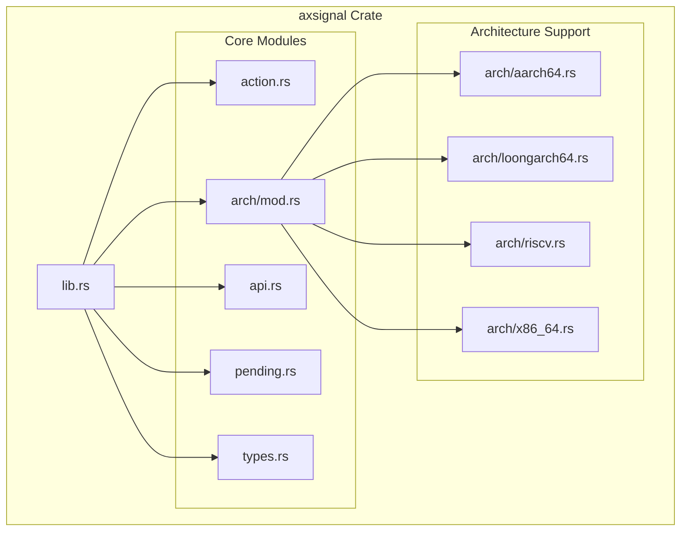
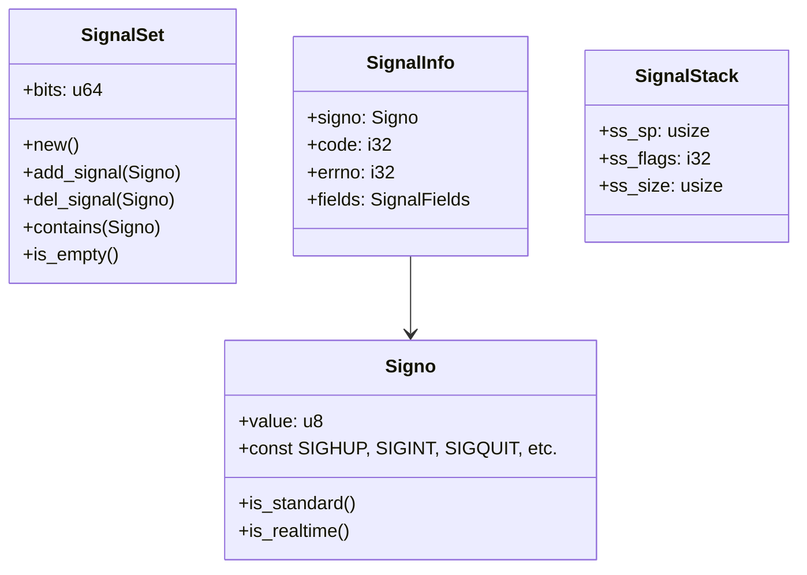
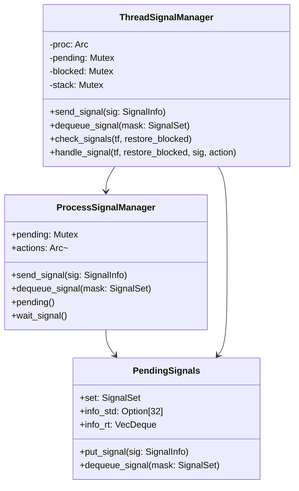
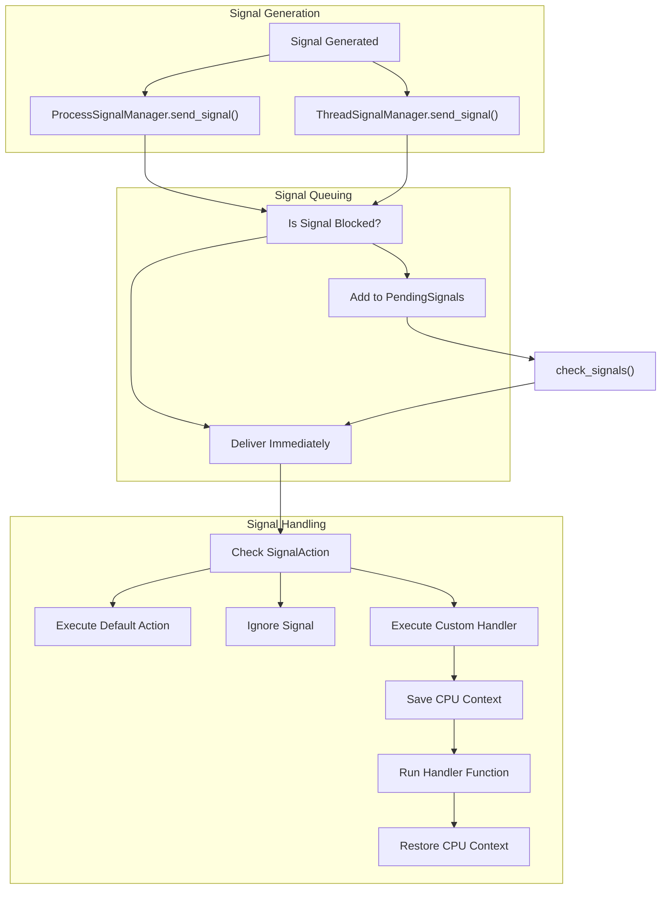
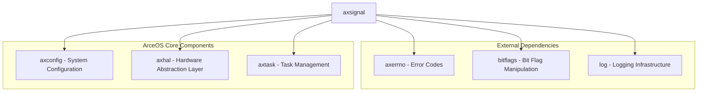
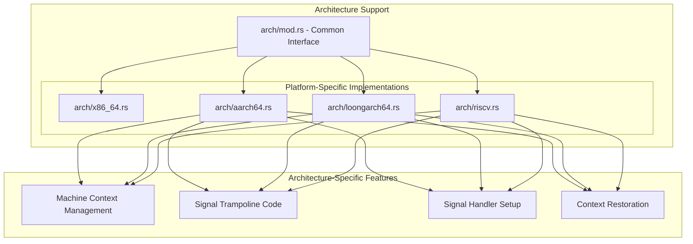

# Overview

> **Relevant source files**
> * [Cargo.toml](https://github.com/Starry-OS/axsignal/blob/b5b6089c/Cargo.toml)
> * [src/lib.rs](https://github.com/Starry-OS/axsignal/blob/b5b6089c/src/lib.rs)

## Purpose and Scope

The `axsignal` crate implements a Unix-like signal handling system for ArceOS. It provides a comprehensive framework for managing signals at both process and thread levels, supporting standard operations such as sending, blocking, and handling signals. This crate enables applications running on ArceOS to use familiar signal handling patterns similar to those found in POSIX systems.

For detailed explanations of specific components, see [Signal Management System](/Starry-OS/axsignal/2-signal-management-system), [Signal Types and Structures](/Starry-OS/axsignal/3-signal-types-and-structures), and [Architecture Support](/Starry-OS/axsignal/4-architecture-support).

Sources: [src/lib.rs(L1 - L16)&emsp;](https://github.com/Starry-OS/axsignal/blob/b5b6089c/src/lib.rs#L1-L16) [Cargo.toml(L1 - L31)&emsp;](https://github.com/Starry-OS/axsignal/blob/b5b6089c/Cargo.toml#L1-L31)

## High-Level Architecture

The `axsignal` crate is organized into several interconnected modules that together form a complete signal handling system.

**High-Level Architecture of axsignal**

Sources: [src/lib.rs(L7 - L15)&emsp;](https://github.com/Starry-OS/axsignal/blob/b5b6089c/src/lib.rs#L7-L15)

## Key Components

The `axsignal` crate consists of several key components that work together to provide signal handling functionality:

### Signal Types

**Signal Type Components**

### Signal Managers

**Signal Management Components**

Sources: [src/lib.rs(L7 - L15)&emsp;](https://github.com/Starry-OS/axsignal/blob/b5b6089c/src/lib.rs#L7-L15)

## Signal Processing Flow

The signal handling process in `axsignal` follows a well-defined flow from generation to handling:

**Signal Processing Flow**

Sources: [src/lib.rs(L7 - L15)&emsp;](https://github.com/Starry-OS/axsignal/blob/b5b6089c/src/lib.rs#L7-L15)

## System Dependencies and Integration

The `axsignal` crate integrates with several core components of ArceOS to provide its functionality:

**Dependencies and Integration**

The crate relies on:

* `axconfig`: For system configuration parameters
* `axhal`: For hardware abstraction with userspace support
* `axtask`: For multitasking integration
* `axerrno`: For error handling
* `bitflags`: For efficient signal set implementation
* Additional utilities for logging and synchronization

Sources: [Cargo.toml(L6 - L26)&emsp;](https://github.com/Starry-OS/axsignal/blob/b5b6089c/Cargo.toml#L6-L26)

## Architecture Support

The `axsignal` crate provides platform-specific implementations for different CPU architectures, ensuring proper signal context management:

**Architecture Support System**

Each architecture implementation provides specialized functionality for:

* Saving and restoring CPU registers during signal handling
* Setting up signal trampolines (code that transfers control to user-defined handlers)
* Managing signal stacks
* Handling architecture-specific signal delivery requirements

Sources: [src/lib.rs(L8 - L9)&emsp;](https://github.com/Starry-OS/axsignal/blob/b5b6089c/src/lib.rs#L8-L9)

## Summary

The `axsignal` crate provides a comprehensive signal handling system for ArceOS, implementing familiar Unix-like functionality across multiple processor architectures. It manages signals at both process and thread levels, supports standard and real-time signals, and offers a flexible framework for defining custom signal actions.

Key features include:

* Process and thread level signal management
* Support for multiple architectures (x86_64, AArch64, RISC-V, LoongArch64)
* Signal masking and prioritization
* Custom signal handlers with context management
* Integration with ArceOS task management

For detailed information about specific components, refer to the dedicated pages on [Signal Management System](/Starry-OS/axsignal/2-signal-management-system) and [Signal Types and Structures](/Starry-OS/axsignal/3-signal-types-and-structures).

Sources: [src/lib.rs(L1 - L16)&emsp;](https://github.com/Starry-OS/axsignal/blob/b5b6089c/src/lib.rs#L1-L16) [Cargo.toml(L1 - L31)&emsp;](https://github.com/Starry-OS/axsignal/blob/b5b6089c/Cargo.toml#L1-L31)