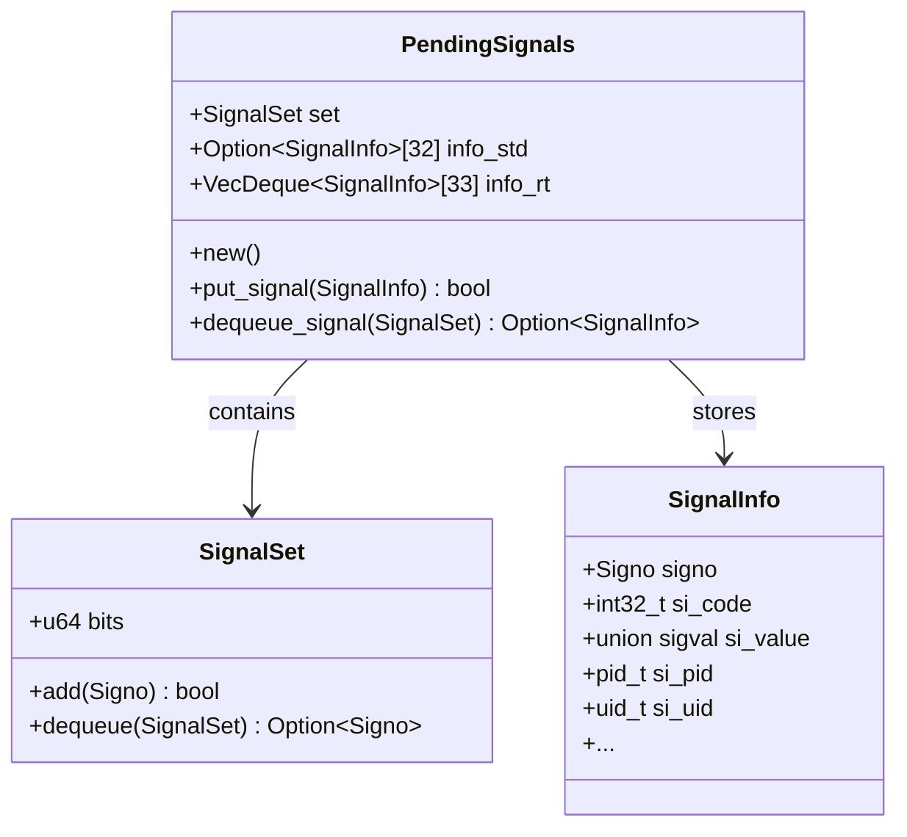
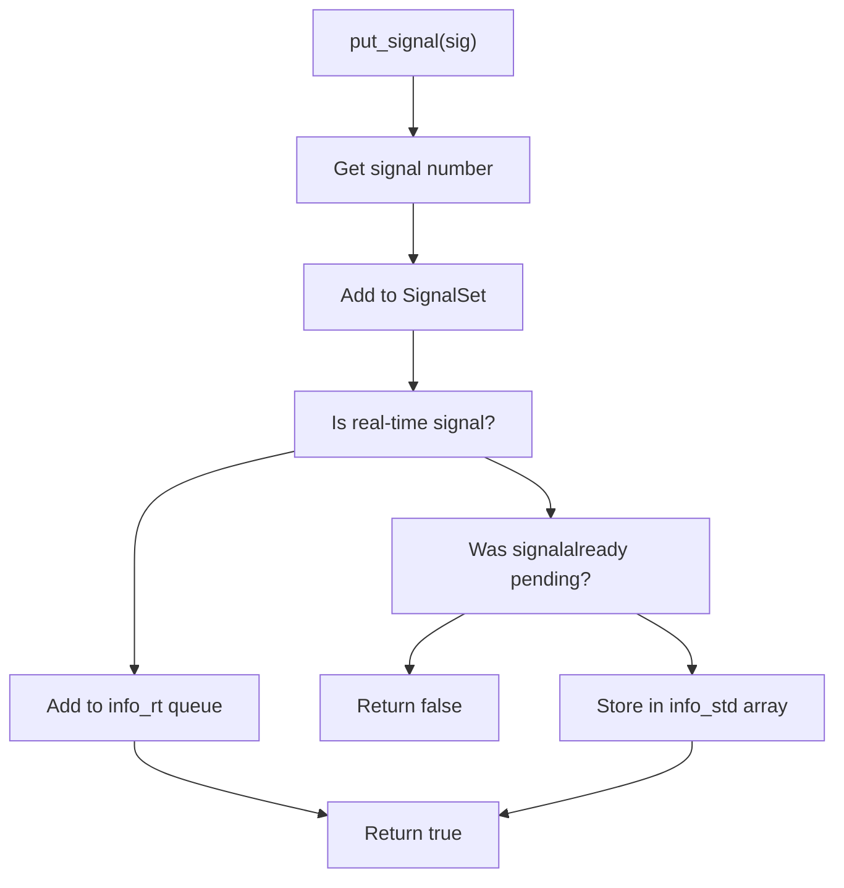
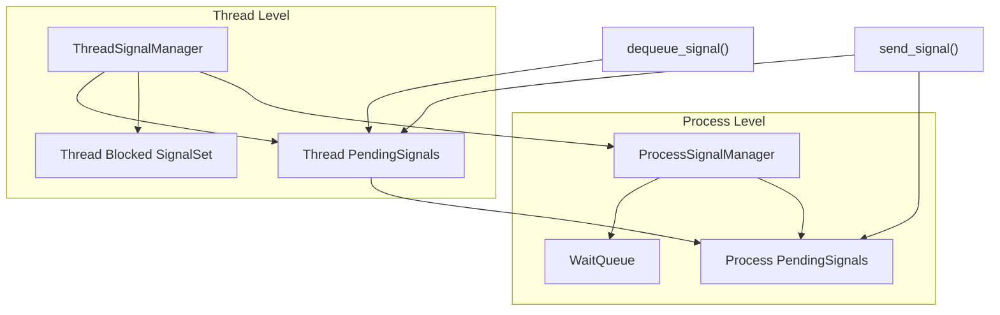
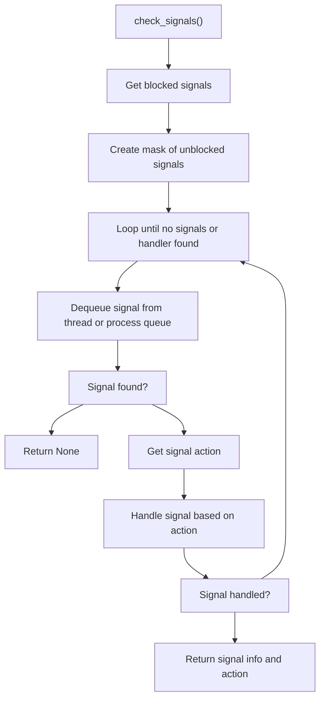
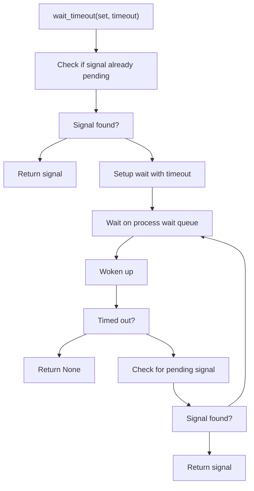

# Pending Signals

> **Relevant source files**
> * [src/api/process.rs](https://github.com/Starry-OS/axsignal/blob/b5b6089c/src/api/process.rs)
> * [src/api/thread.rs](https://github.com/Starry-OS/axsignal/blob/b5b6089c/src/api/thread.rs)
> * [src/pending.rs](https://github.com/Starry-OS/axsignal/blob/b5b6089c/src/pending.rs)

## Overview

This document describes the pending signals system in the axsignal crate, which manages signals that have been delivered but not yet processed by their handlers. The pending signals system is responsible for queuing signals, maintaining their associated information, and dequeuing them when they are ready to be handled.

For information about signal types and representations, see [Signal Numbers and Sets](/Starry-OS/axsignal/3.1-signal-numbers-and-sets). For details on the actions taken when signals are handled, see [Signal Actions and Dispositions](/Starry-OS/axsignal/3.2-signal-actions-and-dispositions).

Sources: [src/pending.rs(L1 - L66)&emsp;](https://github.com/Starry-OS/axsignal/blob/b5b6089c/src/pending.rs#L1-L66)

## PendingSignals Structure

The core of the pending signals system is the `PendingSignals` structure, which manages two types of signals:

1. **Standard signals** (1-31): At most one instance of each standard signal can be pending at any time.
2. **Real-time signals** (32-64): Multiple instances of each real-time signal can be queued.

### Data Structure Components



The `PendingSignals` structure consists of:

* `set`: A bit field representing which signals are currently pending
* `info_std`: An array storing information for standard signals (indices 1-31)
* `info_rt`: An array of queues storing information for real-time signals (indices 32-64)

Sources: [src/pending.rs(L8 - L21)&emsp;](https://github.com/Starry-OS/axsignal/blob/b5b6089c/src/pending.rs#L8-L21)

## Signal Queuing Process

### Adding Signals to the Queue

When a signal is sent to a process or thread, it's added to the pending queue using the `put_signal` method:



Key points about signal queuing:

* Standard signals (1-31) will only be queued once, with repeated signals being ignored
* Real-time signals (32-64) are queued in order of arrival, with multiple instances allowed
* The `put_signal` method returns a boolean indicating whether the signal was added to the queue

Sources: [src/pending.rs(L31 - L49)&emsp;](https://github.com/Starry-OS/axsignal/blob/b5b6089c/src/pending.rs#L31-L49) [src/api/thread.rs(L157 - L163)&emsp;](https://github.com/Starry-OS/axsignal/blob/b5b6089c/src/api/thread.rs#L157-L163) [src/api/process.rs(L64 - L70)&emsp;](https://github.com/Starry-OS/axsignal/blob/b5b6089c/src/api/process.rs#L64-L70)

## Signal Dequeuing Process

### Retrieving Signals from the Queue

Signals are dequeued when they are ready to be handled, using the `dequeue_signal` method:

```mermaid
flowchart TD
Start["dequeue_signal(mask)"]
DequeueSet["Dequeue a signal number from set"]
SignalFound["Signal found?"]
ReturnNone["Return None"]
IsRT["Is real-time signal?"]
PopQueue["Pop from info_rt queue"]
QueueEmpty["Queue empty?"]
ResetBit["Reset bit in set"]
Skip[""]
ReturnRT["Return signal info"]
TakeSTD["Take from info_std array"]
ReturnSTD["Return signal info"]

DequeueSet --> SignalFound
IsRT --> PopQueue
IsRT --> TakeSTD
PopQueue --> QueueEmpty
QueueEmpty --> ResetBit
QueueEmpty --> Skip
ResetBit --> ReturnRT
SignalFound --> IsRT
SignalFound --> ReturnNone
Skip --> ReturnRT
Start --> DequeueSet
TakeSTD --> ReturnSTD
```

Key points about signal dequeuing:

* Signals are dequeued according to priority (lower signal numbers first)
* Only signals that match the provided mask are considered
* For real-time signals, the queue maintains signal delivery order
* After dequeuing, the signal is removed from the pending set unless more instances exist

Sources: [src/pending.rs(L50 - L65)&emsp;](https://github.com/Starry-OS/axsignal/blob/b5b6089c/src/pending.rs#L50-L65)

## Hierarchy of Pending Signal Management

The pending signals system operates at two levels:



### Process-Level Pending Signals

The `ProcessSignalManager` maintains a process-wide pending signals queue that is shared among all threads in the process. Signals sent to the process are queued here.

Sources: [src/api/process.rs(L33 - L35)&emsp;](https://github.com/Starry-OS/axsignal/blob/b5b6089c/src/api/process.rs#L33-L35) [src/api/process.rs(L60 - L62)&emsp;](https://github.com/Starry-OS/axsignal/blob/b5b6089c/src/api/process.rs#L60-L62) [src/api/process.rs(L64 - L70)&emsp;](https://github.com/Starry-OS/axsignal/blob/b5b6089c/src/api/process.rs#L64-L70)

### Thread-Level Pending Signals

Each `ThreadSignalManager` maintains its own pending signals queue for thread-specific signals. When checking for signals to handle, a thread will:

1. First check its own pending queue
2. Then check the process-level pending queue if no signals are found

This hierarchical approach allows for both process-wide and thread-specific signal delivery.

Sources: [src/api/thread.rs(L22 - L26)&emsp;](https://github.com/Starry-OS/axsignal/blob/b5b6089c/src/api/thread.rs#L22-L26) [src/api/thread.rs(L43 - L48)&emsp;](https://github.com/Starry-OS/axsignal/blob/b5b6089c/src/api/thread.rs#L43-L48) [src/api/thread.rs(L157 - L163)&emsp;](https://github.com/Starry-OS/axsignal/blob/b5b6089c/src/api/thread.rs#L157-L163) [src/api/thread.rs(L185 - L188)&emsp;](https://github.com/Starry-OS/axsignal/blob/b5b6089c/src/api/thread.rs#L185-L188)

## Signal Handling Process

When the system checks for signals to handle, it combines the pending signals system with the blocked signals mask:



Key points about signal handling:

* Only unblocked signals are considered for handling
* Signals are handled in priority order (lower signal numbers first)
* Standard signals are processed before real-time signals
* The action taken depends on the signal's disposition (default, ignore, or handler)

Sources: [src/api/thread.rs(L119 - L143)&emsp;](https://github.com/Starry-OS/axsignal/blob/b5b6089c/src/api/thread.rs#L119-L143)

## Waiting for Signals

The signal system provides mechanisms to wait for signals, implemented through wait queues:



When waiting for signals:

1. The thread first checks if any of the requested signals are already pending
2. If not, it waits on the process wait queue
3. When a signal arrives, the queue is notified and the thread wakes up
4. The thread checks again for the requested signals
5. If found, it returns; otherwise, it continues waiting until timeout

Sources: [src/api/thread.rs(L190 - L239)&emsp;](https://github.com/Starry-OS/axsignal/blob/b5b6089c/src/api/thread.rs#L190-L239) [src/api/process.rs(L76 - L81)&emsp;](https://github.com/Starry-OS/axsignal/blob/b5b6089c/src/api/process.rs#L76-L81)

## Standard vs. Real-Time Signals Comparison

|Feature|Standard Signals (1-31)|Real-Time Signals (32-64)|
| --- | --- | --- |
|Storage|Single slot per signal number|Queue for each signal number|
|Queuing|At most one instance pending|Multiple instances can be queued|
|Overwriting|New signals overwrite older ones|Signals queued in arrival order|
|Information|Minimal signal info stored|Full signal info preserved for each instance|
|Typical Use|Common system signals (SIGINT, SIGTERM, etc.)|Application-specific signals with data|

Sources: [src/pending.rs(L8 - L21)&emsp;](https://github.com/Starry-OS/axsignal/blob/b5b6089c/src/pending.rs#L8-L21) [src/pending.rs(L31 - L49)&emsp;](https://github.com/Starry-OS/axsignal/blob/b5b6089c/src/pending.rs#L31-L49) [src/pending.rs(L50 - L65)&emsp;](https://github.com/Starry-OS/axsignal/blob/b5b6089c/src/pending.rs#L50-L65)